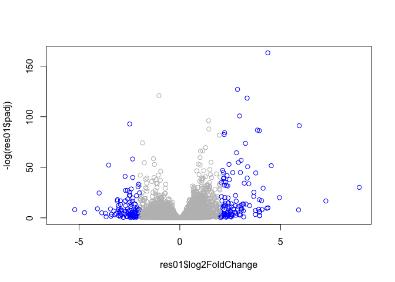
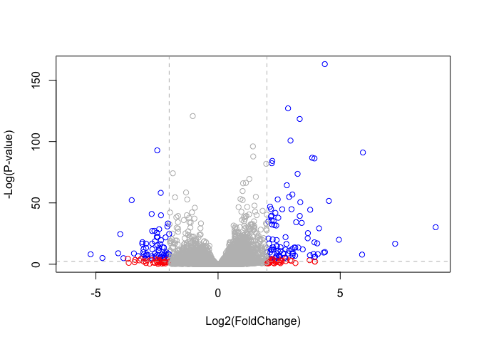

class15
================

Import countData and colData into R
-----------------------------------

``` r
counts <- read.csv("data/airway_scaledcounts.csv", stringsAsFactors = FALSE)
metadata <- read.csv("data/airway_metadata.csv", stringsAsFactors = FALSE)
```

``` r
dim(counts)
```

    ## [1] 38694     9

``` r
head(counts)
```

    ##           ensgene SRR1039508 SRR1039509 SRR1039512 SRR1039513 SRR1039516
    ## 1 ENSG00000000003        723        486        904        445       1170
    ## 2 ENSG00000000005          0          0          0          0          0
    ## 3 ENSG00000000419        467        523        616        371        582
    ## 4 ENSG00000000457        347        258        364        237        318
    ## 5 ENSG00000000460         96         81         73         66        118
    ## 6 ENSG00000000938          0          0          1          0          2
    ##   SRR1039517 SRR1039520 SRR1039521
    ## 1       1097        806        604
    ## 2          0          0          0
    ## 3        781        417        509
    ## 4        447        330        324
    ## 5         94        102         74
    ## 6          0          0          0

``` r
head(metadata)
```

    ##           id     dex celltype     geo_id
    ## 1 SRR1039508 control   N61311 GSM1275862
    ## 2 SRR1039509 treated   N61311 GSM1275863
    ## 3 SRR1039512 control  N052611 GSM1275866
    ## 4 SRR1039513 treated  N052611 GSM1275867
    ## 5 SRR1039516 control  N080611 GSM1275870
    ## 6 SRR1039517 treated  N080611 GSM1275871

``` r
colnames(counts)
```

    ## [1] "ensgene"    "SRR1039508" "SRR1039509" "SRR1039512" "SRR1039513"
    ## [6] "SRR1039516" "SRR1039517" "SRR1039520" "SRR1039521"

``` r
metadata$id
```

    ## [1] "SRR1039508" "SRR1039509" "SRR1039512" "SRR1039513" "SRR1039516"
    ## [6] "SRR1039517" "SRR1039520" "SRR1039521"

Check for corespondence of metadata and countdata

``` r
all( colnames(counts)[-1] == metadata$id )
```

    ## [1] TRUE

First task find which columns in *counts* correspond to th control condition (i.e. no drug!). Then we can caculate the mean count value for each gene.

``` r
control.inds <- metadata$dex == "control"
control.ids <- metadata$id[control.inds]

head(counts[,control.ids])
```

    ##   SRR1039508 SRR1039512 SRR1039516 SRR1039520
    ## 1        723        904       1170        806
    ## 2          0          0          0          0
    ## 3        467        616        582        417
    ## 4        347        364        318        330
    ## 5         96         73        118        102
    ## 6          0          1          2          0

Calculate the mean counts value for all genes

``` r
control.mean <- rowSums(counts[,control.ids]) / ncol(counts[,control.ids])
names(control.mean) <- counts$ensgene
head(control.mean)
```

    ## ENSG00000000003 ENSG00000000005 ENSG00000000419 ENSG00000000457 
    ##          900.75            0.00          520.50          339.75 
    ## ENSG00000000460 ENSG00000000938 
    ##           97.25            0.75

Now do the same thing for the drug treated samples (i.e. *treated* columns)

``` r
treated <- metadata[metadata[,"dex"]=="treated",]
treated.mean <- rowSums(counts[,treated$id]) / ncol(counts[,treated$id])
names(treated.mean) <- counts$ensgene
```

Combine the mean count values for control and trested into a new data.frame called meancounts!

``` r
meancounts <- data.frame(control.mean,treated.mean)
```

``` r
colSums(meancounts)
```

    ## control.mean treated.mean 
    ##     23005324     22196524

Now we can plot the drug treated vs non-drug control count values

``` r
plot(meancounts$control.mean, meancounts$treated.mean)
```


``` r
plot(meancounts$control.mean, meancounts$treated.mean, log="xy")
```

    ## Warning in xy.coords(x, y, xlabel, ylabel, log): 15032 x values <= 0
    ## omitted from logarithmic plot

    ## Warning in xy.coords(x, y, xlabel, ylabel, log): 15281 y values <= 0
    ## omitted from logarithmic plot


We can find candidate differentially expressed genes by looking for genes with a large change between control and dex-treated samples. We usually look at the log2 of the fold change, because this has better mathematical properties.

Here we calculate log2foldchange, add it to our meancounts data.frame and inspect the results either with the head() or the View() function for example.

``` r
meancounts$log2fc <- log2(meancounts[,"treated.mean"]/meancounts[,"control.mean"])
head(meancounts)
```

    ##                 control.mean treated.mean      log2fc
    ## ENSG00000000003       900.75       658.00 -0.45303916
    ## ENSG00000000005         0.00         0.00         NaN
    ## ENSG00000000419       520.50       546.00  0.06900279
    ## ENSG00000000457       339.75       316.50 -0.10226805
    ## ENSG00000000460        97.25        78.75 -0.30441833
    ## ENSG00000000938         0.75         0.00        -Inf

``` r
toy <- c(1,2,0,4,0)
toy == 0
```

    ## [1] FALSE FALSE  TRUE FALSE  TRUE

``` r
toy <- meancounts[1:6,]
toy[,1:2]
```

    ##                 control.mean treated.mean
    ## ENSG00000000003       900.75       658.00
    ## ENSG00000000005         0.00         0.00
    ## ENSG00000000419       520.50       546.00
    ## ENSG00000000457       339.75       316.50
    ## ENSG00000000460        97.25        78.75
    ## ENSG00000000938         0.75         0.00

``` r
unique(which(toy[,1:2] == 0, arr.ind = TRUE)[,1])
```

    ## [1] 2 6

Working the zero entry genes from meancounts to produce *mycounts*s

``` r
zero.vals <- which(meancounts[,1:2]==0, arr.ind=TRUE)
to.rm <- unique(zero.vals[,1])
mycounts <- meancounts[-to.rm,]
head(mycounts)
```

    ##                 control.mean treated.mean      log2fc
    ## ENSG00000000003       900.75       658.00 -0.45303916
    ## ENSG00000000419       520.50       546.00  0.06900279
    ## ENSG00000000457       339.75       316.50 -0.10226805
    ## ENSG00000000460        97.25        78.75 -0.30441833
    ## ENSG00000000971      5219.00      6687.50  0.35769358
    ## ENSG00000001036      2327.00      1785.75 -0.38194109

``` r
up.ind <- mycounts$log2fc > 2
down.ind <- mycounts$log2fc < (-2)
```

``` r
sum(up.ind)
```

    ## [1] 250

``` r
sum(down.ind)
```

    ## [1] 367

There are 'sum(up.ind)' up regulated genes and 'sum(down.ind)' down regulated genes.

``` r
head(mycounts[up.ind,])
```

    ##                 control.mean treated.mean   log2fc
    ## ENSG00000004799       270.50      1429.25 2.401558
    ## ENSG00000006788         2.75        19.75 2.844349
    ## ENSG00000008438         0.50         2.75 2.459432
    ## ENSG00000011677         0.50         2.25 2.169925
    ## ENSG00000015413         0.50         3.00 2.584963
    ## ENSG00000015592         0.50         2.25 2.169925

Adding annotation data
----------------------

Use the *merge()* function to add annotation data from ensemble

``` r
anno <- read.csv("data/annotables_grch38.csv")
head(anno)
```

    ##           ensgene entrez   symbol chr     start       end strand
    ## 1 ENSG00000000003   7105   TSPAN6   X 100627109 100639991     -1
    ## 2 ENSG00000000005  64102     TNMD   X 100584802 100599885      1
    ## 3 ENSG00000000419   8813     DPM1  20  50934867  50958555     -1
    ## 4 ENSG00000000457  57147    SCYL3   1 169849631 169894267     -1
    ## 5 ENSG00000000460  55732 C1orf112   1 169662007 169854080      1
    ## 6 ENSG00000000938   2268      FGR   1  27612064  27635277     -1
    ##          biotype
    ## 1 protein_coding
    ## 2 protein_coding
    ## 3 protein_coding
    ## 4 protein_coding
    ## 5 protein_coding
    ## 6 protein_coding
    ##                                                                                                  description
    ## 1                                                          tetraspanin 6 [Source:HGNC Symbol;Acc:HGNC:11858]
    ## 2                                                            tenomodulin [Source:HGNC Symbol;Acc:HGNC:17757]
    ## 3 dolichyl-phosphate mannosyltransferase polypeptide 1, catalytic subunit [Source:HGNC Symbol;Acc:HGNC:3005]
    ## 4                                               SCY1-like, kinase-like 3 [Source:HGNC Symbol;Acc:HGNC:19285]
    ## 5                                    chromosome 1 open reading frame 112 [Source:HGNC Symbol;Acc:HGNC:25565]
    ## 6                          FGR proto-oncogene, Src family tyrosine kinase [Source:HGNC Symbol;Acc:HGNC:3697]

``` r
mycounts.annotated <- merge(x=mycounts, y=anno, by.x="row.names", by.y="ensgene")
head(mycounts.annotated)
```

    ##         Row.names control.mean treated.mean      log2fc entrez   symbol
    ## 1 ENSG00000000003       900.75       658.00 -0.45303916   7105   TSPAN6
    ## 2 ENSG00000000419       520.50       546.00  0.06900279   8813     DPM1
    ## 3 ENSG00000000457       339.75       316.50 -0.10226805  57147    SCYL3
    ## 4 ENSG00000000460        97.25        78.75 -0.30441833  55732 C1orf112
    ## 5 ENSG00000000971      5219.00      6687.50  0.35769358   3075      CFH
    ## 6 ENSG00000001036      2327.00      1785.75 -0.38194109   2519    FUCA2
    ##   chr     start       end strand        biotype
    ## 1   X 100627109 100639991     -1 protein_coding
    ## 2  20  50934867  50958555     -1 protein_coding
    ## 3   1 169849631 169894267     -1 protein_coding
    ## 4   1 169662007 169854080      1 protein_coding
    ## 5   1 196651878 196747504      1 protein_coding
    ## 6   6 143494811 143511690     -1 protein_coding
    ##                                                                                                  description
    ## 1                                                          tetraspanin 6 [Source:HGNC Symbol;Acc:HGNC:11858]
    ## 2 dolichyl-phosphate mannosyltransferase polypeptide 1, catalytic subunit [Source:HGNC Symbol;Acc:HGNC:3005]
    ## 3                                               SCY1-like, kinase-like 3 [Source:HGNC Symbol;Acc:HGNC:19285]
    ## 4                                    chromosome 1 open reading frame 112 [Source:HGNC Symbol;Acc:HGNC:25565]
    ## 5                                                     complement factor H [Source:HGNC Symbol;Acc:HGNC:4883]
    ## 6                                          fucosidase, alpha-L- 2, plasma [Source:HGNC Symbol;Acc:HGNC:4008]

DESeq2 analysis
---------------

Now we do this analysis properly with p-values!

``` r
library(DESeq2)
```

    ## Loading required package: S4Vectors

    ## Loading required package: stats4

    ## Loading required package: BiocGenerics

    ## Loading required package: parallel

    ## 
    ## Attaching package: 'BiocGenerics'

    ## The following objects are masked from 'package:parallel':
    ## 
    ##     clusterApply, clusterApplyLB, clusterCall, clusterEvalQ,
    ##     clusterExport, clusterMap, parApply, parCapply, parLapply,
    ##     parLapplyLB, parRapply, parSapply, parSapplyLB

    ## The following objects are masked from 'package:stats':
    ## 
    ##     IQR, mad, sd, var, xtabs

    ## The following objects are masked from 'package:base':
    ## 
    ##     anyDuplicated, append, as.data.frame, basename, cbind,
    ##     colMeans, colnames, colSums, dirname, do.call, duplicated,
    ##     eval, evalq, Filter, Find, get, grep, grepl, intersect,
    ##     is.unsorted, lapply, lengths, Map, mapply, match, mget, order,
    ##     paste, pmax, pmax.int, pmin, pmin.int, Position, rank, rbind,
    ##     Reduce, rowMeans, rownames, rowSums, sapply, setdiff, sort,
    ##     table, tapply, union, unique, unsplit, which, which.max,
    ##     which.min

    ## 
    ## Attaching package: 'S4Vectors'

    ## The following object is masked from 'package:base':
    ## 
    ##     expand.grid

    ## Loading required package: IRanges

    ## Loading required package: GenomicRanges

    ## Loading required package: GenomeInfoDb

    ## Loading required package: SummarizedExperiment

    ## Loading required package: Biobase

    ## Welcome to Bioconductor
    ## 
    ##     Vignettes contain introductory material; view with
    ##     'browseVignettes()'. To cite Bioconductor, see
    ##     'citation("Biobase")', and for packages 'citation("pkgname")'.

    ## Loading required package: DelayedArray

    ## Loading required package: matrixStats

    ## 
    ## Attaching package: 'matrixStats'

    ## The following objects are masked from 'package:Biobase':
    ## 
    ##     anyMissing, rowMedians

    ## Loading required package: BiocParallel

    ## 
    ## Attaching package: 'DelayedArray'

    ## The following objects are masked from 'package:matrixStats':
    ## 
    ##     colMaxs, colMins, colRanges, rowMaxs, rowMins, rowRanges

    ## The following objects are masked from 'package:base':
    ## 
    ##     aperm, apply

``` r
citation("DESeq2")
```

    ## 
    ##   Love, M.I., Huber, W., Anders, S. Moderated estimation of fold
    ##   change and dispersion for RNA-seq data with DESeq2 Genome
    ##   Biology 15(12):550 (2014)
    ## 
    ## A BibTeX entry for LaTeX users is
    ## 
    ##   @Article{,
    ##     title = {Moderated estimation of fold change and dispersion for RNA-seq data with DESeq2},
    ##     author = {Michael I. Love and Wolfgang Huber and Simon Anders},
    ##     year = {2014},
    ##     journal = {Genome Biology},
    ##     doi = {10.1186/s13059-014-0550-8},
    ##     volume = {15},
    ##     issue = {12},
    ##     pages = {550},
    ##   }

``` r
dds <- DESeqDataSetFromMatrix(countData=counts, 
                              colData=metadata, 
                              design=~dex, 
                              tidy=TRUE)
```

    ## converting counts to integer mode

    ## Warning in DESeqDataSet(se, design = design, ignoreRank): some variables in
    ## design formula are characters, converting to factors

``` r
dds
```

    ## class: DESeqDataSet 
    ## dim: 38694 8 
    ## metadata(1): version
    ## assays(1): counts
    ## rownames(38694): ENSG00000000003 ENSG00000000005 ...
    ##   ENSG00000283120 ENSG00000283123
    ## rowData names(0):
    ## colnames(8): SRR1039508 SRR1039509 ... SRR1039520 SRR1039521
    ## colData names(4): id dex celltype geo_id

``` r
dds <- DESeq(dds)
```

    ## estimating size factors

    ## estimating dispersions

    ## gene-wise dispersion estimates

    ## mean-dispersion relationship

    ## final dispersion estimates

    ## fitting model and testing

``` r
res <- results(dds)
res
```

    ## log2 fold change (MLE): dex treated vs control 
    ## Wald test p-value: dex treated vs control 
    ## DataFrame with 38694 rows and 6 columns
    ##                          baseMean     log2FoldChange             lfcSE
    ##                         <numeric>          <numeric>         <numeric>
    ## ENSG00000000003  747.194195359907   -0.3507029622814 0.168242083226488
    ## ENSG00000000005                 0                 NA                NA
    ## ENSG00000000419  520.134160051965  0.206107283859631 0.101041504450297
    ## ENSG00000000457  322.664843927049 0.0245270113332259 0.145133863747848
    ## ENSG00000000460   87.682625164828 -0.147142630021601 0.256995442048617
    ## ...                           ...                ...               ...
    ## ENSG00000283115                 0                 NA                NA
    ## ENSG00000283116                 0                 NA                NA
    ## ENSG00000283119                 0                 NA                NA
    ## ENSG00000283120 0.974916032393564 -0.668250141507888  1.69441251902541
    ## ENSG00000283123                 0                 NA                NA
    ##                               stat             pvalue              padj
    ##                          <numeric>          <numeric>         <numeric>
    ## ENSG00000000003  -2.08451390731582 0.0371134465286876 0.163017154198658
    ## ENSG00000000005                 NA                 NA                NA
    ## ENSG00000000419   2.03982793982463 0.0413674659636722 0.175936611069872
    ## ENSG00000000457  0.168995785682647  0.865799956261551 0.961682459668587
    ## ENSG00000000460 -0.572549570718713  0.566949713033353 0.815805192485639
    ## ...                            ...                ...               ...
    ## ENSG00000283115                 NA                 NA                NA
    ## ENSG00000283116                 NA                 NA                NA
    ## ENSG00000283119                 NA                 NA                NA
    ## ENSG00000283120 -0.394384563383805  0.693297138830703                NA
    ## ENSG00000283123                 NA                 NA                NA

``` r
summary(res)
```

    ## 
    ## out of 25258 with nonzero total read count
    ## adjusted p-value < 0.1
    ## LFC > 0 (up)       : 1564, 6.2%
    ## LFC < 0 (down)     : 1188, 4.7%
    ## outliers [1]       : 142, 0.56%
    ## low counts [2]     : 9971, 39%
    ## (mean count < 10)
    ## [1] see 'cooksCutoff' argument of ?results
    ## [2] see 'independentFiltering' argument of ?results

``` r
res01 <- results(dds, alpha=0.01)
summary(res01)
```

    ## 
    ## out of 25258 with nonzero total read count
    ## adjusted p-value < 0.01
    ## LFC > 0 (up)       : 850, 3.4%
    ## LFC < 0 (down)     : 581, 2.3%
    ## outliers [1]       : 142, 0.56%
    ## low counts [2]     : 9033, 36%
    ## (mean count < 6)
    ## [1] see 'cooksCutoff' argument of ?results
    ## [2] see 'independentFiltering' argument of ?results

``` r
mycols <- rep("gray", nrow(res01))
mycols[abs(res01$log2FoldChange) > 2] <- "blue"
mycols[]
```

    ##     [1] "gray" "gray" "gray" "gray" "gray" "gray" "gray" "gray" "gray"
    ##    [10] "gray" "gray" "gray" "gray" "gray" "gray" "gray" "gray" "gray"
    ##    [19] "gray" "gray" "gray" "gray" "gray" "gray" "gray" "gray" "gray"
    ##    [28] "gray" "gray" "gray" "gray" "gray" "gray" "gray" "gray" "gray"
    ##    [37] "gray" "gray" "gray" "gray" "gray" "gray" "gray" "gray" "gray"
    ##    [46] "gray" "gray" "gray" "gray" "gray" "gray" "gray" "gray" "gray"
    ##    [55] "gray" "gray" "gray" "gray" "gray" "gray" "blue" "gray" "gray"
    ##    [64] "gray" "gray" "gray" "gray" "gray" "gray" "gray" "gray" "gray"
    ##    [73] "gray" "gray" "gray" "gray" "gray" "gray" "gray" "gray" "blue"
    ##    [82] "gray" "gray" "gray" "gray" "gray" "gray" "gray" "gray" "gray"
    ##    [91] "gray" "gray" "gray" "gray" "gray" "gray" "gray" "gray" "gray"
    ##   [100] "gray" "gray" "gray" "gray" "gray" "gray" "gray" "gray" "gray"
    ##   [109] "gray" "gray" "gray" "gray" "gray" "gray" "gray" "gray" "gray"
    ##   [118] "gray" "gray" "gray" "gray" "gray" "gray" "gray" "gray" "gray"
    ##   [127] "gray" "gray" "gray" "gray" "gray" "gray" "gray" "gray" "gray"
    ##   [136] "gray" "gray" "gray" "gray" "gray" "gray" "gray" "gray" "gray"
    ##   [145] "gray" "gray" "gray" "gray" "gray" "gray" "gray" "gray" "gray"
    ##   [154] "gray" "gray" "gray" "gray" "gray" "gray" "blue" "gray" "gray"
    ##   [163] "gray" "gray" "gray" "gray" "gray" "gray" "gray" "gray" "gray"
    ##   [172] "gray" "gray" "gray" "gray" "gray" "gray" "gray" "gray" "gray"
    ##   [181] "gray" "gray" "gray" "gray" "gray" "gray" "gray" "gray" "gray"
    ##   [190] "gray" "gray" "gray" "gray" "gray" "gray" "gray" "gray" "gray"
    ##   [199] "gray" "gray" "gray" "gray" "gray" "gray" "gray" "gray" "gray"
    ##   [208] "gray" "gray" "gray" "gray" "gray" "gray" "gray" "gray" "gray"
    ##   [217] "gray" "gray" "gray" "blue" "gray" "gray" "gray" "gray" "gray"
    ##   [226] "gray" "gray" "gray" "gray" "gray" "gray" "gray" "gray" "gray"
    ##   [235] "gray" "gray" "gray" "gray" "gray" "gray" "gray" "gray" "gray"
    ##   [244] "gray" "gray" "gray" "gray" "gray" "gray" "gray" "gray" "gray"
    ##   [253] "gray" "gray" "gray" "gray" "gray" "gray" "blue" "gray" "gray"
    ##   [262] "gray" "gray" "gray" "gray" "gray" "gray" "gray" "gray" "gray"
    ##   [271] "gray" "gray" "gray" "gray" "gray" "gray" "gray" "gray" "gray"
    ##   [280] "gray" "gray" "gray" "gray" "gray" "gray" "gray" "gray" "gray"
    ##   [289] "gray" "gray" "gray" "gray" "gray" "gray" "gray" "gray" "gray"
    ##   [298] "gray" "gray" "gray" "gray" "gray" "gray" "gray" "gray" "gray"
    ##   [307] "gray" "gray" "blue" "gray" "gray" "gray" "gray" "gray" "gray"
    ##   [316] "gray" "gray" "gray" "gray" "gray" "gray" "gray" "gray" "gray"
    ##   [325] "gray" "gray" "gray" "gray" "gray" "gray" "gray" "gray" "gray"
    ##   [334] "gray" "gray" "gray" "gray" "gray" "gray" "gray" "gray" "gray"
    ##   [343] "gray" "gray" "gray" "gray" "gray" "gray" "gray" "gray" "gray"
    ##   [352] "gray" "gray" "gray" "gray" "gray" "gray" "gray" "blue" "gray"
    ##   [361] "gray" "blue" "gray" "gray" "blue" "gray" "gray" "gray" "gray"
    ##   [370] "gray" "gray" "gray" "gray" "gray" "gray" "gray" "gray" "gray"
    ##   [379] "gray" "gray" "gray" "gray" "gray" "gray" "gray" "gray" "gray"
    ##   [388] "gray" "gray" "blue" "gray" "gray" "gray" "gray" "gray" "gray"
    ##   [397] "gray" "gray" "gray" "gray" "gray" "gray" "gray" "gray" "gray"
    ##   [406] "gray" "gray" "gray" "gray" "gray" "gray" "gray" "gray" "gray"
    ##   [415] "gray" "gray" "gray" "gray" "gray" "gray" "gray" "gray" "gray"
    ##   [424] "gray" "gray" "gray" "gray" "gray" "gray" "gray" "gray" "gray"
    ##   [433] "gray" "gray" "gray" "gray" "gray" "gray" "gray" "gray" "gray"
    ##   [442] "gray" "gray" "gray" "gray" "blue" "gray" "gray" "gray" "gray"
    ##   [451] "gray" "gray" "gray" "gray" "gray" "gray" "gray" "gray" "gray"
    ##   [460] "gray" "gray" "gray" "gray" "gray" "gray" "gray" "gray" "gray"
    ##   [469] "gray" "gray" "gray" "gray" "gray" "gray" "gray" "gray" "gray"
    ##   [478] "gray" "gray" "gray" "gray" "gray" "gray" "gray" "gray" "gray"
    ##   [487] "gray" "gray" "gray" "gray" "gray" "gray" "gray" "gray" "gray"
    ##   [496] "gray" "gray" "gray" "gray" "gray" "gray" "gray" "gray" "gray"
    ##   [505] "gray" "gray" "gray" "gray" "gray" "gray" "gray" "gray" "gray"
    ##   [514] "gray" "gray" "gray" "gray" "gray" "gray" "gray" "gray" "gray"
    ##   [523] "gray" "gray" "gray" "gray" "gray" "gray" "gray" "gray" "gray"
    ##   [532] "gray" "gray" "gray" "gray" "gray" "gray" "gray" "gray" "gray"
    ##   [541] "gray" "gray" "gray" "gray" "gray" "gray" "gray" "gray" "gray"
    ##   [550] "gray" "gray" "gray" "gray" "gray" "gray" "gray" "gray" "gray"
    ##   [559] "gray" "gray" "gray" "gray" "gray" "gray" "gray" "gray" "gray"
    ##   [568] "gray" "gray" "gray" "gray" "gray" "gray" "gray" "gray" "gray"
    ##   [577] "gray" "gray" "gray" "gray" "gray" "gray" "gray" "gray" "gray"
    ##   [586] "gray" "gray" "gray" "gray" "gray" "gray" "gray" "gray" "gray"
    ##   [595] "gray" "gray" "gray" "gray" "gray" "gray" "gray" "gray" "gray"
    ##   [604] "gray" "gray" "gray" "gray" "gray" "gray" "gray" "blue" "gray"
    ##   [613] "gray" "gray" "gray" "gray" "gray" "gray" "gray" "gray" "gray"
    ##   [622] "gray" "gray" "gray" "gray" "gray" "gray" "gray" "gray" "gray"
    ##   [631] "gray" "gray" "gray" "gray" "gray" "gray" "gray" "gray" "gray"
    ##   [640] "gray" "gray" "gray" "gray" "gray" "gray" "gray" "gray" "gray"
    ##   [649] "gray" "gray" "gray" "gray" "gray" "gray" "gray" "gray" "gray"
    ##   [658] "gray" "gray" "gray" "gray" "gray" "gray" "gray" "gray" "gray"
    ##   [667] "gray" "gray" "gray" "gray" "gray" "gray" "gray" "gray" "gray"
    ##   [676] "gray" "gray" "gray" "gray" "gray" "gray" "gray" "gray" "gray"
    ##   [685] "gray" "blue" "gray" "gray" "gray" "gray" "gray" "gray" "gray"
    ##   [694] "gray" "gray" "gray" "gray" "gray" "blue" "gray" "gray" "gray"
    ##   [703] "gray" "gray" "gray" "gray" "gray" "gray" "gray" "gray" "gray"
    ##   [712] "gray" "gray" "gray" "gray" "gray" "gray" "gray" "gray" "gray"
    ##   [721] "gray" "blue" "gray" "gray" "gray" "gray" "gray" "gray" "gray"
    ##   [730] "gray" "gray" "gray" "gray" "gray" "gray" "gray" "gray" "gray"
    ##   [739] "gray" "gray" "gray" "gray" "gray" "gray" "gray" "gray" "gray"
    ##   [748] "gray" "gray" "gray" "gray" "gray" "gray" "gray" "gray" "gray"
    ##   [757] "blue" "gray" "gray" "gray" "gray" "gray" "gray" "gray" "gray"
    ##   [766] "gray" "gray" "gray" "gray" "gray" "gray" "gray" "gray" "gray"
    ##   [775] "gray" "gray" "gray" "gray" "gray" "gray" "gray" "gray" "gray"
    ##   [784] "gray" "gray" "gray" "gray" "gray" "gray" "gray" "gray" "gray"
    ##   [793] "gray" "gray" "gray" "gray" "gray" "gray" "gray" "gray" "gray"
    ##   [802] "gray" "gray" "gray" "gray" "gray" "gray" "gray" "gray" "gray"
    ##   [811] "gray" "gray" "gray" "gray" "gray" "gray" "gray" "gray" "gray"
    ##   [820] "gray" "blue" "gray" "gray" "gray" "gray" "gray" "gray" "gray"
    ##   [829] "gray" "gray" "gray" "gray" "gray" "gray" "gray" "gray" "gray"
    ##   [838] "gray" "gray" "gray" "gray" "gray" "gray" "gray" "gray" "gray"
    ##   [847] "gray" "gray" "gray" "gray" "gray" "gray" "gray" "gray" "gray"
    ##   [856] "gray" "gray" "gray" "gray" "gray" "gray" "gray" "gray" "gray"
    ##   [865] "gray" "gray" "gray" "gray" "gray" "gray" "gray" "gray" "gray"
    ##   [874] "gray" "blue" "gray" "gray" "gray" "gray" "gray" "gray" "gray"
    ##   [883] "gray" "gray" "gray" "gray" "gray" "gray" "gray" "gray" "gray"
    ##   [892] "gray" "gray" "gray" "gray" "gray" "gray" "gray" "gray" "gray"
    ##   [901] "gray" "gray" "gray" "gray" "gray" "gray" "gray" "gray" "gray"
    ##   [910] "gray" "gray" "gray" "gray" "gray" "gray" "gray" "gray" "gray"
    ##   [919] "gray" "gray" "gray" "gray" "gray" "gray" "gray" "gray" "gray"
    ##   [928] "gray" "gray" "gray" "gray" "gray" "gray" "gray" "gray" "gray"
    ##   [937] "gray" "gray" "gray" "gray" "gray" "gray" "gray" "gray" "gray"
    ##   [946] "gray" "gray" "gray" "gray" "gray" "gray" "gray" "gray" "gray"
    ##   [955] "gray" "gray" "gray" "gray" "gray" "gray" "gray" "gray" "gray"
    ##   [964] "gray" "gray" "gray" "gray" "gray" "gray" "gray" "gray" "gray"
    ##   [973] "gray" "gray" "gray" "gray" "blue" "gray" "gray" "gray" "gray"
    ##   [982] "gray" "gray" "gray" "gray" "gray" "gray" "gray" "gray" "gray"
    ##   [991] "gray" "gray" "gray" "gray" "gray" "gray" "gray" "gray" "gray"
    ##  [1000] "gray" "gray" "gray" "gray" "gray" "gray" "gray" "gray" "gray"
    ##  [1009] "gray" "gray" "gray" "gray" "gray" "gray" "gray" "gray" "gray"
    ##  [1018] "gray" "gray" "gray" "gray" "gray" "gray" "blue" "gray" "gray"
    ##  [1027] "gray" "gray" "gray" "gray" "gray" "gray" "gray" "gray" "gray"
    ##  [1036] "gray" "gray" "gray" "gray" "gray" "gray" "gray" "gray" "gray"
    ##  [1045] "gray" "gray" "gray" "gray" "gray" "gray" "gray" "gray" "gray"
    ##  [1054] "gray" "gray" "gray" "gray" "gray" "gray" "gray" "gray" "gray"
    ##  [1063] "gray" "gray" "gray" "gray" "gray" "gray" "gray" "gray" "gray"
    ##  [1072] "gray" "gray" "gray" "gray" "gray" "gray" "gray" "gray" "gray"
    ##  [1081] "gray" "gray" "gray" "gray" "gray" "gray" "gray" "gray" "gray"
    ##  [1090] "gray" "gray" "gray" "gray" "gray" "gray" "gray" "gray" "gray"
    ##  [1099] "gray" "gray" "gray" "gray" "blue" "gray" "gray" "gray" "gray"
    ##  [1108] "gray" "gray" "blue" "gray" "gray" "gray" "gray" "gray" "gray"
    ##  [1117] "gray" "gray" "gray" "gray" "gray" "gray" "gray" "gray" "gray"
    ##  [1126] "gray" "gray" "gray" "gray" "gray" "gray" "gray" "gray" "gray"
    ##  [1135] "gray" "gray" "gray" "gray" "gray" "gray" "gray" "gray" "gray"
    ##  [1144] "gray" "gray" "gray" "gray" "gray" "gray" "gray" "gray" "gray"
    ##  [1153] "gray" "gray" "gray" "gray" "gray" "gray" "gray" "gray" "gray"
    ##  [1162] "gray" "gray" "gray" "gray" "gray" "gray" "gray" "gray" "gray"
    ##  [1171] "gray" "gray" "gray" "gray" "gray" "gray" "gray" "gray" "gray"
    ##  [1180] "gray" "gray" "gray" "blue" "gray" "gray" "gray" "gray" "gray"
    ##  [1189] "gray" "gray" "gray" "gray" "gray" "gray" "gray" "gray" "gray"
    ##  [1198] "gray" "gray" "gray" "gray" "gray" "gray" "gray" "gray" "gray"
    ##  [1207] "gray" "gray" "gray" "gray" "gray" "gray" "gray" "gray" "gray"
    ##  [1216] "gray" "gray" "gray" "gray" "gray" "gray" "gray" "gray" "gray"
    ##  [1225] "gray" "gray" "gray" "gray" "gray" "gray" "gray" "gray" "gray"
    ##  [1234] "gray" "gray" "gray" "gray" "gray" "blue" "gray" "gray" "gray"
    ##  [1243] "gray" "gray" "gray" "gray" "gray" "gray" "gray" "gray" "gray"
    ##  [1252] "gray" "gray" "gray" "gray" "gray" "gray" "gray" "blue" "gray"
    ##  [1261] "gray" "gray" "gray" "gray" "gray" "gray" "gray" "gray" "gray"
    ##  [1270] "gray" "gray" "gray" "gray" "gray" "gray" "gray" "gray" "gray"
    ##  [1279] "gray" "gray" "gray" "gray" "gray" "gray" "gray" "gray" "gray"
    ##  [1288] "gray" "gray" "gray" "gray" "gray" "gray" "gray" "gray" "gray"
    ##  [1297] "gray" "gray" "blue" "gray" "gray" "gray" "blue" "gray" "gray"
    ##  [1306] "gray" "gray" "gray" "gray" "gray" "gray" "gray" "gray" "gray"
    ##  [1315] "gray" "gray" "gray" "gray" "gray" "gray" "gray" "gray" "gray"
    ##  [1324] "gray" "gray" "gray" "gray" "gray" "gray" "gray" "gray" "gray"
    ##  [1333] "gray" "gray" "gray" "gray" "gray" "gray" "gray" "gray" "gray"
    ##  [1342] "gray" "gray" "gray" "gray" "gray" "gray" "gray" "gray" "gray"
    ##  [1351] "gray" "gray" "gray" "gray" "gray" "gray" "gray" "gray" "gray"
    ##  [1360] "gray" "gray" "gray" "gray" "gray" "gray" "gray" "gray" "gray"
    ##  [1369] "gray" "gray" "gray" "gray" "gray" "gray" "gray" "gray" "gray"
    ##  [1378] "gray" "gray" "gray" "gray" "gray" "gray" "gray" "gray" "gray"
    ##  [1387] "gray" "gray" "gray" "gray" "blue" "gray" "gray" "gray" "gray"
    ##  [1396] "gray" "gray" "gray" "gray" "gray" "gray" "gray" "gray" "gray"
    ##  [1405] "gray" "gray" "gray" "gray" "gray" "gray" "gray" "gray" "gray"
    ##  [1414] "gray" "gray" "gray" "gray" "gray" "gray" "gray" "gray" "gray"
    ##  [1423] "gray" "gray" "gray" "gray" "gray" "blue" "gray" "gray" "gray"
    ##  [1432] "gray" "gray" "gray" "gray" "gray" "gray" "gray" "gray" "gray"
    ##  [1441] "gray" "gray" "gray" "gray" "gray" "gray" "gray" "gray" "gray"
    ##  [1450] "gray" "gray" "gray" "gray" "gray" "gray" "gray" "gray" "gray"
    ##  [1459] "gray" "gray" "gray" "gray" "gray" "gray" "gray" "gray" "gray"
    ##  [1468] "gray" "gray" "gray" "gray" "gray" "gray" "gray" "gray" "gray"
    ##  [1477] "gray" "gray" "gray" "gray" "gray" "gray" "gray" "gray" "gray"
    ##  [1486] "gray" "gray" "gray" "blue" "gray" "gray" "gray" "gray" "gray"
    ##  [1495] "gray" "gray" "gray" "gray" "gray" "gray" "gray" "gray" "gray"
    ##  [1504] "gray" "gray" "gray" "gray" "gray" "gray" "gray" "gray" "gray"
    ##  [1513] "gray" "gray" "gray" "gray" "gray" "gray" "gray" "gray" "gray"
    ##  [1522] "gray" "blue" "gray" "gray" "gray" "gray" "gray" "gray" "gray"
    ##  [1531] "gray" "gray" "gray" "gray" "gray" "gray" "gray" "gray" "gray"
    ##  [1540] "gray" "gray" "gray" "gray" "gray" "gray" "gray" "gray" "gray"
    ##  [1549] "gray" "gray" "gray" "gray" "gray" "gray" "gray" "gray" "gray"
    ##  [1558] "gray" "gray" "gray" "gray" "gray" "gray" "gray" "gray" "gray"
    ##  [1567] "gray" "gray" "gray" "gray" "gray" "gray" "gray" "gray" "gray"
    ##  [1576] "gray" "gray" "gray" "gray" "gray" "gray" "gray" "gray" "gray"
    ##  [1585] "gray" "gray" "gray" "gray" "gray" "gray" "gray" "gray" "gray"
    ##  [1594] "gray" "gray" "gray" "gray" "gray" "gray" "gray" "gray" "gray"
    ##  [1603] "blue" "gray" "gray" "gray" "gray" "gray" "gray" "gray" "gray"
    ##  [1612] "gray" "gray" "gray" "gray" "gray" "gray" "gray" "gray" "gray"
    ##  [1621] "gray" "gray" "gray" "gray" "gray" "gray" "gray" "gray" "gray"
    ##  [1630] "gray" "gray" "gray" "gray" "gray" "gray" "blue" "gray" "gray"
    ##  [1639] "gray" "gray" "gray" "gray" "gray" "gray" "gray" "gray" "gray"
    ##  [1648] "gray" "gray" "gray" "gray" "gray" "gray" "gray" "gray" "gray"
    ##  [1657] "gray" "gray" "gray" "gray" "blue" "gray" "gray" "gray" "gray"
    ##  [1666] "gray" "gray" "gray" "gray" "gray" "gray" "gray" "gray" "gray"
    ##  [1675] "gray" "gray" "gray" "gray" "gray" "gray" "gray" "gray" "gray"
    ##  [1684] "gray" "gray" "gray" "gray" "gray" "gray" "gray" "gray" "gray"
    ##  [1693] "gray" "gray" "gray" "gray" "gray" "gray" "gray" "gray" "gray"
    ##  [1702] "gray" "gray" "gray" "blue" "gray" "gray" "gray" "gray" "blue"
    ##  [1711] "gray" "gray" "gray" "gray" "gray" "gray" "gray" "gray" "gray"
    ##  [1720] "gray" "gray" "gray" "gray" "gray" "gray" "gray" "gray" "gray"
    ##  [1729] "gray" "gray" "gray" "gray" "gray" "gray" "gray" "gray" "gray"
    ##  [1738] "gray" "gray" "gray" "gray" "gray" "gray" "gray" "gray" "gray"
    ##  [1747] "gray" "gray" "gray" "gray" "gray" "gray" "gray" "gray" "gray"
    ##  [1756] "gray" "gray" "gray" "gray" "gray" "gray" "gray" "gray" "gray"
    ##  [1765] "gray" "gray" "gray" "blue" "gray" "gray" "gray" "gray" "gray"
    ##  [1774] "gray" "gray" "gray" "gray" "gray" "gray" "gray" "gray" "gray"
    ##  [1783] "gray" "gray" "gray" "gray" "gray" "gray" "gray" "gray" "gray"
    ##  [1792] "gray" "gray" "gray" "gray" "gray" "gray" "gray" "gray" "gray"
    ##  [1801] "gray" "gray" "gray" "gray" "gray" "gray" "gray" "gray" "gray"
    ##  [1810] "gray" "gray" "gray" "gray" "gray" "gray" "gray" "gray" "gray"
    ##  [1819] "gray" "gray" "gray" "gray" "gray" "gray" "gray" "gray" "gray"
    ##  [1828] "gray" "gray" "gray" "gray" "gray" "gray" "gray" "gray" "gray"
    ##  [1837] "gray" "gray" "gray" "gray" "gray" "gray" "gray" "gray" "gray"
    ##  [1846] "gray" "gray" "gray" "gray" "gray" "gray" "gray" "gray" "gray"
    ##  [1855] "gray" "gray" "gray" "gray" "gray" "gray" "gray" "gray" "gray"
    ##  [1864] "gray" "gray" "gray" "gray" "gray" "gray" "gray" "gray" "gray"
    ##  [1873] "gray" "blue" "gray" "gray" "gray" "gray" "gray" "gray" "gray"
    ##  [1882] "gray" "gray" "gray" "gray" "gray" "gray" "gray" "gray" "gray"
    ##  [1891] "gray" "gray" "gray" "gray" "gray" "gray" "gray" "gray" "gray"
    ##  [1900] "gray" "gray" "gray" "gray" "gray" "gray" "gray" "gray" "gray"
    ##  [1909] "gray" "gray" "gray" "gray" "gray" "gray" "gray" "gray" "gray"
    ##  [1918] "gray" "gray" "gray" "gray" "gray" "gray" "gray" "gray" "gray"
    ##  [1927] "gray" "gray" "gray" "gray" "gray" "gray" "gray" "gray" "gray"
    ##  [1936] "gray" "gray" "gray" "gray" "gray" "gray" "gray" "gray" "gray"
    ##  [1945] "gray" "gray" "gray" "gray" "gray" "gray" "gray" "blue" "gray"
    ##  [1954] "gray" "gray" "gray" "gray" "gray" "gray" "gray" "gray" "gray"
    ##  [1963] "gray" "gray" "gray" "gray" "gray" "gray" "gray" "gray" "gray"
    ##  [1972] "gray" "gray" "gray" "gray" "gray" "gray" "gray" "gray" "gray"
    ##  [1981] "gray" "gray" "gray" "gray" "gray" "gray" "gray" "gray" "gray"
    ##  [1990] "gray" "gray" "gray" "gray" "gray" "gray" "gray" "gray" "gray"
    ##  [1999] "gray" "gray" "gray" "gray" "gray" "gray" "gray" "gray" "gray"
    ##  [2008] "gray" "gray" "gray" "gray" "gray" "gray" "gray" "blue" "gray"
    ##  [2017] "gray" "gray" "gray" "gray" "gray" "gray" "gray" "gray" "gray"
    ##  [2026] "gray" "gray" "gray" "gray" "gray" "gray" "blue" "gray" "blue"
    ##  [2035] "gray" "gray" "gray" "gray" "gray" "gray" "gray" "gray" "gray"
    ##  [2044] "gray" "gray" "gray" "blue" "gray" "gray" "blue" "gray" "gray"
    ##  [2053] "gray" "gray" "gray" "gray" "gray" "gray" "gray" "gray" "gray"
    ##  [2062] "gray" "gray" "gray" "gray" "gray" "gray" "gray" "gray" "gray"
    ##  [2071] "gray" "gray" "gray" "gray" "gray" "gray" "gray" "gray" "gray"
    ##  [2080] "gray" "gray" "gray" "gray" "gray" "gray" "gray" "blue" "gray"
    ##  [2089] "gray" "gray" "gray" "gray" "gray" "blue" "gray" "gray" "gray"
    ##  [2098] "gray" "gray" "gray" "gray" "gray" "gray" "gray" "gray" "gray"
    ##  [2107] "gray" "gray" "gray" "gray" "gray" "gray" "gray" "gray" "gray"
    ##  [2116] "gray" "gray" "gray" "gray" "gray" "gray" "gray" "gray" "gray"
    ##  [2125] "gray" "gray" "gray" "gray" "gray" "gray" "gray" "gray" "gray"
    ##  [2134] "gray" "gray" "gray" "gray" "gray" "gray" "gray" "gray" "gray"
    ##  [2143] "gray" "gray" "gray" "gray" "gray" "gray" "gray" "gray" "gray"
    ##  [2152] "gray" "gray" "gray" "blue" "gray" "gray" "gray" "gray" "gray"
    ##  [2161] "gray" "gray" "gray" "gray" "gray" "gray" "blue" "gray" "gray"
    ##  [2170] "gray" "gray" "gray" "gray" "gray" "gray" "gray" "gray" "gray"
    ##  [2179] "gray" "gray" "gray" "gray" "gray" "gray" "gray" "gray" "gray"
    ##  [2188] "gray" "gray" "gray" "gray" "gray" "gray" "gray" "gray" "gray"
    ##  [2197] "gray" "gray" "gray" "gray" "gray" "gray" "gray" "gray" "gray"
    ##  [2206] "gray" "gray" "gray" "gray" "gray" "gray" "gray" "gray" "gray"
    ##  [2215] "gray" "gray" "gray" "gray" "gray" "gray" "gray" "gray" "gray"
    ##  [2224] "gray" "gray" "gray" "gray" "gray" "gray" "gray" "gray" "gray"
    ##  [2233] "gray" "gray" "gray" "gray" "gray" "gray" "gray" "gray" "gray"
    ##  [2242] "gray" "gray" "gray" "gray" "gray" "gray" "gray" "gray" "gray"
    ##  [2251] "gray" "gray" "gray" "gray" "gray" "gray" "gray" "gray" "gray"
    ##  [2260] "gray" "gray" "gray" "gray" "gray" "gray" "gray" "gray" "gray"
    ##  [2269] "gray" "gray" "gray" "gray" "gray" "gray" "gray" "gray" "gray"
    ##  [2278] "gray" "gray" "gray" "gray" "gray" "gray" "gray" "gray" "gray"
    ##  [2287] "gray" "gray" "gray" "gray" "gray" "gray" "gray" "gray" "gray"
    ##  [2296] "gray" "gray" "gray" "gray" "gray" "gray" "gray" "gray" "gray"
    ##  [2305] "gray" "gray" "gray" "gray" "gray" "gray" "gray" "gray" "gray"
    ##  [2314] "gray" "gray" "gray" "gray" "gray" "gray" "gray" "gray" "gray"
    ##  [2323] "gray" "gray" "gray" "gray" "gray" "gray" "gray" "gray" "gray"
    ##  [2332] "gray" "gray" "gray" "gray" "gray" "gray" "gray" "gray" "gray"
    ##  [2341] "gray" "gray" "gray" "gray" "gray" "gray" "gray" "gray" "gray"
    ##  [2350] "gray" "gray" "gray" "gray" "gray" "gray" "gray" "gray" "gray"
    ##  [2359] "gray" "gray" "gray" "gray" "gray" "gray" "gray" "gray" "gray"
    ##  [2368] "gray" "gray" "gray" "gray" "gray" "gray" "gray" "gray" "gray"
    ##  [2377] "gray" "gray" "gray" "gray" "gray" "gray" "gray" "gray" "gray"
    ##  [2386] "gray" "gray" "gray" "gray" "gray" "gray" "gray" "gray" "gray"
    ##  [2395] "gray" "gray" "gray" "gray" "gray" "gray" "gray" "gray" "gray"
    ##  [2404] "gray" "gray" "gray" "gray" "gray" "gray" "gray" "gray" "gray"
    ##  [2413] "gray" "gray" "gray" "gray" "gray" "gray" "gray" "gray" "gray"
    ##  [2422] "gray" "gray" "gray" "gray" "gray" "gray" "gray" "gray" "gray"
    ##  [2431] "gray" "gray" "gray" "gray" "gray" "gray" "gray" "gray" "gray"
    ##  [2440] "gray" "gray" "gray" "gray" "gray" "gray" "gray" "gray" "gray"
    ##  [2449] "gray" "gray" "gray" "gray" "gray" "gray" "gray" "gray" "gray"
    ##  [2458] "blue" "gray" "gray" "gray" "gray" "gray" "gray" "gray" "gray"
    ##  [2467] "gray" "gray" "gray" "gray" "gray" "gray" "gray" "gray" "gray"
    ##  [2476] "gray" "gray" "gray" "gray" "gray" "gray" "gray" "gray" "gray"
    ##  [2485] "blue" "gray" "gray" "gray" "gray" "gray" "gray" "gray" "gray"
    ##  [2494] "gray" "gray" "gray" "gray" "gray" "gray" "gray" "gray" "gray"
    ##  [2503] "blue" "gray" "gray" "blue" "gray" "gray" "gray" "gray" "gray"
    ##  [2512] "gray" "gray" "gray" "gray" "gray" "blue" "gray" "gray" "gray"
    ##  [2521] "gray" "gray" "gray" "gray" "gray" "gray" "blue" "gray" "gray"
    ##  [2530] "gray" "gray" "gray" "gray" "gray" "gray" "gray" "gray" "gray"
    ##  [2539] "gray" "gray" "gray" "gray" "gray" "gray" "gray" "gray" "gray"
    ##  [2548] "gray" "gray" "gray" "gray" "gray" "gray" "gray" "gray" "gray"
    ##  [2557] "gray" "gray" "gray" "gray" "gray" "gray" "gray" "gray" "gray"
    ##  [2566] "gray" "gray" "gray" "gray" "gray" "gray" "gray" "gray" "gray"
    ##  [2575] "gray" "gray" "gray" "gray" "gray" "gray" "gray" "gray" "gray"
    ##  [2584] "gray" "gray" "gray" "gray" "gray" "gray" "gray" "gray" "gray"
    ##  [2593] "gray" "gray" "gray" "gray" "gray" "gray" "gray" "gray" "gray"
    ##  [2602] "blue" "gray" "gray" "gray" "gray" "gray" "gray" "gray" "gray"
    ##  [2611] "gray" "gray" "gray" "gray" "gray" "gray" "gray" "gray" "gray"
    ##  [2620] "gray" "gray" "gray" "gray" "gray" "gray" "gray" "gray" "gray"
    ##  [2629] "gray" "gray" "gray" "gray" "gray" "gray" "gray" "gray" "gray"
    ##  [2638] "gray" "gray" "gray" "gray" "gray" "gray" "gray" "gray" "gray"
    ##  [2647] "gray" "gray" "gray" "gray" "gray" "gray" "gray" "gray" "gray"
    ##  [2656] "gray" "gray" "gray" "gray" "gray" "gray" "gray" "gray" "gray"
    ##  [2665] "gray" "gray" "gray" "gray" "gray" "gray" "gray" "gray" "gray"
    ##  [2674] "gray" "gray" "gray" "gray" "gray" "gray" "gray" "gray" "gray"
    ##  [2683] "blue" "gray" "gray" "gray" "gray" "gray" "gray" "gray" "gray"
    ##  [2692] "gray" "gray" "gray" "gray" "gray" "blue" "gray" "gray" "gray"
    ##  [2701] "gray" "gray" "gray" "gray" "gray" "gray" "gray" "gray" "gray"
    ##  [2710] "gray" "gray" "gray" "gray" "gray" "gray" "gray" "gray" "gray"
    ##  [2719] "gray" "gray" "gray" "gray" "gray" "gray" "gray" "gray" "gray"
    ##  [2728] "gray" "gray" "gray" "gray" "gray" "gray" "gray" "gray" "gray"
    ##  [2737] "gray" "gray" "gray" "gray" "gray" "gray" "gray" "gray" "gray"
    ##  [2746] "gray" "gray" "gray" "gray" "gray" "gray" "gray" "gray" "gray"
    ##  [2755] "gray" "gray" "gray" "gray" "gray" "gray" "gray" "gray" "gray"
    ##  [2764] "gray" "gray" "gray" "gray" "gray" "gray" "gray" "gray" "gray"
    ##  [2773] "gray" "gray" "blue" "gray" "gray" "gray" "gray" "gray" "gray"
    ##  [2782] "gray" "gray" "gray" "gray" "gray" "gray" "gray" "gray" "gray"
    ##  [2791] "gray" "gray" "gray" "gray" "gray" "gray" "gray" "gray" "gray"
    ##  [2800] "gray" "gray" "gray" "gray" "gray" "gray" "gray" "gray" "gray"
    ##  [2809] "gray" "gray" "gray" "gray" "gray" "gray" "gray" "gray" "gray"
    ##  [2818] "gray" "gray" "gray" "gray" "gray" "gray" "gray" "gray" "gray"
    ##  [2827] "gray" "gray" "gray" "gray" "gray" "gray" "gray" "gray" "gray"
    ##  [2836] "gray" "gray" "gray" "gray" "gray" "gray" "gray" "gray" "gray"
    ##  [2845] "gray" "gray" "gray" "gray" "gray" "gray" "blue" "gray" "gray"
    ##  [2854] "gray" "gray" "gray" "gray" "gray" "gray" "gray" "gray" "gray"
    ##  [2863] "gray" "gray" "gray" "blue" "gray" "gray" "gray" "gray" "gray"
    ##  [2872] "gray" "gray" "gray" "gray" "gray" "gray" "gray" "gray" "gray"
    ##  [2881] "gray" "gray" "gray" "gray" "gray" "gray" "gray" "gray" "gray"
    ##  [2890] "gray" "gray" "gray" "gray" "gray" "gray" "gray" "gray" "gray"
    ##  [2899] "gray" "gray" "gray" "gray" "gray" "gray" "gray" "gray" "gray"
    ##  [2908] "gray" "gray" "gray" "gray" "gray" "gray" "gray" "gray" "gray"
    ##  [2917] "gray" "gray" "gray" "gray" "gray" "gray" "gray" "gray" "gray"
    ##  [2926] "gray" "gray" "gray" "gray" "gray" "gray" "gray" "gray" "gray"
    ##  [2935] "gray" "gray" "gray" "gray" "gray" "gray" "gray" "gray" "gray"
    ##  [2944] "gray" "gray" "gray" "gray" "gray" "gray" "gray" "gray" "gray"
    ##  [2953] "gray" "gray" "gray" "gray" "gray" "gray" "gray" "gray" "gray"
    ##  [2962] "gray" "gray" "gray" "gray" "gray" "gray" "gray" "gray" "gray"
    ##  [2971] "gray" "gray" "gray" "gray" "gray" "gray" "gray" "gray" "gray"
    ##  [2980] "gray" "gray" "gray" "gray" "gray" "gray" "gray" "gray" "gray"
    ##  [2989] "gray" "gray" "gray" "gray" "gray" "gray" "gray" "gray" "gray"
    ##  [2998] "gray" "gray" "gray" "gray" "gray" "gray" "gray" "gray" "gray"
    ##  [3007] "gray" "gray" "gray" "gray" "gray" "gray" "gray" "gray" "gray"
    ##  [3016] "gray" "gray" "gray" "gray" "gray" "gray" "gray" "gray" "gray"
    ##  [3025] "gray" "gray" "gray" "gray" "gray" "gray" "gray" "gray" "gray"
    ##  [3034] "gray" "gray" "gray" "gray" "gray" "gray" "gray" "gray" "gray"
    ##  [3043] "gray" "gray" "gray" "gray" "gray" "gray" "gray" "gray" "gray"
    ##  [3052] "gray" "gray" "gray" "gray" "gray" "gray" "gray" "gray" "gray"
    ##  [3061] "gray" "gray" "gray" "gray" "gray" "gray" "gray" "gray" "gray"
    ##  [3070] "gray" "gray" "gray" "gray" "gray" "gray" "gray" "gray" "gray"
    ##  [3079] "gray" "gray" "gray" "gray" "gray" "gray" "gray" "gray" "gray"
    ##  [3088] "gray" "gray" "gray" "gray" "gray" "gray" "gray" "gray" "gray"
    ##  [3097] "gray" "gray" "gray" "gray" "gray" "gray" "gray" "gray" "gray"
    ##  [3106] "gray" "gray" "gray" "gray" "gray" "gray" "gray" "gray" "gray"
    ##  [3115] "gray" "gray" "gray" "gray" "gray" "gray" "gray" "gray" "gray"
    ##  [3124] "gray" "gray" "gray" "gray" "gray" "gray" "gray" "gray" "gray"
    ##  [3133] "gray" "gray" "gray" "gray" "gray" "gray" "gray" "gray" "gray"
    ##  [3142] "gray" "gray" "gray" "gray" "gray" "gray" "gray" "gray" "gray"
    ##  [3151] "gray" "gray" "gray" "gray" "gray" "gray" "gray" "gray" "gray"
    ##  [3160] "gray" "gray" "gray" "gray" "gray" "gray" "gray" "gray" "gray"
    ##  [3169] "gray" "gray" "gray" "gray" "gray" "gray" "gray" "gray" "gray"
    ##  [3178] "gray" "gray" "gray" "gray" "gray" "gray" "gray" "gray" "gray"
    ##  [3187] "gray" "gray" "gray" "gray" "gray" "gray" "gray" "gray" "gray"
    ##  [3196] "gray" "gray" "gray" "gray" "gray" "gray" "gray" "blue" "gray"
    ##  [3205] "gray" "gray" "gray" "gray" "gray" "gray" "gray" "gray" "gray"
    ##  [3214] "gray" "gray" "gray" "gray" "gray" "gray" "gray" "gray" "gray"
    ##  [3223] "blue" "gray" "gray" "gray" "gray" "gray" "gray" "gray" "gray"
    ##  [3232] "blue" "gray" "gray" "gray" "gray" "blue" "gray" "gray" "gray"
    ##  [3241] "gray" "gray" "gray" "gray" "gray" "gray" "gray" "gray" "gray"
    ##  [3250] "gray" "gray" "gray" "gray" "gray" "gray" "gray" "gray" "gray"
    ##  [3259] "gray" "gray" "gray" "gray" "gray" "gray" "gray" "gray" "gray"
    ##  [3268] "gray" "gray" "gray" "gray" "gray" "gray" "gray" "gray" "gray"
    ##  [3277] "gray" "gray" "gray" "gray" "gray" "gray" "gray" "gray" "gray"
    ##  [3286] "gray" "gray" "gray" "gray" "gray" "gray" "gray" "gray" "gray"
    ##  [3295] "gray" "gray" "gray" "gray" "gray" "gray" "gray" "gray" "gray"
    ##  [3304] "gray" "gray" "gray" "gray" "gray" "gray" "gray" "gray" "gray"
    ##  [3313] "gray" "gray" "gray" "gray" "gray" "gray" "gray" "gray" "gray"
    ##  [3322] "gray" "gray" "gray" "gray" "gray" "gray" "gray" "gray" "gray"
    ##  [3331] "gray" "gray" "gray" "gray" "gray" "gray" "gray" "gray" "gray"
    ##  [3340] "gray" "gray" "gray" "gray" "gray" "gray" "gray" "gray" "gray"
    ##  [3349] "gray" "gray" "gray" "gray" "gray" "gray" "gray" "gray" "gray"
    ##  [3358] "gray" "gray" "gray" "gray" "gray" "gray" "gray" "gray" "gray"
    ##  [3367] "gray" "gray" "gray" "gray" "gray" "gray" "gray" "gray" "gray"
    ##  [3376] "gray" "gray" "gray" "gray" "gray" "gray" "gray" "gray" "gray"
    ##  [3385] "gray" "gray" "gray" "gray" "gray" "gray" "gray" "gray" "gray"
    ##  [3394] "gray" "gray" "gray" "gray" "gray" "gray" "gray" "gray" "gray"
    ##  [3403] "gray" "gray" "gray" "gray" "gray" "gray" "gray" "gray" "gray"
    ##  [3412] "gray" "gray" "gray" "gray" "gray" "gray" "gray" "blue" "gray"
    ##  [3421] "gray" "gray" "gray" "gray" "gray" "gray" "gray" "gray" "gray"
    ##  [3430] "gray" "gray" "gray" "gray" "gray" "gray" "gray" "gray" "gray"
    ##  [3439] "gray" "gray" "gray" "gray" "gray" "gray" "gray" "gray" "gray"
    ##  [3448] "gray" "gray" "gray" "gray" "gray" "gray" "gray" "gray" "gray"
    ##  [3457] "gray" "gray" "gray" "gray" "gray" "gray" "gray" "gray" "gray"
    ##  [3466] "gray" "gray" "gray" "gray" "gray" "gray" "gray" "gray" "gray"
    ##  [3475] "gray" "gray" "gray" "gray" "gray" "gray" "gray" "gray" "gray"
    ##  [3484] "gray" "gray" "gray" "gray" "gray" "gray" "gray" "gray" "gray"
    ##  [3493] "gray" "gray" "gray" "gray" "gray" "gray" "gray" "blue" "gray"
    ##  [3502] "gray" "gray" "gray" "gray" "gray" "gray" "gray" "gray" "gray"
    ##  [3511] "gray" "gray" "gray" "gray" "blue" "gray" "gray" "gray" "gray"
    ##  [3520] "gray" "gray" "gray" "gray" "gray" "gray" "gray" "gray" "gray"
    ##  [3529] "gray" "gray" "gray" "gray" "gray" "gray" "gray" "gray" "gray"
    ##  [3538] "gray" "gray" "gray" "gray" "gray" "gray" "gray" "gray" "blue"
    ##  [3547] "gray" "gray" "gray" "gray" "gray" "gray" "gray" "gray" "gray"
    ##  [3556] "gray" "gray" "gray" "gray" "blue" "gray" "gray" "gray" "gray"
    ##  [3565] "gray" "gray" "gray" "gray" "gray" "gray" "gray" "blue" "gray"
    ##  [3574] "blue" "gray" "gray" "gray" "gray" "gray" "gray" "gray" "gray"
    ##  [3583] "gray" "gray" "gray" "gray" "gray" "gray" "gray" "gray" "gray"
    ##  [3592] "gray" "gray" "gray" "gray" "blue" "gray" "gray" "gray" "gray"
    ##  [3601] "gray" "gray" "gray" "gray" "gray" "gray" "gray" "gray" "gray"
    ##  [3610] "gray" "gray" "gray" "gray" "gray" "gray" "gray" "gray" "gray"
    ##  [3619] "gray" "gray" "blue" "gray" "gray" "gray" "gray" "gray" "gray"
    ##  [3628] "gray" "gray" "gray" "gray" "gray" "gray" "gray" "gray" "gray"
    ##  [3637] "gray" "gray" "gray" "gray" "gray" "gray" "gray" "gray" "gray"
    ##  [3646] "gray" "gray" "gray" "gray" "gray" "gray" "gray" "gray" "gray"
    ##  [3655] "gray" "gray" "gray" "gray" "gray" "gray" "gray" "gray" "gray"
    ##  [3664] "gray" "gray" "gray" "gray" "gray" "gray" "gray" "gray" "gray"
    ##  [3673] "blue" "gray" "gray" "gray" "gray" "gray" "gray" "gray" "gray"
    ##  [3682] "gray" "gray" "gray" "gray" "gray" "gray" "gray" "gray" "gray"
    ##  [3691] "gray" "gray" "gray" "gray" "gray" "gray" "gray" "gray" "gray"
    ##  [3700] "gray" "gray" "gray" "gray" "gray" "gray" "gray" "gray" "gray"
    ##  [3709] "gray" "gray" "gray" "gray" "gray" "blue" "gray" "gray" "gray"
    ##  [3718] "gray" "gray" "gray" "gray" "gray" "gray" "gray" "gray" "gray"
    ##  [3727] "gray" "gray" "gray" "gray" "gray" "gray" "gray" "gray" "gray"
    ##  [3736] "gray" "gray" "gray" "gray" "gray" "gray" "gray" "gray" "gray"
    ##  [3745] "gray" "gray" "gray" "gray" "gray" "gray" "gray" "gray" "gray"
    ##  [3754] "gray" "gray" "gray" "gray" "gray" "gray" "gray" "gray" "gray"
    ##  [3763] "gray" "gray" "gray" "blue" "gray" "gray" "gray" "gray" "gray"
    ##  [3772] "gray" "gray" "gray" "gray" "gray" "gray" "gray" "gray" "gray"
    ##  [3781] "gray" "gray" "gray" "gray" "gray" "gray" "gray" "gray" "gray"
    ##  [3790] "gray" "gray" "gray" "gray" "gray" "gray" "gray" "gray" "gray"
    ##  [3799] "gray" "gray" "gray" "gray" "gray" "gray" "gray" "gray" "gray"
    ##  [3808] "gray" "blue" "gray" "gray" "gray" "gray" "gray" "gray" "gray"
    ##  [3817] "gray" "gray" "gray" "gray" "gray" "gray" "gray" "gray" "gray"
    ##  [3826] "gray" "gray" "gray" "gray" "gray" "gray" "gray" "gray" "gray"
    ##  [3835] "blue" "gray" "gray" "gray" "gray" "gray" "gray" "gray" "gray"
    ##  [3844] "gray" "gray" "gray" "gray" "gray" "gray" "gray" "gray" "gray"
    ##  [3853] "gray" "gray" "gray" "gray" "gray" "gray" "gray" "gray" "gray"
    ##  [3862] "gray" "gray" "gray" "gray" "gray" "gray" "gray" "gray" "gray"
    ##  [3871] "gray" "gray" "gray" "gray" "gray" "gray" "gray" "gray" "gray"
    ##  [3880] "gray" "gray" "gray" "gray" "gray" "gray" "gray" "gray" "gray"
    ##  [3889] "gray" "gray" "gray" "gray" "gray" "gray" "gray" "gray" "gray"
    ##  [3898] "gray" "gray" "gray" "gray" "gray" "gray" "gray" "gray" "gray"
    ##  [3907] "gray" "gray" "gray" "gray" "gray" "gray" "gray" "gray" "gray"
    ##  [3916] "gray" "gray" "gray" "gray" "gray" "gray" "gray" "gray" "gray"
    ##  [3925] "gray" "gray" "gray" "gray" "gray" "gray" "gray" "gray" "gray"
    ##  [3934] "gray" "gray" "gray" "gray" "gray" "gray" "gray" "gray" "gray"
    ##  [3943] "gray" "gray" "gray" "gray" "gray" "gray" "gray" "gray" "gray"
    ##  [3952] "gray" "gray" "gray" "gray" "gray" "gray" "gray" "gray" "gray"
    ##  [3961] "gray" "gray" "gray" "gray" "gray" "gray" "gray" "gray" "gray"
    ##  [3970] "gray" "gray" "gray" "gray" "gray" "gray" "gray" "gray" "gray"
    ##  [3979] "gray" "gray" "gray" "gray" "gray" "gray" "gray" "gray" "gray"
    ##  [3988] "gray" "gray" "gray" "gray" "gray" "gray" "gray" "gray" "gray"
    ##  [3997] "gray" "gray" "gray" "gray" "gray" "gray" "gray" "gray" "gray"
    ##  [4006] "gray" "gray" "gray" "gray" "gray" "gray" "gray" "gray" "gray"
    ##  [4015] "gray" "gray" "gray" "gray" "gray" "gray" "gray" "gray" "gray"
    ##  [4024] "gray" "gray" "gray" "gray" "gray" "gray" "gray" "gray" "gray"
    ##  [4033] "gray" "gray" "gray" "gray" "gray" "gray" "gray" "gray" "gray"
    ##  [4042] "gray" "gray" "gray" "gray" "gray" "gray" "gray" "gray" "gray"
    ##  [4051] "gray" "gray" "gray" "gray" "gray" "gray" "gray" "gray" "gray"
    ##  [4060] "gray" "gray" "gray" "gray" "gray" "gray" "gray" "gray" "gray"
    ##  [4069] "gray" "gray" "gray" "gray" "gray" "blue" "gray" "gray" "gray"
    ##  [4078] "gray" "gray" "gray" "blue" "gray" "gray" "gray" "gray" "gray"
    ##  [4087] "gray" "gray" "gray" "gray" "gray" "gray" "gray" "gray" "gray"
    ##  [4096] "gray" "gray" "gray" "gray" "gray" "gray" "gray" "gray" "gray"
    ##  [4105] "gray" "gray" "gray" "gray" "gray" "gray" "gray" "gray" "gray"
    ##  [4114] "gray" "gray" "gray" "gray" "gray" "gray" "gray" "gray" "gray"
    ##  [4123] "gray" "gray" "gray" "blue" "gray" "gray" "gray" "gray" "gray"
    ##  [4132] "gray" "gray" "gray" "gray" "gray" "gray" "gray" "gray" "blue"
    ##  [4141] "gray" "gray" "gray" "gray" "gray" "gray" "gray" "gray" "gray"
    ##  [4150] "gray" "gray" "gray" "gray" "gray" "gray" "gray" "gray" "gray"
    ##  [4159] "blue" "gray" "gray" "gray" "gray" "gray" "gray" "gray" "gray"
    ##  [4168] "gray" "gray" "gray" "gray" "gray" "blue" "gray" "gray" "gray"
    ##  [4177] "gray" "gray" "gray" "gray" "gray" "gray" "gray" "gray" "gray"
    ##  [4186] "blue" "gray" "gray" "gray" "gray" "gray" "gray" "gray" "gray"
    ##  [4195] "gray" "blue" "gray" "gray" "gray" "gray" "gray" "gray" "gray"
    ##  [4204] "gray" "gray" "gray" "gray" "gray" "gray" "gray" "gray" "gray"
    ##  [4213] "gray" "gray" "gray" "gray" "gray" "gray" "gray" "gray" "gray"
    ##  [4222] "gray" "gray" "gray" "gray" "gray" "gray" "gray" "gray" "gray"
    ##  [4231] "gray" "blue" "gray" "gray" "gray" "gray" "gray" "gray" "gray"
    ##  [4240] "gray" "gray" "gray" "gray" "gray" "gray" "gray" "gray" "gray"
    ##  [4249] "gray" "gray" "gray" "gray" "gray" "gray" "gray" "gray" "gray"
    ##  [4258] "gray" "gray" "gray" "gray" "gray" "gray" "gray" "gray" "gray"
    ##  [4267] "gray" "gray" "gray" "gray" "gray" "gray" "gray" "gray" "blue"
    ##  [4276] "gray" "gray" "gray" "gray" "gray" "gray" "gray" "gray" "gray"
    ##  [4285] "gray" "gray" "gray" "gray" "gray" "gray" "gray" "gray" "gray"
    ##  [4294] "gray" "gray" "gray" "gray" "gray" "gray" "gray" "gray" "gray"
    ##  [4303] "gray" "gray" "gray" "gray" "gray" "gray" "gray" "gray" "gray"
    ##  [4312] "gray" "gray" "gray" "gray" "gray" "gray" "gray" "gray" "gray"
    ##  [4321] "gray" "gray" "gray" "gray" "gray" "gray" "gray" "gray" "gray"
    ##  [4330] "gray" "gray" "gray" "gray" "gray" "blue" "gray" "gray" "gray"
    ##  [4339] "gray" "gray" "gray" "gray" "gray" "gray" "gray" "gray" "gray"
    ##  [4348] "gray" "gray" "gray" "gray" "gray" "gray" "gray" "gray" "gray"
    ##  [4357] "blue" "gray" "gray" "gray" "gray" "gray" "gray" "blue" "gray"
    ##  [4366] "gray" "gray" "gray" "gray" "gray" "gray" "gray" "gray" "blue"
    ##  [4375] "gray" "gray" "gray" "gray" "gray" "gray" "gray" "gray" "gray"
    ##  [4384] "gray" "gray" "gray" "gray" "gray" "gray" "gray" "gray" "gray"
    ##  [4393] "gray" "gray" "blue" "gray" "gray" "gray" "gray" "gray" "gray"
    ##  [4402] "gray" "gray" "gray" "gray" "gray" "gray" "gray" "gray" "gray"
    ##  [4411] "gray" "gray" "gray" "gray" "gray" "gray" "gray" "gray" "gray"
    ##  [4420] "gray" "gray" "gray" "gray" "gray" "gray" "gray" "gray" "gray"
    ##  [4429] "gray" "gray" "gray" "gray" "blue" "gray" "gray" "gray" "blue"
    ##  [4438] "blue" "gray" "gray" "gray" "gray" "gray" "gray" "gray" "gray"
    ##  [4447] "gray" "gray" "gray" "gray" "gray" "gray" "gray" "gray" "gray"
    ##  [4456] "gray" "gray" "gray" "gray" "gray" "gray" "gray" "gray" "gray"
    ##  [4465] "gray" "gray" "gray" "gray" "gray" "gray" "gray" "gray" "gray"
    ##  [4474] "gray" "gray" "gray" "gray" "gray" "gray" "gray" "gray" "gray"
    ##  [4483] "gray" "gray" "gray" "gray" "gray" "gray" "gray" "gray" "gray"
    ##  [4492] "gray" "gray" "gray" "gray" "gray" "gray" "gray" "gray" "gray"
    ##  [4501] "gray" "gray" "gray" "gray" "gray" "gray" "gray" "gray" "gray"
    ##  [4510] "gray" "gray" "gray" "gray" "gray" "gray" "gray" "gray" "gray"
    ##  [4519] "gray" "gray" "gray" "gray" "gray" "gray" "gray" "gray" "gray"
    ##  [4528] "gray" "gray" "gray" "gray" "gray" "gray" "gray" "gray" "gray"
    ##  [4537] "gray" "gray" "gray" "gray" "gray" "gray" "gray" "gray" "gray"
    ##  [4546] "gray" "gray" "blue" "gray" "gray" "gray" "gray" "gray" "gray"
    ##  [4555] "gray" "gray" "gray" "gray" "gray" "gray" "gray" "gray" "blue"
    ##  [4564] "gray" "gray" "gray" "gray" "gray" "gray" "gray" "gray" "gray"
    ##  [4573] "gray" "gray" "gray" "gray" "gray" "gray" "gray" "gray" "gray"
    ##  [4582] "gray" "gray" "gray" "gray" "gray" "gray" "gray" "gray" "gray"
    ##  [4591] "gray" "gray" "gray" "gray" "gray" "gray" "gray" "gray" "gray"
    ##  [4600] "gray" "gray" "gray" "gray" "gray" "blue" "gray" "blue" "gray"
    ##  [4609] "blue" "gray" "gray" "gray" "gray" "gray" "gray" "gray" "gray"
    ##  [4618] "gray" "gray" "gray" "gray" "gray" "gray" "gray" "gray" "gray"
    ##  [4627] "gray" "gray" "gray" "gray" "gray" "gray" "gray" "gray" "gray"
    ##  [4636] "gray" "gray" "gray" "gray" "gray" "gray" "gray" "gray" "gray"
    ##  [4645] "gray" "gray" "gray" "gray" "gray" "gray" "gray" "gray" "gray"
    ##  [4654] "gray" "blue" "gray" "gray" "gray" "gray" "gray" "gray" "gray"
    ##  [4663] "gray" "gray" "gray" "gray" "gray" "gray" "gray" "gray" "gray"
    ##  [4672] "gray" "gray" "gray" "blue" "gray" "gray" "gray" "gray" "gray"
    ##  [4681] "gray" "gray" "gray" "gray" "gray" "gray" "gray" "gray" "gray"
    ##  [4690] "gray" "gray" "gray" "gray" "gray" "gray" "gray" "gray" "gray"
    ##  [4699] "gray" "gray" "gray" "gray" "gray" "gray" "gray" "gray" "gray"
    ##  [4708] "gray" "gray" "gray" "gray" "gray" "gray" "gray" "gray" "gray"
    ##  [4717] "gray" "gray" "gray" "gray" "gray" "gray" "gray" "gray" "gray"
    ##  [4726] "gray" "gray" "gray" "blue" "gray" "gray" "gray" "gray" "gray"
    ##  [4735] "gray" "gray" "gray" "blue" "gray" "gray" "gray" "gray" "gray"
    ##  [4744] "gray" "gray" "gray" "gray" "gray" "gray" "gray" "gray" "gray"
    ##  [4753] "gray" "gray" "gray" "gray" "gray" "gray" "gray" "gray" "gray"
    ##  [4762] "gray" "gray" "gray" "gray" "gray" "gray" "blue" "gray" "gray"
    ##  [4771] "gray" "gray" "gray" "gray" "gray" "gray" "gray" "gray" "gray"
    ##  [4780] "blue" "gray" "gray" "gray" "blue" "gray" "gray" "gray" "gray"
    ##  [4789] "gray" "gray" "gray" "gray" "gray" "gray" "gray" "gray" "gray"
    ##  [4798] "gray" "gray" "gray" "gray" "gray" "gray" "gray" "gray" "gray"
    ##  [4807] "gray" "gray" "blue" "gray" "gray" "gray" "gray" "gray" "gray"
    ##  [4816] "gray" "gray" "gray" "gray" "gray" "gray" "gray" "gray" "gray"
    ##  [4825] "blue" "gray" "gray" "gray" "gray" "gray" "gray" "gray" "gray"
    ##  [4834] "gray" "gray" "gray" "gray" "gray" "gray" "gray" "gray" "blue"
    ##  [4843] "gray" "gray" "gray" "gray" "gray" "gray" "gray" "gray" "gray"
    ##  [4852] "gray" "gray" "gray" "gray" "gray" "gray" "blue" "gray" "gray"
    ##  [4861] "gray" "gray" "gray" "gray" "gray" "blue" "gray" "gray" "gray"
    ##  [4870] "gray" "gray" "gray" "gray" "gray" "blue" "gray" "gray" "gray"
    ##  [4879] "gray" "gray" "gray" "gray" "gray" "gray" "gray" "gray" "gray"
    ##  [4888] "gray" "gray" "gray" "gray" "gray" "gray" "gray" "gray" "gray"
    ##  [4897] "gray" "gray" "gray" "gray" "gray" "gray" "gray" "gray" "gray"
    ##  [4906] "gray" "gray" "gray" "gray" "blue" "gray" "gray" "gray" "gray"
    ##  [4915] "gray" "gray" "gray" "gray" "gray" "gray" "gray" "gray" "gray"
    ##  [4924] "gray" "gray" "gray" "gray" "gray" "gray" "gray" "gray" "gray"
    ##  [4933] "gray" "gray" "gray" "gray" "gray" "gray" "gray" "gray" "gray"
    ##  [4942] "gray" "gray" "gray" "gray" "gray" "gray" "gray" "gray" "blue"
    ##  [4951] "gray" "gray" "gray" "gray" "gray" "gray" "gray" "gray" "gray"
    ##  [4960] "gray" "gray" "gray" "gray" "gray" "gray" "gray" "gray" "gray"
    ##  [4969] "gray" "gray" "gray" "gray" "gray" "gray" "gray" "gray" "gray"
    ##  [4978] "gray" "gray" "gray" "gray" "gray" "gray" "gray" "gray" "gray"
    ##  [4987] "gray" "gray" "gray" "gray" "gray" "gray" "gray" "gray" "gray"
    ##  [4996] "gray" "gray" "gray" "gray" "gray" "gray" "gray" "gray" "gray"
    ##  [5005] "gray" "gray" "gray" "gray" "gray" "blue" "gray" "gray" "gray"
    ##  [5014] "gray" "gray" "gray" "blue" "gray" "gray" "gray" "gray" "gray"
    ##  [5023] "gray" "gray" "gray" "gray" "gray" "gray" "gray" "gray" "gray"
    ##  [5032] "gray" "gray" "gray" "gray" "gray" "gray" "gray" "gray" "gray"
    ##  [5041] "gray" "gray" "gray" "gray" "gray" "gray" "gray" "gray" "gray"
    ##  [5050] "gray" "gray" "gray" "gray" "gray" "gray" "gray" "gray" "gray"
    ##  [5059] "gray" "gray" "gray" "gray" "gray" "gray" "gray" "gray" "gray"
    ##  [5068] "gray" "gray" "gray" "gray" "gray" "gray" "gray" "gray" "gray"
    ##  [5077] "gray" "gray" "gray" "gray" "gray" "gray" "gray" "gray" "gray"
    ##  [5086] "gray" "gray" "gray" "gray" "gray" "gray" "gray" "gray" "gray"
    ##  [5095] "gray" "gray" "gray" "gray" "gray" "gray" "gray" "gray" "gray"
    ##  [5104] "gray" "gray" "gray" "gray" "gray" "gray" "gray" "gray" "gray"
    ##  [5113] "gray" "gray" "gray" "gray" "gray" "gray" "gray" "gray" "blue"
    ##  [5122] "gray" "gray" "gray" "gray" "gray" "gray" "gray" "gray" "gray"
    ##  [5131] "gray" "gray" "gray" "gray" "gray" "gray" "gray" "gray" "gray"
    ##  [5140] "gray" "gray" "gray" "gray" "gray" "gray" "gray" "gray" "gray"
    ##  [5149] "gray" "gray" "gray" "gray" "gray" "gray" "gray" "gray" "gray"
    ##  [5158] "gray" "gray" "gray" "gray" "gray" "gray" "gray" "gray" "gray"
    ##  [5167] "gray" "gray" "gray" "gray" "gray" "gray" "gray" "gray" "gray"
    ##  [5176] "gray" "gray" "gray" "gray" "gray" "gray" "gray" "gray" "gray"
    ##  [5185] "gray" "gray" "gray" "gray" "gray" "gray" "gray" "gray" "gray"
    ##  [5194] "gray" "gray" "gray" "gray" "gray" "gray" "gray" "gray" "gray"
    ##  [5203] "blue" "gray" "gray" "gray" "gray" "gray" "gray" "gray" "gray"
    ##  [5212] "gray" "gray" "gray" "gray" "gray" "gray" "gray" "gray" "gray"
    ##  [5221] "gray" "gray" "gray" "gray" "gray" "gray" "blue" "gray" "gray"
    ##  [5230] "gray" "gray" "gray" "gray" "gray" "gray" "gray" "gray" "gray"
    ##  [5239] "blue" "gray" "gray" "gray" "gray" "gray" "gray" "gray" "gray"
    ##  [5248] "gray" "gray" "gray" "gray" "gray" "gray" "gray" "gray" "gray"
    ##  [5257] "gray" "gray" "gray" "gray" "gray" "gray" "gray" "gray" "gray"
    ##  [5266] "gray" "gray" "gray" "gray" "gray" "gray" "gray" "gray" "gray"
    ##  [5275] "gray" "gray" "gray" "gray" "gray" "gray" "gray" "gray" "blue"
    ##  [5284] "gray" "gray" "gray" "gray" "gray" "gray" "blue" "gray" "gray"
    ##  [5293] "gray" "gray" "gray" "gray" "gray" "gray" "gray" "gray" "gray"
    ##  [5302] "gray" "gray" "gray" "gray" "gray" "gray" "gray" "gray" "gray"
    ##  [5311] "gray" "gray" "gray" "gray" "gray" "gray" "gray" "gray" "gray"
    ##  [5320] "blue" "gray" "gray" "gray" "gray" "gray" "gray" "gray" "gray"
    ##  [5329] "gray" "gray" "gray" "gray" "gray" "gray" "gray" "gray" "gray"
    ##  [5338] "gray" "gray" "gray" "gray" "gray" "gray" "gray" "gray" "gray"
    ##  [5347] "gray" "gray" "gray" "gray" "gray" "gray" "gray" "gray" "gray"
    ##  [5356] "gray" "gray" "gray" "gray" "gray" "gray" "gray" "gray" "gray"
    ##  [5365] "gray" "gray" "gray" "gray" "gray" "gray" "gray" "gray" "gray"
    ##  [5374] "gray" "gray" "gray" "gray" "blue" "gray" "gray" "gray" "gray"
    ##  [5383] "gray" "gray" "gray" "gray" "gray" "gray" "gray" "gray" "gray"
    ##  [5392] "gray" "gray" "gray" "gray" "gray" "gray" "gray" "gray" "gray"
    ##  [5401] "gray" "gray" "gray" "gray" "gray" "gray" "gray" "gray" "gray"
    ##  [5410] "blue" "gray" "gray" "gray" "gray" "blue" "blue" "gray" "gray"
    ##  [5419] "gray" "gray" "gray" "gray" "gray" "gray" "gray" "gray" "gray"
    ##  [5428] "gray" "gray" "gray" "gray" "gray" "gray" "gray" "gray" "gray"
    ##  [5437] "gray" "gray" "gray" "gray" "gray" "gray" "gray" "gray" "gray"
    ##  [5446] "gray" "gray" "gray" "gray" "gray" "gray" "gray" "gray" "gray"
    ##  [5455] "blue" "gray" "gray" "gray" "gray" "gray" "gray" "gray" "gray"
    ##  [5464] "gray" "gray" "gray" "gray" "gray" "gray" "gray" "gray" "gray"
    ##  [5473] "gray" "gray" "gray" "gray" "gray" "gray" "gray" "gray" "gray"
    ##  [5482] "gray" "gray" "gray" "gray" "gray" "gray" "gray" "gray" "gray"
    ##  [5491] "gray" "gray" "gray" "gray" "gray" "gray" "gray" "gray" "gray"
    ##  [5500] "gray" "gray" "gray" "gray" "gray" "gray" "gray" "gray" "gray"
    ##  [5509] "gray" "gray" "gray" "gray" "gray" "gray" "gray" "gray" "gray"
    ##  [5518] "gray" "gray" "gray" "gray" "gray" "gray" "gray" "gray" "gray"
    ##  [5527] "blue" "gray" "gray" "gray" "gray" "gray" "gray" "gray" "gray"
    ##  [5536] "gray" "gray" "gray" "gray" "blue" "gray" "gray" "gray" "gray"
    ##  [5545] "gray" "gray" "gray" "gray" "gray" "gray" "gray" "gray" "gray"
    ##  [5554] "gray" "gray" "gray" "gray" "gray" "gray" "gray" "gray" "gray"
    ##  [5563] "gray" "gray" "gray" "gray" "gray" "gray" "gray" "gray" "gray"
    ##  [5572] "gray" "gray" "blue" "gray" "gray" "blue" "gray" "gray" "gray"
    ##  [5581] "gray" "gray" "gray" "gray" "gray" "gray" "gray" "gray" "gray"
    ##  [5590] "gray" "gray" "gray" "gray" "gray" "gray" "gray" "gray" "gray"
    ##  [5599] "gray" "gray" "gray" "gray" "gray" "gray" "gray" "gray" "gray"
    ##  [5608] "blue" "blue" "gray" "gray" "gray" "gray" "gray" "gray" "gray"
    ##  [5617] "gray" "gray" "gray" "gray" "gray" "gray" "gray" "gray" "gray"
    ##  [5626] "gray" "gray" "gray" "gray" "gray" "gray" "gray" "gray" "gray"
    ##  [5635] "gray" "gray" "gray" "gray" "gray" "blue" "gray" "gray" "gray"
    ##  [5644] "gray" "gray" "gray" "gray" "gray" "gray" "gray" "gray" "gray"
    ##  [5653] "gray" "gray" "gray" "gray" "gray" "gray" "gray" "gray" "gray"
    ##  [5662] "gray" "gray" "gray" "gray" "gray" "gray" "gray" "gray" "gray"
    ##  [5671] "gray" "gray" "gray" "gray" "gray" "gray" "gray" "gray" "gray"
    ##  [5680] "gray" "gray" "gray" "gray" "gray" "gray" "blue" "gray" "blue"
    ##  [5689] "gray" "gray" "gray" "gray" "gray" "gray" "gray" "gray" "gray"
    ##  [5698] "gray" "gray" "gray" "gray" "gray" "gray" "gray" "gray" "gray"
    ##  [5707] "gray" "gray" "gray" "gray" "gray" "gray" "gray" "gray" "gray"
    ##  [5716] "gray" "gray" "gray" "gray" "gray" "gray" "gray" "gray" "gray"
    ##  [5725] "gray" "gray" "gray" "gray" "blue" "gray" "gray" "gray" "gray"
    ##  [5734] "gray" "gray" "gray" "gray" "gray" "blue" "gray" "gray" "gray"
    ##  [5743] "gray" "gray" "gray" "gray" "gray" "gray" "gray" "gray" "gray"
    ##  [5752] "gray" "gray" "gray" "gray" "gray" "gray" "gray" "gray" "gray"
    ##  [5761] "gray" "gray" "gray" "gray" "gray" "gray" "gray" "gray" "gray"
    ##  [5770] "gray" "gray" "gray" "gray" "gray" "gray" "gray" "blue" "gray"
    ##  [5779] "gray" "gray" "gray" "gray" "gray" "gray" "gray" "gray" "gray"
    ##  [5788] "gray" "gray" "gray" "gray" "gray" "gray" "gray" "gray" "gray"
    ##  [5797] "gray" "gray" "gray" "gray" "gray" "gray" "blue" "gray" "gray"
    ##  [5806] "gray" "gray" "gray" "gray" "gray" "gray" "gray" "gray" "gray"
    ##  [5815] "gray" "gray" "gray" "gray" "gray" "gray" "gray" "gray" "gray"
    ##  [5824] "gray" "gray" "gray" "gray" "gray" "gray" "gray" "gray" "gray"
    ##  [5833] "gray" "gray" "gray" "gray" "gray" "gray" "gray" "gray" "gray"
    ##  [5842] "gray" "gray" "gray" "gray" "gray" "gray" "gray" "gray" "blue"
    ##  [5851] "gray" "gray" "gray" "gray" "gray" "gray" "gray" "gray" "gray"
    ##  [5860] "gray" "blue" "gray" "gray" "gray" "gray" "gray" "gray" "gray"
    ##  [5869] "gray" "gray" "gray" "gray" "gray" "gray" "gray" "gray" "gray"
    ##  [5878] "gray" "gray" "gray" "gray" "gray" "gray" "gray" "gray" "gray"
    ##  [5887] "gray" "gray" "gray" "gray" "gray" "gray" "gray" "blue" "gray"
    ##  [5896] "gray" "gray" "gray" "gray" "gray" "gray" "gray" "gray" "gray"
    ##  [5905] "gray" "gray" "gray" "gray" "gray" "gray" "gray" "gray" "gray"
    ##  [5914] "gray" "gray" "gray" "gray" "gray" "gray" "gray" "gray" "gray"
    ##  [5923] "gray" "gray" "gray" "gray" "gray" "gray" "gray" "gray" "gray"
    ##  [5932] "gray" "gray" "gray" "gray" "gray" "gray" "gray" "gray" "gray"
    ##  [5941] "gray" "gray" "gray" "gray" "gray" "gray" "gray" "gray" "gray"
    ##  [5950] "gray" "gray" "gray" "gray" "gray" "gray" "gray" "gray" "gray"
    ##  [5959] "gray" "gray" "blue" "gray" "gray" "gray" "gray" "gray" "gray"
    ##  [5968] "gray" "gray" "gray" "gray" "gray" "gray" "blue" "gray" "blue"
    ##  [5977] "gray" "gray" "blue" "gray" "gray" "gray" "gray" "gray" "gray"
    ##  [5986] "gray" "gray" "gray" "gray" "gray" "gray" "gray" "gray" "gray"
    ##  [5995] "gray" "gray" "gray" "blue" "gray" "gray" "gray" "gray" "gray"
    ##  [6004] "gray" "gray" "gray" "gray" "blue" "gray" "gray" "gray" "gray"
    ##  [6013] "gray" "gray" "gray" "gray" "gray" "blue" "gray" "gray" "gray"
    ##  [6022] "gray" "gray" "gray" "gray" "gray" "gray" "gray" "gray" "gray"
    ##  [6031] "gray" "gray" "gray" "gray" "gray" "gray" "gray" "gray" "blue"
    ##  [6040] "gray" "gray" "blue" "gray" "gray" "gray" "gray" "gray" "gray"
    ##  [6049] "gray" "gray" "gray" "blue" "gray" "gray" "gray" "gray" "gray"
    ##  [6058] "gray" "gray" "gray" "gray" "gray" "gray" "gray" "gray" "gray"
    ##  [6067] "gray" "gray" "gray" "gray" "gray" "gray" "gray" "gray" "blue"
    ##  [6076] "gray" "gray" "gray" "gray" "gray" "gray" "gray" "gray" "gray"
    ##  [6085] "gray" "gray" "gray" "gray" "gray" "gray" "gray" "gray" "gray"
    ##  [6094] "gray" "gray" "gray" "gray" "gray" "gray" "blue" "gray" "gray"
    ##  [6103] "gray" "gray" "gray" "gray" "gray" "gray" "gray" "gray" "gray"
    ##  [6112] "gray" "gray" "gray" "gray" "gray" "gray" "gray" "gray" "gray"
    ##  [6121] "gray" "gray" "gray" "gray" "gray" "gray" "gray" "gray" "gray"
    ##  [6130] "gray" "gray" "gray" "gray" "gray" "gray" "gray" "gray" "gray"
    ##  [6139] "gray" "gray" "gray" "gray" "gray" "gray" "gray" "gray" "gray"
    ##  [6148] "gray" "gray" "gray" "gray" "gray" "gray" "gray" "gray" "gray"
    ##  [6157] "gray" "gray" "gray" "gray" "gray" "gray" "gray" "gray" "gray"
    ##  [6166] "gray" "gray" "gray" "gray" "gray" "gray" "gray" "gray" "gray"
    ##  [6175] "gray" "gray" "gray" "gray" "gray" "gray" "gray" "gray" "gray"
    ##  [6184] "gray" "blue" "gray" "gray" "gray" "gray" "gray" "gray" "gray"
    ##  [6193] "gray" "gray" "gray" "gray" "gray" "gray" "gray" "gray" "gray"
    ##  [6202] "gray" "gray" "gray" "gray" "gray" "gray" "gray" "gray" "gray"
    ##  [6211] "gray" "gray" "gray" "gray" "gray" "gray" "gray" "gray" "gray"
    ##  [6220] "gray" "gray" "gray" "gray" "gray" "gray" "gray" "gray" "gray"
    ##  [6229] "blue" "gray" "gray" "gray" "gray" "gray" "gray" "gray" "gray"
    ##  [6238] "gray" "gray" "gray" "gray" "gray" "gray" "gray" "gray" "gray"
    ##  [6247] "gray" "gray" "gray" "gray" "gray" "gray" "gray" "gray" "gray"
    ##  [6256] "blue" "gray" "gray" "gray" "gray" "gray" "gray" "blue" "gray"
    ##  [6265] "gray" "gray" "gray" "gray" "gray" "gray" "gray" "gray" "gray"
    ##  [6274] "gray" "gray" "gray" "gray" "gray" "gray" "gray" "gray" "gray"
    ##  [6283] "gray" "gray" "gray" "gray" "gray" "gray" "gray" "gray" "gray"
    ##  [6292] "gray" "gray" "gray" "gray" "gray" "gray" "gray" "gray" "gray"
    ##  [6301] "gray" "gray" "gray" "gray" "gray" "gray" "gray" "gray" "gray"
    ##  [6310] "gray" "gray" "gray" "gray" "gray" "gray" "gray" "gray" "gray"
    ##  [6319] "gray" "gray" "gray" "gray" "gray" "gray" "blue" "gray" "gray"
    ##  [6328] "gray" "gray" "gray" "gray" "gray" "gray" "gray" "gray" "gray"
    ##  [6337] "gray" "gray" "gray" "gray" "gray" "gray" "gray" "gray" "gray"
    ##  [6346] "gray" "gray" "gray" "gray" "gray" "gray" "gray" "gray" "gray"
    ##  [6355] "gray" "gray" "gray" "gray" "gray" "gray" "gray" "gray" "gray"
    ##  [6364] "gray" "gray" "gray" "gray" "gray" "gray" "gray" "gray" "gray"
    ##  [6373] "gray" "gray" "gray" "gray" "gray" "gray" "gray" "gray" "gray"
    ##  [6382] "gray" "gray" "gray" "gray" "gray" "gray" "gray" "gray" "gray"
    ##  [6391] "gray" "gray" "gray" "blue" "gray" "gray" "gray" "gray" "gray"
    ##  [6400] "gray" "gray" "gray" "gray" "gray" "gray" "gray" "gray" "gray"
    ##  [6409] "gray" "gray" "gray" "gray" "blue" "gray" "gray" "gray" "gray"
    ##  [6418] "gray" "gray" "gray" "gray" "gray" "gray" "gray" "gray" "gray"
    ##  [6427] "gray" "gray" "gray" "gray" "gray" "gray" "gray" "gray" "gray"
    ##  [6436] "gray" "gray" "gray" "gray" "gray" "gray" "gray" "gray" "gray"
    ##  [6445] "gray" "gray" "gray" "gray" "gray" "gray" "gray" "gray" "gray"
    ##  [6454] "gray" "gray" "gray" "gray" "gray" "gray" "gray" "gray" "gray"
    ##  [6463] "gray" "gray" "gray" "gray" "gray" "gray" "gray" "gray" "gray"
    ##  [6472] "gray" "gray" "gray" "gray" "gray" "gray" "gray" "blue" "gray"
    ##  [6481] "gray" "gray" "gray" "gray" "gray" "gray" "gray" "gray" "gray"
    ##  [6490] "gray" "gray" "gray" "gray" "blue" "gray" "gray" "gray" "gray"
    ##  [6499] "gray" "gray" "gray" "gray" "gray" "gray" "gray" "gray" "gray"
    ##  [6508] "gray" "gray" "gray" "gray" "gray" "gray" "gray" "gray" "gray"
    ##  [6517] "gray" "gray" "gray" "gray" "gray" "gray" "gray" "gray" "gray"
    ##  [6526] "gray" "gray" "gray" "gray" "gray" "gray" "gray" "gray" "gray"
    ##  [6535] "gray" "gray" "gray" "gray" "gray" "gray" "gray" "gray" "gray"
    ##  [6544] "gray" "gray" "gray" "gray" "gray" "gray" "gray" "gray" "gray"
    ##  [6553] "gray" "gray" "gray" "gray" "gray" "gray" "gray" "gray" "gray"
    ##  [6562] "gray" "gray" "gray" "gray" "gray" "gray" "gray" "gray" "gray"
    ##  [6571] "gray" "gray" "gray" "gray" "gray" "gray" "gray" "gray" "gray"
    ##  [6580] "gray" "gray" "gray" "gray" "gray" "gray" "gray" "gray" "gray"
    ##  [6589] "gray" "blue" "gray" "gray" "gray" "gray" "gray" "gray" "gray"
    ##  [6598] "gray" "gray" "gray" "gray" "gray" "gray" "gray" "gray" "gray"
    ##  [6607] "gray" "blue" "gray" "gray" "gray" "gray" "gray" "gray" "gray"
    ##  [6616] "gray" "gray" "gray" "gray" "gray" "gray" "gray" "gray" "gray"
    ##  [6625] "gray" "gray" "gray" "gray" "gray" "gray" "gray" "gray" "gray"
    ##  [6634] "gray" "gray" "gray" "gray" "gray" "gray" "gray" "gray" "gray"
    ##  [6643] "gray" "gray" "gray" "gray" "gray" "gray" "gray" "gray" "gray"
    ##  [6652] "gray" "gray" "gray" "gray" "blue" "gray" "gray" "gray" "gray"
    ##  [6661] "gray" "gray" "gray" "gray" "gray" "gray" "gray" "gray" "gray"
    ##  [6670] "gray" "gray" "gray" "gray" "gray" "gray" "gray" "gray" "gray"
    ##  [6679] "gray" "gray" "gray" "gray" "gray" "gray" "gray" "gray" "gray"
    ##  [6688] "gray" "gray" "gray" "gray" "gray" "gray" "gray" "gray" "gray"
    ##  [6697] "gray" "gray" "gray" "gray" "gray" "gray" "gray" "gray" "gray"
    ##  [6706] "gray" "gray" "gray" "gray" "gray" "gray" "gray" "gray" "gray"
    ##  [6715] "gray" "gray" "gray" "gray" "gray" "gray" "gray" "gray" "gray"
    ##  [6724] "gray" "gray" "gray" "gray" "gray" "gray" "gray" "gray" "gray"
    ##  [6733] "gray" "gray" "gray" "gray" "gray" "gray" "gray" "gray" "gray"
    ##  [6742] "gray" "gray" "gray" "gray" "gray" "gray" "gray" "gray" "gray"
    ##  [6751] "gray" "gray" "gray" "gray" "gray" "gray" "gray" "gray" "gray"
    ##  [6760] "gray" "gray" "gray" "gray" "gray" "gray" "gray" "gray" "gray"
    ##  [6769] "gray" "gray" "gray" "gray" "gray" "gray" "gray" "gray" "gray"
    ##  [6778] "gray" "gray" "gray" "gray" "gray" "gray" "gray" "gray" "gray"
    ##  [6787] "gray" "gray" "gray" "gray" "gray" "gray" "gray" "gray" "gray"
    ##  [6796] "gray" "blue" "gray" "gray" "gray" "gray" "gray" "gray" "gray"
    ##  [6805] "gray" "gray" "gray" "gray" "gray" "gray" "gray" "gray" "gray"
    ##  [6814] "gray" "gray" "gray" "gray" "gray" "gray" "gray" "gray" "gray"
    ##  [6823] "gray" "gray" "gray" "gray" "gray" "blue" "gray" "gray" "gray"
    ##  [6832] "gray" "gray" "gray" "gray" "gray" "gray" "gray" "gray" "gray"
    ##  [6841] "gray" "gray" "blue" "gray" "gray" "gray" "gray" "gray" "gray"
    ##  [6850] "gray" "gray" "blue" "gray" "gray" "gray" "gray" "gray" "gray"
    ##  [6859] "gray" "gray" "gray" "gray" "gray" "gray" "gray" "gray" "blue"
    ##  [6868] "gray" "gray" "gray" "gray" "gray" "gray" "gray" "gray" "gray"
    ##  [6877] "gray" "gray" "gray" "gray" "gray" "gray" "gray" "gray" "gray"
    ##  [6886] "gray" "gray" "gray" "gray" "gray" "gray" "gray" "gray" "gray"
    ##  [6895] "gray" "gray" "gray" "gray" "gray" "gray" "gray" "gray" "gray"
    ##  [6904] "gray" "gray" "gray" "gray" "gray" "gray" "gray" "gray" "gray"
    ##  [6913] "gray" "gray" "gray" "gray" "gray" "gray" "gray" "gray" "gray"
    ##  [6922] "gray" "gray" "gray" "gray" "gray" "gray" "gray" "blue" "gray"
    ##  [6931] "gray" "gray" "gray" "gray" "blue" "gray" "gray" "gray" "gray"
    ##  [6940] "gray" "gray" "gray" "gray" "gray" "gray" "gray" "gray" "gray"
    ##  [6949] "gray" "gray" "gray" "gray" "gray" "gray" "gray" "gray" "gray"
    ##  [6958] "gray" "gray" "gray" "gray" "gray" "gray" "gray" "gray" "gray"
    ##  [6967] "gray" "gray" "gray" "gray" "gray" "gray" "gray" "gray" "gray"
    ##  [6976] "gray" "gray" "gray" "gray" "gray" "gray" "gray" "gray" "gray"
    ##  [6985] "gray" "gray" "gray" "gray" "blue" "gray" "gray" "gray" "gray"
    ##  [6994] "gray" "gray" "gray" "gray" "gray" "gray" "gray" "gray" "gray"
    ##  [7003] "gray" "gray" "gray" "gray" "gray" "gray" "gray" "gray" "gray"
    ##  [7012] "gray" "gray" "gray" "gray" "gray" "gray" "gray" "gray" "gray"
    ##  [7021] "gray" "gray" "gray" "gray" "gray" "gray" "gray" "gray" "blue"
    ##  [7030] "gray" "gray" "gray" "gray" "gray" "gray" "gray" "gray" "gray"
    ##  [7039] "gray" "gray" "gray" "gray" "gray" "gray" "gray" "gray" "gray"
    ##  [7048] "gray" "gray" "gray" "gray" "gray" "gray" "gray" "gray" "gray"
    ##  [7057] "gray" "gray" "gray" "gray" "gray" "gray" "gray" "gray" "gray"
    ##  [7066] "gray" "gray" "gray" "gray" "gray" "gray" "gray" "gray" "gray"
    ##  [7075] "gray" "gray" "gray" "gray" "gray" "gray" "gray" "gray" "gray"
    ##  [7084] "blue" "gray" "gray" "gray" "gray" "gray" "gray" "gray" "gray"
    ##  [7093] "gray" "gray" "gray" "gray" "gray" "gray" "blue" "gray" "gray"
    ##  [7102] "gray" "gray" "gray" "gray" "gray" "gray" "gray" "gray" "gray"
    ##  [7111] "gray" "gray" "gray" "gray" "gray" "blue" "gray" "gray" "gray"
    ##  [7120] "gray" "gray" "gray" "gray" "gray" "gray" "gray" "gray" "gray"
    ##  [7129] "gray" "gray" "gray" "gray" "gray" "gray" "gray" "blue" "gray"
    ##  [7138] "gray" "gray" "gray" "gray" "gray" "gray" "gray" "gray" "gray"
    ##  [7147] "gray" "gray" "gray" "gray" "gray" "gray" "gray" "gray" "gray"
    ##  [7156] "gray" "gray" "gray" "gray" "gray" "gray" "gray" "gray" "gray"
    ##  [7165] "gray" "gray" "gray" "gray" "gray" "gray" "gray" "gray" "gray"
    ##  [7174] "gray" "gray" "gray" "gray" "gray" "gray" "gray" "gray" "gray"
    ##  [7183] "gray" "gray" "gray" "gray" "gray" "gray" "gray" "gray" "gray"
    ##  [7192] "gray" "gray" "gray" "gray" "gray" "gray" "gray" "gray" "gray"
    ##  [7201] "gray" "gray" "gray" "gray" "gray" "gray" "gray" "gray" "gray"
    ##  [7210] "gray" "gray" "gray" "gray" "gray" "gray" "gray" "gray" "gray"
    ##  [7219] "gray" "gray" "gray" "gray" "gray" "gray" "gray" "gray" "blue"
    ##  [7228] "gray" "gray" "gray" "gray" "gray" "blue" "gray" "gray" "gray"
    ##  [7237] "gray" "gray" "gray" "gray" "gray" "gray" "gray" "gray" "gray"
    ##  [7246] "gray" "gray" "gray" "gray" "gray" "gray" "gray" "gray" "gray"
    ##  [7255] "gray" "gray" "gray" "gray" "gray" "gray" "gray" "gray" "gray"
    ##  [7264] "gray" "gray" "gray" "gray" "gray" "gray" "gray" "gray" "gray"
    ##  [7273] "gray" "gray" "gray" "gray" "gray" "blue" "gray" "blue" "gray"
    ##  [7282] "gray" "gray" "gray" "gray" "gray" "gray" "gray" "gray" "gray"
    ##  [7291] "gray" "gray" "gray" "gray" "blue" "gray" "gray" "gray" "gray"
    ##  [7300] "gray" "gray" "gray" "gray" "gray" "gray" "gray" "gray" "gray"
    ##  [7309] "gray" "gray" "gray" "gray" "gray" "gray" "gray" "gray" "gray"
    ##  [7318] "gray" "gray" "gray" "gray" "gray" "gray" "gray" "gray" "gray"
    ##  [7327] "gray" "gray" "gray" "gray" "gray" "gray" "gray" "gray" "gray"
    ##  [7336] "gray" "gray" "gray" "gray" "gray" "gray" "gray" "gray" "gray"
    ##  [7345] "gray" "gray" "gray" "gray" "gray" "gray" "gray" "gray" "gray"
    ##  [7354] "blue" "gray" "gray" "gray" "gray" "gray" "gray" "gray" "gray"
    ##  [7363] "gray" "gray" "gray" "gray" "gray" "gray" "gray" "gray" "gray"
    ##  [7372] "gray" "gray" "gray" "gray" "blue" "gray" "gray" "gray" "gray"
    ##  [7381] "gray" "gray" "gray" "gray" "gray" "gray" "gray" "gray" "gray"
    ##  [7390] "gray" "gray" "gray" "gray" "gray" "gray" "gray" "gray" "gray"
    ##  [7399] "gray" "gray" "gray" "gray" "gray" "gray" "gray" "gray" "gray"
    ##  [7408] "gray" "gray" "gray" "gray" "gray" "gray" "gray" "gray" "gray"
    ##  [7417] "gray" "gray" "gray" "gray" "gray" "gray" "gray" "gray" "gray"
    ##  [7426] "gray" "gray" "gray" "gray" "gray" "gray" "gray" "gray" "gray"
    ##  [7435] "gray" "gray" "gray" "gray" "gray" "gray" "gray" "gray" "gray"
    ##  [7444] "gray" "gray" "gray" "gray" "gray" "gray" "gray" "gray" "gray"
    ##  [7453] "gray" "gray" "gray" "gray" "gray" "gray" "gray" "gray" "gray"
    ##  [7462] "gray" "gray" "gray" "gray" "gray" "gray" "gray" "gray" "gray"
    ##  [7471] "gray" "gray" "gray" "gray" "gray" "gray" "gray" "gray" "gray"
    ##  [7480] "gray" "gray" "blue" "gray" "gray" "gray" "gray" "gray" "gray"
    ##  [7489] "gray" "gray" "gray" "gray" "gray" "gray" "gray" "blue" "gray"
    ##  [7498] "gray" "gray" "gray" "gray" "gray" "gray" "blue" "gray" "gray"
    ##  [7507] "gray" "gray" "gray" "gray" "gray" "gray" "gray" "gray" "gray"
    ##  [7516] "gray" "gray" "gray" "gray" "gray" "gray" "gray" "gray" "gray"
    ##  [7525] "gray" "gray" "gray" "gray" "gray" "gray" "gray" "gray" "gray"
    ##  [7534] "gray" "gray" "gray" "gray" "gray" "gray" "gray" "gray" "gray"
    ##  [7543] "gray" "gray" "gray" "gray" "gray" "gray" "gray" "gray" "gray"
    ##  [7552] "gray" "gray" "blue" "gray" "gray" "gray" "gray" "gray" "gray"
    ##  [7561] "gray" "gray" "gray" "gray" "gray" "gray" "gray" "gray" "gray"
    ##  [7570] "gray" "gray" "gray" "gray" "gray" "gray" "gray" "gray" "gray"
    ##  [7579] "gray" "gray" "gray" "gray" "gray" "gray" "gray" "gray" "gray"
    ##  [7588] "gray" "gray" "blue" "gray" "gray" "gray" "gray" "gray" "gray"
    ##  [7597] "gray" "gray" "gray" "gray" "gray" "gray" "gray" "gray" "gray"
    ##  [7606] "gray" "gray" "gray" "gray" "gray" "gray" "gray" "gray" "gray"
    ##  [7615] "gray" "gray" "gray" "gray" "gray" "gray" "gray" "gray" "gray"
    ##  [7624] "gray" "gray" "gray" "gray" "gray" "gray" "gray" "gray" "gray"
    ##  [7633] "blue" "gray" "gray" "gray" "gray" "gray" "gray" "gray" "gray"
    ##  [7642] "gray" "gray" "gray" "gray" "gray" "gray" "gray" "gray" "gray"
    ##  [7651] "gray" "gray" "gray" "gray" "gray" "gray" "gray" "gray" "gray"
    ##  [7660] "gray" "gray" "gray" "gray" "gray" "gray" "gray" "gray" "blue"
    ##  [7669] "gray" "gray" "gray" "gray" "gray" "gray" "gray" "gray" "gray"
    ##  [7678] "gray" "gray" "gray" "gray" "gray" "gray" "gray" "gray" "gray"
    ##  [7687] "gray" "gray" "gray" "gray" "gray" "gray" "gray" "gray" "gray"
    ##  [7696] "gray" "gray" "gray" "gray" "gray" "gray" "gray" "gray" "gray"
    ##  [7705] "gray" "gray" "gray" "gray" "gray" "gray" "gray" "gray" "gray"
    ##  [7714] "gray" "gray" "gray" "gray" "gray" "gray" "gray" "gray" "gray"
    ##  [7723] "gray" "gray" "gray" "gray" "gray" "gray" "gray" "gray" "gray"
    ##  [7732] "gray" "gray" "gray" "gray" "gray" "gray" "gray" "gray" "gray"
    ##  [7741] "blue" "blue" "gray" "gray" "gray" "gray" "gray" "gray" "gray"
    ##  [7750] "blue" "gray" "blue" "gray" "gray" "gray" "gray" "gray" "blue"
    ##  [7759] "gray" "gray" "gray" "gray" "gray" "gray" "gray" "gray" "gray"
    ##  [7768] "gray" "gray" "gray" "gray" "gray" "gray" "gray" "gray" "gray"
    ##  [7777] "gray" "gray" "gray" "gray" "gray" "gray" "gray" "gray" "gray"
    ##  [7786] "gray" "gray" "gray" "gray" "blue" "gray" "gray" "gray" "gray"
    ##  [7795] "blue" "gray" "gray" "gray" "gray" "gray" "blue" "gray" "gray"
    ##  [7804] "gray" "gray" "gray" "gray" "gray" "gray" "gray" "gray" "gray"
    ##  [7813] "gray" "gray" "gray" "gray" "gray" "gray" "gray" "gray" "gray"
    ##  [7822] "gray" "gray" "gray" "gray" "gray" "blue" "gray" "gray" "gray"
    ##  [7831] "gray" "gray" "gray" "gray" "gray" "blue" "gray" "gray" "gray"
    ##  [7840] "gray" "gray" "gray" "gray" "gray" "gray" "gray" "gray" "gray"
    ##  [7849] "gray" "gray" "gray" "gray" "gray" "gray" "gray" "gray" "gray"
    ##  [7858] "gray" "gray" "gray" "gray" "gray" "gray" "gray" "gray" "gray"
    ##  [7867] "gray" "gray" "gray" "gray" "gray" "gray" "gray" "gray" "gray"
    ##  [7876] "gray" "gray" "gray" "gray" "gray" "gray" "gray" "gray" "gray"
    ##  [7885] "gray" "gray" "gray" "gray" "gray" "gray" "gray" "gray" "gray"
    ##  [7894] "gray" "gray" "gray" "gray" "gray" "gray" "gray" "gray" "gray"
    ##  [7903] "gray" "gray" "gray" "gray" "gray" "gray" "gray" "gray" "gray"
    ##  [7912] "gray" "gray" "gray" "gray" "gray" "gray" "gray" "gray" "gray"
    ##  [7921] "gray" "gray" "blue" "gray" "gray" "gray" "gray" "gray" "gray"
    ##  [7930] "gray" "gray" "gray" "gray" "gray" "gray" "gray" "gray" "gray"
    ##  [7939] "gray" "gray" "gray" "gray" "gray" "gray" "gray" "gray" "gray"
    ##  [7948] "gray" "gray" "gray" "gray" "gray" "gray" "gray" "gray" "gray"
    ##  [7957] "gray" "gray" "gray" "blue" "gray" "gray" "gray" "blue" "gray"
    ##  [7966] "gray" "gray" "gray" "gray" "gray" "gray" "gray" "gray" "gray"
    ##  [7975] "gray" "gray" "gray" "gray" "gray" "gray" "gray" "gray" "gray"
    ##  [7984] "gray" "gray" "gray" "gray" "gray" "gray" "blue" "gray" "blue"
    ##  [7993] "gray" "gray" "gray" "gray" "gray" "gray" "gray" "gray" "gray"
    ##  [8002] "gray" "gray" "gray" "gray" "gray" "gray" "blue" "gray" "gray"
    ##  [8011] "gray" "gray" "gray" "blue" "gray" "gray" "gray" "gray" "gray"
    ##  [8020] "gray" "gray" "gray" "gray" "gray" "gray" "gray" "gray" "gray"
    ##  [8029] "gray" "gray" "gray" "gray" "gray" "gray" "gray" "gray" "gray"
    ##  [8038] "gray" "gray" "gray" "gray" "gray" "gray" "gray" "gray" "gray"
    ##  [8047] "gray" "gray" "gray" "gray" "gray" "gray" "gray" "gray" "gray"
    ##  [8056] "gray" "gray" "gray" "gray" "gray" "gray" "gray" "gray" "gray"
    ##  [8065] "gray" "gray" "gray" "gray" "gray" "gray" "gray" "gray" "gray"
    ##  [8074] "gray" "gray" "gray" "gray" "gray" "gray" "gray" "gray" "gray"
    ##  [8083] "gray" "gray" "gray" "gray" "gray" "blue" "gray" "gray" "gray"
    ##  [8092] "gray" "gray" "gray" "gray" "gray" "gray" "gray" "gray" "gray"
    ##  [8101] "gray" "gray" "gray" "gray" "gray" "blue" "gray" "gray" "gray"
    ##  [8110] "gray" "gray" "gray" "gray" "gray" "gray" "gray" "gray" "gray"
    ##  [8119] "gray" "gray" "gray" "gray" "gray" "gray" "gray" "gray" "gray"
    ##  [8128] "gray" "gray" "gray" "gray" "gray" "gray" "gray" "gray" "gray"
    ##  [8137] "gray" "gray" "gray" "gray" "gray" "gray" "gray" "gray" "gray"
    ##  [8146] "gray" "gray" "gray" "gray" "gray" "gray" "gray" "gray" "gray"
    ##  [8155] "gray" "blue" "gray" "gray" "gray" "gray" "gray" "gray" "gray"
    ##  [8164] "gray" "gray" "gray" "gray" "gray" "gray" "gray" "gray" "gray"
    ##  [8173] "gray" "gray" "gray" "gray" "gray" "gray" "gray" "gray" "gray"
    ##  [8182] "gray" "gray" "gray" "gray" "gray" "gray" "gray" "gray" "gray"
    ##  [8191] "gray" "gray" "gray" "gray" "gray" "gray" "gray" "gray" "gray"
    ##  [8200] "gray" "gray" "gray" "gray" "gray" "gray" "gray" "gray" "gray"
    ##  [8209] "gray" "gray" "gray" "gray" "gray" "gray" "gray" "gray" "gray"
    ##  [8218] "gray" "gray" "gray" "gray" "gray" "gray" "gray" "gray" "gray"
    ##  [8227] "gray" "gray" "gray" "gray" "gray" "gray" "gray" "gray" "gray"
    ##  [8236] "gray" "gray" "gray" "gray" "gray" "gray" "gray" "gray" "gray"
    ##  [8245] "gray" "gray" "blue" "gray" "gray" "gray" "gray" "gray" "gray"
    ##  [8254] "gray" "gray" "gray" "gray" "gray" "gray" "gray" "gray" "gray"
    ##  [8263] "gray" "gray" "gray" "gray" "gray" "gray" "gray" "gray" "gray"
    ##  [8272] "gray" "gray" "gray" "gray" "gray" "gray" "gray" "gray" "gray"
    ##  [8281] "gray" "gray" "gray" "gray" "gray" "gray" "gray" "gray" "gray"
    ##  [8290] "blue" "gray" "gray" "gray" "gray" "gray" "gray" "gray" "gray"
    ##  [8299] "gray" "gray" "gray" "gray" "gray" "gray" "gray" "blue" "gray"
    ##  [8308] "blue" "gray" "gray" "gray" "gray" "gray" "gray" "gray" "gray"
    ##  [8317] "gray" "gray" "blue" "gray" "gray" "gray" "gray" "gray" "gray"
    ##  [8326] "gray" "gray" "gray" "gray" "gray" "gray" "gray" "gray" "gray"
    ##  [8335] "gray" "gray" "gray" "gray" "gray" "gray" "gray" "gray" "gray"
    ##  [8344] "gray" "gray" "gray" "gray" "gray" "gray" "gray" "gray" "gray"
    ##  [8353] "gray" "gray" "gray" "gray" "gray" "gray" "gray" "gray" "gray"
    ##  [8362] "gray" "gray" "gray" "gray" "gray" "gray" "gray" "gray" "gray"
    ##  [8371] "gray" "gray" "gray" "gray" "gray" "gray" "gray" "gray" "gray"
    ##  [8380] "gray" "gray" "gray" "gray" "gray" "gray" "gray" "gray" "gray"
    ##  [8389] "gray" "gray" "gray" "gray" "gray" "gray" "gray" "gray" "gray"
    ##  [8398] "gray" "gray" "gray" "gray" "gray" "gray" "gray" "gray" "gray"
    ##  [8407] "gray" "gray" "gray" "gray" "gray" "gray" "gray" "gray" "gray"
    ##  [8416] "gray" "gray" "gray" "gray" "gray" "gray" "gray" "gray" "gray"
    ##  [8425] "gray" "gray" "gray" "gray" "gray" "gray" "gray" "gray" "gray"
    ##  [8434] "gray" "gray" "gray" "gray" "gray" "gray" "gray" "gray" "gray"
    ##  [8443] "gray" "gray" "gray" "gray" "gray" "gray" "gray" "gray" "gray"
    ##  [8452] "gray" "gray" "gray" "gray" "gray" "gray" "gray" "gray" "gray"
    ##  [8461] "gray" "gray" "gray" "gray" "gray" "gray" "gray" "gray" "gray"
    ##  [8470] "gray" "gray" "gray" "gray" "gray" "gray" "gray" "gray" "gray"
    ##  [8479] "gray" "gray" "gray" "gray" "gray" "gray" "gray" "gray" "gray"
    ##  [8488] "gray" "gray" "gray" "gray" "blue" "blue" "gray" "gray" "gray"
    ##  [8497] "gray" "gray" "gray" "gray" "gray" "gray" "gray" "gray" "gray"
    ##  [8506] "gray" "gray" "gray" "gray" "gray" "gray" "gray" "gray" "gray"
    ##  [8515] "gray" "gray" "gray" "gray" "gray" "gray" "gray" "gray" "gray"
    ##  [8524] "gray" "gray" "gray" "gray" "gray" "gray" "gray" "gray" "gray"
    ##  [8533] "gray" "gray" "gray" "gray" "gray" "gray" "gray" "gray" "gray"
    ##  [8542] "gray" "gray" "gray" "gray" "gray" "gray" "gray" "gray" "gray"
    ##  [8551] "gray" "gray" "gray" "gray" "gray" "gray" "gray" "gray" "gray"
    ##  [8560] "gray" "gray" "gray" "gray" "gray" "gray" "blue" "gray" "gray"
    ##  [8569] "gray" "gray" "gray" "gray" "gray" "gray" "gray" "gray" "gray"
    ##  [8578] "gray" "gray" "gray" "gray" "gray" "gray" "gray" "gray" "gray"
    ##  [8587] "gray" "gray" "gray" "gray" "gray" "gray" "gray" "gray" "gray"
    ##  [8596] "gray" "gray" "gray" "gray" "gray" "gray" "gray" "gray" "gray"
    ##  [8605] "gray" "gray" "gray" "gray" "gray" "gray" "gray" "gray" "gray"
    ##  [8614] "gray" "gray" "gray" "gray" "gray" "gray" "gray" "gray" "blue"
    ##  [8623] "gray" "gray" "gray" "gray" "gray" "gray" "gray" "gray" "gray"
    ##  [8632] "gray" "gray" "gray" "gray" "gray" "gray" "gray" "gray" "gray"
    ##  [8641] "gray" "gray" "gray" "gray" "gray" "gray" "gray" "gray" "gray"
    ##  [8650] "gray" "gray" "gray" "gray" "gray" "gray" "gray" "gray" "gray"
    ##  [8659] "gray" "gray" "gray" "gray" "gray" "gray" "gray" "gray" "gray"
    ##  [8668] "gray" "gray" "gray" "gray" "gray" "gray" "gray" "gray" "gray"
    ##  [8677] "gray" "gray" "gray" "gray" "gray" "gray" "gray" "gray" "blue"
    ##  [8686] "gray" "gray" "gray" "gray" "gray" "gray" "gray" "gray" "gray"
    ##  [8695] "gray" "gray" "gray" "gray" "gray" "gray" "gray" "gray" "gray"
    ##  [8704] "blue" "gray" "gray" "gray" "gray" "gray" "gray" "gray" "gray"
    ##  [8713] "gray" "gray" "gray" "gray" "gray" "gray" "gray" "gray" "blue"
    ##  [8722] "gray" "gray" "gray" "gray" "gray" "gray" "gray" "gray" "gray"
    ##  [8731] "blue" "gray" "gray" "gray" "gray" "gray" "gray" "gray" "gray"
    ##  [8740] "gray" "gray" "gray" "gray" "gray" "gray" "gray" "gray" "gray"
    ##  [8749] "gray" "gray" "gray" "blue" "gray" "gray" "gray" "gray" "gray"
    ##  [8758] "gray" "gray" "gray" "gray" "gray" "gray" "gray" "gray" "gray"
    ##  [8767] "gray" "gray" "gray" "gray" "gray" "gray" "gray" "blue" "gray"
    ##  [8776] "gray" "gray" "gray" "gray" "gray" "gray" "gray" "gray" "gray"
    ##  [8785] "gray" "gray" "gray" "gray" "gray" "blue" "gray" "gray" "gray"
    ##  [8794] "gray" "gray" "blue" "gray" "gray" "gray" "gray" "gray" "gray"
    ##  [8803] "gray" "gray" "gray" "gray" "gray" "gray" "gray" "gray" "blue"
    ##  [8812] "gray" "gray" "gray" "gray" "gray" "gray" "gray" "gray" "gray"
    ##  [8821] "gray" "gray" "gray" "gray" "gray" "gray" "gray" "gray" "gray"
    ##  [8830] "gray" "gray" "gray" "gray" "gray" "gray" "gray" "gray" "gray"
    ##  [8839] "gray" "gray" "gray" "gray" "gray" "gray" "gray" "gray" "gray"
    ##  [8848] "gray" "gray" "gray" "gray" "blue" "gray" "gray" "gray" "gray"
    ##  [8857] "gray" "gray" "gray" "gray" "gray" "gray" "gray" "gray" "gray"
    ##  [8866] "gray" "gray" "gray" "gray" "gray" "blue" "gray" "gray" "gray"
    ##  [8875] "gray" "gray" "gray" "gray" "gray" "gray" "gray" "gray" "gray"
    ##  [8884] "gray" "gray" "gray" "gray" "gray" "gray" "gray" "gray" "gray"
    ##  [8893] "gray" "gray" "gray" "gray" "gray" "gray" "gray" "gray" "gray"
    ##  [8902] "gray" "gray" "gray" "gray" "gray" "gray" "gray" "gray" "gray"
    ##  [8911] "gray" "gray" "gray" "gray" "gray" "gray" "gray" "gray" "gray"
    ##  [8920] "gray" "gray" "gray" "gray" "gray" "gray" "gray" "gray" "gray"
    ##  [8929] "gray" "gray" "gray" "gray" "gray" "gray" "gray" "gray" "gray"
    ##  [8938] "gray" "gray" "gray" "gray" "gray" "gray" "gray" "gray" "gray"
    ##  [8947] "gray" "gray" "gray" "gray" "gray" "gray" "gray" "gray" "gray"
    ##  [8956] "gray" "gray" "gray" "gray" "gray" "gray" "gray" "gray" "gray"
    ##  [8965] "gray" "gray" "gray" "gray" "blue" "gray" "gray" "gray" "gray"
    ##  [8974] "gray" "gray" "gray" "gray" "gray" "gray" "gray" "gray" "gray"
    ##  [8983] "gray" "gray" "gray" "gray" "gray" "gray" "gray" "gray" "gray"
    ##  [8992] "gray" "gray" "gray" "gray" "blue" "gray" "gray" "gray" "gray"
    ##  [9001] "gray" "gray" "gray" "gray" "gray" "gray" "gray" "gray" "gray"
    ##  [9010] "gray" "gray" "gray" "gray" "gray" "gray" "gray" "gray" "gray"
    ##  [9019] "gray" "gray" "gray" "gray" "gray" "gray" "gray" "gray" "gray"
    ##  [9028] "gray" "gray" "gray" "gray" "gray" "gray" "gray" "gray" "gray"
    ##  [9037] "gray" "gray" "gray" "gray" "gray" "gray" "gray" "gray" "gray"
    ##  [9046] "gray" "gray" "gray" "gray" "gray" "gray" "gray" "gray" "gray"
    ##  [9055] "gray" "gray" "gray" "gray" "gray" "gray" "gray" "gray" "gray"
    ##  [9064] "gray" "gray" "gray" "gray" "gray" "gray" "gray" "gray" "gray"
    ##  [9073] "gray" "gray" "gray" "gray" "gray" "gray" "gray" "gray" "gray"
    ##  [9082] "gray" "gray" "gray" "gray" "gray" "gray" "gray" "gray" "gray"
    ##  [9091] "gray" "gray" "gray" "gray" "gray" "gray" "gray" "gray" "gray"
    ##  [9100] "gray" "gray" "gray" "gray" "gray" "blue" "gray" "gray" "gray"
    ##  [9109] "gray" "gray" "gray" "gray" "gray" "gray" "gray" "gray" "gray"
    ##  [9118] "gray" "gray" "gray" "gray" "gray" "gray" "gray" "gray" "gray"
    ##  [9127] "gray" "gray" "gray" "gray" "gray" "gray" "gray" "gray" "gray"
    ##  [9136] "gray" "gray" "gray" "gray" "gray" "gray" "gray" "gray" "blue"
    ##  [9145] "gray" "gray" "gray" "gray" "gray" "gray" "gray" "gray" "gray"
    ##  [9154] "gray" "gray" "gray" "gray" "gray" "gray" "gray" "gray" "gray"
    ##  [9163] "gray" "gray" "gray" "gray" "gray" "gray" "gray" "gray" "gray"
    ##  [9172] "gray" "gray" "gray" "gray" "blue" "gray" "gray" "gray" "gray"
    ##  [9181] "gray" "gray" "gray" "gray" "gray" "gray" "blue" "gray" "gray"
    ##  [9190] "blue" "gray" "gray" "gray" "gray" "gray" "gray" "gray" "gray"
    ##  [9199] "gray" "gray" "gray" "gray" "gray" "gray" "gray" "gray" "gray"
    ##  [9208] "gray" "gray" "gray" "gray" "gray" "gray" "gray" "gray" "gray"
    ##  [9217] "gray" "gray" "gray" "gray" "gray" "gray" "gray" "gray" "gray"
    ##  [9226] "gray" "gray" "gray" "gray" "gray" "gray" "gray" "gray" "gray"
    ##  [9235] "gray" "gray" "gray" "gray" "gray" "gray" "gray" "gray" "gray"
    ##  [9244] "gray" "gray" "gray" "gray" "gray" "gray" "gray" "gray" "gray"
    ##  [9253] "gray" "gray" "gray" "gray" "gray" "gray" "gray" "gray" "gray"
    ##  [9262] "gray" "gray" "gray" "gray" "gray" "gray" "gray" "gray" "gray"
    ##  [9271] "gray" "gray" "gray" "gray" "gray" "gray" "gray" "gray" "gray"
    ##  [9280] "gray" "gray" "gray" "gray" "gray" "gray" "blue" "gray" "gray"
    ##  [9289] "gray" "gray" "gray" "gray" "gray" "gray" "blue" "gray" "gray"
    ##  [9298] "gray" "gray" "gray" "gray" "gray" "gray" "gray" "gray" "gray"
    ##  [9307] "gray" "gray" "gray" "gray" "gray" "gray" "gray" "gray" "gray"
    ##  [9316] "gray" "gray" "gray" "gray" "gray" "gray" "gray" "gray" "gray"
    ##  [9325] "gray" "blue" "gray" "gray" "gray" "gray" "gray" "gray" "gray"
    ##  [9334] "gray" "gray" "gray" "gray" "gray" "gray" "gray" "gray" "gray"
    ##  [9343] "gray" "gray" "gray" "gray" "gray" "gray" "gray" "gray" "gray"
    ##  [9352] "gray" "gray" "gray" "gray" "gray" "gray" "gray" "gray" "gray"
    ##  [9361] "gray" "gray" "gray" "gray" "gray" "gray" "gray" "gray" "gray"
    ##  [9370] "gray" "gray" "gray" "gray" "gray" "gray" "gray" "gray" "gray"
    ##  [9379] "gray" "gray" "gray" "gray" "gray" "gray" "gray" "gray" "gray"
    ##  [9388] "gray" "gray" "gray" "gray" "gray" "gray" "gray" "gray" "gray"
    ##  [9397] "gray" "gray" "gray" "gray" "gray" "gray" "gray" "gray" "gray"
    ##  [9406] "gray" "gray" "gray" "gray" "gray" "gray" "gray" "gray" "gray"
    ##  [9415] "gray" "gray" "gray" "gray" "gray" "gray" "gray" "gray" "gray"
    ##  [9424] "gray" "gray" "gray" "gray" "gray" "gray" "gray" "gray" "gray"
    ##  [9433] "gray" "gray" "gray" "gray" "gray" "gray" "gray" "gray" "gray"
    ##  [9442] "gray" "gray" "gray" "gray" "gray" "gray" "gray" "gray" "gray"
    ##  [9451] "gray" "gray" "gray" "gray" "gray" "gray" "gray" "gray" "gray"
    ##  [9460] "blue" "gray" "gray" "gray" "gray" "gray" "gray" "gray" "gray"
    ##  [9469] "gray" "gray" "gray" "gray" "gray" "gray" "gray" "gray" "gray"
    ##  [9478] "gray" "gray" "gray" "gray" "gray" "gray" "gray" "gray" "gray"
    ##  [9487] "gray" "gray" "gray" "gray" "gray" "gray" "gray" "gray" "gray"
    ##  [9496] "gray" "gray" "gray" "gray" "gray" "gray" "gray" "gray" "gray"
    ##  [9505] "gray" "gray" "gray" "gray" "gray" "gray" "gray" "gray" "gray"
    ##  [9514] "gray" "gray" "gray" "gray" "gray" "gray" "gray" "gray" "gray"
    ##  [9523] "gray" "blue" "gray" "gray" "gray" "gray" "gray" "gray" "gray"
    ##  [9532] "blue" "gray" "gray" "gray" "gray" "gray" "gray" "gray" "gray"
    ##  [9541] "blue" "gray" "gray" "gray" "gray" "gray" "gray" "gray" "gray"
    ##  [9550] "blue" "gray" "gray" "gray" "gray" "gray" "gray" "gray" "gray"
    ##  [9559] "gray" "gray" "gray" "gray" "gray" "blue" "gray" "gray" "gray"
    ##  [9568] "gray" "gray" "gray" "gray" "gray" "gray" "gray" "gray" "gray"
    ##  [9577] "gray" "gray" "gray" "gray" "gray" "gray" "gray" "gray" "blue"
    ##  [9586] "gray" "blue" "gray" "blue" "gray" "gray" "gray" "gray" "gray"
    ##  [9595] "gray" "gray" "gray" "gray" "gray" "gray" "gray" "gray" "gray"
    ##  [9604] "gray" "gray" "gray" "gray" "gray" "gray" "gray" "gray" "gray"
    ##  [9613] "gray" "gray" "gray" "gray" "gray" "gray" "gray" "gray" "gray"
    ##  [9622] "gray" "gray" "gray" "gray" "gray" "gray" "gray" "gray" "gray"
    ##  [9631] "gray" "gray" "gray" "gray" "gray" "gray" "gray" "gray" "gray"
    ##  [9640] "gray" "gray" "gray" "gray" "gray" "gray" "gray" "gray" "gray"
    ##  [9649] "gray" "gray" "gray" "gray" "gray" "gray" "gray" "gray" "gray"
    ##  [9658] "gray" "gray" "gray" "gray" "gray" "gray" "gray" "gray" "gray"
    ##  [9667] "gray" "gray" "gray" "gray" "gray" "gray" "gray" "gray" "gray"
    ##  [9676] "gray" "gray" "gray" "gray" "gray" "gray" "gray" "gray" "gray"
    ##  [9685] "gray" "gray" "gray" "gray" "gray" "gray" "gray" "gray" "gray"
    ##  [9694] "gray" "gray" "gray" "gray" "gray" "gray" "gray" "gray" "gray"
    ##  [9703] "gray" "gray" "gray" "gray" "gray" "gray" "gray" "gray" "gray"
    ##  [9712] "gray" "gray" "gray" "gray" "gray" "gray" "gray" "gray" "gray"
    ##  [9721] "gray" "gray" "gray" "gray" "gray" "gray" "gray" "gray" "gray"
    ##  [9730] "gray" "gray" "gray" "gray" "gray" "gray" "gray" "gray" "gray"
    ##  [9739] "gray" "gray" "gray" "gray" "gray" "gray" "gray" "gray" "gray"
    ##  [9748] "gray" "gray" "gray" "gray" "gray" "gray" "gray" "gray" "gray"
    ##  [9757] "gray" "gray" "gray" "gray" "gray" "gray" "gray" "gray" "gray"
    ##  [9766] "gray" "gray" "gray" "gray" "gray" "gray" "gray" "gray" "gray"
    ##  [9775] "gray" "gray" "gray" "gray" "gray" "blue" "blue" "gray" "gray"
    ##  [9784] "gray" "gray" "gray" "gray" "gray" "gray" "gray" "gray" "gray"
    ##  [9793] "gray" "gray" "gray" "gray" "gray" "gray" "gray" "gray" "gray"
    ##  [9802] "gray" "gray" "gray" "gray" "gray" "gray" "gray" "gray" "gray"
    ##  [9811] "gray" "gray" "gray" "gray" "gray" "gray" "gray" "gray" "gray"
    ##  [9820] "gray" "gray" "gray" "gray" "gray" "gray" "gray" "gray" "gray"
    ##  [9829] "gray" "gray" "gray" "gray" "gray" "gray" "gray" "gray" "gray"
    ##  [9838] "gray" "gray" "gray" "gray" "gray" "gray" "gray" "gray" "gray"
    ##  [9847] "gray" "gray" "gray" "gray" "gray" "gray" "gray" "gray" "gray"
    ##  [9856] "gray" "gray" "gray" "gray" "gray" "gray" "gray" "gray" "gray"
    ##  [9865] "blue" "gray" "gray" "gray" "gray" "gray" "gray" "gray" "gray"
    ##  [9874] "gray" "gray" "gray" "gray" "gray" "gray" "gray" "gray" "gray"
    ##  [9883] "gray" "gray" "gray" "gray" "gray" "gray" "gray" "gray" "gray"
    ##  [9892] "gray" "gray" "gray" "gray" "blue" "gray" "gray" "gray" "gray"
    ##  [9901] "gray" "gray" "gray" "gray" "gray" "gray" "gray" "gray" "gray"
    ##  [9910] "gray" "gray" "gray" "gray" "gray" "gray" "gray" "gray" "gray"
    ##  [9919] "gray" "gray" "gray" "gray" "gray" "gray" "gray" "gray" "gray"
    ##  [9928] "gray" "gray" "gray" "gray" "gray" "gray" "gray" "gray" "gray"
    ##  [9937] "gray" "gray" "gray" "gray" "gray" "gray" "gray" "gray" "gray"
    ##  [9946] "gray" "gray" "gray" "gray" "gray" "gray" "gray" "gray" "gray"
    ##  [9955] "gray" "gray" "gray" "gray" "gray" "gray" "gray" "gray" "gray"
    ##  [9964] "gray" "gray" "gray" "gray" "gray" "gray" "gray" "gray" "gray"
    ##  [9973] "gray" "gray" "gray" "gray" "gray" "gray" "gray" "gray" "gray"
    ##  [9982] "gray" "gray" "gray" "gray" "gray" "gray" "gray" "gray" "gray"
    ##  [9991] "gray" "gray" "gray" "gray" "gray" "gray" "gray" "gray" "gray"
    ## [10000] "gray" "gray" "gray" "gray" "gray" "gray" "gray" "gray" "gray"
    ## [10009] "gray" "gray" "gray" "gray" "gray" "gray" "gray" "gray" "gray"
    ## [10018] "gray" "gray" "gray" "gray" "gray" "gray" "gray" "gray" "gray"
    ## [10027] "gray" "gray" "gray" "gray" "gray" "gray" "gray" "gray" "gray"
    ## [10036] "gray" "gray" "gray" "gray" "gray" "gray" "gray" "gray" "gray"
    ## [10045] "gray" "gray" "gray" "blue" "blue" "gray" "gray" "gray" "gray"
    ## [10054] "gray" "gray" "gray" "gray" "gray" "gray" "gray" "gray" "gray"
    ## [10063] "gray" "blue" "gray" "gray" "gray" "gray" "gray" "gray" "gray"
    ## [10072] "gray" "gray" "blue" "gray" "gray" "gray" "gray" "gray" "gray"
    ## [10081] "gray" "gray" "gray" "gray" "gray" "gray" "gray" "blue" "gray"
    ## [10090] "blue" "gray" "gray" "gray" "gray" "gray" "gray" "gray" "gray"
    ## [10099] "gray" "gray" "gray" "gray" "gray" "gray" "gray" "gray" "gray"
    ## [10108] "gray" "gray" "gray" "gray" "gray" "gray" "gray" "gray" "gray"
    ## [10117] "gray" "gray" "gray" "gray" "gray" "gray" "gray" "gray" "gray"
    ## [10126] "gray" "gray" "gray" "gray" "gray" "gray" "gray" "gray" "gray"
    ## [10135] "gray" "gray" "gray" "gray" "gray" "gray" "gray" "gray" "gray"
    ## [10144] "gray" "gray" "gray" "gray" "blue" "gray" "gray" "gray" "blue"
    ## [10153] "gray" "gray" "gray" "gray" "gray" "gray" "gray" "gray" "gray"
    ## [10162] "gray" "gray" "gray" "gray" "gray" "gray" "gray" "gray" "gray"
    ## [10171] "gray" "gray" "gray" "gray" "blue" "gray" "gray" "gray" "gray"
    ## [10180] "gray" "gray" "gray" "gray" "gray" "gray" "gray" "gray" "gray"
    ## [10189] "gray" "gray" "gray" "gray" "gray" "gray" "gray" "gray" "gray"
    ## [10198] "gray" "gray" "gray" "gray" "gray" "gray" "gray" "gray" "gray"
    ## [10207] "gray" "gray" "gray" "gray" "gray" "gray" "gray" "gray" "gray"
    ## [10216] "gray" "gray" "gray" "gray" "gray" "gray" "gray" "gray" "gray"
    ## [10225] "gray" "gray" "gray" "gray" "gray" "gray" "gray" "gray" "gray"
    ## [10234] "gray" "gray" "gray" "gray" "gray" "gray" "gray" "gray" "gray"
    ## [10243] "gray" "gray" "gray" "gray" "gray" "gray" "gray" "gray" "gray"
    ## [10252] "gray" "gray" "gray" "gray" "gray" "gray" "gray" "gray" "gray"
    ## [10261] "gray" "gray" "gray" "gray" "gray" "gray" "gray" "gray" "gray"
    ## [10270] "gray" "gray" "gray" "gray" "gray" "gray" "gray" "gray" "gray"
    ## [10279] "gray" "gray" "gray" "gray" "blue" "blue" "gray" "gray" "gray"
    ## [10288] "gray" "gray" "gray" "gray" "gray" "gray" "gray" "gray" "gray"
    ## [10297] "gray" "gray" "gray" "gray" "gray" "gray" "gray" "gray" "gray"
    ## [10306] "gray" "gray" "gray" "gray" "gray" "gray" "gray" "gray" "gray"
    ## [10315] "gray" "gray" "gray" "gray" "gray" "gray" "gray" "gray" "gray"
    ## [10324] "gray" "gray" "gray" "gray" "gray" "gray" "gray" "blue" "gray"
    ## [10333] "gray" "gray" "blue" "gray" "gray" "gray" "gray" "gray" "gray"
    ## [10342] "gray" "gray" "gray" "gray" "gray" "gray" "gray" "gray" "gray"
    ## [10351] "gray" "gray" "gray" "gray" "gray" "gray" "gray" "gray" "gray"
    ## [10360] "gray" "gray" "gray" "gray" "gray" "gray" "gray" "gray" "gray"
    ## [10369] "gray" "gray" "gray" "gray" "gray" "gray" "gray" "gray" "gray"
    ## [10378] "gray" "gray" "gray" "gray" "gray" "gray" "gray" "gray" "gray"
    ## [10387] "gray" "gray" "gray" "gray" "gray" "gray" "gray" "gray" "gray"
    ## [10396] "gray" "gray" "gray" "gray" "gray" "gray" "gray" "gray" "gray"
    ## [10405] "gray" "gray" "gray" "gray" "gray" "gray" "gray" "gray" "gray"
    ## [10414] "gray" "gray" "gray" "gray" "gray" "gray" "gray" "gray" "gray"
    ## [10423] "gray" "gray" "gray" "gray" "gray" "gray" "gray" "gray" "gray"
    ## [10432] "gray" "gray" "gray" "gray" "gray" "gray" "gray" "gray" "gray"
    ## [10441] "gray" "gray" "gray" "gray" "gray" "gray" "gray" "gray" "gray"
    ## [10450] "gray" "gray" "gray" "gray" "gray" "gray" "gray" "gray" "gray"
    ## [10459] "gray" "gray" "gray" "gray" "gray" "gray" "gray" "gray" "gray"
    ## [10468] "gray" "gray" "gray" "gray" "gray" "gray" "gray" "gray" "gray"
    ## [10477] "gray" "gray" "gray" "gray" "gray" "gray" "gray" "gray" "gray"
    ## [10486] "gray" "gray" "gray" "gray" "gray" "gray" "gray" "blue" "gray"
    ## [10495] "gray" "gray" "gray" "gray" "gray" "gray" "gray" "gray" "gray"
    ## [10504] "gray" "gray" "gray" "gray" "gray" "gray" "gray" "gray" "gray"
    ## [10513] "blue" "gray" "gray" "gray" "gray" "gray" "gray" "gray" "blue"
    ## [10522] "gray" "gray" "gray" "gray" "gray" "gray" "gray" "gray" "gray"
    ## [10531] "gray" "gray" "gray" "gray" "gray" "gray" "gray" "gray" "gray"
    ## [10540] "gray" "gray" "blue" "gray" "gray" "gray" "gray" "gray" "gray"
    ## [10549] "gray" "gray" "gray" "gray" "gray" "gray" "gray" "gray" "gray"
    ## [10558] "gray" "gray" "gray" "gray" "gray" "gray" "gray" "gray" "gray"
    ## [10567] "gray" "gray" "gray" "gray" "gray" "gray" "gray" "gray" "gray"
    ## [10576] "gray" "gray" "gray" "gray" "gray" "gray" "gray" "gray" "gray"
    ## [10585] "gray" "gray" "gray" "gray" "gray" "gray" "gray" "gray" "gray"
    ## [10594] "gray" "gray" "gray" "gray" "gray" "gray" "gray" "gray" "gray"
    ## [10603] "gray" "gray" "gray" "gray" "gray" "gray" "gray" "gray" "gray"
    ## [10612] "gray" "gray" "gray" "gray" "gray" "gray" "gray" "gray" "gray"
    ## [10621] "gray" "gray" "gray" "gray" "gray" "gray" "gray" "gray" "gray"
    ## [10630] "gray" "gray" "gray" "gray" "gray" "gray" "gray" "gray" "gray"
    ## [10639] "gray" "gray" "gray" "gray" "gray" "gray" "gray" "gray" "gray"
    ## [10648] "gray" "gray" "gray" "gray" "gray" "gray" "gray" "gray" "gray"
    ## [10657] "gray" "gray" "gray" "gray" "gray" "gray" "gray" "gray" "gray"
    ## [10666] "gray" "gray" "gray" "gray" "gray" "gray" "gray" "gray" "gray"
    ## [10675] "gray" "gray" "gray" "gray" "gray" "blue" "gray" "gray" "gray"
    ## [10684] "gray" "gray" "gray" "gray" "gray" "gray" "gray" "gray" "gray"
    ## [10693] "gray" "gray" "gray" "gray" "gray" "gray" "gray" "gray" "gray"
    ## [10702] "gray" "gray" "gray" "gray" "gray" "gray" "gray" "gray" "gray"
    ## [10711] "gray" "gray" "gray" "gray" "gray" "gray" "gray" "gray" "gray"
    ## [10720] "gray" "gray" "gray" "gray" "gray" "blue" "gray" "gray" "gray"
    ## [10729] "gray" "gray" "gray" "gray" "gray" "gray" "gray" "gray" "gray"
    ## [10738] "gray" "gray" "gray" "gray" "gray" "gray" "gray" "blue" "gray"
    ## [10747] "gray" "gray" "gray" "gray" "gray" "gray" "gray" "gray" "gray"
    ## [10756] "gray" "gray" "gray" "gray" "gray" "gray" "gray" "blue" "gray"
    ## [10765] "gray" "gray" "gray" "gray" "gray" "gray" "gray" "gray" "gray"
    ## [10774] "gray" "gray" "gray" "gray" "gray" "gray" "blue" "gray" "gray"
    ## [10783] "gray" "gray" "gray" "gray" "gray" "gray" "gray" "gray" "gray"
    ## [10792] "blue" "gray" "gray" "gray" "gray" "gray" "blue" "gray" "gray"
    ## [10801] "gray" "gray" "blue" "gray" "gray" "gray" "gray" "gray" "gray"
    ## [10810] "gray" "gray" "gray" "gray" "gray" "gray" "gray" "gray" "gray"
    ## [10819] "gray" "gray" "gray" "gray" "gray" "gray" "gray" "gray" "gray"
    ## [10828] "gray" "gray" "gray" "gray" "gray" "gray" "gray" "gray" "gray"
    ## [10837] "gray" "gray" "gray" "gray" "gray" "gray" "gray" "gray" "gray"
    ## [10846] "gray" "gray" "gray" "gray" "gray" "gray" "gray" "gray" "gray"
    ## [10855] "gray" "gray" "gray" "gray" "gray" "gray" "gray" "gray" "gray"
    ## [10864] "gray" "gray" "gray" "gray" "gray" "gray" "gray" "gray" "gray"
    ## [10873] "gray" "gray" "gray" "gray" "gray" "gray" "gray" "gray" "gray"
    ## [10882] "gray" "gray" "gray" "gray" "gray" "gray" "gray" "gray" "gray"
    ## [10891] "blue" "gray" "gray" "gray" "gray" "gray" "gray" "gray" "gray"
    ## [10900] "gray" "gray" "gray" "gray" "gray" "gray" "gray" "gray" "gray"
    ## [10909] "gray" "gray" "gray" "gray" "gray" "gray" "gray" "gray" "gray"
    ## [10918] "gray" "gray" "blue" "gray" "gray" "gray" "gray" "gray" "gray"
    ## [10927] "gray" "gray" "gray" "gray" "gray" "gray" "blue" "gray" "gray"
    ## [10936] "gray" "gray" "gray" "blue" "gray" "gray" "gray" "gray" "gray"
    ## [10945] "gray" "gray" "gray" "gray" "gray" "gray" "gray" "gray" "gray"
    ## [10954] "gray" "blue" "gray" "gray" "gray" "gray" "gray" "gray" "gray"
    ## [10963] "gray" "gray" "gray" "gray" "gray" "gray" "gray" "gray" "blue"
    ## [10972] "gray" "gray" "gray" "gray" "gray" "gray" "gray" "gray" "gray"
    ## [10981] "gray" "gray" "gray" "gray" "gray" "gray" "gray" "gray" "gray"
    ## [10990] "gray" "gray" "gray" "gray" "gray" "gray" "gray" "blue" "gray"
    ## [10999] "gray" "gray" "blue" "gray" "gray" "gray" "gray" "gray" "gray"
    ## [11008] "gray" "gray" "gray" "gray" "gray" "gray" "gray" "gray" "gray"
    ## [11017] "gray" "gray" "gray" "gray" "gray" "gray" "gray" "blue" "gray"
    ## [11026] "gray" "gray" "gray" "gray" "gray" "gray" "gray" "gray" "gray"
    ## [11035] "gray" "gray" "gray" "gray" "gray" "gray" "gray" "gray" "gray"
    ## [11044] "gray" "gray" "gray" "gray" "gray" "gray" "gray" "gray" "gray"
    ## [11053] "gray" "gray" "gray" "gray" "gray" "gray" "gray" "gray" "gray"
    ## [11062] "gray" "gray" "gray" "gray" "gray" "gray" "blue" "gray" "gray"
    ## [11071] "gray" "gray" "gray" "gray" "gray" "gray" "gray" "gray" "gray"
    ## [11080] "gray" "gray" "gray" "gray" "gray" "gray" "gray" "gray" "gray"
    ## [11089] "gray" "gray" "gray" "blue" "gray" "gray" "gray" "gray" "gray"
    ## [11098] "gray" "gray" "gray" "gray" "gray" "gray" "gray" "gray" "gray"
    ## [11107] "gray" "gray" "gray" "gray" "gray" "gray" "gray" "gray" "gray"
    ## [11116] "gray" "gray" "gray" "gray" "gray" "gray" "gray" "gray" "gray"
    ## [11125] "gray" "gray" "gray" "gray" "gray" "gray" "gray" "gray" "gray"
    ## [11134] "gray" "gray" "gray" "gray" "gray" "gray" "blue" "gray" "gray"
    ## [11143] "gray" "gray" "gray" "gray" "gray" "gray" "gray" "gray" "gray"
    ## [11152] "gray" "gray" "gray" "gray" "gray" "gray" "gray" "gray" "gray"
    ## [11161] "gray" "gray" "gray" "gray" "gray" "gray" "gray" "gray" "gray"
    ## [11170] "gray" "blue" "blue" "gray" "gray" "gray" "gray" "gray" "gray"
    ## [11179] "gray" "gray" "gray" "gray" "gray" "gray" "gray" "gray" "gray"
    ## [11188] "gray" "gray" "gray" "gray" "gray" "gray" "gray" "gray" "gray"
    ## [11197] "gray" "gray" "gray" "gray" "gray" "gray" "gray" "gray" "gray"
    ## [11206] "gray" "gray" "gray" "gray" "gray" "gray" "gray" "gray" "gray"
    ## [11215] "gray" "gray" "gray" "gray" "gray" "gray" "gray" "gray" "gray"
    ## [11224] "gray" "gray" "gray" "gray" "gray" "gray" "gray" "gray" "blue"
    ## [11233] "blue" "gray" "gray" "gray" "gray" "gray" "gray" "blue" "gray"
    ## [11242] "gray" "gray" "gray" "gray" "gray" "gray" "gray" "gray" "gray"
    ## [11251] "gray" "gray" "gray" "gray" "gray" "gray" "gray" "gray" "gray"
    ## [11260] "gray" "gray" "gray" "gray" "gray" "gray" "gray" "gray" "gray"
    ## [11269] "gray" "gray" "gray" "gray" "gray" "gray" "gray" "gray" "gray"
    ## [11278] "gray" "gray" "gray" "gray" "gray" "gray" "gray" "gray" "gray"
    ## [11287] "gray" "gray" "gray" "blue" "gray" "gray" "gray" "gray" "gray"
    ## [11296] "gray" "gray" "gray" "gray" "gray" "gray" "gray" "gray" "gray"
    ## [11305] "gray" "gray" "gray" "gray" "gray" "gray" "gray" "gray" "gray"
    ## [11314] "gray" "gray" "gray" "gray" "gray" "gray" "gray" "gray" "gray"
    ## [11323] "gray" "gray" "gray" "gray" "gray" "gray" "gray" "gray" "gray"
    ## [11332] "gray" "gray" "gray" "gray" "gray" "gray" "gray" "gray" "gray"
    ## [11341] "gray" "gray" "gray" "gray" "gray" "gray" "gray" "gray" "gray"
    ## [11350] "gray" "gray" "gray" "gray" "blue" "gray" "gray" "gray" "gray"
    ## [11359] "gray" "gray" "gray" "gray" "gray" "gray" "gray" "gray" "gray"
    ## [11368] "gray" "gray" "gray" "gray" "gray" "gray" "gray" "gray" "gray"
    ## [11377] "gray" "gray" "gray" "gray" "gray" "gray" "gray" "gray" "gray"
    ## [11386] "gray" "gray" "blue" "blue" "gray" "gray" "gray" "gray" "gray"
    ## [11395] "gray" "gray" "gray" "gray" "gray" "gray" "gray" "blue" "gray"
    ## [11404] "gray" "gray" "gray" "gray" "gray" "gray" "gray" "gray" "gray"
    ## [11413] "gray" "gray" "gray" "gray" "gray" "gray" "gray" "gray" "gray"
    ## [11422] "gray" "gray" "gray" "gray" "gray" "gray" "gray" "gray" "gray"
    ## [11431] "gray" "gray" "gray" "gray" "gray" "gray" "gray" "gray" "gray"
    ## [11440] "gray" "gray" "gray" "gray" "blue" "gray" "gray" "gray" "gray"
    ## [11449] "gray" "gray" "gray" "gray" "gray" "gray" "gray" "gray" "gray"
    ## [11458] "gray" "gray" "gray" "gray" "gray" "gray" "gray" "gray" "gray"
    ## [11467] "gray" "gray" "gray" "gray" "gray" "gray" "gray" "gray" "gray"
    ## [11476] "gray" "gray" "gray" "gray" "gray" "gray" "gray" "gray" "gray"
    ## [11485] "gray" "gray" "blue" "gray" "gray" "gray" "gray" "gray" "gray"
    ## [11494] "gray" "gray" "gray" "gray" "gray" "gray" "gray" "gray" "gray"
    ## [11503] "blue" "gray" "gray" "gray" "gray" "gray" "gray" "gray" "gray"
    ## [11512] "gray" "gray" "gray" "gray" "gray" "gray" "gray" "gray" "gray"
    ## [11521] "gray" "gray" "gray" "gray" "gray" "gray" "gray" "gray" "gray"
    ## [11530] "blue" "gray" "gray" "gray" "gray" "gray" "gray" "gray" "blue"
    ## [11539] "gray" "gray" "gray" "gray" "gray" "gray" "gray" "blue" "gray"
    ## [11548] "gray" "gray" "gray" "gray" "gray" "gray" "gray" "gray" "gray"
    ## [11557] "gray" "gray" "gray" "gray" "gray" "gray" "gray" "gray" "gray"
    ## [11566] "gray" "gray" "blue" "gray" "gray" "gray" "gray" "gray" "gray"
    ## [11575] "gray" "gray" "gray" "gray" "gray" "gray" "gray" "blue" "gray"
    ## [11584] "gray" "gray" "gray" "gray" "gray" "gray" "gray" "gray" "gray"
    ## [11593] "gray" "gray" "gray" "gray" "gray" "gray" "gray" "gray" "gray"
    ## [11602] "gray" "gray" "gray" "gray" "gray" "gray" "gray" "gray" "gray"
    ## [11611] "gray" "gray" "gray" "gray" "gray" "gray" "gray" "gray" "gray"
    ## [11620] "gray" "gray" "gray" "gray" "gray" "gray" "gray" "gray" "gray"
    ## [11629] "gray" "gray" "gray" "gray" "gray" "gray" "blue" "gray" "gray"
    ## [11638] "gray" "blue" "gray" "gray" "gray" "gray" "blue" "gray" "gray"
    ## [11647] "gray" "gray" "gray" "gray" "gray" "gray" "gray" "gray" "gray"
    ## [11656] "gray" "gray" "gray" "gray" "gray" "gray" "gray" "gray" "gray"
    ## [11665] "gray" "gray" "gray" "gray" "gray" "gray" "gray" "gray" "gray"
    ## [11674] "gray" "gray" "gray" "gray" "gray" "gray" "gray" "gray" "gray"
    ## [11683] "gray" "gray" "gray" "gray" "gray" "gray" "gray" "gray" "gray"
    ## [11692] "gray" "gray" "gray" "gray" "gray" "gray" "gray" "gray" "gray"
    ## [11701] "blue" "gray" "gray" "blue" "gray" "gray" "gray" "gray" "gray"
    ## [11710] "blue" "gray" "gray" "gray" "gray" "gray" "gray" "gray" "gray"
    ## [11719] "gray" "gray" "gray" "gray" "gray" "gray" "gray" "gray" "gray"
    ## [11728] "gray" "gray" "gray" "gray" "gray" "gray" "gray" "gray" "gray"
    ## [11737] "gray" "gray" "gray" "gray" "gray" "gray" "gray" "gray" "gray"
    ## [11746] "gray" "gray" "gray" "gray" "gray" "gray" "gray" "gray" "gray"
    ## [11755] "gray" "gray" "gray" "gray" "gray" "gray" "gray" "gray" "gray"
    ## [11764] "gray" "gray" "gray" "gray" "gray" "gray" "gray" "gray" "gray"
    ## [11773] "gray" "gray" "gray" "gray" "gray" "gray" "gray" "gray" "gray"
    ## [11782] "gray" "gray" "gray" "gray" "gray" "gray" "gray" "gray" "gray"
    ## [11791] "gray" "gray" "gray" "gray" "gray" "gray" "gray" "gray" "gray"
    ## [11800] "gray" "gray" "gray" "gray" "gray" "gray" "gray" "gray" "gray"
    ## [11809] "gray" "gray" "gray" "gray" "gray" "gray" "gray" "gray" "gray"
    ## [11818] "gray" "gray" "gray" "gray" "gray" "gray" "gray" "gray" "gray"
    ## [11827] "gray" "gray" "gray" "gray" "gray" "gray" "gray" "gray" "gray"
    ## [11836] "gray" "gray" "gray" "gray" "gray" "gray" "gray" "gray" "gray"
    ## [11845] "gray" "gray" "gray" "gray" "gray" "gray" "gray" "gray" "gray"
    ## [11854] "gray" "gray" "gray" "gray" "gray" "gray" "gray" "gray" "gray"
    ## [11863] "gray" "gray" "gray" "gray" "gray" "gray" "gray" "gray" "gray"
    ## [11872] "gray" "gray" "gray" "gray" "gray" "gray" "gray" "gray" "blue"
    ## [11881] "gray" "gray" "blue" "gray" "gray" "gray" "gray" "gray" "gray"
    ## [11890] "gray" "gray" "gray" "blue" "gray" "gray" "gray" "gray" "gray"
    ## [11899] "gray" "gray" "gray" "gray" "gray" "gray" "gray" "gray" "gray"
    ## [11908] "gray" "gray" "gray" "gray" "gray" "gray" "gray" "gray" "gray"
    ## [11917] "gray" "gray" "gray" "gray" "gray" "gray" "gray" "gray" "gray"
    ## [11926] "gray" "gray" "gray" "gray" "gray" "gray" "blue" "gray" "gray"
    ## [11935] "gray" "gray" "gray" "gray" "gray" "gray" "gray" "gray" "gray"
    ## [11944] "gray" "gray" "gray" "gray" "gray" "gray" "gray" "gray" "gray"
    ## [11953] "gray" "gray" "gray" "gray" "gray" "gray" "gray" "gray" "gray"
    ## [11962] "gray" "gray" "gray" "gray" "gray" "gray" "gray" "gray" "gray"
    ## [11971] "gray" "gray" "gray" "gray" "gray" "gray" "gray" "gray" "gray"
    ## [11980] "gray" "gray" "gray" "gray" "gray" "gray" "gray" "gray" "gray"
    ## [11989] "gray" "gray" "gray" "gray" "gray" "gray" "gray" "gray" "gray"
    ## [11998] "gray" "gray" "gray" "gray" "gray" "gray" "gray" "gray" "gray"
    ## [12007] "gray" "gray" "gray" "gray" "gray" "gray" "gray" "gray" "gray"
    ## [12016] "gray" "gray" "gray" "gray" "gray" "gray" "gray" "gray" "gray"
    ## [12025] "gray" "gray" "gray" "gray" "gray" "gray" "gray" "gray" "gray"
    ## [12034] "gray" "gray" "gray" "gray" "gray" "gray" "gray" "gray" "gray"
    ## [12043] "gray" "gray" "gray" "gray" "gray" "gray" "gray" "gray" "gray"
    ## [12052] "gray" "gray" "gray" "gray" "gray" "gray" "gray" "gray" "gray"
    ## [12061] "gray" "gray" "gray" "gray" "gray" "gray" "gray" "gray" "gray"
    ## [12070] "gray" "gray" "gray" "gray" "gray" "gray" "gray" "gray" "gray"
    ## [12079] "gray" "gray" "gray" "gray" "gray" "blue" "gray" "gray" "gray"
    ## [12088] "gray" "gray" "gray" "gray" "gray" "gray" "gray" "gray" "gray"
    ## [12097] "gray" "gray" "gray" "gray" "gray" "gray" "gray" "gray" "gray"
    ## [12106] "gray" "gray" "gray" "gray" "gray" "gray" "gray" "gray" "blue"
    ## [12115] "gray" "blue" "gray" "gray" "gray" "gray" "gray" "gray" "gray"
    ## [12124] "gray" "gray" "gray" "gray" "gray" "gray" "gray" "gray" "gray"
    ## [12133] "gray" "gray" "gray" "gray" "gray" "gray" "gray" "gray" "gray"
    ## [12142] "gray" "gray" "gray" "gray" "gray" "gray" "gray" "gray" "gray"
    ## [12151] "gray" "gray" "gray" "gray" "gray" "gray" "gray" "blue" "gray"
    ## [12160] "gray" "gray" "gray" "gray" "gray" "gray" "gray" "gray" "gray"
    ## [12169] "gray" "gray" "gray" "gray" "gray" "gray" "gray" "gray" "gray"
    ## [12178] "gray" "gray" "gray" "gray" "gray" "gray" "gray" "gray" "gray"
    ## [12187] "gray" "gray" "gray" "gray" "gray" "gray" "gray" "gray" "gray"
    ## [12196] "gray" "gray" "gray" "gray" "gray" "gray" "gray" "gray" "gray"
    ## [12205] "gray" "gray" "gray" "gray" "gray" "gray" "gray" "gray" "gray"
    ## [12214] "gray" "gray" "gray" "gray" "gray" "gray" "gray" "gray" "gray"
    ## [12223] "gray" "gray" "gray" "gray" "gray" "gray" "gray" "gray" "gray"
    ## [12232] "gray" "gray" "gray" "gray" "gray" "gray" "gray" "gray" "gray"
    ## [12241] "gray" "gray" "gray" "gray" "gray" "gray" "gray" "gray" "gray"
    ## [12250] "gray" "gray" "gray" "gray" "gray" "gray" "gray" "gray" "gray"
    ## [12259] "gray" "gray" "gray" "gray" "gray" "gray" "gray" "gray" "gray"
    ## [12268] "gray" "gray" "gray" "gray" "gray" "gray" "gray" "gray" "gray"
    ## [12277] "gray" "gray" "gray" "gray" "gray" "gray" "gray" "gray" "gray"
    ## [12286] "gray" "gray" "gray" "gray" "gray" "gray" "gray" "gray" "blue"
    ## [12295] "gray" "gray" "gray" "gray" "blue" "gray" "gray" "gray" "gray"
    ## [12304] "blue" "gray" "gray" "gray" "gray" "gray" "gray" "gray" "gray"
    ## [12313] "gray" "gray" "gray" "gray" "gray" "gray" "gray" "gray" "gray"
    ## [12322] "gray" "gray" "gray" "gray" "gray" "gray" "gray" "gray" "gray"
    ## [12331] "gray" "gray" "gray" "gray" "gray" "gray" "blue" "gray" "gray"
    ## [12340] "gray" "gray" "gray" "gray" "gray" "gray" "gray" "gray" "gray"
    ## [12349] "gray" "gray" "gray" "gray" "gray" "gray" "gray" "gray" "blue"
    ## [12358] "gray" "gray" "gray" "gray" "gray" "gray" "gray" "gray" "gray"
    ## [12367] "gray" "gray" "gray" "gray" "gray" "gray" "gray" "blue" "gray"
    ## [12376] "gray" "gray" "gray" "gray" "gray" "gray" "gray" "gray" "gray"
    ## [12385] "gray" "blue" "gray" "gray" "gray" "gray" "gray" "gray" "gray"
    ## [12394] "gray" "gray" "gray" "gray" "gray" "gray" "gray" "gray" "gray"
    ## [12403] "gray" "gray" "gray" "gray" "gray" "gray" "gray" "gray" "gray"
    ## [12412] "gray" "gray" "gray" "gray" "gray" "gray" "blue" "gray" "gray"
    ## [12421] "gray" "gray" "gray" "gray" "gray" "gray" "gray" "gray" "gray"
    ## [12430] "gray" "gray" "gray" "gray" "gray" "gray" "gray" "gray" "gray"
    ## [12439] "gray" "gray" "gray" "gray" "gray" "blue" "gray" "gray" "gray"
    ## [12448] "gray" "gray" "gray" "gray" "gray" "gray" "gray" "gray" "gray"
    ## [12457] "gray" "gray" "gray" "gray" "gray" "gray" "gray" "gray" "gray"
    ## [12466] "gray" "gray" "gray" "gray" "gray" "gray" "gray" "gray" "gray"
    ## [12475] "gray" "gray" "gray" "gray" "gray" "gray" "gray" "gray" "gray"
    ## [12484] "gray" "gray" "gray" "gray" "gray" "gray" "gray" "gray" "gray"
    ## [12493] "gray" "gray" "gray" "gray" "gray" "gray" "gray" "gray" "gray"
    ## [12502] "gray" "gray" "gray" "gray" "gray" "gray" "gray" "gray" "gray"
    ## [12511] "gray" "gray" "gray" "gray" "gray" "gray" "gray" "gray" "gray"
    ## [12520] "gray" "gray" "gray" "blue" "gray" "gray" "gray" "gray" "gray"
    ## [12529] "gray" "gray" "gray" "gray" "gray" "blue" "gray" "gray" "gray"
    ## [12538] "blue" "gray" "gray" "gray" "gray" "gray" "gray" "gray" "gray"
    ## [12547] "gray" "gray" "gray" "gray" "gray" "gray" "gray" "gray" "gray"
    ## [12556] "gray" "gray" "gray" "gray" "gray" "gray" "gray" "gray" "gray"
    ## [12565] "gray" "gray" "gray" "gray" "gray" "gray" "gray" "gray" "gray"
    ## [12574] "gray" "gray" "gray" "gray" "gray" "gray" "gray" "gray" "gray"
    ## [12583] "gray" "gray" "gray" "gray" "gray" "gray" "gray" "gray" "gray"
    ## [12592] "gray" "gray" "gray" "gray" "gray" "gray" "gray" "gray" "gray"
    ## [12601] "gray" "gray" "gray" "gray" "gray" "gray" "gray" "gray" "gray"
    ## [12610] "gray" "gray" "gray" "gray" "gray" "gray" "gray" "gray" "gray"
    ## [12619] "gray" "gray" "gray" "gray" "gray" "gray" "blue" "gray" "gray"
    ## [12628] "gray" "gray" "gray" "gray" "gray" "gray" "blue" "gray" "gray"
    ## [12637] "gray" "gray" "gray" "gray" "gray" "blue" "gray" "gray" "gray"
    ## [12646] "gray" "gray" "gray" "gray" "gray" "gray" "gray" "gray" "gray"
    ## [12655] "gray" "gray" "gray" "gray" "gray" "gray" "gray" "blue" "gray"
    ## [12664] "gray" "gray" "gray" "gray" "gray" "gray" "blue" "gray" "gray"
    ## [12673] "gray" "gray" "gray" "gray" "gray" "gray" "gray" "gray" "gray"
    ## [12682] "gray" "gray" "gray" "gray" "gray" "gray" "gray" "gray" "gray"
    ## [12691] "gray" "gray" "gray" "gray" "gray" "gray" "gray" "gray" "gray"
    ## [12700] "gray" "gray" "gray" "gray" "gray" "gray" "gray" "gray" "gray"
    ## [12709] "gray" "gray" "gray" "gray" "gray" "gray" "gray" "gray" "gray"
    ## [12718] "gray" "gray" "gray" "gray" "gray" "gray" "gray" "gray" "gray"
    ## [12727] "gray" "gray" "gray" "gray" "gray" "gray" "gray" "blue" "gray"
    ## [12736] "blue" "gray" "gray" "gray" "gray" "gray" "gray" "gray" "gray"
    ## [12745] "gray" "gray" "gray" "gray" "gray" "gray" "gray" "gray" "gray"
    ## [12754] "gray" "gray" "gray" "gray" "gray" "gray" "gray" "gray" "blue"
    ## [12763] "gray" "gray" "gray" "gray" "gray" "gray" "gray" "gray" "gray"
    ## [12772] "gray" "gray" "gray" "gray" "gray" "gray" "gray" "gray" "gray"
    ## [12781] "gray" "gray" "gray" "gray" "gray" "gray" "gray" "gray" "gray"
    ## [12790] "gray" "gray" "gray" "gray" "gray" "gray" "gray" "gray" "gray"
    ## [12799] "gray" "gray" "gray" "gray" "gray" "gray" "gray" "gray" "gray"
    ## [12808] "gray" "gray" "gray" "gray" "gray" "gray" "gray" "gray" "gray"
    ## [12817] "gray" "gray" "gray" "gray" "gray" "gray" "gray" "gray" "gray"
    ## [12826] "gray" "gray" "gray" "gray" "gray" "gray" "gray" "gray" "gray"
    ## [12835] "gray" "gray" "gray" "gray" "gray" "gray" "gray" "gray" "gray"
    ## [12844] "gray" "gray" "gray" "gray" "gray" "gray" "gray" "gray" "gray"
    ## [12853] "gray" "gray" "gray" "gray" "gray" "gray" "gray" "gray" "gray"
    ## [12862] "gray" "gray" "gray" "gray" "gray" "gray" "gray" "gray" "gray"
    ## [12871] "gray" "gray" "gray" "gray" "gray" "gray" "gray" "gray" "gray"
    ## [12880] "gray" "gray" "gray" "gray" "gray" "gray" "gray" "gray" "gray"
    ## [12889] "gray" "gray" "gray" "gray" "gray" "gray" "gray" "gray" "gray"
    ## [12898] "gray" "gray" "gray" "gray" "gray" "gray" "gray" "gray" "gray"
    ## [12907] "gray" "gray" "gray" "gray" "gray" "gray" "gray" "gray" "gray"
    ## [12916] "gray" "gray" "gray" "gray" "blue" "gray" "gray" "gray" "gray"
    ## [12925] "gray" "gray" "gray" "gray" "gray" "gray" "blue" "gray" "gray"
    ## [12934] "gray" "gray" "gray" "gray" "gray" "gray" "gray" "gray" "gray"
    ## [12943] "gray" "gray" "gray" "gray" "gray" "gray" "gray" "gray" "gray"
    ## [12952] "gray" "gray" "gray" "gray" "gray" "gray" "gray" "gray" "gray"
    ## [12961] "gray" "gray" "gray" "gray" "gray" "gray" "gray" "gray" "gray"
    ## [12970] "gray" "gray" "gray" "gray" "gray" "gray" "gray" "gray" "gray"
    ## [12979] "gray" "gray" "gray" "gray" "gray" "gray" "gray" "gray" "gray"
    ## [12988] "gray" "gray" "gray" "gray" "gray" "gray" "gray" "gray" "gray"
    ## [12997] "gray" "gray" "gray" "gray" "gray" "gray" "gray" "gray" "gray"
    ## [13006] "gray" "gray" "gray" "gray" "gray" "gray" "gray" "gray" "gray"
    ## [13015] "gray" "gray" "gray" "gray" "gray" "gray" "gray" "gray" "gray"
    ## [13024] "gray" "gray" "gray" "gray" "gray" "gray" "gray" "gray" "gray"
    ## [13033] "gray" "gray" "gray" "gray" "gray" "gray" "blue" "gray" "gray"
    ## [13042] "gray" "gray" "gray" "gray" "gray" "gray" "gray" "gray" "gray"
    ## [13051] "gray" "gray" "gray" "gray" "gray" "gray" "gray" "gray" "gray"
    ## [13060] "gray" "gray" "gray" "gray" "gray" "gray" "gray" "gray" "gray"
    ## [13069] "gray" "gray" "gray" "gray" "gray" "gray" "gray" "gray" "gray"
    ## [13078] "gray" "gray" "gray" "gray" "gray" "gray" "gray" "gray" "gray"
    ## [13087] "gray" "gray" "gray" "gray" "gray" "gray" "gray" "gray" "gray"
    ## [13096] "gray" "gray" "gray" "gray" "gray" "gray" "gray" "gray" "gray"
    ## [13105] "gray" "gray" "gray" "gray" "gray" "gray" "gray" "gray" "gray"
    ## [13114] "gray" "gray" "gray" "gray" "gray" "gray" "blue" "gray" "gray"
    ## [13123] "gray" "gray" "gray" "gray" "gray" "gray" "gray" "gray" "gray"
    ## [13132] "gray" "gray" "gray" "gray" "gray" "gray" "gray" "gray" "gray"
    ## [13141] "gray" "gray" "gray" "gray" "gray" "gray" "gray" "gray" "gray"
    ## [13150] "gray" "gray" "gray" "gray" "gray" "gray" "gray" "gray" "gray"
    ## [13159] "gray" "gray" "gray" "gray" "gray" "gray" "gray" "gray" "gray"
    ## [13168] "gray" "gray" "gray" "gray" "gray" "gray" "gray" "gray" "gray"
    ## [13177] "gray" "gray" "gray" "gray" "blue" "gray" "gray" "gray" "gray"
    ## [13186] "gray" "gray" "gray" "gray" "gray" "gray" "gray" "gray" "gray"
    ## [13195] "gray" "gray" "gray" "gray" "gray" "gray" "gray" "gray" "gray"
    ## [13204] "gray" "gray" "gray" "gray" "gray" "gray" "gray" "gray" "gray"
    ## [13213] "gray" "gray" "gray" "gray" "gray" "gray" "gray" "gray" "gray"
    ## [13222] "gray" "gray" "gray" "gray" "gray" "gray" "gray" "gray" "gray"
    ## [13231] "gray" "gray" "gray" "gray" "gray" "gray" "gray" "gray" "gray"
    ## [13240] "gray" "gray" "gray" "gray" "gray" "gray" "gray" "gray" "gray"
    ## [13249] "gray" "gray" "gray" "gray" "gray" "gray" "gray" "gray" "gray"
    ## [13258] "blue" "gray" "gray" "gray" "gray" "gray" "gray" "blue" "gray"
    ## [13267] "gray" "gray" "gray" "gray" "gray" "gray" "gray" "gray" "gray"
    ## [13276] "gray" "gray" "gray" "gray" "gray" "gray" "gray" "gray" "gray"
    ## [13285] "gray" "gray" "gray" "gray" "gray" "gray" "gray" "gray" "gray"
    ## [13294] "gray" "gray" "gray" "gray" "gray" "gray" "gray" "gray" "gray"
    ## [13303] "blue" "gray" "gray" "gray" "gray" "gray" "gray" "gray" "gray"
    ## [13312] "gray" "gray" "gray" "gray" "gray" "gray" "gray" "gray" "gray"
    ## [13321] "gray" "gray" "gray" "gray" "gray" "gray" "gray" "gray" "gray"
    ## [13330] "gray" "gray" "gray" "gray" "gray" "gray" "gray" "gray" "gray"
    ## [13339] "gray" "gray" "gray" "gray" "gray" "gray" "gray" "gray" "gray"
    ## [13348] "gray" "gray" "gray" "gray" "gray" "gray" "gray" "gray" "gray"
    ## [13357] "gray" "gray" "gray" "gray" "gray" "gray" "gray" "gray" "gray"
    ## [13366] "gray" "gray" "gray" "gray" "gray" "gray" "gray" "gray" "gray"
    ## [13375] "gray" "gray" "gray" "gray" "gray" "gray" "gray" "gray" "gray"
    ## [13384] "gray" "gray" "gray" "gray" "gray" "gray" "gray" "gray" "gray"
    ## [13393] "gray" "gray" "gray" "blue" "gray" "gray" "gray" "gray" "gray"
    ## [13402] "gray" "gray" "gray" "gray" "gray" "gray" "gray" "gray" "gray"
    ## [13411] "gray" "blue" "gray" "gray" "gray" "gray" "gray" "gray" "gray"
    ## [13420] "gray" "gray" "gray" "gray" "gray" "gray" "gray" "gray" "gray"
    ## [13429] "gray" "gray" "gray" "gray" "gray" "gray" "gray" "gray" "gray"
    ## [13438] "gray" "gray" "gray" "gray" "gray" "gray" "gray" "gray" "gray"
    ## [13447] "gray" "gray" "gray" "gray" "gray" "gray" "gray" "gray" "gray"
    ## [13456] "gray" "gray" "gray" "gray" "gray" "gray" "gray" "gray" "gray"
    ## [13465] "gray" "gray" "gray" "gray" "gray" "gray" "gray" "gray" "gray"
    ## [13474] "gray" "gray" "gray" "gray" "gray" "gray" "gray" "gray" "blue"
    ## [13483] "gray" "gray" "gray" "gray" "gray" "gray" "gray" "gray" "gray"
    ## [13492] "gray" "gray" "gray" "gray" "gray" "gray" "gray" "gray" "gray"
    ## [13501] "gray" "gray" "gray" "gray" "gray" "gray" "gray" "gray" "gray"
    ## [13510] "gray" "gray" "gray" "gray" "gray" "gray" "gray" "gray" "gray"
    ## [13519] "gray" "gray" "gray" "gray" "gray" "gray" "gray" "gray" "gray"
    ## [13528] "gray" "gray" "gray" "gray" "gray" "gray" "gray" "gray" "gray"
    ## [13537] "gray" "gray" "gray" "gray" "gray" "gray" "gray" "gray" "gray"
    ## [13546] "gray" "gray" "gray" "gray" "gray" "gray" "gray" "gray" "gray"
    ## [13555] "gray" "gray" "gray" "gray" "gray" "blue" "gray" "gray" "gray"
    ## [13564] "gray" "gray" "gray" "gray" "gray" "gray" "gray" "gray" "gray"
    ## [13573] "gray" "gray" "gray" "gray" "gray" "gray" "gray" "gray" "gray"
    ## [13582] "gray" "gray" "gray" "gray" "gray" "gray" "gray" "gray" "gray"
    ## [13591] "gray" "gray" "gray" "gray" "gray" "gray" "gray" "gray" "gray"
    ## [13600] "gray" "gray" "gray" "gray" "gray" "gray" "gray" "gray" "gray"
    ## [13609] "gray" "gray" "gray" "gray" "gray" "gray" "gray" "gray" "gray"
    ## [13618] "gray" "gray" "gray" "gray" "gray" "gray" "gray" "gray" "gray"
    ## [13627] "gray" "gray" "gray" "gray" "gray" "gray" "gray" "gray" "gray"
    ## [13636] "gray" "gray" "gray" "gray" "gray" "gray" "gray" "gray" "gray"
    ## [13645] "gray" "gray" "gray" "gray" "gray" "gray" "gray" "gray" "gray"
    ## [13654] "gray" "gray" "gray" "gray" "gray" "gray" "blue" "gray" "gray"
    ## [13663] "gray" "blue" "blue" "gray" "gray" "gray" "gray" "gray" "gray"
    ## [13672] "gray" "gray" "gray" "gray" "gray" "gray" "gray" "gray" "gray"
    ## [13681] "gray" "gray" "gray" "blue" "gray" "gray" "gray" "gray" "gray"
    ## [13690] "gray" "gray" "gray" "gray" "gray" "gray" "gray" "gray" "gray"
    ## [13699] "gray" "gray" "gray" "blue" "gray" "gray" "gray" "gray" "gray"
    ## [13708] "gray" "gray" "gray" "gray" "gray" "gray" "gray" "gray" "gray"
    ## [13717] "gray" "gray" "gray" "gray" "gray" "gray" "gray" "gray" "blue"
    ## [13726] "gray" "gray" "gray" "gray" "gray" "gray" "gray" "gray" "gray"
    ## [13735] "gray" "gray" "gray" "gray" "gray" "gray" "gray" "gray" "gray"
    ## [13744] "gray" "gray" "gray" "gray" "gray" "gray" "gray" "gray" "gray"
    ## [13753] "gray" "gray" "gray" "gray" "gray" "gray" "gray" "gray" "gray"
    ## [13762] "gray" "gray" "gray" "gray" "gray" "gray" "gray" "gray" "gray"
    ## [13771] "gray" "gray" "gray" "gray" "gray" "gray" "gray" "gray" "gray"
    ## [13780] "gray" "gray" "gray" "gray" "gray" "gray" "gray" "gray" "gray"
    ## [13789] "gray" "gray" "gray" "gray" "gray" "gray" "gray" "gray" "gray"
    ## [13798] "gray" "gray" "gray" "gray" "gray" "gray" "gray" "gray" "gray"
    ## [13807] "gray" "gray" "gray" "gray" "gray" "gray" "gray" "gray" "gray"
    ## [13816] "gray" "gray" "gray" "gray" "blue" "gray" "gray" "gray" "gray"
    ## [13825] "gray" "gray" "gray" "gray" "gray" "gray" "gray" "gray" "gray"
    ## [13834] "gray" "gray" "gray" "gray" "gray" "gray" "gray" "gray" "gray"
    ## [13843] "gray" "gray" "gray" "gray" "gray" "gray" "gray" "gray" "gray"
    ## [13852] "gray" "gray" "gray" "gray" "gray" "blue" "gray" "gray" "gray"
    ## [13861] "gray" "gray" "gray" "gray" "gray" "gray" "gray" "gray" "gray"
    ## [13870] "gray" "gray" "gray" "gray" "gray" "gray" "gray" "gray" "gray"
    ## [13879] "gray" "gray" "gray" "gray" "gray" "gray" "gray" "gray" "gray"
    ## [13888] "gray" "gray" "gray" "gray" "gray" "gray" "gray" "gray" "gray"
    ## [13897] "gray" "gray" "blue" "gray" "gray" "gray" "gray" "gray" "gray"
    ## [13906] "gray" "gray" "gray" "gray" "gray" "gray" "gray" "gray" "gray"
    ## [13915] "gray" "gray" "gray" "gray" "gray" "gray" "gray" "gray" "gray"
    ## [13924] "gray" "gray" "gray" "gray" "gray" "gray" "gray" "gray" "gray"
    ## [13933] "gray" "blue" "gray" "gray" "gray" "gray" "gray" "gray" "gray"
    ## [13942] "gray" "gray" "gray" "blue" "gray" "gray" "gray" "gray" "gray"
    ## [13951] "gray" "gray" "gray" "gray" "gray" "gray" "gray" "gray" "gray"
    ## [13960] "gray" "gray" "gray" "gray" "gray" "gray" "gray" "gray" "gray"
    ## [13969] "gray" "gray" "gray" "gray" "gray" "gray" "gray" "gray" "gray"
    ## [13978] "gray" "gray" "gray" "gray" "gray" "gray" "gray" "gray" "gray"
    ## [13987] "gray" "gray" "gray" "gray" "gray" "gray" "gray" "gray" "gray"
    ## [13996] "gray" "gray" "gray" "gray" "gray" "gray" "gray" "gray" "gray"
    ## [14005] "gray" "gray" "gray" "gray" "gray" "gray" "gray" "gray" "gray"
    ## [14014] "gray" "gray" "gray" "gray" "gray" "gray" "gray" "gray" "gray"
    ## [14023] "gray" "gray" "gray" "gray" "blue" "gray" "gray" "gray" "gray"
    ## [14032] "gray" "gray" "gray" "gray" "gray" "gray" "gray" "gray" "gray"
    ## [14041] "gray" "gray" "gray" "gray" "gray" "gray" "gray" "gray" "gray"
    ## [14050] "gray" "gray" "gray" "gray" "gray" "gray" "gray" "gray" "gray"
    ## [14059] "gray" "gray" "gray" "gray" "gray" "gray" "gray" "gray" "gray"
    ## [14068] "gray" "gray" "gray" "gray" "gray" "gray" "gray" "gray" "gray"
    ## [14077] "gray" "gray" "gray" "gray" "gray" "gray" "gray" "gray" "gray"
    ## [14086] "gray" "gray" "gray" "blue" "gray" "gray" "gray" "gray" "gray"
    ## [14095] "gray" "gray" "gray" "gray" "gray" "gray" "gray" "gray" "gray"
    ## [14104] "gray" "gray" "gray" "gray" "gray" "gray" "gray" "gray" "gray"
    ## [14113] "gray" "gray" "gray" "gray" "gray" "gray" "gray" "gray" "gray"
    ## [14122] "gray" "gray" "gray" "gray" "gray" "gray" "gray" "gray" "gray"
    ## [14131] "gray" "gray" "gray" "gray" "gray" "gray" "gray" "gray" "gray"
    ## [14140] "gray" "gray" "gray" "gray" "gray" "gray" "gray" "gray" "gray"
    ## [14149] "gray" "gray" "gray" "gray" "gray" "gray" "gray" "gray" "gray"
    ## [14158] "gray" "gray" "gray" "gray" "gray" "gray" "gray" "blue" "gray"
    ## [14167] "gray" "gray" "gray" "gray" "gray" "gray" "gray" "gray" "gray"
    ## [14176] "gray" "gray" "gray" "gray" "gray" "gray" "gray" "gray" "gray"
    ## [14185] "gray" "gray" "gray" "gray" "gray" "gray" "gray" "gray" "gray"
    ## [14194] "gray" "gray" "gray" "blue" "gray" "gray" "gray" "blue" "gray"
    ## [14203] "gray" "gray" "gray" "gray" "gray" "gray" "gray" "gray" "gray"
    ## [14212] "gray" "gray" "gray" "gray" "gray" "gray" "gray" "gray" "blue"
    ## [14221] "gray" "gray" "gray" "gray" "gray" "gray" "gray" "gray" "gray"
    ## [14230] "gray" "gray" "gray" "gray" "gray" "gray" "gray" "gray" "gray"
    ## [14239] "gray" "gray" "gray" "gray" "blue" "gray" "gray" "gray" "gray"
    ## [14248] "gray" "gray" "gray" "gray" "gray" "gray" "gray" "gray" "gray"
    ## [14257] "gray" "gray" "gray" "gray" "gray" "gray" "gray" "blue" "gray"
    ## [14266] "gray" "gray" "gray" "gray" "gray" "gray" "gray" "blue" "gray"
    ## [14275] "gray" "gray" "gray" "gray" "gray" "gray" "gray" "gray" "gray"
    ## [14284] "gray" "gray" "gray" "gray" "gray" "gray" "gray" "gray" "gray"
    ## [14293] "gray" "gray" "gray" "gray" "gray" "gray" "gray" "gray" "gray"
    ## [14302] "gray" "gray" "gray" "gray" "gray" "gray" "gray" "gray" "gray"
    ## [14311] "gray" "gray" "gray" "gray" "gray" "gray" "gray" "gray" "gray"
    ## [14320] "blue" "gray" "gray" "gray" "gray" "gray" "gray" "gray" "gray"
    ## [14329] "gray" "gray" "blue" "gray" "gray" "gray" "gray" "gray" "gray"
    ## [14338] "gray" "gray" "gray" "gray" "gray" "gray" "gray" "gray" "gray"
    ## [14347] "gray" "gray" "gray" "gray" "gray" "gray" "gray" "gray" "gray"
    ## [14356] "gray" "gray" "gray" "gray" "gray" "gray" "gray" "gray" "gray"
    ## [14365] "gray" "gray" "gray" "gray" "gray" "gray" "gray" "gray" "gray"
    ## [14374] "gray" "gray" "gray" "gray" "gray" "gray" "gray" "gray" "gray"
    ## [14383] "gray" "gray" "gray" "gray" "gray" "gray" "gray" "gray" "gray"
    ## [14392] "gray" "gray" "gray" "gray" "gray" "gray" "gray" "gray" "gray"
    ## [14401] "gray" "gray" "gray" "blue" "gray" "blue" "gray" "gray" "gray"
    ## [14410] "gray" "gray" "gray" "gray" "gray" "gray" "gray" "gray" "gray"
    ## [14419] "gray" "gray" "gray" "gray" "gray" "gray" "gray" "gray" "gray"
    ## [14428] "gray" "gray" "gray" "gray" "gray" "gray" "gray" "gray" "gray"
    ## [14437] "gray" "gray" "gray" "gray" "gray" "gray" "gray" "blue" "gray"
    ## [14446] "blue" "gray" "gray" "gray" "gray" "gray" "gray" "gray" "gray"
    ## [14455] "gray" "gray" "gray" "gray" "gray" "gray" "gray" "gray" "gray"
    ## [14464] "gray" "gray" "gray" "gray" "gray" "gray" "gray" "gray" "gray"
    ## [14473] "gray" "gray" "gray" "blue" "gray" "gray" "gray" "gray" "gray"
    ## [14482] "gray" "gray" "gray" "gray" "gray" "gray" "gray" "gray" "gray"
    ## [14491] "gray" "gray" "gray" "gray" "gray" "gray" "gray" "gray" "gray"
    ## [14500] "gray" "gray" "gray" "gray" "gray" "gray" "gray" "gray" "gray"
    ## [14509] "gray" "gray" "gray" "gray" "gray" "gray" "gray" "gray" "gray"
    ## [14518] "gray" "gray" "gray" "gray" "gray" "gray" "blue" "gray" "gray"
    ## [14527] "gray" "gray" "gray" "gray" "gray" "gray" "gray" "gray" "gray"
    ## [14536] "blue" "gray" "gray" "gray" "gray" "gray" "gray" "gray" "gray"
    ## [14545] "gray" "gray" "gray" "gray" "gray" "gray" "gray" "gray" "gray"
    ## [14554] "gray" "blue" "gray" "gray" "gray" "gray" "gray" "gray" "blue"
    ## [14563] "gray" "gray" "blue" "gray" "gray" "gray" "gray" "gray" "gray"
    ## [14572] "gray" "gray" "gray" "gray" "gray" "gray" "gray" "gray" "gray"
    ## [14581] "gray" "gray" "gray" "gray" "gray" "gray" "gray" "gray" "gray"
    ## [14590] "gray" "gray" "gray" "gray" "gray" "gray" "gray" "gray" "gray"
    ## [14599] "gray" "gray" "gray" "gray" "gray" "gray" "blue" "gray" "gray"
    ## [14608] "gray" "gray" "gray" "gray" "gray" "gray" "gray" "gray" "gray"
    ## [14617] "gray" "gray" "gray" "gray" "gray" "gray" "gray" "gray" "gray"
    ## [14626] "gray" "gray" "gray" "gray" "gray" "gray" "gray" "blue" "gray"
    ## [14635] "gray" "gray" "gray" "gray" "gray" "gray" "gray" "gray" "gray"
    ## [14644] "gray" "gray" "gray" "gray" "gray" "gray" "gray" "gray" "gray"
    ## [14653] "blue" "gray" "gray" "gray" "gray" "gray" "gray" "gray" "gray"
    ## [14662] "gray" "gray" "gray" "gray" "gray" "gray" "gray" "blue" "gray"
    ## [14671] "gray" "gray" "gray" "gray" "gray" "gray" "gray" "gray" "gray"
    ## [14680] "gray" "gray" "gray" "gray" "gray" "gray" "gray" "gray" "gray"
    ## [14689] "gray" "gray" "gray" "gray" "gray" "gray" "gray" "gray" "gray"
    ## [14698] "gray" "gray" "gray" "gray" "gray" "gray" "gray" "gray" "gray"
    ## [14707] "gray" "gray" "gray" "gray" "gray" "gray" "gray" "gray" "gray"
    ## [14716] "gray" "gray" "gray" "blue" "gray" "gray" "gray" "gray" "gray"
    ## [14725] "gray" "gray" "gray" "gray" "gray" "gray" "gray" "gray" "gray"
    ## [14734] "gray" "gray" "gray" "gray" "gray" "gray" "gray" "gray" "gray"
    ## [14743] "gray" "gray" "gray" "gray" "gray" "gray" "gray" "gray" "gray"
    ## [14752] "gray" "gray" "gray" "gray" "gray" "gray" "gray" "gray" "gray"
    ## [14761] "gray" "gray" "gray" "gray" "gray" "gray" "gray" "gray" "gray"
    ## [14770] "gray" "gray" "gray" "gray" "gray" "gray" "gray" "gray" "gray"
    ## [14779] "blue" "gray" "gray" "gray" "gray" "gray" "gray" "gray" "gray"
    ## [14788] "gray" "gray" "gray" "gray" "gray" "gray" "gray" "gray" "gray"
    ## [14797] "gray" "gray" "gray" "gray" "gray" "gray" "gray" "gray" "gray"
    ## [14806] "gray" "gray" "gray" "gray" "gray" "gray" "gray" "gray" "gray"
    ## [14815] "gray" "blue" "gray" "gray" "gray" "gray" "gray" "gray" "gray"
    ## [14824] "gray" "gray" "gray" "gray" "gray" "gray" "gray" "gray" "gray"
    ## [14833] "gray" "gray" "gray" "gray" "gray" "gray" "gray" "gray" "gray"
    ## [14842] "gray" "gray" "gray" "gray" "gray" "gray" "gray" "gray" "gray"
    ## [14851] "gray" "gray" "gray" "gray" "gray" "gray" "gray" "gray" "gray"
    ## [14860] "gray" "gray" "gray" "gray" "gray" "gray" "gray" "gray" "gray"
    ## [14869] "gray" "gray" "gray" "gray" "gray" "gray" "gray" "gray" "gray"
    ## [14878] "gray" "gray" "gray" "gray" "gray" "gray" "gray" "gray" "gray"
    ## [14887] "gray" "gray" "gray" "gray" "gray" "gray" "gray" "gray" "gray"
    ## [14896] "gray" "gray" "gray" "gray" "gray" "gray" "gray" "gray" "gray"
    ## [14905] "gray" "gray" "gray" "gray" "gray" "gray" "gray" "gray" "gray"
    ## [14914] "gray" "gray" "gray" "gray" "gray" "gray" "gray" "gray" "gray"
    ## [14923] "gray" "gray" "gray" "gray" "gray" "gray" "gray" "gray" "gray"
    ## [14932] "gray" "gray" "gray" "gray" "gray" "gray" "gray" "gray" "gray"
    ## [14941] "gray" "blue" "gray" "gray" "gray" "gray" "gray" "gray" "gray"
    ## [14950] "gray" "gray" "gray" "blue" "gray" "gray" "gray" "blue" "gray"
    ## [14959] "gray" "gray" "gray" "gray" "gray" "gray" "gray" "gray" "gray"
    ## [14968] "gray" "gray" "gray" "gray" "gray" "gray" "gray" "gray" "gray"
    ## [14977] "gray" "gray" "gray" "gray" "gray" "gray" "blue" "gray" "gray"
    ## [14986] "gray" "gray" "gray" "gray" "gray" "gray" "gray" "gray" "gray"
    ## [14995] "gray" "gray" "gray" "gray" "gray" "gray" "gray" "gray" "gray"
    ## [15004] "gray" "gray" "gray" "gray" "gray" "gray" "gray" "gray" "gray"
    ## [15013] "gray" "gray" "gray" "gray" "blue" "gray" "gray" "gray" "gray"
    ## [15022] "gray" "gray" "gray" "gray" "gray" "gray" "gray" "blue" "gray"
    ## [15031] "gray" "gray" "gray" "gray" "gray" "gray" "gray" "gray" "gray"
    ## [15040] "gray" "gray" "gray" "gray" "gray" "gray" "gray" "gray" "gray"
    ## [15049] "gray" "gray" "gray" "gray" "gray" "gray" "gray" "gray" "gray"
    ## [15058] "gray" "gray" "gray" "gray" "gray" "gray" "gray" "gray" "gray"
    ## [15067] "gray" "gray" "gray" "gray" "gray" "gray" "gray" "gray" "gray"
    ## [15076] "gray" "gray" "gray" "gray" "gray" "gray" "gray" "gray" "gray"
    ## [15085] "gray" "gray" "gray" "gray" "gray" "gray" "gray" "gray" "blue"
    ## [15094] "gray" "gray" "gray" "gray" "gray" "gray" "gray" "gray" "gray"
    ## [15103] "gray" "gray" "gray" "gray" "gray" "gray" "gray" "gray" "gray"
    ## [15112] "gray" "gray" "gray" "gray" "gray" "gray" "gray" "gray" "gray"
    ## [15121] "gray" "gray" "gray" "gray" "gray" "gray" "gray" "gray" "gray"
    ## [15130] "gray" "gray" "gray" "gray" "gray" "gray" "gray" "gray" "gray"
    ## [15139] "gray" "gray" "gray" "gray" "gray" "gray" "gray" "gray" "gray"
    ## [15148] "gray" "gray" "blue" "gray" "gray" "gray" "gray" "gray" "gray"
    ## [15157] "gray" "gray" "gray" "gray" "gray" "gray" "gray" "gray" "gray"
    ## [15166] "gray" "gray" "blue" "gray" "gray" "gray" "gray" "gray" "gray"
    ## [15175] "gray" "gray" "gray" "gray" "blue" "gray" "gray" "gray" "gray"
    ## [15184] "blue" "gray" "gray" "gray" "gray" "gray" "gray" "gray" "gray"
    ## [15193] "gray" "blue" "gray" "gray" "gray" "gray" "gray" "gray" "blue"
    ## [15202] "gray" "gray" "gray" "gray" "gray" "gray" "gray" "gray" "gray"
    ## [15211] "gray" "gray" "gray" "gray" "gray" "gray" "gray" "gray" "gray"
    ## [15220] "gray" "gray" "gray" "gray" "gray" "gray" "gray" "gray" "gray"
    ## [15229] "gray" "gray" "gray" "gray" "gray" "gray" "gray" "gray" "gray"
    ## [15238] "gray" "gray" "gray" "gray" "gray" "gray" "gray" "gray" "gray"
    ## [15247] "gray" "gray" "gray" "gray" "gray" "gray" "gray" "gray" "gray"
    ## [15256] "blue" "gray" "gray" "gray" "gray" "gray" "gray" "blue" "gray"
    ## [15265] "blue" "gray" "gray" "gray" "gray" "gray" "gray" "gray" "gray"
    ## [15274] "gray" "gray" "blue" "gray" "gray" "gray" "gray" "gray" "gray"
    ## [15283] "gray" "blue" "gray" "gray" "gray" "gray" "gray" "gray" "gray"
    ## [15292] "gray" "gray" "gray" "blue" "gray" "gray" "gray" "gray" "gray"
    ## [15301] "gray" "gray" "gray" "gray" "gray" "gray" "gray" "gray" "gray"
    ## [15310] "gray" "gray" "gray" "gray" "gray" "gray" "gray" "gray" "gray"
    ## [15319] "gray" "gray" "gray" "gray" "gray" "gray" "gray" "gray" "gray"
    ## [15328] "gray" "gray" "gray" "gray" "gray" "gray" "blue" "gray" "gray"
    ## [15337] "gray" "gray" "gray" "gray" "gray" "gray" "gray" "gray" "gray"
    ## [15346] "blue" "gray" "gray" "gray" "gray" "gray" "gray" "gray" "gray"
    ## [15355] "gray" "gray" "gray" "blue" "gray" "gray" "gray" "gray" "gray"
    ## [15364] "gray" "gray" "gray" "gray" "gray" "gray" "gray" "gray" "gray"
    ## [15373] "gray" "gray" "gray" "gray" "gray" "gray" "gray" "gray" "gray"
    ## [15382] "gray" "gray" "gray" "gray" "gray" "gray" "gray" "gray" "gray"
    ## [15391] "gray" "gray" "gray" "gray" "gray" "gray" "gray" "gray" "gray"
    ## [15400] "gray" "gray" "gray" "gray" "gray" "gray" "gray" "gray" "gray"
    ## [15409] "gray" "gray" "gray" "gray" "gray" "gray" "gray" "gray" "gray"
    ## [15418] "gray" "gray" "gray" "gray" "gray" "gray" "gray" "gray" "gray"
    ## [15427] "gray" "gray" "gray" "gray" "gray" "gray" "gray" "gray" "gray"
    ## [15436] "gray" "gray" "gray" "gray" "gray" "gray" "blue" "gray" "gray"
    ## [15445] "gray" "gray" "gray" "gray" "gray" "gray" "gray" "gray" "gray"
    ## [15454] "gray" "gray" "gray" "gray" "gray" "gray" "gray" "gray" "gray"
    ## [15463] "gray" "gray" "gray" "gray" "gray" "gray" "gray" "gray" "gray"
    ## [15472] "gray" "blue" "gray" "gray" "gray" "gray" "gray" "gray" "gray"
    ## [15481] "gray" "gray" "gray" "gray" "gray" "gray" "gray" "gray" "gray"
    ## [15490] "gray" "gray" "gray" "gray" "gray" "gray" "gray" "gray" "gray"
    ## [15499] "gray" "gray" "gray" "gray" "gray" "gray" "gray" "gray" "gray"
    ## [15508] "gray" "gray" "gray" "gray" "gray" "gray" "gray" "gray" "gray"
    ## [15517] "blue" "blue" "gray" "gray" "gray" "gray" "gray" "gray" "gray"
    ## [15526] "gray" "gray" "gray" "gray" "gray" "gray" "gray" "gray" "gray"
    ## [15535] "gray" "gray" "gray" "gray" "gray" "gray" "gray" "gray" "gray"
    ## [15544] "blue" "gray" "gray" "gray" "gray" "gray" "gray" "gray" "gray"
    ## [15553] "gray" "gray" "gray" "gray" "gray" "gray" "gray" "gray" "gray"
    ## [15562] "gray" "gray" "gray" "gray" "gray" "gray" "gray" "gray" "gray"
    ## [15571] "gray" "gray" "gray" "gray" "gray" "gray" "gray" "gray" "gray"
    ## [15580] "gray" "gray" "gray" "gray" "gray" "gray" "gray" "gray" "gray"
    ## [15589] "gray" "gray" "gray" "gray" "gray" "gray" "gray" "gray" "gray"
    ## [15598] "gray" "gray" "gray" "gray" "gray" "gray" "gray" "gray" "gray"
    ## [15607] "gray" "gray" "gray" "gray" "gray" "gray" "gray" "gray" "blue"
    ## [15616] "gray" "gray" "gray" "gray" "gray" "blue" "gray" "gray" "gray"
    ## [15625] "gray" "gray" "gray" "gray" "gray" "gray" "gray" "gray" "gray"
    ## [15634] "gray" "gray" "blue" "gray" "gray" "gray" "gray" "gray" "gray"
    ## [15643] "blue" "gray" "gray" "gray" "gray" "gray" "gray" "gray" "gray"
    ## [15652] "gray" "gray" "gray" "gray" "gray" "gray" "gray" "gray" "gray"
    ## [15661] "gray" "gray" "gray" "gray" "gray" "gray" "gray" "gray" "blue"
    ## [15670] "gray" "gray" "gray" "gray" "gray" "gray" "gray" "gray" "gray"
    ## [15679] "gray" "gray" "gray" "gray" "gray" "gray" "gray" "gray" "gray"
    ## [15688] "gray" "gray" "gray" "gray" "gray" "gray" "gray" "gray" "gray"
    ## [15697] "gray" "gray" "gray" "gray" "gray" "gray" "gray" "gray" "gray"
    ## [15706] "gray" "gray" "gray" "gray" "gray" "gray" "gray" "gray" "gray"
    ## [15715] "gray" "gray" "gray" "gray" "gray" "gray" "gray" "gray" "gray"
    ## [15724] "gray" "gray" "gray" "gray" "gray" "gray" "gray" "gray" "gray"
    ## [15733] "gray" "blue" "gray" "gray" "gray" "gray" "gray" "gray" "gray"
    ## [15742] "gray" "gray" "gray" "gray" "gray" "gray" "gray" "gray" "gray"
    ## [15751] "gray" "gray" "gray" "blue" "gray" "gray" "gray" "gray" "gray"
    ## [15760] "gray" "gray" "gray" "gray" "gray" "gray" "gray" "gray" "gray"
    ## [15769] "gray" "gray" "gray" "gray" "gray" "gray" "gray" "gray" "gray"
    ## [15778] "gray" "gray" "gray" "gray" "gray" "gray" "gray" "gray" "gray"
    ## [15787] "gray" "gray" "gray" "gray" "gray" "gray" "gray" "gray" "gray"
    ## [15796] "gray" "gray" "gray" "gray" "blue" "blue" "gray" "gray" "gray"
    ## [15805] "gray" "gray" "gray" "gray" "gray" "gray" "blue" "gray" "gray"
    ## [15814] "gray" "gray" "gray" "gray" "gray" "gray" "gray" "gray" "gray"
    ## [15823] "blue" "blue" "gray" "gray" "gray" "gray" "gray" "gray" "gray"
    ## [15832] "gray" "gray" "gray" "gray" "gray" "gray" "gray" "gray" "gray"
    ## [15841] "gray" "gray" "gray" "gray" "blue" "gray" "gray" "gray" "gray"
    ## [15850] "gray" "gray" "gray" "gray" "gray" "gray" "gray" "gray" "gray"
    ## [15859] "gray" "gray" "gray" "gray" "gray" "gray" "gray" "gray" "gray"
    ## [15868] "gray" "gray" "gray" "gray" "gray" "gray" "gray" "gray" "gray"
    ## [15877] "gray" "gray" "gray" "gray" "gray" "gray" "gray" "gray" "gray"
    ## [15886] "gray" "gray" "gray" "gray" "gray" "gray" "gray" "gray" "gray"
    ## [15895] "gray" "gray" "gray" "gray" "gray" "gray" "gray" "gray" "gray"
    ## [15904] "gray" "gray" "gray" "gray" "gray" "gray" "gray" "gray" "gray"
    ## [15913] "gray" "gray" "gray" "gray" "gray" "gray" "gray" "gray" "gray"
    ## [15922] "gray" "blue" "gray" "gray" "gray" "gray" "gray" "gray" "gray"
    ## [15931] "gray" "gray" "gray" "gray" "gray" "gray" "gray" "gray" "gray"
    ## [15940] "gray" "gray" "gray" "gray" "gray" "gray" "gray" "gray" "gray"
    ## [15949] "gray" "gray" "gray" "gray" "gray" "blue" "gray" "gray" "gray"
    ## [15958] "gray" "gray" "gray" "gray" "gray" "gray" "gray" "gray" "gray"
    ## [15967] "gray" "gray" "gray" "gray" "gray" "gray" "gray" "gray" "gray"
    ## [15976] "gray" "gray" "gray" "gray" "gray" "gray" "gray" "gray" "gray"
    ## [15985] "blue" "gray" "gray" "blue" "gray" "gray" "gray" "gray" "gray"
    ## [15994] "gray" "gray" "gray" "gray" "gray" "blue" "gray" "gray" "gray"
    ## [16003] "gray" "gray" "gray" "gray" "gray" "gray" "gray" "gray" "gray"
    ## [16012] "gray" "gray" "gray" "gray" "gray" "gray" "gray" "gray" "gray"
    ## [16021] "gray" "gray" "gray" "gray" "gray" "gray" "gray" "gray" "gray"
    ## [16030] "gray" "gray" "gray" "gray" "gray" "gray" "gray" "gray" "gray"
    ## [16039] "gray" "blue" "gray" "gray" "gray" "gray" "gray" "gray" "gray"
    ## [16048] "gray" "gray" "gray" "gray" "gray" "gray" "gray" "gray" "gray"
    ## [16057] "gray" "gray" "gray" "gray" "gray" "gray" "gray" "gray" "gray"
    ## [16066] "gray" "gray" "gray" "gray" "gray" "gray" "gray" "gray" "gray"
    ## [16075] "gray" "gray" "gray" "gray" "gray" "gray" "gray" "gray" "gray"
    ## [16084] "gray" "gray" "gray" "gray" "gray" "gray" "gray" "gray" "gray"
    ## [16093] "gray" "gray" "gray" "gray" "gray" "gray" "gray" "gray" "gray"
    ## [16102] "gray" "gray" "gray" "gray" "gray" "gray" "gray" "gray" "gray"
    ## [16111] "gray" "gray" "gray" "gray" "gray" "gray" "gray" "gray" "gray"
    ## [16120] "gray" "gray" "gray" "gray" "gray" "gray" "gray" "gray" "gray"
    ## [16129] "gray" "gray" "gray" "gray" "blue" "gray" "gray" "gray" "gray"
    ## [16138] "gray" "gray" "gray" "gray" "gray" "gray" "gray" "gray" "gray"
    ## [16147] "gray" "gray" "gray" "gray" "gray" "gray" "gray" "gray" "gray"
    ## [16156] "gray" "gray" "gray" "gray" "gray" "gray" "gray" "gray" "gray"
    ## [16165] "gray" "gray" "gray" "gray" "gray" "gray" "blue" "gray" "gray"
    ## [16174] "gray" "gray" "gray" "gray" "gray" "gray" "gray" "gray" "gray"
    ## [16183] "gray" "gray" "gray" "gray" "gray" "gray" "gray" "gray" "gray"
    ## [16192] "blue" "gray" "gray" "gray" "gray" "gray" "gray" "gray" "gray"
    ## [16201] "gray" "gray" "gray" "gray" "gray" "gray" "gray" "gray" "gray"
    ## [16210] "gray" "gray" "gray" "gray" "gray" "gray" "gray" "gray" "gray"
    ## [16219] "gray" "gray" "gray" "gray" "gray" "gray" "gray" "gray" "gray"
    ## [16228] "gray" "gray" "gray" "gray" "gray" "gray" "gray" "gray" "gray"
    ## [16237] "gray" "gray" "gray" "gray" "gray" "gray" "gray" "gray" "gray"
    ## [16246] "gray" "gray" "gray" "gray" "gray" "gray" "gray" "gray" "gray"
    ## [16255] "gray" "gray" "blue" "gray" "gray" "gray" "gray" "gray" "gray"
    ## [16264] "gray" "gray" "gray" "gray" "gray" "gray" "gray" "gray" "gray"
    ## [16273] "blue" "gray" "gray" "gray" "gray" "gray" "gray" "gray" "gray"
    ## [16282] "gray" "gray" "gray" "gray" "gray" "gray" "gray" "gray" "gray"
    ## [16291] "gray" "gray" "gray" "gray" "gray" "gray" "gray" "gray" "gray"
    ## [16300] "gray" "gray" "gray" "gray" "blue" "gray" "gray" "gray" "gray"
    ## [16309] "gray" "gray" "gray" "gray" "gray" "gray" "gray" "gray" "gray"
    ## [16318] "gray" "gray" "gray" "gray" "gray" "gray" "gray" "gray" "gray"
    ## [16327] "gray" "gray" "gray" "gray" "gray" "gray" "gray" "gray" "gray"
    ## [16336] "gray" "gray" "gray" "gray" "gray" "gray" "gray" "gray" "gray"
    ## [16345] "gray" "gray" "gray" "gray" "gray" "gray" "gray" "gray" "gray"
    ## [16354] "gray" "gray" "gray" "gray" "gray" "gray" "blue" "gray" "gray"
    ## [16363] "gray" "gray" "gray" "gray" "gray" "gray" "gray" "gray" "gray"
    ## [16372] "gray" "gray" "gray" "gray" "gray" "gray" "gray" "gray" "gray"
    ## [16381] "gray" "gray" "gray" "gray" "gray" "gray" "gray" "gray" "gray"
    ## [16390] "blue" "gray" "gray" "gray" "gray" "gray" "gray" "gray" "gray"
    ## [16399] "gray" "gray" "gray" "gray" "gray" "gray" "gray" "gray" "gray"
    ## [16408] "gray" "blue" "gray" "gray" "gray" "gray" "gray" "gray" "gray"
    ## [16417] "gray" "gray" "gray" "gray" "gray" "gray" "gray" "gray" "gray"
    ## [16426] "gray" "gray" "gray" "gray" "gray" "gray" "gray" "gray" "gray"
    ## [16435] "gray" "gray" "gray" "gray" "gray" "gray" "gray" "gray" "gray"
    ## [16444] "gray" "gray" "blue" "gray" "gray" "gray" "gray" "gray" "gray"
    ## [16453] "gray" "gray" "gray" "gray" "gray" "gray" "gray" "gray" "gray"
    ## [16462] "gray" "gray" "gray" "gray" "gray" "gray" "gray" "gray" "gray"
    ## [16471] "gray" "gray" "gray" "gray" "blue" "gray" "gray" "gray" "gray"
    ## [16480] "gray" "gray" "gray" "gray" "gray" "gray" "gray" "gray" "gray"
    ## [16489] "gray" "gray" "gray" "gray" "gray" "gray" "gray" "gray" "gray"
    ## [16498] "gray" "gray" "gray" "gray" "gray" "gray" "gray" "gray" "gray"
    ## [16507] "gray" "gray" "gray" "gray" "gray" "gray" "gray" "gray" "gray"
    ## [16516] "gray" "gray" "gray" "gray" "gray" "gray" "gray" "gray" "gray"
    ## [16525] "gray" "gray" "gray" "gray" "gray" "gray" "gray" "gray" "gray"
    ## [16534] "gray" "gray" "gray" "gray" "gray" "gray" "gray" "gray" "gray"
    ## [16543] "gray" "gray" "gray" "blue" "gray" "gray" "gray" "gray" "gray"
    ## [16552] "gray" "gray" "gray" "gray" "gray" "gray" "gray" "gray" "gray"
    ## [16561] "gray" "gray" "gray" "blue" "gray" "gray" "gray" "gray" "gray"
    ## [16570] "gray" "gray" "gray" "gray" "gray" "gray" "gray" "gray" "gray"
    ## [16579] "gray" "gray" "gray" "gray" "gray" "gray" "gray" "gray" "gray"
    ## [16588] "gray" "gray" "gray" "gray" "gray" "gray" "gray" "gray" "gray"
    ## [16597] "gray" "gray" "gray" "gray" "gray" "gray" "blue" "gray" "gray"
    ## [16606] "gray" "gray" "gray" "gray" "gray" "gray" "gray" "gray" "gray"
    ## [16615] "gray" "gray" "gray" "gray" "gray" "gray" "gray" "gray" "gray"
    ## [16624] "gray" "gray" "gray" "gray" "gray" "gray" "gray" "gray" "gray"
    ## [16633] "gray" "gray" "gray" "gray" "blue" "gray" "gray" "gray" "gray"
    ## [16642] "gray" "gray" "gray" "gray" "gray" "gray" "gray" "gray" "gray"
    ## [16651] "gray" "gray" "gray" "gray" "blue" "gray" "gray" "blue" "gray"
    ## [16660] "gray" "gray" "gray" "gray" "gray" "gray" "gray" "blue" "gray"
    ## [16669] "gray" "gray" "gray" "gray" "gray" "gray" "gray" "gray" "gray"
    ## [16678] "gray" "gray" "gray" "gray" "gray" "gray" "gray" "gray" "gray"
    ## [16687] "gray" "gray" "gray" "gray" "gray" "gray" "gray" "gray" "gray"
    ## [16696] "gray" "gray" "gray" "gray" "gray" "gray" "gray" "gray" "gray"
    ## [16705] "gray" "gray" "gray" "gray" "gray" "gray" "gray" "gray" "gray"
    ## [16714] "gray" "gray" "gray" "gray" "gray" "gray" "gray" "gray" "gray"
    ## [16723] "gray" "gray" "gray" "gray" "gray" "gray" "gray" "gray" "blue"
    ## [16732] "gray" "gray" "gray" "gray" "blue" "gray" "gray" "gray" "gray"
    ## [16741] "gray" "gray" "gray" "gray" "gray" "gray" "gray" "gray" "gray"
    ## [16750] "gray" "gray" "gray" "gray" "gray" "blue" "gray" "gray" "gray"
    ## [16759] "blue" "gray" "gray" "gray" "gray" "gray" "gray" "gray" "gray"
    ## [16768] "gray" "gray" "gray" "gray" "gray" "gray" "gray" "gray" "gray"
    ## [16777] "gray" "gray" "gray" "gray" "gray" "gray" "gray" "gray" "gray"
    ## [16786] "gray" "gray" "gray" "gray" "gray" "gray" "gray" "gray" "gray"
    ## [16795] "gray" "gray" "gray" "gray" "gray" "gray" "blue" "gray" "gray"
    ## [16804] "gray" "gray" "gray" "gray" "gray" "gray" "gray" "gray" "gray"
    ## [16813] "gray" "gray" "gray" "gray" "gray" "gray" "gray" "gray" "gray"
    ## [16822] "gray" "gray" "gray" "gray" "gray" "gray" "gray" "gray" "blue"
    ## [16831] "gray" "gray" "gray" "gray" "gray" "gray" "gray" "gray" "gray"
    ## [16840] "gray" "gray" "gray" "gray" "gray" "gray" "gray" "gray" "gray"
    ## [16849] "gray" "gray" "gray" "gray" "gray" "gray" "gray" "gray" "blue"
    ## [16858] "gray" "gray" "gray" "gray" "gray" "gray" "gray" "gray" "gray"
    ## [16867] "gray" "gray" "gray" "gray" "gray" "gray" "gray" "gray" "gray"
    ## [16876] "gray" "gray" "gray" "gray" "gray" "gray" "gray" "gray" "gray"
    ## [16885] "gray" "gray" "gray" "gray" "gray" "gray" "gray" "gray" "gray"
    ## [16894] "gray" "gray" "gray" "gray" "gray" "gray" "gray" "gray" "gray"
    ## [16903] "gray" "gray" "blue" "gray" "gray" "blue" "gray" "gray" "gray"
    ## [16912] "gray" "gray" "gray" "gray" "gray" "gray" "gray" "gray" "gray"
    ## [16921] "gray" "gray" "gray" "gray" "gray" "gray" "gray" "gray" "gray"
    ## [16930] "gray" "gray" "gray" "gray" "gray" "gray" "blue" "gray" "gray"
    ## [16939] "gray" "gray" "gray" "gray" "gray" "gray" "gray" "gray" "gray"
    ## [16948] "gray" "gray" "gray" "blue" "gray" "gray" "gray" "gray" "gray"
    ## [16957] "gray" "gray" "gray" "gray" "gray" "gray" "gray" "gray" "gray"
    ## [16966] "gray" "gray" "gray" "gray" "gray" "gray" "gray" "gray" "gray"
    ## [16975] "gray" "gray" "gray" "gray" "gray" "blue" "gray" "gray" "gray"
    ## [16984] "gray" "gray" "gray" "gray" "gray" "gray" "gray" "gray" "gray"
    ## [16993] "gray" "gray" "gray" "gray" "gray" "gray" "gray" "gray" "gray"
    ## [17002] "gray" "gray" "gray" "gray" "gray" "gray" "gray" "gray" "gray"
    ## [17011] "gray" "gray" "gray" "gray" "gray" "gray" "gray" "gray" "blue"
    ## [17020] "gray" "gray" "gray" "blue" "gray" "gray" "gray" "gray" "gray"
    ## [17029] "gray" "gray" "gray" "blue" "gray" "gray" "gray" "gray" "gray"
    ## [17038] "gray" "gray" "gray" "gray" "gray" "gray" "gray" "gray" "gray"
    ## [17047] "gray" "gray" "blue" "gray" "gray" "gray" "gray" "gray" "gray"
    ## [17056] "gray" "gray" "gray" "gray" "gray" "gray" "gray" "gray" "gray"
    ## [17065] "gray" "gray" "gray" "gray" "gray" "gray" "gray" "gray" "gray"
    ## [17074] "gray" "gray" "gray" "gray" "gray" "gray" "gray" "gray" "gray"
    ## [17083] "gray" "gray" "gray" "gray" "gray" "gray" "gray" "gray" "gray"
    ## [17092] "gray" "gray" "gray" "gray" "gray" "gray" "gray" "gray" "gray"
    ## [17101] "gray" "gray" "gray" "gray" "gray" "gray" "gray" "gray" "gray"
    ## [17110] "gray" "gray" "gray" "gray" "gray" "gray" "gray" "gray" "gray"
    ## [17119] "gray" "gray" "gray" "gray" "gray" "gray" "gray" "gray" "gray"
    ## [17128] "gray" "gray" "gray" "gray" "gray" "gray" "gray" "gray" "gray"
    ## [17137] "gray" "gray" "gray" "gray" "gray" "gray" "gray" "gray" "gray"
    ## [17146] "gray" "gray" "gray" "gray" "gray" "gray" "gray" "gray" "gray"
    ## [17155] "gray" "gray" "gray" "gray" "gray" "gray" "gray" "gray" "gray"
    ## [17164] "gray" "gray" "gray" "gray" "gray" "gray" "gray" "gray" "gray"
    ## [17173] "gray" "gray" "gray" "gray" "gray" "gray" "gray" "gray" "blue"
    ## [17182] "gray" "gray" "gray" "gray" "gray" "gray" "gray" "gray" "gray"
    ## [17191] "gray" "gray" "gray" "gray" "gray" "gray" "gray" "gray" "gray"
    ## [17200] "gray" "gray" "gray" "gray" "gray" "gray" "gray" "gray" "gray"
    ## [17209] "gray" "gray" "gray" "gray" "gray" "gray" "gray" "gray" "gray"
    ## [17218] "gray" "gray" "gray" "gray" "gray" "gray" "gray" "gray" "gray"
    ## [17227] "gray" "gray" "gray" "gray" "gray" "gray" "gray" "gray" "gray"
    ## [17236] "gray" "gray" "gray" "gray" "gray" "gray" "gray" "gray" "gray"
    ## [17245] "gray" "gray" "gray" "gray" "gray" "gray" "gray" "gray" "gray"
    ## [17254] "gray" "gray" "gray" "gray" "gray" "blue" "gray" "gray" "gray"
    ## [17263] "gray" "gray" "gray" "gray" "gray" "gray" "gray" "gray" "gray"
    ## [17272] "gray" "gray" "gray" "gray" "gray" "gray" "gray" "gray" "gray"
    ## [17281] "gray" "gray" "gray" "blue" "gray" "gray" "gray" "gray" "gray"
    ## [17290] "gray" "gray" "gray" "gray" "gray" "blue" "gray" "gray" "gray"
    ## [17299] "gray" "gray" "gray" "gray" "gray" "gray" "gray" "gray" "gray"
    ## [17308] "gray" "gray" "gray" "gray" "gray" "gray" "gray" "gray" "gray"
    ## [17317] "gray" "gray" "gray" "gray" "gray" "gray" "gray" "gray" "gray"
    ## [17326] "gray" "gray" "gray" "gray" "gray" "gray" "gray" "gray" "gray"
    ## [17335] "gray" "gray" "gray" "gray" "gray" "gray" "gray" "gray" "gray"
    ## [17344] "gray" "gray" "gray" "gray" "gray" "gray" "gray" "gray" "gray"
    ## [17353] "gray" "gray" "gray" "gray" "gray" "gray" "gray" "gray" "gray"
    ## [17362] "gray" "gray" "gray" "gray" "gray" "gray" "gray" "gray" "gray"
    ## [17371] "gray" "gray" "gray" "gray" "gray" "gray" "gray" "gray" "gray"
    ## [17380] "gray" "gray" "gray" "gray" "gray" "gray" "gray" "gray" "gray"
    ## [17389] "gray" "gray" "gray" "gray" "gray" "gray" "gray" "gray" "gray"
    ## [17398] "gray" "gray" "gray" "gray" "gray" "gray" "gray" "gray" "gray"
    ## [17407] "gray" "gray" "gray" "gray" "gray" "gray" "gray" "gray" "gray"
    ## [17416] "gray" "gray" "gray" "gray" "gray" "gray" "gray" "gray" "gray"
    ## [17425] "gray" "gray" "gray" "gray" "gray" "gray" "gray" "gray" "gray"
    ## [17434] "gray" "gray" "gray" "gray" "gray" "gray" "gray" "gray" "gray"
    ## [17443] "blue" "gray" "gray" "gray" "gray" "gray" "gray" "gray" "gray"
    ## [17452] "gray" "gray" "gray" "gray" "gray" "gray" "gray" "gray" "gray"
    ## [17461] "gray" "gray" "gray" "gray" "gray" "gray" "gray" "gray" "gray"
    ## [17470] "gray" "gray" "gray" "gray" "gray" "gray" "gray" "gray" "gray"
    ## [17479] "gray" "gray" "gray" "gray" "gray" "gray" "gray" "gray" "gray"
    ## [17488] "gray" "gray" "gray" "gray" "gray" "gray" "gray" "gray" "gray"
    ## [17497] "gray" "gray" "gray" "gray" "gray" "gray" "gray" "gray" "gray"
    ## [17506] "gray" "gray" "gray" "gray" "gray" "gray" "gray" "gray" "gray"
    ## [17515] "gray" "gray" "gray" "gray" "gray" "gray" "gray" "gray" "gray"
    ## [17524] "gray" "gray" "gray" "gray" "gray" "gray" "gray" "gray" "gray"
    ## [17533] "gray" "gray" "gray" "gray" "gray" "gray" "gray" "gray" "gray"
    ## [17542] "gray" "gray" "gray" "gray" "gray" "gray" "gray" "gray" "gray"
    ## [17551] "gray" "gray" "gray" "gray" "blue" "gray" "gray" "gray" "gray"
    ## [17560] "gray" "gray" "gray" "gray" "gray" "gray" "gray" "gray" "gray"
    ## [17569] "gray" "gray" "gray" "gray" "gray" "gray" "gray" "gray" "gray"
    ## [17578] "gray" "gray" "gray" "gray" "gray" "gray" "gray" "gray" "gray"
    ## [17587] "gray" "gray" "gray" "gray" "gray" "gray" "gray" "gray" "gray"
    ## [17596] "gray" "gray" "blue" "gray" "gray" "gray" "gray" "gray" "gray"
    ## [17605] "gray" "gray" "gray" "gray" "gray" "gray" "gray" "blue" "gray"
    ## [17614] "gray" "gray" "gray" "gray" "gray" "gray" "gray" "gray" "gray"
    ## [17623] "gray" "gray" "gray" "gray" "gray" "gray" "gray" "gray" "gray"
    ## [17632] "gray" "gray" "gray" "gray" "gray" "gray" "gray" "gray" "gray"
    ## [17641] "gray" "gray" "gray" "gray" "gray" "gray" "gray" "gray" "gray"
    ## [17650] "gray" "gray" "gray" "gray" "gray" "gray" "gray" "gray" "gray"
    ## [17659] "gray" "gray" "gray" "gray" "gray" "gray" "gray" "gray" "gray"
    ## [17668] "gray" "gray" "gray" "gray" "gray" "blue" "gray" "gray" "gray"
    ## [17677] "gray" "gray" "gray" "gray" "gray" "gray" "gray" "gray" "gray"
    ## [17686] "gray" "gray" "gray" "gray" "gray" "gray" "gray" "gray" "gray"
    ## [17695] "gray" "gray" "gray" "gray" "gray" "gray" "gray" "gray" "gray"
    ## [17704] "gray" "gray" "gray" "gray" "gray" "gray" "gray" "gray" "gray"
    ## [17713] "gray" "gray" "gray" "gray" "gray" "gray" "gray" "gray" "gray"
    ## [17722] "gray" "gray" "gray" "gray" "gray" "gray" "gray" "gray" "gray"
    ## [17731] "gray" "gray" "gray" "gray" "gray" "gray" "gray" "blue" "gray"
    ## [17740] "gray" "gray" "gray" "gray" "gray" "gray" "gray" "gray" "gray"
    ## [17749] "gray" "gray" "gray" "gray" "blue" "gray" "gray" "gray" "gray"
    ## [17758] "gray" "gray" "gray" "gray" "gray" "gray" "gray" "gray" "blue"
    ## [17767] "gray" "gray" "gray" "gray" "gray" "gray" "gray" "gray" "gray"
    ## [17776] "gray" "gray" "gray" "gray" "gray" "gray" "gray" "gray" "gray"
    ## [17785] "gray" "gray" "gray" "gray" "gray" "gray" "gray" "gray" "gray"
    ## [17794] "gray" "gray" "gray" "gray" "gray" "gray" "gray" "gray" "gray"
    ## [17803] "gray" "gray" "gray" "gray" "gray" "gray" "gray" "gray" "gray"
    ## [17812] "gray" "gray" "gray" "gray" "gray" "gray" "gray" "gray" "gray"
    ## [17821] "gray" "gray" "gray" "gray" "gray" "gray" "gray" "gray" "gray"
    ## [17830] "gray" "gray" "gray" "gray" "gray" "blue" "gray" "gray" "gray"
    ## [17839] "gray" "gray" "gray" "gray" "gray" "gray" "gray" "gray" "gray"
    ## [17848] "gray" "gray" "blue" "gray" "gray" "gray" "gray" "gray" "gray"
    ## [17857] "gray" "gray" "gray" "gray" "gray" "gray" "gray" "gray" "gray"
    ## [17866] "gray" "gray" "gray" "gray" "gray" "gray" "gray" "gray" "gray"
    ## [17875] "gray" "gray" "gray" "gray" "gray" "gray" "gray" "gray" "gray"
    ## [17884] "gray" "gray" "gray" "gray" "gray" "gray" "gray" "gray" "gray"
    ## [17893] "gray" "gray" "gray" "gray" "gray" "gray" "gray" "gray" "gray"
    ## [17902] "gray" "gray" "gray" "gray" "gray" "gray" "gray" "gray" "gray"
    ## [17911] "gray" "gray" "gray" "gray" "gray" "gray" "gray" "gray" "gray"
    ## [17920] "gray" "gray" "gray" "gray" "gray" "gray" "gray" "gray" "gray"
    ## [17929] "gray" "gray" "gray" "blue" "gray" "gray" "gray" "gray" "gray"
    ## [17938] "gray" "gray" "gray" "gray" "gray" "gray" "gray" "gray" "gray"
    ## [17947] "gray" "gray" "gray" "gray" "gray" "gray" "gray" "gray" "gray"
    ## [17956] "gray" "gray" "gray" "gray" "gray" "gray" "gray" "gray" "gray"
    ## [17965] "gray" "gray" "blue" "gray" "gray" "gray" "gray" "gray" "gray"
    ## [17974] "gray" "gray" "gray" "gray" "gray" "gray" "gray" "blue" "gray"
    ## [17983] "blue" "gray" "gray" "gray" "gray" "gray" "gray" "gray" "gray"
    ## [17992] "gray" "gray" "blue" "gray" "gray" "gray" "gray" "gray" "gray"
    ## [18001] "gray" "gray" "gray" "gray" "gray" "gray" "gray" "gray" "gray"
    ## [18010] "gray" "gray" "gray" "gray" "blue" "gray" "gray" "gray" "gray"
    ## [18019] "gray" "gray" "gray" "gray" "gray" "gray" "gray" "gray" "gray"
    ## [18028] "gray" "gray" "gray" "gray" "gray" "gray" "gray" "gray" "gray"
    ## [18037] "gray" "gray" "gray" "gray" "gray" "gray" "gray" "gray" "gray"
    ## [18046] "gray" "gray" "gray" "gray" "gray" "gray" "gray" "gray" "gray"
    ## [18055] "gray" "gray" "gray" "gray" "gray" "gray" "gray" "gray" "gray"
    ## [18064] "gray" "gray" "gray" "gray" "gray" "gray" "gray" "gray" "gray"
    ## [18073] "gray" "gray" "gray" "gray" "gray" "gray" "gray" "gray" "gray"
    ## [18082] "gray" "gray" "gray" "gray" "gray" "gray" "gray" "gray" "gray"
    ## [18091] "gray" "gray" "gray" "gray" "gray" "gray" "blue" "gray" "gray"
    ## [18100] "gray" "gray" "gray" "gray" "gray" "gray" "gray" "gray" "gray"
    ## [18109] "gray" "gray" "gray" "gray" "gray" "gray" "gray" "gray" "gray"
    ## [18118] "gray" "gray" "gray" "gray" "gray" "blue" "gray" "gray" "gray"
    ## [18127] "gray" "gray" "gray" "gray" "gray" "gray" "gray" "gray" "gray"
    ## [18136] "gray" "gray" "gray" "blue" "gray" "gray" "gray" "gray" "gray"
    ## [18145] "gray" "gray" "gray" "gray" "gray" "gray" "gray" "gray" "blue"
    ## [18154] "gray" "gray" "gray" "gray" "gray" "gray" "gray" "gray" "gray"
    ## [18163] "gray" "gray" "gray" "gray" "gray" "gray" "gray" "gray" "gray"
    ## [18172] "gray" "gray" "gray" "gray" "gray" "gray" "gray" "gray" "gray"
    ## [18181] "blue" "gray" "gray" "gray" "gray" "gray" "gray" "gray" "gray"
    ## [18190] "gray" "gray" "gray" "gray" "gray" "gray" "gray" "gray" "gray"
    ## [18199] "gray" "gray" "gray" "blue" "gray" "gray" "gray" "gray" "gray"
    ## [18208] "gray" "gray" "gray" "gray" "gray" "gray" "gray" "gray" "gray"
    ## [18217] "gray" "gray" "gray" "gray" "gray" "blue" "gray" "gray" "gray"
    ## [18226] "gray" "gray" "gray" "gray" "gray" "gray" "gray" "gray" "gray"
    ## [18235] "blue" "gray" "gray" "gray" "gray" "gray" "blue" "gray" "gray"
    ## [18244] "gray" "gray" "gray" "gray" "gray" "gray" "gray" "gray" "gray"
    ## [18253] "gray" "gray" "gray" "gray" "gray" "gray" "gray" "gray" "gray"
    ## [18262] "gray" "gray" "gray" "gray" "gray" "gray" "gray" "gray" "gray"
    ## [18271] "gray" "gray" "gray" "gray" "gray" "gray" "gray" "gray" "gray"
    ## [18280] "gray" "gray" "gray" "gray" "gray" "gray" "gray" "gray" "gray"
    ## [18289] "gray" "gray" "gray" "gray" "gray" "gray" "gray" "gray" "gray"
    ## [18298] "gray" "gray" "gray" "gray" "gray" "gray" "gray" "gray" "gray"
    ## [18307] "gray" "gray" "gray" "gray" "gray" "gray" "gray" "gray" "gray"
    ## [18316] "gray" "gray" "gray" "gray" "gray" "gray" "gray" "gray" "gray"
    ## [18325] "gray" "gray" "gray" "gray" "gray" "gray" "gray" "gray" "gray"
    ## [18334] "gray" "gray" "gray" "gray" "gray" "gray" "gray" "gray" "gray"
    ## [18343] "gray" "gray" "gray" "gray" "gray" "gray" "gray" "gray" "gray"
    ## [18352] "gray" "gray" "gray" "gray" "gray" "gray" "gray" "gray" "gray"
    ## [18361] "gray" "gray" "gray" "gray" "gray" "gray" "gray" "gray" "gray"
    ## [18370] "gray" "gray" "gray" "gray" "gray" "gray" "gray" "gray" "gray"
    ## [18379] "gray" "gray" "gray" "gray" "gray" "gray" "gray" "gray" "gray"
    ## [18388] "gray" "gray" "gray" "gray" "gray" "blue" "gray" "gray" "gray"
    ## [18397] "gray" "gray" "gray" "gray" "gray" "gray" "gray" "gray" "gray"
    ## [18406] "gray" "gray" "gray" "gray" "gray" "gray" "gray" "gray" "gray"
    ## [18415] "gray" "gray" "gray" "gray" "gray" "gray" "blue" "gray" "gray"
    ## [18424] "gray" "gray" "gray" "gray" "gray" "gray" "gray" "gray" "gray"
    ## [18433] "gray" "gray" "gray" "gray" "gray" "gray" "gray" "gray" "gray"
    ## [18442] "gray" "gray" "gray" "gray" "gray" "gray" "gray" "gray" "gray"
    ## [18451] "gray" "gray" "gray" "gray" "gray" "gray" "gray" "gray" "gray"
    ## [18460] "gray" "gray" "gray" "gray" "gray" "gray" "gray" "gray" "gray"
    ## [18469] "gray" "gray" "gray" "gray" "gray" "gray" "gray" "gray" "gray"
    ## [18478] "blue" "gray" "gray" "gray" "gray" "gray" "blue" "gray" "gray"
    ## [18487] "gray" "gray" "gray" "gray" "gray" "gray" "gray" "gray" "gray"
    ## [18496] "gray" "gray" "gray" "gray" "gray" "gray" "gray" "gray" "gray"
    ## [18505] "gray" "gray" "gray" "gray" "gray" "gray" "gray" "gray" "gray"
    ## [18514] "gray" "gray" "gray" "gray" "gray" "gray" "gray" "gray" "gray"
    ## [18523] "gray" "gray" "gray" "gray" "gray" "gray" "gray" "gray" "gray"
    ## [18532] "gray" "gray" "gray" "gray" "gray" "gray" "gray" "gray" "gray"
    ## [18541] "gray" "gray" "gray" "gray" "gray" "gray" "gray" "gray" "gray"
    ## [18550] "blue" "gray" "gray" "gray" "gray" "gray" "gray" "blue" "gray"
    ## [18559] "gray" "gray" "gray" "gray" "gray" "gray" "gray" "gray" "gray"
    ## [18568] "gray" "gray" "gray" "gray" "gray" "gray" "gray" "gray" "gray"
    ## [18577] "gray" "gray" "gray" "gray" "gray" "gray" "gray" "gray" "gray"
    ## [18586] "gray" "gray" "gray" "gray" "gray" "gray" "gray" "gray" "gray"
    ## [18595] "gray" "gray" "gray" "gray" "gray" "gray" "gray" "gray" "gray"
    ## [18604] "gray" "gray" "gray" "gray" "gray" "gray" "gray" "gray" "gray"
    ## [18613] "gray" "gray" "gray" "gray" "gray" "gray" "gray" "gray" "gray"
    ## [18622] "gray" "gray" "gray" "gray" "gray" "gray" "gray" "gray" "gray"
    ## [18631] "gray" "gray" "gray" "gray" "gray" "gray" "blue" "gray" "gray"
    ## [18640] "gray" "gray" "gray" "gray" "gray" "gray" "gray" "gray" "gray"
    ## [18649] "gray" "gray" "gray" "gray" "gray" "gray" "gray" "gray" "gray"
    ## [18658] "gray" "gray" "gray" "gray" "gray" "gray" "gray" "gray" "gray"
    ## [18667] "gray" "gray" "gray" "gray" "gray" "gray" "gray" "gray" "gray"
    ## [18676] "gray" "gray" "gray" "gray" "gray" "gray" "gray" "gray" "gray"
    ## [18685] "gray" "gray" "gray" "gray" "gray" "gray" "gray" "gray" "gray"
    ## [18694] "gray" "gray" "gray" "gray" "gray" "gray" "gray" "gray" "gray"
    ## [18703] "gray" "gray" "gray" "gray" "gray" "gray" "gray" "gray" "gray"
    ## [18712] "gray" "gray" "gray" "gray" "gray" "gray" "gray" "gray" "gray"
    ## [18721] "gray" "gray" "gray" "gray" "gray" "gray" "gray" "gray" "gray"
    ## [18730] "gray" "gray" "gray" "gray" "gray" "gray" "gray" "gray" "gray"
    ## [18739] "gray" "gray" "gray" "gray" "gray" "gray" "gray" "gray" "gray"
    ## [18748] "gray" "gray" "gray" "gray" "gray" "gray" "gray" "gray" "gray"
    ## [18757] "gray" "gray" "gray" "gray" "gray" "gray" "gray" "gray" "gray"
    ## [18766] "gray" "gray" "gray" "gray" "gray" "gray" "gray" "gray" "gray"
    ## [18775] "gray" "gray" "gray" "gray" "gray" "gray" "gray" "gray" "gray"
    ## [18784] "gray" "gray" "gray" "gray" "gray" "gray" "gray" "gray" "gray"
    ## [18793] "gray" "gray" "gray" "gray" "gray" "gray" "gray" "gray" "gray"
    ## [18802] "gray" "gray" "gray" "gray" "gray" "gray" "gray" "gray" "gray"
    ## [18811] "gray" "gray" "gray" "gray" "gray" "gray" "gray" "gray" "gray"
    ## [18820] "gray" "gray" "gray" "gray" "gray" "gray" "gray" "gray" "gray"
    ## [18829] "gray" "gray" "gray" "gray" "gray" "gray" "gray" "gray" "gray"
    ## [18838] "gray" "gray" "gray" "gray" "gray" "gray" "gray" "gray" "gray"
    ## [18847] "gray" "gray" "gray" "gray" "gray" "gray" "gray" "blue" "gray"
    ## [18856] "gray" "gray" "gray" "gray" "gray" "gray" "gray" "gray" "gray"
    ## [18865] "gray" "gray" "gray" "blue" "gray" "gray" "gray" "gray" "gray"
    ## [18874] "gray" "gray" "gray" "gray" "gray" "gray" "gray" "blue" "gray"
    ## [18883] "gray" "gray" "gray" "gray" "gray" "gray" "gray" "gray" "gray"
    ## [18892] "gray" "blue" "gray" "gray" "gray" "gray" "blue" "gray" "gray"
    ## [18901] "gray" "gray" "gray" "gray" "gray" "gray" "gray" "gray" "gray"
    ## [18910] "gray" "gray" "gray" "gray" "gray" "gray" "gray" "gray" "gray"
    ## [18919] "gray" "gray" "gray" "gray" "gray" "gray" "gray" "gray" "gray"
    ## [18928] "gray" "gray" "gray" "gray" "gray" "gray" "gray" "gray" "gray"
    ## [18937] "gray" "gray" "gray" "blue" "gray" "gray" "gray" "gray" "gray"
    ## [18946] "gray" "gray" "gray" "gray" "gray" "gray" "gray" "gray" "gray"
    ## [18955] "gray" "gray" "gray" "gray" "gray" "gray" "gray" "gray" "gray"
    ## [18964] "gray" "gray" "gray" "gray" "gray" "gray" "gray" "gray" "gray"
    ## [18973] "gray" "gray" "gray" "gray" "gray" "gray" "gray" "gray" "gray"
    ## [18982] "gray" "gray" "gray" "gray" "gray" "gray" "gray" "gray" "gray"
    ## [18991] "gray" "gray" "gray" "gray" "gray" "gray" "blue" "gray" "gray"
    ## [19000] "gray" "gray" "gray" "gray" "gray" "gray" "gray" "gray" "gray"
    ## [19009] "gray" "gray" "gray" "gray" "gray" "gray" "gray" "gray" "gray"
    ## [19018] "gray" "gray" "gray" "gray" "gray" "gray" "blue" "gray" "blue"
    ## [19027] "gray" "gray" "gray" "gray" "gray" "gray" "gray" "blue" "gray"
    ## [19036] "gray" "gray" "gray" "gray" "gray" "gray" "gray" "gray" "gray"
    ## [19045] "gray" "gray" "gray" "gray" "gray" "gray" "gray" "gray" "gray"
    ## [19054] "gray" "gray" "gray" "gray" "gray" "gray" "gray" "gray" "gray"
    ## [19063] "gray" "gray" "gray" "gray" "blue" "gray" "gray" "gray" "gray"
    ## [19072] "gray" "gray" "gray" "gray" "gray" "gray" "gray" "gray" "gray"
    ## [19081] "gray" "gray" "gray" "gray" "gray" "gray" "gray" "gray" "gray"
    ## [19090] "gray" "gray" "gray" "gray" "gray" "gray" "gray" "gray" "gray"
    ## [19099] "gray" "gray" "gray" "gray" "gray" "gray" "gray" "gray" "gray"
    ## [19108] "gray" "gray" "gray" "gray" "gray" "gray" "gray" "gray" "gray"
    ## [19117] "gray" "gray" "gray" "gray" "gray" "gray" "gray" "gray" "gray"
    ## [19126] "gray" "gray" "gray" "gray" "gray" "gray" "gray" "gray" "gray"
    ## [19135] "gray" "gray" "gray" "gray" "gray" "gray" "gray" "gray" "gray"
    ## [19144] "gray" "gray" "gray" "gray" "gray" "blue" "gray" "gray" "gray"
    ## [19153] "gray" "gray" "gray" "gray" "gray" "gray" "gray" "gray" "gray"
    ## [19162] "gray" "gray" "gray" "gray" "gray" "gray" "gray" "gray" "gray"
    ## [19171] "gray" "gray" "gray" "gray" "gray" "gray" "gray" "gray" "gray"
    ## [19180] "gray" "gray" "gray" "gray" "gray" "gray" "gray" "gray" "gray"
    ## [19189] "gray" "gray" "gray" "gray" "gray" "gray" "gray" "gray" "gray"
    ## [19198] "gray" "gray" "gray" "gray" "gray" "gray" "gray" "gray" "gray"
    ## [19207] "gray" "gray" "gray" "gray" "gray" "blue" "gray" "gray" "gray"
    ## [19216] "gray" "gray" "gray" "gray" "gray" "gray" "gray" "gray" "gray"
    ## [19225] "gray" "gray" "gray" "gray" "gray" "gray" "gray" "gray" "gray"
    ## [19234] "gray" "gray" "gray" "gray" "gray" "gray" "gray" "gray" "gray"
    ## [19243] "gray" "gray" "gray" "gray" "gray" "gray" "gray" "gray" "gray"
    ## [19252] "gray" "gray" "gray" "gray" "gray" "gray" "gray" "gray" "gray"
    ## [19261] "gray" "gray" "gray" "gray" "gray" "gray" "gray" "gray" "gray"
    ## [19270] "gray" "gray" "gray" "gray" "gray" "gray" "gray" "gray" "blue"
    ## [19279] "gray" "gray" "gray" "gray" "gray" "gray" "gray" "gray" "gray"
    ## [19288] "gray" "gray" "gray" "gray" "gray" "gray" "gray" "gray" "gray"
    ## [19297] "gray" "gray" "gray" "gray" "gray" "gray" "gray" "gray" "gray"
    ## [19306] "gray" "gray" "gray" "gray" "gray" "gray" "gray" "gray" "gray"
    ## [19315] "gray" "gray" "gray" "blue" "gray" "gray" "gray" "gray" "gray"
    ## [19324] "gray" "gray" "blue" "gray" "gray" "gray" "blue" "gray" "gray"
    ## [19333] "gray" "gray" "gray" "gray" "gray" "gray" "gray" "gray" "gray"
    ## [19342] "gray" "gray" "gray" "gray" "gray" "gray" "gray" "gray" "gray"
    ## [19351] "gray" "gray" "gray" "gray" "gray" "gray" "gray" "gray" "gray"
    ## [19360] "gray" "gray" "gray" "gray" "gray" "gray" "gray" "gray" "gray"
    ## [19369] "gray" "gray" "gray" "gray" "gray" "gray" "gray" "gray" "gray"
    ## [19378] "gray" "gray" "gray" "gray" "gray" "gray" "gray" "gray" "gray"
    ## [19387] "gray" "gray" "gray" "gray" "blue" "gray" "gray" "gray" "gray"
    ## [19396] "gray" "gray" "gray" "gray" "gray" "gray" "gray" "gray" "gray"
    ## [19405] "gray" "gray" "gray" "gray" "gray" "gray" "gray" "gray" "gray"
    ## [19414] "gray" "gray" "gray" "gray" "gray" "gray" "gray" "gray" "gray"
    ## [19423] "gray" "gray" "gray" "gray" "gray" "gray" "gray" "gray" "gray"
    ## [19432] "gray" "gray" "gray" "gray" "gray" "gray" "gray" "gray" "gray"
    ## [19441] "blue" "gray" "gray" "gray" "gray" "gray" "gray" "gray" "gray"
    ## [19450] "gray" "gray" "gray" "gray" "gray" "gray" "gray" "gray" "gray"
    ## [19459] "gray" "gray" "gray" "gray" "gray" "gray" "gray" "gray" "gray"
    ## [19468] "gray" "gray" "gray" "gray" "gray" "gray" "gray" "gray" "gray"
    ## [19477] "gray" "gray" "gray" "gray" "gray" "gray" "blue" "gray" "gray"
    ## [19486] "gray" "gray" "gray" "gray" "gray" "gray" "gray" "gray" "gray"
    ## [19495] "gray" "gray" "gray" "gray" "gray" "gray" "gray" "gray" "gray"
    ## [19504] "gray" "gray" "gray" "gray" "gray" "gray" "gray" "gray" "gray"
    ## [19513] "gray" "gray" "gray" "gray" "gray" "gray" "blue" "gray" "gray"
    ## [19522] "gray" "gray" "gray" "gray" "gray" "gray" "gray" "gray" "gray"
    ## [19531] "gray" "gray" "gray" "gray" "gray" "gray" "gray" "gray" "gray"
    ## [19540] "gray" "gray" "gray" "gray" "gray" "blue" "gray" "gray" "gray"
    ## [19549] "gray" "gray" "gray" "gray" "gray" "gray" "gray" "gray" "gray"
    ## [19558] "gray" "gray" "gray" "gray" "gray" "gray" "gray" "gray" "gray"
    ## [19567] "gray" "gray" "gray" "gray" "gray" "gray" "blue" "gray" "gray"
    ## [19576] "gray" "gray" "gray" "gray" "gray" "gray" "gray" "gray" "gray"
    ## [19585] "gray" "gray" "gray" "gray" "gray" "gray" "gray" "gray" "gray"
    ## [19594] "gray" "gray" "gray" "gray" "gray" "gray" "gray" "gray" "gray"
    ## [19603] "gray" "gray" "gray" "gray" "gray" "gray" "gray" "gray" "blue"
    ## [19612] "gray" "gray" "gray" "gray" "gray" "gray" "gray" "gray" "gray"
    ## [19621] "gray" "gray" "gray" "gray" "gray" "gray" "gray" "gray" "gray"
    ## [19630] "gray" "gray" "gray" "gray" "gray" "gray" "gray" "gray" "gray"
    ## [19639] "gray" "gray" "gray" "gray" "gray" "gray" "gray" "gray" "gray"
    ## [19648] "gray" "gray" "gray" "gray" "gray" "gray" "gray" "gray" "gray"
    ## [19657] "gray" "gray" "gray" "gray" "gray" "gray" "gray" "gray" "gray"
    ## [19666] "blue" "gray" "gray" "gray" "gray" "gray" "gray" "gray" "gray"
    ## [19675] "gray" "gray" "gray" "gray" "gray" "gray" "gray" "gray" "gray"
    ## [19684] "gray" "gray" "gray" "gray" "gray" "gray" "gray" "gray" "gray"
    ## [19693] "gray" "gray" "gray" "gray" "gray" "gray" "gray" "gray" "gray"
    ## [19702] "gray" "gray" "gray" "gray" "gray" "gray" "gray" "gray" "gray"
    ## [19711] "gray" "gray" "gray" "gray" "gray" "gray" "gray" "gray" "gray"
    ## [19720] "gray" "gray" "gray" "gray" "gray" "gray" "gray" "gray" "gray"
    ## [19729] "gray" "gray" "gray" "gray" "gray" "gray" "gray" "gray" "gray"
    ## [19738] "gray" "gray" "gray" "gray" "gray" "gray" "gray" "gray" "gray"
    ## [19747] "gray" "gray" "gray" "gray" "gray" "gray" "gray" "gray" "gray"
    ## [19756] "gray" "gray" "gray" "gray" "gray" "gray" "gray" "gray" "gray"
    ## [19765] "gray" "gray" "gray" "gray" "gray" "gray" "gray" "gray" "gray"
    ## [19774] "gray" "gray" "gray" "gray" "gray" "gray" "gray" "gray" "gray"
    ## [19783] "gray" "gray" "gray" "gray" "gray" "gray" "gray" "gray" "gray"
    ## [19792] "blue" "gray" "gray" "gray" "gray" "gray" "gray" "gray" "gray"
    ## [19801] "gray" "gray" "gray" "gray" "gray" "gray" "gray" "gray" "gray"
    ## [19810] "gray" "gray" "gray" "gray" "gray" "gray" "gray" "gray" "gray"
    ## [19819] "gray" "gray" "gray" "gray" "gray" "gray" "gray" "gray" "gray"
    ## [19828] "gray" "gray" "gray" "gray" "gray" "gray" "gray" "gray" "blue"
    ## [19837] "gray" "gray" "gray" "gray" "gray" "gray" "gray" "gray" "gray"
    ## [19846] "gray" "gray" "gray" "gray" "gray" "gray" "gray" "gray" "gray"
    ## [19855] "gray" "gray" "gray" "gray" "gray" "gray" "gray" "gray" "gray"
    ## [19864] "gray" "gray" "gray" "gray" "gray" "gray" "gray" "gray" "gray"
    ## [19873] "gray" "gray" "gray" "gray" "gray" "gray" "gray" "gray" "gray"
    ## [19882] "gray" "gray" "gray" "gray" "gray" "gray" "gray" "gray" "gray"
    ## [19891] "gray" "gray" "gray" "gray" "gray" "gray" "gray" "gray" "gray"
    ## [19900] "gray" "gray" "gray" "gray" "gray" "gray" "gray" "gray" "gray"
    ## [19909] "gray" "gray" "gray" "gray" "gray" "gray" "gray" "gray" "gray"
    ## [19918] "gray" "gray" "gray" "gray" "gray" "gray" "gray" "gray" "gray"
    ## [19927] "gray" "gray" "gray" "gray" "gray" "gray" "blue" "gray" "gray"
    ## [19936] "gray" "gray" "gray" "gray" "gray" "gray" "gray" "gray" "gray"
    ## [19945] "gray" "gray" "gray" "gray" "gray" "gray" "gray" "gray" "gray"
    ## [19954] "gray" "gray" "gray" "gray" "gray" "gray" "gray" "gray" "gray"
    ## [19963] "gray" "gray" "gray" "gray" "gray" "gray" "gray" "gray" "gray"
    ## [19972] "gray" "gray" "gray" "gray" "gray" "gray" "gray" "gray" "gray"
    ## [19981] "gray" "gray" "gray" "gray" "gray" "gray" "gray" "gray" "gray"
    ## [19990] "gray" "gray" "gray" "gray" "gray" "gray" "gray" "gray" "gray"
    ## [19999] "gray" "gray" "gray" "gray" "gray" "gray" "gray" "gray" "gray"
    ## [20008] "gray" "gray" "gray" "gray" "gray" "gray" "gray" "gray" "gray"
    ## [20017] "gray" "gray" "gray" "gray" "gray" "gray" "gray" "gray" "gray"
    ## [20026] "gray" "gray" "gray" "gray" "gray" "gray" "gray" "gray" "gray"
    ## [20035] "gray" "gray" "gray" "gray" "gray" "gray" "gray" "blue" "gray"
    ## [20044] "gray" "gray" "gray" "gray" "gray" "gray" "gray" "gray" "gray"
    ## [20053] "gray" "gray" "gray" "gray" "blue" "gray" "gray" "gray" "gray"
    ## [20062] "gray" "gray" "gray" "gray" "gray" "gray" "gray" "gray" "gray"
    ## [20071] "gray" "gray" "gray" "gray" "gray" "gray" "gray" "gray" "gray"
    ## [20080] "gray" "gray" "gray" "blue" "gray" "gray" "gray" "gray" "gray"
    ## [20089] "gray" "gray" "gray" "gray" "gray" "gray" "gray" "gray" "gray"
    ## [20098] "gray" "gray" "gray" "gray" "gray" "gray" "gray" "gray" "gray"
    ## [20107] "gray" "gray" "gray" "gray" "gray" "gray" "gray" "gray" "gray"
    ## [20116] "gray" "gray" "gray" "gray" "gray" "gray" "gray" "gray" "gray"
    ## [20125] "gray" "gray" "gray" "gray" "gray" "gray" "gray" "gray" "gray"
    ## [20134] "gray" "gray" "gray" "gray" "gray" "gray" "gray" "gray" "gray"
    ## [20143] "gray" "gray" "gray" "gray" "blue" "gray" "gray" "gray" "gray"
    ## [20152] "gray" "blue" "gray" "gray" "gray" "gray" "gray" "gray" "gray"
    ## [20161] "gray" "gray" "gray" "gray" "gray" "gray" "gray" "gray" "gray"
    ## [20170] "gray" "gray" "gray" "gray" "gray" "gray" "gray" "gray" "gray"
    ## [20179] "gray" "gray" "gray" "gray" "gray" "gray" "blue" "gray" "blue"
    ## [20188] "gray" "gray" "gray" "gray" "gray" "gray" "gray" "gray" "gray"
    ## [20197] "gray" "gray" "gray" "gray" "gray" "gray" "gray" "gray" "gray"
    ## [20206] "gray" "gray" "gray" "gray" "gray" "gray" "gray" "gray" "gray"
    ## [20215] "gray" "gray" "gray" "gray" "blue" "gray" "gray" "gray" "gray"
    ## [20224] "gray" "gray" "gray" "gray" "gray" "gray" "gray" "gray" "gray"
    ## [20233] "gray" "gray" "gray" "gray" "gray" "gray" "gray" "gray" "gray"
    ## [20242] "gray" "gray" "gray" "gray" "gray" "gray" "gray" "gray" "gray"
    ## [20251] "gray" "gray" "gray" "gray" "gray" "gray" "gray" "gray" "gray"
    ## [20260] "gray" "gray" "gray" "gray" "gray" "gray" "gray" "gray" "gray"
    ## [20269] "gray" "gray" "gray" "gray" "gray" "gray" "gray" "gray" "gray"
    ## [20278] "gray" "gray" "gray" "gray" "gray" "gray" "gray" "gray" "gray"
    ## [20287] "gray" "gray" "gray" "gray" "gray" "gray" "gray" "gray" "gray"
    ## [20296] "gray" "blue" "gray" "gray" "gray" "gray" "gray" "gray" "gray"
    ## [20305] "gray" "gray" "gray" "gray" "gray" "gray" "gray" "gray" "gray"
    ## [20314] "gray" "gray" "gray" "gray" "gray" "gray" "gray" "gray" "gray"
    ## [20323] "gray" "gray" "gray" "gray" "gray" "gray" "gray" "gray" "gray"
    ## [20332] "gray" "gray" "gray" "gray" "gray" "gray" "gray" "gray" "gray"
    ## [20341] "gray" "gray" "gray" "gray" "gray" "gray" "gray" "gray" "gray"
    ## [20350] "gray" "gray" "gray" "gray" "gray" "gray" "gray" "gray" "gray"
    ## [20359] "blue" "gray" "gray" "gray" "gray" "gray" "gray" "gray" "gray"
    ## [20368] "gray" "gray" "blue" "gray" "gray" "gray" "gray" "gray" "gray"
    ## [20377] "gray" "gray" "gray" "gray" "gray" "gray" "gray" "gray" "gray"
    ## [20386] "gray" "gray" "gray" "gray" "gray" "gray" "gray" "gray" "gray"
    ## [20395] "gray" "gray" "blue" "gray" "gray" "gray" "gray" "gray" "gray"
    ## [20404] "gray" "gray" "gray" "gray" "gray" "gray" "gray" "gray" "gray"
    ## [20413] "gray" "gray" "gray" "gray" "gray" "gray" "gray" "gray" "gray"
    ## [20422] "gray" "gray" "gray" "gray" "gray" "gray" "gray" "gray" "gray"
    ## [20431] "gray" "gray" "gray" "gray" "gray" "gray" "gray" "gray" "gray"
    ## [20440] "gray" "gray" "gray" "gray" "gray" "gray" "gray" "gray" "gray"
    ## [20449] "gray" "gray" "gray" "gray" "gray" "gray" "gray" "gray" "gray"
    ## [20458] "gray" "gray" "gray" "gray" "gray" "gray" "gray" "blue" "gray"
    ## [20467] "gray" "gray" "gray" "gray" "gray" "gray" "gray" "gray" "gray"
    ## [20476] "gray" "gray" "gray" "gray" "gray" "gray" "gray" "gray" "gray"
    ## [20485] "gray" "blue" "gray" "gray" "gray" "gray" "gray" "gray" "gray"
    ## [20494] "gray" "gray" "gray" "gray" "gray" "gray" "gray" "blue" "gray"
    ## [20503] "gray" "gray" "gray" "gray" "gray" "gray" "gray" "gray" "gray"
    ## [20512] "gray" "gray" "gray" "gray" "gray" "gray" "gray" "gray" "gray"
    ## [20521] "gray" "gray" "gray" "gray" "gray" "gray" "gray" "gray" "gray"
    ## [20530] "gray" "gray" "gray" "gray" "blue" "gray" "gray" "gray" "gray"
    ## [20539] "blue" "gray" "gray" "gray" "blue" "gray" "gray" "gray" "blue"
    ## [20548] "gray" "gray" "blue" "gray" "gray" "gray" "gray" "gray" "gray"
    ## [20557] "gray" "gray" "gray" "gray" "gray" "gray" "gray" "gray" "gray"
    ## [20566] "gray" "gray" "gray" "gray" "gray" "gray" "gray" "gray" "gray"
    ## [20575] "gray" "gray" "gray" "gray" "gray" "gray" "gray" "gray" "gray"
    ## [20584] "gray" "gray" "gray" "gray" "gray" "gray" "gray" "gray" "gray"
    ## [20593] "gray" "gray" "gray" "gray" "gray" "gray" "gray" "gray" "gray"
    ## [20602] "gray" "gray" "gray" "gray" "gray" "gray" "gray" "gray" "gray"
    ## [20611] "gray" "gray" "gray" "gray" "gray" "gray" "gray" "gray" "gray"
    ## [20620] "gray" "gray" "gray" "gray" "gray" "gray" "gray" "gray" "gray"
    ## [20629] "blue" "gray" "gray" "gray" "gray" "gray" "gray" "gray" "blue"
    ## [20638] "gray" "gray" "gray" "gray" "gray" "gray" "gray" "gray" "gray"
    ## [20647] "gray" "gray" "gray" "gray" "gray" "gray" "blue" "gray" "gray"
    ## [20656] "gray" "gray" "gray" "gray" "gray" "gray" "gray" "gray" "gray"
    ## [20665] "gray" "gray" "gray" "gray" "gray" "gray" "gray" "gray" "gray"
    ## [20674] "gray" "gray" "gray" "gray" "gray" "gray" "gray" "gray" "gray"
    ## [20683] "gray" "gray" "gray" "gray" "gray" "gray" "gray" "gray" "gray"
    ## [20692] "gray" "gray" "gray" "gray" "gray" "gray" "gray" "gray" "gray"
    ## [20701] "gray" "gray" "gray" "gray" "gray" "gray" "gray" "gray" "gray"
    ## [20710] "gray" "gray" "gray" "gray" "gray" "gray" "gray" "gray" "gray"
    ## [20719] "gray" "gray" "gray" "gray" "gray" "gray" "gray" "gray" "gray"
    ## [20728] "gray" "gray" "gray" "gray" "gray" "gray" "gray" "gray" "gray"
    ## [20737] "gray" "gray" "blue" "gray" "gray" "gray" "gray" "gray" "gray"
    ## [20746] "gray" "gray" "gray" "gray" "gray" "gray" "blue" "gray" "gray"
    ## [20755] "gray" "gray" "gray" "gray" "gray" "gray" "blue" "gray" "gray"
    ## [20764] "gray" "blue" "gray" "gray" "gray" "gray" "gray" "gray" "gray"
    ## [20773] "gray" "gray" "gray" "gray" "gray" "gray" "gray" "gray" "gray"
    ## [20782] "gray" "gray" "gray" "blue" "gray" "gray" "gray" "gray" "gray"
    ## [20791] "gray" "gray" "gray" "gray" "gray" "gray" "gray" "gray" "gray"
    ## [20800] "gray" "gray" "gray" "gray" "gray" "gray" "gray" "gray" "gray"
    ## [20809] "gray" "gray" "gray" "gray" "gray" "gray" "gray" "gray" "gray"
    ## [20818] "gray" "gray" "gray" "gray" "gray" "gray" "gray" "gray" "gray"
    ## [20827] "gray" "gray" "gray" "gray" "gray" "gray" "gray" "gray" "gray"
    ## [20836] "gray" "gray" "gray" "gray" "gray" "blue" "gray" "gray" "gray"
    ## [20845] "gray" "gray" "gray" "gray" "gray" "gray" "gray" "gray" "gray"
    ## [20854] "gray" "gray" "gray" "gray" "gray" "gray" "gray" "gray" "gray"
    ## [20863] "gray" "gray" "gray" "gray" "gray" "gray" "gray" "gray" "gray"
    ## [20872] "gray" "gray" "gray" "gray" "gray" "gray" "gray" "gray" "gray"
    ## [20881] "gray" "gray" "gray" "gray" "gray" "gray" "gray" "gray" "gray"
    ## [20890] "gray" "gray" "gray" "gray" "gray" "gray" "gray" "gray" "gray"
    ## [20899] "gray" "gray" "gray" "gray" "gray" "gray" "gray" "gray" "gray"
    ## [20908] "gray" "gray" "gray" "gray" "gray" "gray" "gray" "gray" "gray"
    ## [20917] "gray" "gray" "gray" "gray" "gray" "gray" "gray" "gray" "gray"
    ## [20926] "gray" "gray" "gray" "gray" "gray" "gray" "gray" "gray" "gray"
    ## [20935] "gray" "gray" "gray" "gray" "gray" "gray" "gray" "gray" "gray"
    ## [20944] "gray" "gray" "gray" "gray" "gray" "gray" "gray" "blue" "gray"
    ## [20953] "gray" "blue" "gray" "gray" "gray" "gray" "gray" "gray" "gray"
    ## [20962] "gray" "gray" "gray" "gray" "gray" "gray" "gray" "gray" "gray"
    ## [20971] "gray" "gray" "gray" "gray" "gray" "gray" "gray" "gray" "gray"
    ## [20980] "gray" "gray" "gray" "gray" "gray" "gray" "gray" "gray" "gray"
    ## [20989] "gray" "gray" "gray" "gray" "gray" "gray" "gray" "gray" "gray"
    ## [20998] "gray" "gray" "gray" "gray" "gray" "gray" "gray" "gray" "gray"
    ## [21007] "gray" "gray" "gray" "gray" "gray" "gray" "gray" "gray" "gray"
    ## [21016] "gray" "gray" "gray" "gray" "gray" "gray" "gray" "gray" "gray"
    ## [21025] "gray" "gray" "gray" "gray" "gray" "gray" "gray" "gray" "gray"
    ## [21034] "gray" "gray" "gray" "gray" "gray" "gray" "gray" "gray" "gray"
    ## [21043] "gray" "gray" "gray" "gray" "gray" "gray" "gray" "gray" "gray"
    ## [21052] "gray" "gray" "gray" "gray" "gray" "gray" "gray" "gray" "gray"
    ## [21061] "gray" "gray" "gray" "gray" "gray" "gray" "gray" "gray" "gray"
    ## [21070] "gray" "gray" "gray" "gray" "gray" "gray" "gray" "gray" "gray"
    ## [21079] "gray" "gray" "gray" "gray" "gray" "gray" "gray" "gray" "blue"
    ## [21088] "gray" "gray" "gray" "gray" "gray" "gray" "gray" "gray" "gray"
    ## [21097] "gray" "gray" "gray" "gray" "gray" "gray" "gray" "gray" "gray"
    ## [21106] "gray" "gray" "gray" "gray" "gray" "gray" "gray" "gray" "gray"
    ## [21115] "gray" "gray" "gray" "gray" "gray" "gray" "gray" "gray" "gray"
    ## [21124] "gray" "gray" "gray" "gray" "gray" "gray" "gray" "gray" "gray"
    ## [21133] "gray" "gray" "gray" "gray" "gray" "gray" "gray" "gray" "gray"
    ## [21142] "gray" "gray" "gray" "gray" "gray" "gray" "gray" "gray" "gray"
    ## [21151] "gray" "gray" "gray" "gray" "gray" "gray" "gray" "gray" "gray"
    ## [21160] "gray" "gray" "blue" "gray" "gray" "gray" "gray" "gray" "gray"
    ## [21169] "gray" "gray" "gray" "gray" "gray" "gray" "gray" "gray" "gray"
    ## [21178] "gray" "gray" "gray" "gray" "gray" "gray" "gray" "gray" "gray"
    ## [21187] "gray" "gray" "gray" "gray" "gray" "gray" "gray" "gray" "gray"
    ## [21196] "gray" "gray" "gray" "gray" "gray" "gray" "gray" "gray" "gray"
    ## [21205] "gray" "gray" "gray" "gray" "gray" "gray" "gray" "gray" "gray"
    ## [21214] "gray" "gray" "gray" "gray" "gray" "gray" "gray" "gray" "gray"
    ## [21223] "gray" "gray" "gray" "gray" "gray" "gray" "gray" "blue" "gray"
    ## [21232] "blue" "gray" "gray" "gray" "gray" "gray" "gray" "gray" "gray"
    ## [21241] "blue" "gray" "gray" "gray" "gray" "gray" "gray" "gray" "gray"
    ## [21250] "gray" "gray" "gray" "gray" "gray" "gray" "gray" "gray" "gray"
    ## [21259] "gray" "gray" "gray" "gray" "gray" "gray" "gray" "gray" "blue"
    ## [21268] "gray" "gray" "gray" "gray" "gray" "gray" "gray" "gray" "gray"
    ## [21277] "gray" "gray" "gray" "gray" "gray" "gray" "gray" "gray" "gray"
    ## [21286] "gray" "gray" "gray" "gray" "gray" "gray" "gray" "gray" "gray"
    ## [21295] "gray" "gray" "gray" "gray" "gray" "gray" "gray" "gray" "gray"
    ## [21304] "gray" "gray" "gray" "gray" "gray" "gray" "gray" "gray" "gray"
    ## [21313] "gray" "gray" "gray" "gray" "gray" "gray" "gray" "gray" "gray"
    ## [21322] "gray" "gray" "gray" "gray" "gray" "gray" "blue" "gray" "gray"
    ## [21331] "gray" "gray" "gray" "gray" "gray" "gray" "gray" "gray" "gray"
    ## [21340] "gray" "gray" "blue" "gray" "gray" "gray" "gray" "gray" "gray"
    ## [21349] "gray" "gray" "gray" "gray" "gray" "gray" "gray" "gray" "gray"
    ## [21358] "gray" "gray" "gray" "gray" "gray" "gray" "gray" "gray" "gray"
    ## [21367] "gray" "gray" "gray" "gray" "gray" "gray" "gray" "gray" "gray"
    ## [21376] "gray" "gray" "gray" "gray" "gray" "gray" "gray" "gray" "blue"
    ## [21385] "gray" "gray" "gray" "gray" "gray" "gray" "gray" "gray" "gray"
    ## [21394] "gray" "gray" "gray" "gray" "gray" "gray" "gray" "gray" "gray"
    ## [21403] "gray" "gray" "gray" "gray" "gray" "gray" "gray" "gray" "gray"
    ## [21412] "gray" "gray" "gray" "gray" "gray" "gray" "gray" "gray" "gray"
    ## [21421] "gray" "gray" "gray" "gray" "gray" "gray" "gray" "gray" "gray"
    ## [21430] "gray" "blue" "gray" "gray" "blue" "gray" "gray" "gray" "gray"
    ## [21439] "gray" "gray" "gray" "gray" "gray" "gray" "gray" "gray" "gray"
    ## [21448] "gray" "gray" "gray" "gray" "gray" "gray" "blue" "gray" "gray"
    ## [21457] "gray" "gray" "gray" "gray" "gray" "gray" "gray" "gray" "gray"
    ## [21466] "gray" "gray" "gray" "gray" "gray" "gray" "gray" "gray" "gray"
    ## [21475] "gray" "gray" "gray" "gray" "gray" "gray" "gray" "gray" "gray"
    ## [21484] "gray" "gray" "gray" "gray" "gray" "gray" "blue" "gray" "gray"
    ## [21493] "gray" "gray" "gray" "gray" "gray" "gray" "gray" "gray" "gray"
    ## [21502] "gray" "gray" "gray" "gray" "gray" "gray" "gray" "gray" "gray"
    ## [21511] "gray" "gray" "gray" "gray" "gray" "gray" "gray" "gray" "gray"
    ## [21520] "gray" "gray" "gray" "gray" "gray" "gray" "gray" "gray" "gray"
    ## [21529] "gray" "gray" "gray" "gray" "gray" "gray" "gray" "gray" "gray"
    ## [21538] "gray" "gray" "gray" "gray" "gray" "gray" "gray" "gray" "gray"
    ## [21547] "gray" "gray" "gray" "gray" "gray" "gray" "gray" "gray" "gray"
    ## [21556] "gray" "gray" "gray" "gray" "gray" "gray" "gray" "gray" "gray"
    ## [21565] "gray" "gray" "gray" "gray" "gray" "gray" "gray" "gray" "gray"
    ## [21574] "gray" "gray" "gray" "gray" "gray" "gray" "blue" "gray" "gray"
    ## [21583] "gray" "gray" "gray" "gray" "gray" "gray" "gray" "gray" "gray"
    ## [21592] "gray" "gray" "gray" "gray" "gray" "gray" "gray" "gray" "gray"
    ## [21601] "gray" "gray" "gray" "gray" "gray" "gray" "gray" "gray" "gray"
    ## [21610] "gray" "gray" "gray" "gray" "gray" "gray" "gray" "gray" "gray"
    ## [21619] "gray" "gray" "gray" "gray" "gray" "blue" "gray" "gray" "gray"
    ## [21628] "gray" "gray" "gray" "gray" "gray" "gray" "gray" "gray" "gray"
    ## [21637] "gray" "gray" "gray" "gray" "gray" "gray" "gray" "gray" "gray"
    ## [21646] "gray" "gray" "gray" "gray" "gray" "gray" "blue" "gray" "gray"
    ## [21655] "gray" "gray" "gray" "gray" "gray" "gray" "gray" "gray" "gray"
    ## [21664] "gray" "gray" "gray" "gray" "gray" "gray" "gray" "gray" "gray"
    ## [21673] "gray" "gray" "gray" "gray" "gray" "gray" "gray" "gray" "gray"
    ## [21682] "gray" "gray" "gray" "gray" "gray" "gray" "gray" "gray" "gray"
    ## [21691] "gray" "gray" "gray" "gray" "gray" "gray" "gray" "gray" "gray"
    ## [21700] "gray" "gray" "gray" "gray" "gray" "gray" "gray" "gray" "gray"
    ## [21709] "gray" "gray" "gray" "gray" "gray" "gray" "gray" "gray" "gray"
    ## [21718] "gray" "gray" "gray" "gray" "gray" "gray" "gray" "gray" "gray"
    ## [21727] "gray" "gray" "gray" "gray" "gray" "gray" "gray" "gray" "gray"
    ## [21736] "gray" "gray" "gray" "gray" "gray" "gray" "gray" "gray" "gray"
    ## [21745] "gray" "gray" "gray" "gray" "gray" "gray" "gray" "gray" "gray"
    ## [21754] "gray" "gray" "gray" "gray" "gray" "gray" "gray" "gray" "gray"
    ## [21763] "gray" "gray" "gray" "gray" "gray" "gray" "gray" "gray" "gray"
    ## [21772] "gray" "gray" "gray" "gray" "gray" "gray" "gray" "gray" "gray"
    ## [21781] "gray" "blue" "gray" "gray" "gray" "gray" "gray" "gray" "gray"
    ## [21790] "gray" "gray" "gray" "gray" "gray" "gray" "gray" "gray" "gray"
    ## [21799] "gray" "gray" "gray" "gray" "gray" "gray" "gray" "gray" "gray"
    ## [21808] "gray" "gray" "gray" "gray" "gray" "gray" "gray" "gray" "gray"
    ## [21817] "gray" "gray" "gray" "gray" "gray" "gray" "gray" "gray" "gray"
    ## [21826] "gray" "gray" "gray" "gray" "gray" "gray" "gray" "gray" "gray"
    ## [21835] "gray" "gray" "gray" "gray" "gray" "gray" "gray" "gray" "gray"
    ## [21844] "gray" "gray" "gray" "gray" "gray" "gray" "gray" "gray" "gray"
    ## [21853] "gray" "gray" "gray" "gray" "gray" "gray" "gray" "gray" "gray"
    ## [21862] "gray" "gray" "gray" "gray" "gray" "gray" "gray" "gray" "gray"
    ## [21871] "gray" "gray" "gray" "gray" "gray" "gray" "gray" "gray" "gray"
    ## [21880] "gray" "gray" "gray" "gray" "gray" "gray" "gray" "gray" "gray"
    ## [21889] "gray" "gray" "gray" "blue" "gray" "gray" "gray" "gray" "gray"
    ## [21898] "gray" "gray" "gray" "gray" "gray" "gray" "gray" "gray" "gray"
    ## [21907] "gray" "gray" "gray" "gray" "gray" "gray" "gray" "gray" "gray"
    ## [21916] "gray" "gray" "gray" "gray" "gray" "blue" "gray" "gray" "gray"
    ## [21925] "gray" "gray" "gray" "gray" "gray" "gray" "gray" "gray" "gray"
    ## [21934] "gray" "gray" "gray" "gray" "gray" "gray" "gray" "gray" "gray"
    ## [21943] "gray" "gray" "gray" "gray" "gray" "gray" "gray" "blue" "gray"
    ## [21952] "gray" "gray" "gray" "gray" "gray" "gray" "gray" "gray" "gray"
    ## [21961] "gray" "gray" "gray" "gray" "gray" "gray" "gray" "gray" "gray"
    ## [21970] "gray" "gray" "gray" "gray" "gray" "gray" "gray" "gray" "gray"
    ## [21979] "gray" "gray" "gray" "gray" "gray" "gray" "gray" "gray" "gray"
    ## [21988] "gray" "gray" "gray" "gray" "gray" "gray" "gray" "gray" "blue"
    ## [21997] "gray" "gray" "gray" "gray" "gray" "gray" "gray" "gray" "gray"
    ## [22006] "gray" "gray" "gray" "gray" "gray" "gray" "gray" "gray" "gray"
    ## [22015] "gray" "gray" "gray" "gray" "gray" "gray" "gray" "gray" "gray"
    ## [22024] "gray" "gray" "gray" "gray" "gray" "gray" "gray" "gray" "gray"
    ## [22033] "gray" "gray" "gray" "gray" "gray" "gray" "gray" "gray" "gray"
    ## [22042] "gray" "gray" "gray" "gray" "gray" "gray" "gray" "gray" "gray"
    ## [22051] "gray" "gray" "gray" "gray" "gray" "gray" "gray" "gray" "gray"
    ## [22060] "gray" "gray" "gray" "gray" "gray" "gray" "gray" "gray" "gray"
    ## [22069] "gray" "gray" "gray" "gray" "gray" "gray" "gray" "gray" "gray"
    ## [22078] "gray" "gray" "gray" "gray" "gray" "gray" "gray" "gray" "gray"
    ## [22087] "gray" "gray" "gray" "gray" "blue" "gray" "gray" "gray" "gray"
    ## [22096] "gray" "gray" "gray" "gray" "gray" "gray" "gray" "gray" "gray"
    ## [22105] "gray" "gray" "gray" "gray" "gray" "gray" "gray" "gray" "gray"
    ## [22114] "gray" "gray" "gray" "gray" "gray" "gray" "gray" "gray" "gray"
    ## [22123] "gray" "gray" "gray" "gray" "gray" "gray" "gray" "gray" "gray"
    ## [22132] "gray" "gray" "gray" "gray" "gray" "gray" "gray" "gray" "gray"
    ## [22141] "gray" "gray" "gray" "gray" "gray" "gray" "gray" "gray" "gray"
    ## [22150] "gray" "gray" "gray" "gray" "gray" "gray" "blue" "gray" "gray"
    ## [22159] "gray" "gray" "gray" "gray" "gray" "gray" "gray" "gray" "gray"
    ## [22168] "gray" "gray" "gray" "gray" "gray" "gray" "gray" "gray" "gray"
    ## [22177] "gray" "gray" "gray" "gray" "gray" "gray" "gray" "gray" "gray"
    ## [22186] "gray" "gray" "gray" "gray" "gray" "gray" "gray" "gray" "gray"
    ## [22195] "gray" "gray" "gray" "gray" "gray" "gray" "gray" "gray" "gray"
    ## [22204] "gray" "gray" "gray" "gray" "gray" "gray" "gray" "gray" "gray"
    ## [22213] "gray" "gray" "gray" "gray" "gray" "gray" "gray" "gray" "gray"
    ## [22222] "gray" "gray" "gray" "gray" "gray" "gray" "gray" "gray" "gray"
    ## [22231] "gray" "gray" "gray" "gray" "gray" "gray" "gray" "gray" "gray"
    ## [22240] "gray" "gray" "gray" "gray" "gray" "gray" "gray" "gray" "gray"
    ## [22249] "gray" "gray" "gray" "gray" "gray" "gray" "gray" "gray" "gray"
    ## [22258] "gray" "gray" "gray" "gray" "gray" "gray" "gray" "gray" "gray"
    ## [22267] "gray" "gray" "gray" "gray" "gray" "gray" "gray" "gray" "gray"
    ## [22276] "gray" "gray" "gray" "gray" "gray" "gray" "gray" "gray" "gray"
    ## [22285] "gray" "gray" "gray" "gray" "gray" "gray" "gray" "gray" "gray"
    ## [22294] "gray" "gray" "gray" "gray" "gray" "gray" "gray" "gray" "gray"
    ## [22303] "gray" "gray" "gray" "gray" "gray" "gray" "gray" "gray" "gray"
    ## [22312] "gray" "gray" "gray" "gray" "gray" "gray" "gray" "gray" "gray"
    ## [22321] "gray" "gray" "gray" "gray" "gray" "gray" "gray" "gray" "gray"
    ## [22330] "gray" "gray" "gray" "gray" "gray" "gray" "gray" "gray" "gray"
    ## [22339] "gray" "gray" "gray" "gray" "gray" "gray" "gray" "gray" "gray"
    ## [22348] "gray" "gray" "gray" "gray" "gray" "gray" "gray" "gray" "gray"
    ## [22357] "gray" "gray" "gray" "blue" "gray" "gray" "gray" "gray" "gray"
    ## [22366] "gray" "gray" "gray" "gray" "gray" "gray" "gray" "gray" "gray"
    ## [22375] "gray" "gray" "gray" "gray" "gray" "gray" "gray" "gray" "gray"
    ## [22384] "gray" "gray" "gray" "gray" "gray" "gray" "blue" "gray" "gray"
    ## [22393] "gray" "gray" "gray" "gray" "gray" "gray" "gray" "gray" "gray"
    ## [22402] "gray" "gray" "gray" "gray" "gray" "gray" "gray" "gray" "gray"
    ## [22411] "gray" "gray" "gray" "gray" "gray" "gray" "gray" "gray" "gray"
    ## [22420] "gray" "gray" "gray" "gray" "gray" "gray" "gray" "gray" "gray"
    ## [22429] "gray" "gray" "gray" "gray" "gray" "gray" "gray" "gray" "gray"
    ## [22438] "gray" "gray" "gray" "gray" "gray" "gray" "gray" "gray" "gray"
    ## [22447] "gray" "gray" "gray" "gray" "gray" "gray" "gray" "gray" "gray"
    ## [22456] "gray" "gray" "gray" "gray" "gray" "gray" "gray" "gray" "gray"
    ## [22465] "gray" "gray" "gray" "gray" "gray" "blue" "gray" "gray" "gray"
    ## [22474] "gray" "gray" "gray" "gray" "gray" "gray" "gray" "gray" "gray"
    ## [22483] "gray" "gray" "gray" "gray" "gray" "gray" "gray" "gray" "gray"
    ## [22492] "gray" "gray" "gray" "gray" "gray" "blue" "gray" "gray" "gray"
    ## [22501] "gray" "gray" "gray" "gray" "gray" "gray" "gray" "gray" "gray"
    ## [22510] "gray" "gray" "gray" "gray" "gray" "gray" "gray" "gray" "gray"
    ## [22519] "blue" "gray" "gray" "gray" "gray" "gray" "gray" "gray" "gray"
    ## [22528] "gray" "gray" "gray" "gray" "gray" "gray" "gray" "gray" "gray"
    ## [22537] "gray" "gray" "gray" "gray" "gray" "gray" "gray" "gray" "gray"
    ## [22546] "gray" "gray" "gray" "gray" "gray" "gray" "gray" "gray" "gray"
    ## [22555] "gray" "gray" "gray" "gray" "gray" "gray" "blue" "gray" "gray"
    ## [22564] "gray" "gray" "gray" "gray" "gray" "gray" "gray" "gray" "gray"
    ## [22573] "gray" "gray" "gray" "gray" "gray" "gray" "gray" "gray" "gray"
    ## [22582] "gray" "gray" "gray" "gray" "gray" "gray" "gray" "gray" "gray"
    ## [22591] "gray" "gray" "blue" "blue" "gray" "gray" "gray" "gray" "gray"
    ## [22600] "gray" "gray" "gray" "gray" "gray" "gray" "gray" "gray" "blue"
    ## [22609] "gray" "gray" "gray" "gray" "gray" "gray" "gray" "gray" "gray"
    ## [22618] "gray" "gray" "gray" "gray" "gray" "gray" "gray" "gray" "gray"
    ## [22627] "gray" "gray" "gray" "gray" "gray" "gray" "gray" "gray" "gray"
    ## [22636] "gray" "gray" "gray" "gray" "gray" "gray" "gray" "gray" "gray"
    ## [22645] "gray" "gray" "gray" "blue" "gray" "gray" "gray" "gray" "gray"
    ## [22654] "gray" "gray" "gray" "gray" "gray" "gray" "gray" "gray" "gray"
    ## [22663] "gray" "gray" "gray" "gray" "gray" "gray" "gray" "gray" "gray"
    ## [22672] "gray" "gray" "gray" "gray" "gray" "gray" "gray" "gray" "gray"
    ## [22681] "gray" "gray" "gray" "gray" "gray" "gray" "gray" "gray" "gray"
    ## [22690] "gray" "gray" "gray" "gray" "gray" "gray" "gray" "gray" "gray"
    ## [22699] "gray" "gray" "gray" "gray" "gray" "gray" "gray" "gray" "gray"
    ## [22708] "gray" "blue" "gray" "gray" "gray" "gray" "gray" "gray" "gray"
    ## [22717] "gray" "gray" "gray" "gray" "gray" "gray" "gray" "gray" "gray"
    ## [22726] "gray" "gray" "gray" "gray" "gray" "gray" "gray" "gray" "gray"
    ## [22735] "gray" "gray" "gray" "gray" "gray" "gray" "gray" "gray" "gray"
    ## [22744] "gray" "gray" "gray" "gray" "gray" "gray" "gray" "gray" "gray"
    ## [22753] "gray" "gray" "gray" "gray" "gray" "gray" "gray" "gray" "gray"
    ## [22762] "gray" "gray" "gray" "gray" "gray" "gray" "gray" "gray" "gray"
    ## [22771] "gray" "gray" "gray" "gray" "gray" "gray" "gray" "gray" "gray"
    ## [22780] "gray" "gray" "gray" "gray" "gray" "gray" "gray" "gray" "gray"
    ## [22789] "gray" "gray" "gray" "gray" "gray" "gray" "gray" "gray" "gray"
    ## [22798] "gray" "gray" "gray" "gray" "gray" "gray" "gray" "gray" "gray"
    ## [22807] "gray" "gray" "gray" "gray" "gray" "gray" "gray" "gray" "gray"
    ## [22816] "gray" "gray" "gray" "gray" "gray" "gray" "gray" "gray" "gray"
    ## [22825] "gray" "gray" "gray" "gray" "gray" "gray" "gray" "gray" "gray"
    ## [22834] "gray" "gray" "gray" "gray" "gray" "gray" "gray" "gray" "gray"
    ## [22843] "gray" "gray" "gray" "gray" "blue" "gray" "gray" "gray" "gray"
    ## [22852] "gray" "gray" "gray" "gray" "gray" "gray" "gray" "gray" "gray"
    ## [22861] "gray" "gray" "gray" "gray" "gray" "blue" "gray" "gray" "gray"
    ## [22870] "gray" "gray" "gray" "gray" "gray" "gray" "gray" "gray" "gray"
    ## [22879] "gray" "gray" "gray" "gray" "gray" "gray" "gray" "gray" "gray"
    ## [22888] "gray" "gray" "gray" "gray" "gray" "gray" "gray" "gray" "gray"
    ## [22897] "gray" "gray" "gray" "gray" "gray" "gray" "gray" "gray" "gray"
    ## [22906] "gray" "gray" "gray" "gray" "gray" "gray" "gray" "gray" "gray"
    ## [22915] "gray" "gray" "blue" "gray" "gray" "gray" "gray" "blue" "gray"
    ## [22924] "gray" "gray" "gray" "gray" "gray" "gray" "gray" "gray" "gray"
    ## [22933] "gray" "gray" "gray" "gray" "gray" "gray" "gray" "gray" "gray"
    ## [22942] "blue" "gray" "gray" "gray" "gray" "gray" "gray" "gray" "gray"
    ## [22951] "gray" "gray" "gray" "gray" "gray" "gray" "gray" "gray" "gray"
    ## [22960] "gray" "gray" "gray" "gray" "gray" "gray" "gray" "gray" "gray"
    ## [22969] "gray" "gray" "gray" "gray" "gray" "gray" "gray" "gray" "gray"
    ## [22978] "gray" "gray" "gray" "gray" "gray" "gray" "gray" "gray" "gray"
    ## [22987] "gray" "gray" "gray" "gray" "gray" "gray" "gray" "gray" "gray"
    ## [22996] "gray" "gray" "gray" "gray" "gray" "gray" "gray" "gray" "gray"
    ## [23005] "gray" "gray" "gray" "gray" "gray" "gray" "gray" "gray" "gray"
    ## [23014] "gray" "gray" "gray" "gray" "gray" "gray" "gray" "gray" "gray"
    ## [23023] "gray" "gray" "gray" "gray" "gray" "gray" "gray" "gray" "gray"
    ## [23032] "gray" "gray" "gray" "gray" "gray" "gray" "gray" "gray" "gray"
    ## [23041] "gray" "gray" "gray" "gray" "gray" "gray" "gray" "gray" "gray"
    ## [23050] "gray" "gray" "gray" "gray" "gray" "gray" "gray" "gray" "gray"
    ## [23059] "gray" "gray" "gray" "gray" "gray" "gray" "gray" "gray" "gray"
    ## [23068] "gray" "gray" "gray" "gray" "gray" "gray" "gray" "gray" "gray"
    ## [23077] "gray" "gray" "gray" "gray" "gray" "gray" "gray" "gray" "gray"
    ## [23086] "gray" "gray" "gray" "gray" "gray" "gray" "gray" "gray" "gray"
    ## [23095] "gray" "blue" "gray" "gray" "gray" "gray" "gray" "gray" "gray"
    ## [23104] "gray" "gray" "gray" "gray" "gray" "gray" "gray" "gray" "gray"
    ## [23113] "gray" "gray" "gray" "gray" "gray" "gray" "gray" "gray" "gray"
    ## [23122] "gray" "gray" "gray" "gray" "gray" "gray" "gray" "gray" "gray"
    ## [23131] "gray" "gray" "gray" "gray" "gray" "gray" "gray" "gray" "gray"
    ## [23140] "gray" "gray" "gray" "gray" "gray" "gray" "gray" "gray" "gray"
    ## [23149] "gray" "gray" "gray" "gray" "gray" "gray" "gray" "gray" "gray"
    ## [23158] "gray" "gray" "gray" "gray" "gray" "gray" "gray" "gray" "gray"
    ## [23167] "gray" "gray" "gray" "gray" "gray" "gray" "gray" "gray" "gray"
    ## [23176] "gray" "gray" "gray" "gray" "gray" "gray" "gray" "gray" "gray"
    ## [23185] "gray" "gray" "blue" "gray" "gray" "gray" "gray" "gray" "gray"
    ## [23194] "gray" "gray" "gray" "gray" "gray" "gray" "gray" "gray" "gray"
    ## [23203] "gray" "gray" "gray" "gray" "gray" "gray" "gray" "gray" "gray"
    ## [23212] "gray" "gray" "gray" "gray" "gray" "gray" "gray" "gray" "gray"
    ## [23221] "gray" "gray" "gray" "gray" "gray" "gray" "gray" "gray" "gray"
    ## [23230] "gray" "blue" "gray" "gray" "gray" "gray" "gray" "gray" "gray"
    ## [23239] "gray" "gray" "gray" "gray" "gray" "gray" "gray" "gray" "gray"
    ## [23248] "gray" "gray" "gray" "gray" "gray" "gray" "gray" "gray" "gray"
    ## [23257] "gray" "gray" "gray" "gray" "gray" "gray" "gray" "gray" "gray"
    ## [23266] "gray" "gray" "gray" "gray" "gray" "gray" "gray" "gray" "gray"
    ## [23275] "gray" "gray" "gray" "gray" "gray" "gray" "gray" "gray" "gray"
    ## [23284] "gray" "gray" "gray" "gray" "gray" "gray" "gray" "gray" "gray"
    ## [23293] "gray" "gray" "gray" "gray" "gray" "gray" "gray" "gray" "gray"
    ## [23302] "gray" "gray" "gray" "gray" "gray" "gray" "gray" "gray" "gray"
    ## [23311] "gray" "gray" "gray" "gray" "gray" "gray" "gray" "gray" "gray"
    ## [23320] "gray" "gray" "gray" "gray" "gray" "gray" "gray" "gray" "gray"
    ## [23329] "gray" "gray" "gray" "gray" "gray" "gray" "gray" "gray" "blue"
    ## [23338] "gray" "gray" "gray" "gray" "gray" "gray" "gray" "gray" "gray"
    ## [23347] "gray" "gray" "gray" "gray" "gray" "gray" "gray" "gray" "gray"
    ## [23356] "gray" "gray" "gray" "gray" "gray" "gray" "gray" "gray" "gray"
    ## [23365] "gray" "gray" "gray" "gray" "gray" "gray" "gray" "gray" "gray"
    ## [23374] "gray" "gray" "gray" "gray" "blue" "gray" "gray" "gray" "gray"
    ## [23383] "gray" "gray" "gray" "gray" "gray" "gray" "gray" "gray" "gray"
    ## [23392] "gray" "gray" "blue" "gray" "gray" "gray" "gray" "gray" "gray"
    ## [23401] "gray" "gray" "gray" "gray" "gray" "gray" "gray" "gray" "gray"
    ## [23410] "gray" "gray" "gray" "gray" "gray" "gray" "gray" "gray" "gray"
    ## [23419] "gray" "gray" "gray" "gray" "gray" "gray" "gray" "gray" "gray"
    ## [23428] "gray" "gray" "gray" "gray" "gray" "gray" "gray" "gray" "gray"
    ## [23437] "gray" "gray" "gray" "gray" "gray" "gray" "gray" "gray" "gray"
    ## [23446] "gray" "gray" "gray" "gray" "gray" "gray" "gray" "gray" "gray"
    ## [23455] "gray" "gray" "gray" "gray" "gray" "gray" "gray" "gray" "gray"
    ## [23464] "gray" "gray" "gray" "gray" "gray" "gray" "gray" "gray" "gray"
    ## [23473] "gray" "gray" "gray" "gray" "gray" "gray" "gray" "gray" "gray"
    ## [23482] "gray" "gray" "gray" "gray" "gray" "gray" "gray" "gray" "gray"
    ## [23491] "gray" "gray" "gray" "gray" "gray" "gray" "gray" "gray" "gray"
    ## [23500] "gray" "gray" "gray" "gray" "gray" "gray" "gray" "gray" "gray"
    ## [23509] "gray" "gray" "gray" "gray" "gray" "gray" "gray" "gray" "gray"
    ## [23518] "gray" "gray" "gray" "gray" "gray" "gray" "gray" "gray" "gray"
    ## [23527] "gray" "gray" "gray" "gray" "gray" "gray" "gray" "gray" "gray"
    ## [23536] "gray" "gray" "gray" "gray" "gray" "gray" "gray" "gray" "gray"
    ## [23545] "gray" "gray" "gray" "gray" "gray" "gray" "gray" "gray" "gray"
    ## [23554] "gray" "gray" "gray" "gray" "gray" "gray" "gray" "gray" "gray"
    ## [23563] "gray" "gray" "gray" "gray" "gray" "gray" "gray" "gray" "gray"
    ## [23572] "gray" "gray" "gray" "gray" "gray" "gray" "gray" "gray" "gray"
    ## [23581] "gray" "gray" "gray" "gray" "gray" "gray" "gray" "gray" "gray"
    ## [23590] "gray" "gray" "gray" "gray" "gray" "gray" "gray" "gray" "gray"
    ## [23599] "gray" "gray" "gray" "gray" "gray" "gray" "gray" "gray" "blue"
    ## [23608] "gray" "gray" "gray" "gray" "blue" "gray" "gray" "gray" "gray"
    ## [23617] "gray" "gray" "gray" "gray" "gray" "gray" "gray" "gray" "gray"
    ## [23626] "gray" "gray" "gray" "gray" "gray" "gray" "gray" "gray" "gray"
    ## [23635] "gray" "gray" "gray" "gray" "gray" "gray" "gray" "gray" "gray"
    ## [23644] "gray" "gray" "gray" "gray" "gray" "gray" "blue" "gray" "gray"
    ## [23653] "gray" "gray" "gray" "gray" "gray" "gray" "gray" "gray" "gray"
    ## [23662] "gray" "gray" "gray" "gray" "gray" "gray" "gray" "gray" "gray"
    ## [23671] "gray" "gray" "gray" "gray" "gray" "gray" "gray" "gray" "gray"
    ## [23680] "gray" "gray" "gray" "gray" "gray" "gray" "gray" "gray" "gray"
    ## [23689] "gray" "gray" "gray" "gray" "gray" "gray" "gray" "gray" "gray"
    ## [23698] "gray" "gray" "gray" "gray" "gray" "gray" "gray" "gray" "gray"
    ## [23707] "gray" "blue" "gray" "gray" "gray" "gray" "gray" "gray" "gray"
    ## [23716] "gray" "gray" "gray" "gray" "gray" "blue" "gray" "gray" "gray"
    ## [23725] "gray" "gray" "gray" "gray" "gray" "gray" "gray" "gray" "gray"
    ## [23734] "gray" "gray" "gray" "gray" "gray" "blue" "gray" "gray" "gray"
    ## [23743] "gray" "gray" "gray" "gray" "gray" "gray" "gray" "gray" "gray"
    ## [23752] "gray" "gray" "gray" "gray" "gray" "gray" "gray" "gray" "gray"
    ## [23761] "gray" "gray" "gray" "gray" "gray" "gray" "gray" "gray" "gray"
    ## [23770] "gray" "gray" "gray" "gray" "gray" "gray" "gray" "gray" "gray"
    ## [23779] "gray" "gray" "gray" "gray" "gray" "gray" "gray" "gray" "gray"
    ## [23788] "gray" "gray" "gray" "gray" "gray" "gray" "gray" "gray" "gray"
    ## [23797] "gray" "gray" "gray" "gray" "gray" "gray" "gray" "gray" "gray"
    ## [23806] "gray" "gray" "gray" "gray" "gray" "gray" "blue" "gray" "gray"
    ## [23815] "gray" "gray" "gray" "gray" "gray" "gray" "gray" "gray" "blue"
    ## [23824] "gray" "gray" "gray" "gray" "gray" "gray" "gray" "gray" "gray"
    ## [23833] "gray" "gray" "gray" "gray" "gray" "gray" "gray" "gray" "gray"
    ## [23842] "gray" "gray" "gray" "gray" "gray" "gray" "blue" "gray" "gray"
    ## [23851] "gray" "gray" "gray" "gray" "gray" "gray" "gray" "gray" "gray"
    ## [23860] "gray" "gray" "gray" "gray" "gray" "gray" "gray" "gray" "gray"
    ## [23869] "gray" "gray" "gray" "blue" "gray" "gray" "gray" "gray" "gray"
    ## [23878] "gray" "gray" "gray" "gray" "gray" "gray" "gray" "gray" "gray"
    ## [23887] "gray" "gray" "blue" "gray" "gray" "gray" "gray" "gray" "gray"
    ## [23896] "gray" "gray" "blue" "gray" "gray" "gray" "gray" "gray" "gray"
    ## [23905] "gray" "gray" "gray" "gray" "gray" "gray" "gray" "gray" "gray"
    ## [23914] "gray" "gray" "gray" "gray" "gray" "gray" "gray" "gray" "gray"
    ## [23923] "gray" "gray" "gray" "gray" "gray" "gray" "gray" "gray" "gray"
    ## [23932] "gray" "gray" "gray" "gray" "gray" "gray" "gray" "gray" "gray"
    ## [23941] "gray" "gray" "gray" "gray" "gray" "gray" "gray" "gray" "gray"
    ## [23950] "gray" "gray" "gray" "gray" "gray" "gray" "gray" "gray" "gray"
    ## [23959] "gray" "blue" "blue" "gray" "gray" "gray" "gray" "gray" "gray"
    ## [23968] "gray" "gray" "gray" "blue" "gray" "gray" "gray" "gray" "gray"
    ## [23977] "gray" "gray" "gray" "gray" "gray" "gray" "gray" "gray" "gray"
    ## [23986] "gray" "gray" "gray" "gray" "gray" "gray" "gray" "gray" "gray"
    ## [23995] "gray" "gray" "gray" "gray" "gray" "gray" "gray" "gray" "gray"
    ## [24004] "gray" "gray" "gray" "gray" "gray" "gray" "gray" "gray" "gray"
    ## [24013] "gray" "gray" "gray" "gray" "gray" "gray" "gray" "gray" "gray"
    ## [24022] "gray" "gray" "gray" "gray" "gray" "gray" "gray" "gray" "gray"
    ## [24031] "gray" "gray" "gray" "gray" "gray" "gray" "gray" "gray" "gray"
    ## [24040] "gray" "gray" "gray" "gray" "gray" "gray" "gray" "gray" "gray"
    ## [24049] "gray" "gray" "gray" "gray" "gray" "gray" "gray" "gray" "gray"
    ## [24058] "gray" "gray" "gray" "gray" "gray" "gray" "blue" "gray" "gray"
    ## [24067] "gray" "gray" "gray" "gray" "gray" "gray" "gray" "gray" "gray"
    ## [24076] "gray" "gray" "gray" "gray" "blue" "gray" "gray" "gray" "gray"
    ## [24085] "gray" "gray" "gray" "gray" "gray" "gray" "gray" "gray" "gray"
    ## [24094] "gray" "gray" "gray" "gray" "gray" "gray" "gray" "gray" "gray"
    ## [24103] "gray" "gray" "gray" "gray" "gray" "gray" "gray" "gray" "gray"
    ## [24112] "gray" "gray" "gray" "gray" "gray" "gray" "gray" "gray" "gray"
    ## [24121] "gray" "gray" "gray" "gray" "gray" "gray" "gray" "gray" "gray"
    ## [24130] "gray" "gray" "gray" "gray" "gray" "gray" "gray" "gray" "gray"
    ## [24139] "gray" "gray" "gray" "gray" "gray" "gray" "gray" "gray" "gray"
    ## [24148] "gray" "gray" "gray" "gray" "gray" "gray" "gray" "gray" "gray"
    ## [24157] "gray" "gray" "gray" "gray" "gray" "gray" "gray" "gray" "gray"
    ## [24166] "gray" "gray" "gray" "gray" "gray" "gray" "gray" "gray" "gray"
    ## [24175] "gray" "gray" "gray" "gray" "gray" "gray" "gray" "gray" "gray"
    ## [24184] "gray" "gray" "gray" "gray" "gray" "gray" "gray" "gray" "gray"
    ## [24193] "gray" "gray" "gray" "gray" "gray" "gray" "gray" "gray" "gray"
    ## [24202] "gray" "gray" "gray" "gray" "gray" "gray" "gray" "gray" "gray"
    ## [24211] "gray" "blue" "gray" "gray" "gray" "gray" "gray" "gray" "gray"
    ## [24220] "gray" "gray" "gray" "gray" "gray" "gray" "gray" "gray" "gray"
    ## [24229] "gray" "gray" "gray" "gray" "gray" "gray" "gray" "gray" "gray"
    ## [24238] "gray" "gray" "gray" "gray" "gray" "gray" "gray" "gray" "gray"
    ## [24247] "gray" "gray" "gray" "gray" "gray" "gray" "gray" "gray" "gray"
    ## [24256] "gray" "gray" "gray" "gray" "gray" "gray" "gray" "gray" "gray"
    ## [24265] "gray" "gray" "gray" "gray" "gray" "gray" "gray" "gray" "gray"
    ## [24274] "gray" "gray" "gray" "gray" "gray" "gray" "gray" "gray" "gray"
    ## [24283] "gray" "gray" "gray" "gray" "gray" "gray" "gray" "gray" "gray"
    ## [24292] "gray" "gray" "gray" "gray" "gray" "gray" "gray" "gray" "gray"
    ## [24301] "gray" "gray" "gray" "gray" "gray" "gray" "gray" "gray" "gray"
    ## [24310] "gray" "gray" "gray" "gray" "gray" "gray" "gray" "gray" "gray"
    ## [24319] "gray" "gray" "gray" "gray" "gray" "gray" "gray" "gray" "gray"
    ## [24328] "gray" "gray" "gray" "gray" "gray" "gray" "gray" "gray" "gray"
    ## [24337] "gray" "gray" "gray" "gray" "gray" "gray" "gray" "gray" "gray"
    ## [24346] "gray" "gray" "gray" "gray" "gray" "gray" "gray" "gray" "gray"
    ## [24355] "gray" "gray" "gray" "gray" "gray" "gray" "gray" "gray" "gray"
    ## [24364] "gray" "gray" "gray" "gray" "gray" "gray" "gray" "gray" "gray"
    ## [24373] "gray" "gray" "gray" "gray" "gray" "gray" "gray" "gray" "gray"
    ## [24382] "gray" "gray" "gray" "gray" "gray" "gray" "gray" "gray" "gray"
    ## [24391] "gray" "gray" "gray" "gray" "gray" "gray" "gray" "gray" "gray"
    ## [24400] "gray" "gray" "gray" "gray" "gray" "gray" "gray" "gray" "gray"
    ## [24409] "gray" "gray" "gray" "gray" "gray" "gray" "gray" "gray" "gray"
    ## [24418] "gray" "gray" "gray" "gray" "gray" "blue" "gray" "gray" "gray"
    ## [24427] "gray" "gray" "gray" "blue" "gray" "gray" "gray" "gray" "gray"
    ## [24436] "gray" "gray" "gray" "gray" "gray" "gray" "gray" "gray" "gray"
    ## [24445] "gray" "gray" "gray" "gray" "gray" "gray" "gray" "gray" "gray"
    ## [24454] "gray" "gray" "gray" "gray" "gray" "gray" "gray" "gray" "blue"
    ## [24463] "gray" "gray" "gray" "gray" "gray" "gray" "gray" "gray" "gray"
    ## [24472] "gray" "gray" "gray" "gray" "gray" "gray" "gray" "gray" "gray"
    ## [24481] "gray" "gray" "gray" "gray" "gray" "gray" "gray" "gray" "gray"
    ## [24490] "gray" "gray" "gray" "gray" "gray" "gray" "gray" "gray" "gray"
    ## [24499] "gray" "gray" "gray" "gray" "gray" "gray" "gray" "gray" "gray"
    ## [24508] "gray" "gray" "gray" "gray" "gray" "gray" "blue" "blue" "gray"
    ## [24517] "gray" "gray" "gray" "gray" "gray" "gray" "gray" "gray" "gray"
    ## [24526] "gray" "gray" "gray" "gray" "gray" "gray" "gray" "gray" "gray"
    ## [24535] "gray" "gray" "gray" "gray" "gray" "gray" "gray" "gray" "gray"
    ## [24544] "gray" "gray" "gray" "gray" "gray" "gray" "gray" "gray" "gray"
    ## [24553] "gray" "gray" "gray" "gray" "gray" "gray" "gray" "gray" "gray"
    ## [24562] "gray" "gray" "gray" "gray" "gray" "gray" "gray" "gray" "gray"
    ## [24571] "gray" "gray" "gray" "gray" "gray" "gray" "gray" "gray" "blue"
    ## [24580] "gray" "gray" "gray" "gray" "gray" "gray" "gray" "gray" "gray"
    ## [24589] "gray" "gray" "gray" "gray" "gray" "gray" "gray" "gray" "gray"
    ## [24598] "gray" "gray" "gray" "gray" "gray" "gray" "gray" "gray" "gray"
    ## [24607] "gray" "gray" "gray" "gray" "blue" "gray" "gray" "gray" "gray"
    ## [24616] "gray" "gray" "gray" "gray" "gray" "gray" "gray" "gray" "gray"
    ## [24625] "gray" "gray" "gray" "gray" "gray" "gray" "gray" "gray" "gray"
    ## [24634] "gray" "gray" "gray" "gray" "gray" "gray" "gray" "gray" "gray"
    ## [24643] "gray" "gray" "gray" "gray" "gray" "blue" "gray" "gray" "gray"
    ## [24652] "gray" "gray" "gray" "gray" "gray" "gray" "gray" "gray" "gray"
    ## [24661] "gray" "gray" "gray" "gray" "gray" "gray" "gray" "gray" "gray"
    ## [24670] "gray" "gray" "gray" "blue" "gray" "gray" "gray" "gray" "gray"
    ## [24679] "gray" "gray" "gray" "gray" "gray" "gray" "gray" "gray" "gray"
    ## [24688] "gray" "gray" "gray" "gray" "gray" "gray" "gray" "gray" "gray"
    ## [24697] "gray" "gray" "gray" "gray" "gray" "gray" "gray" "gray" "gray"
    ## [24706] "gray" "gray" "gray" "gray" "gray" "gray" "gray" "gray" "gray"
    ## [24715] "gray" "gray" "gray" "gray" "gray" "gray" "gray" "gray" "gray"
    ## [24724] "gray" "gray" "gray" "gray" "gray" "gray" "gray" "gray" "gray"
    ## [24733] "gray" "gray" "gray" "gray" "gray" "gray" "gray" "gray" "gray"
    ## [24742] "gray" "gray" "gray" "gray" "gray" "gray" "gray" "gray" "gray"
    ## [24751] "gray" "gray" "gray" "gray" "gray" "gray" "gray" "gray" "gray"
    ## [24760] "gray" "gray" "gray" "gray" "gray" "gray" "gray" "gray" "gray"
    ## [24769] "gray" "gray" "gray" "gray" "gray" "gray" "gray" "gray" "gray"
    ## [24778] "gray" "gray" "gray" "gray" "gray" "gray" "gray" "gray" "gray"
    ## [24787] "gray" "gray" "gray" "gray" "blue" "gray" "gray" "gray" "gray"
    ## [24796] "gray" "gray" "gray" "gray" "gray" "gray" "gray" "gray" "gray"
    ## [24805] "gray" "gray" "gray" "gray" "gray" "gray" "gray" "gray" "gray"
    ## [24814] "gray" "blue" "gray" "gray" "gray" "gray" "gray" "gray" "gray"
    ## [24823] "gray" "gray" "gray" "gray" "gray" "gray" "gray" "gray" "gray"
    ## [24832] "gray" "gray" "gray" "gray" "gray" "gray" "gray" "gray" "gray"
    ## [24841] "gray" "gray" "gray" "gray" "gray" "gray" "gray" "gray" "gray"
    ## [24850] "blue" "gray" "gray" "gray" "gray" "gray" "gray" "gray" "gray"
    ## [24859] "gray" "gray" "gray" "gray" "gray" "gray" "gray" "gray" "gray"
    ## [24868] "gray" "gray" "gray" "gray" "gray" "gray" "gray" "gray" "gray"
    ## [24877] "gray" "gray" "gray" "gray" "gray" "gray" "gray" "gray" "gray"
    ## [24886] "gray" "gray" "gray" "gray" "gray" "gray" "gray" "gray" "gray"
    ## [24895] "gray" "gray" "gray" "gray" "gray" "gray" "gray" "gray" "gray"
    ## [24904] "gray" "gray" "gray" "gray" "gray" "gray" "gray" "gray" "gray"
    ## [24913] "gray" "gray" "gray" "gray" "gray" "gray" "gray" "gray" "gray"
    ## [24922] "gray" "gray" "gray" "gray" "gray" "gray" "gray" "blue" "gray"
    ## [24931] "gray" "gray" "gray" "gray" "gray" "gray" "gray" "gray" "gray"
    ## [24940] "gray" "gray" "gray" "gray" "gray" "gray" "gray" "gray" "gray"
    ## [24949] "gray" "gray" "gray" "gray" "gray" "gray" "gray" "gray" "gray"
    ## [24958] "gray" "gray" "gray" "gray" "gray" "gray" "gray" "gray" "gray"
    ## [24967] "gray" "gray" "gray" "gray" "gray" "gray" "gray" "gray" "gray"
    ## [24976] "gray" "gray" "gray" "gray" "gray" "gray" "gray" "gray" "gray"
    ## [24985] "gray" "gray" "gray" "gray" "gray" "gray" "gray" "gray" "gray"
    ## [24994] "gray" "gray" "gray" "gray" "gray" "gray" "gray" "gray" "gray"
    ## [25003] "gray" "gray" "gray" "gray" "gray" "gray" "gray" "gray" "gray"
    ## [25012] "gray" "gray" "gray" "gray" "gray" "gray" "gray" "gray" "gray"
    ## [25021] "gray" "gray" "gray" "gray" "gray" "gray" "gray" "gray" "gray"
    ## [25030] "gray" "gray" "gray" "gray" "gray" "gray" "gray" "gray" "gray"
    ## [25039] "gray" "gray" "gray" "gray" "gray" "gray" "gray" "gray" "gray"
    ## [25048] "gray" "gray" "gray" "gray" "gray" "gray" "gray" "gray" "gray"
    ## [25057] "gray" "gray" "gray" "gray" "gray" "gray" "gray" "gray" "gray"
    ## [25066] "gray" "gray" "gray" "gray" "gray" "blue" "gray" "gray" "gray"
    ## [25075] "gray" "gray" "gray" "gray" "gray" "gray" "gray" "gray" "gray"
    ## [25084] "gray" "gray" "gray" "gray" "gray" "gray" "gray" "gray" "gray"
    ## [25093] "gray" "gray" "gray" "gray" "gray" "gray" "gray" "gray" "gray"
    ## [25102] "gray" "gray" "gray" "gray" "gray" "gray" "gray" "gray" "gray"
    ## [25111] "gray" "gray" "gray" "gray" "gray" "gray" "gray" "gray" "gray"
    ## [25120] "gray" "gray" "gray" "gray" "gray" "gray" "gray" "gray" "gray"
    ## [25129] "gray" "gray" "gray" "gray" "gray" "gray" "gray" "gray" "gray"
    ## [25138] "gray" "gray" "gray" "gray" "gray" "gray" "gray" "gray" "gray"
    ## [25147] "gray" "gray" "gray" "gray" "blue" "gray" "gray" "gray" "gray"
    ## [25156] "gray" "gray" "gray" "gray" "gray" "gray" "gray" "gray" "gray"
    ## [25165] "gray" "gray" "gray" "gray" "gray" "gray" "gray" "gray" "gray"
    ## [25174] "gray" "gray" "gray" "gray" "gray" "gray" "gray" "gray" "gray"
    ## [25183] "gray" "gray" "gray" "gray" "gray" "gray" "gray" "gray" "gray"
    ## [25192] "gray" "gray" "gray" "gray" "gray" "gray" "gray" "gray" "gray"
    ## [25201] "gray" "gray" "gray" "gray" "gray" "gray" "gray" "gray" "gray"
    ## [25210] "gray" "gray" "gray" "gray" "gray" "gray" "gray" "gray" "gray"
    ## [25219] "gray" "gray" "gray" "gray" "gray" "gray" "gray" "gray" "gray"
    ## [25228] "gray" "gray" "gray" "gray" "gray" "gray" "gray" "gray" "gray"
    ## [25237] "gray" "gray" "gray" "gray" "gray" "gray" "gray" "gray" "gray"
    ## [25246] "gray" "gray" "gray" "gray" "gray" "gray" "gray" "gray" "gray"
    ## [25255] "gray" "gray" "gray" "gray" "gray" "gray" "gray" "gray" "gray"
    ## [25264] "blue" "gray" "gray" "gray" "gray" "gray" "gray" "gray" "gray"
    ## [25273] "gray" "gray" "gray" "gray" "gray" "gray" "gray" "gray" "gray"
    ## [25282] "blue" "gray" "gray" "gray" "gray" "gray" "gray" "gray" "gray"
    ## [25291] "gray" "gray" "gray" "gray" "gray" "gray" "gray" "gray" "gray"
    ## [25300] "gray" "gray" "gray" "gray" "gray" "gray" "gray" "gray" "gray"
    ## [25309] "gray" "gray" "gray" "gray" "gray" "gray" "gray" "gray" "gray"
    ## [25318] "gray" "gray" "gray" "gray" "gray" "gray" "gray" "gray" "gray"
    ## [25327] "gray" "gray" "gray" "gray" "gray" "gray" "gray" "gray" "gray"
    ## [25336] "gray" "gray" "gray" "gray" "gray" "gray" "gray" "gray" "gray"
    ## [25345] "gray" "gray" "gray" "gray" "gray" "gray" "gray" "gray" "gray"
    ## [25354] "gray" "gray" "gray" "gray" "gray" "gray" "gray" "gray" "gray"
    ## [25363] "gray" "gray" "gray" "gray" "gray" "gray" "gray" "gray" "gray"
    ## [25372] "gray" "gray" "gray" "gray" "gray" "gray" "gray" "gray" "gray"
    ## [25381] "gray" "gray" "gray" "gray" "gray" "gray" "gray" "gray" "gray"
    ## [25390] "gray" "gray" "gray" "gray" "gray" "gray" "gray" "gray" "gray"
    ## [25399] "gray" "gray" "gray" "gray" "gray" "gray" "blue" "gray" "gray"
    ## [25408] "gray" "gray" "gray" "gray" "gray" "gray" "gray" "gray" "gray"
    ## [25417] "gray" "gray" "gray" "gray" "blue" "gray" "gray" "gray" "gray"
    ## [25426] "gray" "gray" "gray" "gray" "gray" "gray" "gray" "gray" "gray"
    ## [25435] "gray" "gray" "gray" "gray" "gray" "gray" "gray" "gray" "gray"
    ## [25444] "gray" "gray" "gray" "gray" "gray" "gray" "gray" "gray" "gray"
    ## [25453] "gray" "gray" "gray" "gray" "gray" "gray" "gray" "gray" "gray"
    ## [25462] "gray" "gray" "gray" "gray" "gray" "gray" "gray" "gray" "gray"
    ## [25471] "gray" "gray" "gray" "blue" "gray" "gray" "gray" "gray" "gray"
    ## [25480] "gray" "gray" "gray" "gray" "gray" "gray" "gray" "gray" "gray"
    ## [25489] "gray" "gray" "gray" "gray" "gray" "gray" "gray" "gray" "gray"
    ## [25498] "gray" "gray" "gray" "blue" "gray" "gray" "gray" "gray" "gray"
    ## [25507] "gray" "gray" "gray" "gray" "gray" "gray" "gray" "gray" "gray"
    ## [25516] "gray" "gray" "blue" "gray" "blue" "gray" "gray" "gray" "gray"
    ## [25525] "gray" "gray" "gray" "gray" "gray" "gray" "gray" "blue" "gray"
    ## [25534] "gray" "gray" "gray" "gray" "gray" "gray" "gray" "gray" "gray"
    ## [25543] "gray" "gray" "gray" "gray" "gray" "gray" "gray" "gray" "gray"
    ## [25552] "gray" "gray" "gray" "gray" "blue" "gray" "gray" "gray" "gray"
    ## [25561] "gray" "gray" "gray" "gray" "gray" "gray" "gray" "gray" "blue"
    ## [25570] "gray" "gray" "gray" "gray" "blue" "gray" "gray" "gray" "gray"
    ## [25579] "gray" "gray" "gray" "gray" "gray" "gray" "gray" "gray" "gray"
    ## [25588] "gray" "gray" "gray" "gray" "gray" "gray" "gray" "gray" "gray"
    ## [25597] "gray" "gray" "gray" "gray" "gray" "gray" "gray" "gray" "gray"
    ## [25606] "gray" "gray" "gray" "gray" "gray" "gray" "gray" "gray" "gray"
    ## [25615] "gray" "gray" "gray" "gray" "gray" "gray" "gray" "gray" "gray"
    ## [25624] "gray" "gray" "gray" "gray" "gray" "gray" "gray" "gray" "gray"
    ## [25633] "gray" "gray" "gray" "gray" "gray" "gray" "gray" "gray" "gray"
    ## [25642] "gray" "gray" "gray" "gray" "gray" "gray" "gray" "gray" "gray"
    ## [25651] "gray" "gray" "gray" "gray" "gray" "gray" "gray" "gray" "blue"
    ## [25660] "gray" "gray" "gray" "gray" "gray" "gray" "gray" "gray" "gray"
    ## [25669] "gray" "gray" "gray" "gray" "gray" "gray" "gray" "gray" "gray"
    ## [25678] "gray" "gray" "gray" "gray" "gray" "gray" "gray" "gray" "gray"
    ## [25687] "gray" "gray" "gray" "gray" "gray" "gray" "gray" "gray" "gray"
    ## [25696] "gray" "gray" "gray" "gray" "gray" "gray" "gray" "gray" "gray"
    ## [25705] "gray" "gray" "gray" "gray" "gray" "gray" "gray" "gray" "gray"
    ## [25714] "gray" "gray" "gray" "gray" "gray" "gray" "gray" "gray" "gray"
    ## [25723] "gray" "gray" "gray" "gray" "gray" "gray" "gray" "gray" "gray"
    ## [25732] "gray" "gray" "gray" "gray" "gray" "gray" "gray" "gray" "gray"
    ## [25741] "gray" "gray" "gray" "gray" "gray" "gray" "gray" "gray" "gray"
    ## [25750] "gray" "gray" "gray" "gray" "gray" "gray" "gray" "gray" "gray"
    ## [25759] "gray" "gray" "gray" "gray" "gray" "gray" "gray" "gray" "gray"
    ## [25768] "gray" "gray" "gray" "gray" "gray" "gray" "gray" "gray" "gray"
    ## [25777] "gray" "gray" "gray" "gray" "blue" "gray" "gray" "gray" "gray"
    ## [25786] "gray" "gray" "gray" "gray" "gray" "gray" "gray" "gray" "gray"
    ## [25795] "gray" "gray" "gray" "gray" "gray" "gray" "gray" "gray" "gray"
    ## [25804] "gray" "gray" "gray" "gray" "gray" "gray" "gray" "gray" "gray"
    ## [25813] "gray" "gray" "gray" "gray" "gray" "gray" "gray" "gray" "gray"
    ## [25822] "gray" "gray" "gray" "gray" "gray" "gray" "gray" "gray" "gray"
    ## [25831] "gray" "gray" "gray" "gray" "gray" "gray" "gray" "gray" "gray"
    ## [25840] "gray" "gray" "gray" "gray" "gray" "gray" "gray" "gray" "gray"
    ## [25849] "gray" "gray" "gray" "gray" "gray" "gray" "gray" "gray" "gray"
    ## [25858] "gray" "gray" "gray" "gray" "gray" "gray" "gray" "gray" "gray"
    ## [25867] "gray" "gray" "gray" "gray" "gray" "gray" "gray" "gray" "gray"
    ## [25876] "gray" "gray" "gray" "gray" "gray" "gray" "gray" "gray" "gray"
    ## [25885] "gray" "gray" "gray" "gray" "gray" "gray" "gray" "gray" "gray"
    ## [25894] "gray" "gray" "gray" "gray" "gray" "gray" "gray" "gray" "gray"
    ## [25903] "gray" "gray" "gray" "gray" "gray" "gray" "gray" "gray" "gray"
    ## [25912] "gray" "gray" "gray" "gray" "gray" "gray" "gray" "gray" "gray"
    ## [25921] "gray" "gray" "gray" "gray" "gray" "gray" "gray" "gray" "gray"
    ## [25930] "gray" "gray" "blue" "gray" "gray" "gray" "gray" "gray" "gray"
    ## [25939] "gray" "gray" "gray" "gray" "gray" "gray" "gray" "blue" "gray"
    ## [25948] "gray" "gray" "gray" "gray" "gray" "gray" "gray" "gray" "gray"
    ## [25957] "gray" "gray" "gray" "gray" "gray" "gray" "gray" "gray" "gray"
    ## [25966] "gray" "gray" "gray" "gray" "gray" "gray" "gray" "gray" "gray"
    ## [25975] "gray" "gray" "gray" "gray" "gray" "gray" "gray" "gray" "gray"
    ## [25984] "gray" "gray" "gray" "gray" "gray" "gray" "gray" "gray" "gray"
    ## [25993] "gray" "gray" "gray" "gray" "gray" "gray" "gray" "gray" "gray"
    ## [26002] "gray" "gray" "gray" "gray" "gray" "gray" "gray" "gray" "gray"
    ## [26011] "gray" "gray" "gray" "gray" "gray" "gray" "gray" "gray" "gray"
    ## [26020] "gray" "gray" "gray" "gray" "gray" "gray" "gray" "gray" "gray"
    ## [26029] "blue" "gray" "gray" "gray" "gray" "gray" "gray" "gray" "blue"
    ## [26038] "gray" "gray" "gray" "gray" "gray" "gray" "gray" "gray" "gray"
    ## [26047] "gray" "gray" "gray" "gray" "gray" "gray" "gray" "gray" "gray"
    ## [26056] "gray" "gray" "gray" "gray" "gray" "gray" "gray" "gray" "gray"
    ## [26065] "gray" "blue" "gray" "gray" "gray" "blue" "gray" "gray" "gray"
    ## [26074] "gray" "gray" "gray" "gray" "gray" "gray" "gray" "gray" "gray"
    ## [26083] "gray" "gray" "gray" "gray" "gray" "gray" "gray" "gray" "gray"
    ## [26092] "gray" "gray" "gray" "gray" "gray" "gray" "gray" "gray" "gray"
    ## [26101] "gray" "gray" "gray" "gray" "gray" "gray" "gray" "gray" "gray"
    ## [26110] "gray" "gray" "gray" "gray" "gray" "blue" "blue" "gray" "gray"
    ## [26119] "gray" "gray" "gray" "gray" "gray" "gray" "gray" "gray" "gray"
    ## [26128] "gray" "gray" "gray" "gray" "gray" "gray" "gray" "gray" "gray"
    ## [26137] "gray" "gray" "gray" "gray" "gray" "gray" "gray" "gray" "gray"
    ## [26146] "gray" "gray" "gray" "gray" "gray" "gray" "gray" "gray" "gray"
    ## [26155] "gray" "gray" "gray" "gray" "gray" "blue" "gray" "gray" "gray"
    ## [26164] "gray" "gray" "gray" "gray" "gray" "gray" "gray" "gray" "gray"
    ## [26173] "gray" "gray" "gray" "gray" "gray" "gray" "gray" "gray" "gray"
    ## [26182] "blue" "gray" "gray" "gray" "gray" "gray" "gray" "gray" "gray"
    ## [26191] "gray" "gray" "gray" "gray" "gray" "gray" "gray" "gray" "gray"
    ## [26200] "gray" "gray" "gray" "gray" "gray" "gray" "gray" "gray" "gray"
    ## [26209] "gray" "gray" "gray" "gray" "gray" "gray" "gray" "gray" "gray"
    ## [26218] "gray" "gray" "gray" "gray" "gray" "gray" "gray" "gray" "gray"
    ## [26227] "gray" "gray" "gray" "gray" "gray" "gray" "gray" "gray" "gray"
    ## [26236] "gray" "gray" "gray" "gray" "gray" "gray" "gray" "gray" "gray"
    ## [26245] "gray" "gray" "gray" "gray" "gray" "gray" "gray" "gray" "gray"
    ## [26254] "gray" "gray" "gray" "gray" "gray" "gray" "gray" "gray" "gray"
    ## [26263] "gray" "gray" "gray" "gray" "gray" "gray" "gray" "gray" "gray"
    ## [26272] "gray" "gray" "gray" "gray" "blue" "gray" "gray" "gray" "gray"
    ## [26281] "gray" "gray" "gray" "gray" "gray" "gray" "blue" "gray" "gray"
    ## [26290] "gray" "gray" "gray" "gray" "gray" "gray" "gray" "gray" "gray"
    ## [26299] "gray" "gray" "gray" "gray" "gray" "gray" "gray" "gray" "gray"
    ## [26308] "gray" "gray" "gray" "gray" "gray" "blue" "gray" "gray" "gray"
    ## [26317] "gray" "gray" "gray" "gray" "gray" "gray" "gray" "gray" "blue"
    ## [26326] "gray" "gray" "gray" "gray" "gray" "gray" "gray" "gray" "gray"
    ## [26335] "gray" "gray" "gray" "gray" "gray" "gray" "gray" "gray" "gray"
    ## [26344] "gray" "gray" "gray" "gray" "gray" "gray" "gray" "gray" "gray"
    ## [26353] "gray" "gray" "gray" "gray" "gray" "gray" "blue" "gray" "gray"
    ## [26362] "gray" "gray" "blue" "gray" "gray" "gray" "gray" "gray" "gray"
    ## [26371] "gray" "gray" "gray" "gray" "gray" "gray" "gray" "gray" "gray"
    ## [26380] "blue" "gray" "gray" "gray" "gray" "gray" "gray" "gray" "gray"
    ## [26389] "gray" "gray" "gray" "gray" "gray" "gray" "gray" "gray" "gray"
    ## [26398] "gray" "gray" "gray" "gray" "gray" "gray" "gray" "gray" "gray"
    ## [26407] "gray" "gray" "gray" "gray" "gray" "gray" "gray" "gray" "gray"
    ## [26416] "gray" "gray" "gray" "gray" "gray" "gray" "gray" "gray" "gray"
    ## [26425] "gray" "gray" "gray" "gray" "gray" "gray" "gray" "gray" "gray"
    ## [26434] "gray" "gray" "gray" "gray" "gray" "gray" "gray" "gray" "gray"
    ## [26443] "gray" "gray" "gray" "gray" "gray" "gray" "gray" "gray" "gray"
    ## [26452] "gray" "gray" "gray" "gray" "gray" "gray" "gray" "gray" "gray"
    ## [26461] "gray" "gray" "gray" "gray" "gray" "gray" "gray" "gray" "gray"
    ## [26470] "gray" "gray" "gray" "gray" "gray" "gray" "gray" "gray" "gray"
    ## [26479] "gray" "gray" "gray" "gray" "gray" "gray" "gray" "gray" "gray"
    ## [26488] "gray" "gray" "gray" "gray" "gray" "gray" "gray" "gray" "gray"
    ## [26497] "gray" "gray" "gray" "gray" "gray" "gray" "gray" "gray" "gray"
    ## [26506] "blue" "gray" "blue" "gray" "blue" "gray" "gray" "gray" "gray"
    ## [26515] "gray" "gray" "gray" "gray" "gray" "gray" "gray" "gray" "gray"
    ## [26524] "gray" "gray" "gray" "gray" "gray" "gray" "gray" "blue" "gray"
    ## [26533] "gray" "gray" "gray" "gray" "gray" "gray" "gray" "gray" "gray"
    ## [26542] "gray" "gray" "gray" "gray" "gray" "gray" "gray" "gray" "gray"
    ## [26551] "gray" "gray" "gray" "gray" "gray" "gray" "gray" "gray" "gray"
    ## [26560] "gray" "blue" "gray" "gray" "gray" "gray" "gray" "gray" "gray"
    ## [26569] "gray" "gray" "gray" "gray" "gray" "gray" "gray" "gray" "gray"
    ## [26578] "gray" "gray" "gray" "gray" "gray" "gray" "gray" "gray" "gray"
    ## [26587] "gray" "gray" "gray" "gray" "gray" "gray" "gray" "gray" "gray"
    ## [26596] "gray" "gray" "gray" "gray" "gray" "gray" "gray" "gray" "gray"
    ## [26605] "gray" "gray" "gray" "gray" "gray" "gray" "gray" "gray" "gray"
    ## [26614] "gray" "gray" "gray" "gray" "gray" "gray" "gray" "gray" "gray"
    ## [26623] "gray" "gray" "gray" "gray" "gray" "gray" "gray" "gray" "gray"
    ## [26632] "gray" "gray" "gray" "gray" "gray" "gray" "gray" "gray" "gray"
    ## [26641] "gray" "gray" "gray" "gray" "gray" "gray" "gray" "gray" "gray"
    ## [26650] "gray" "gray" "gray" "gray" "gray" "gray" "gray" "gray" "gray"
    ## [26659] "gray" "gray" "gray" "gray" "gray" "gray" "gray" "gray" "gray"
    ## [26668] "gray" "gray" "gray" "gray" "gray" "gray" "gray" "gray" "gray"
    ## [26677] "gray" "gray" "gray" "gray" "gray" "gray" "gray" "gray" "gray"
    ## [26686] "gray" "gray" "gray" "gray" "gray" "gray" "gray" "gray" "gray"
    ## [26695] "gray" "gray" "gray" "gray" "gray" "gray" "gray" "gray" "gray"
    ## [26704] "gray" "gray" "gray" "gray" "gray" "gray" "gray" "gray" "gray"
    ## [26713] "gray" "gray" "gray" "blue" "gray" "gray" "gray" "gray" "gray"
    ## [26722] "gray" "gray" "gray" "gray" "gray" "gray" "gray" "blue" "gray"
    ## [26731] "gray" "gray" "gray" "gray" "gray" "gray" "gray" "gray" "gray"
    ## [26740] "gray" "gray" "gray" "gray" "gray" "gray" "gray" "gray" "gray"
    ## [26749] "blue" "gray" "gray" "gray" "gray" "gray" "gray" "gray" "gray"
    ## [26758] "gray" "gray" "gray" "gray" "gray" "gray" "gray" "gray" "gray"
    ## [26767] "gray" "gray" "gray" "gray" "gray" "gray" "gray" "gray" "gray"
    ## [26776] "gray" "gray" "gray" "gray" "gray" "gray" "gray" "gray" "gray"
    ## [26785] "gray" "gray" "gray" "gray" "gray" "gray" "blue" "gray" "gray"
    ## [26794] "gray" "gray" "gray" "gray" "gray" "gray" "gray" "gray" "gray"
    ## [26803] "gray" "gray" "gray" "gray" "gray" "blue" "gray" "gray" "gray"
    ## [26812] "gray" "gray" "gray" "gray" "gray" "gray" "gray" "gray" "gray"
    ## [26821] "gray" "gray" "gray" "gray" "gray" "gray" "gray" "gray" "gray"
    ## [26830] "gray" "gray" "gray" "gray" "gray" "gray" "gray" "gray" "gray"
    ## [26839] "gray" "gray" "gray" "gray" "gray" "gray" "gray" "gray" "gray"
    ## [26848] "gray" "gray" "blue" "gray" "gray" "gray" "gray" "gray" "gray"
    ## [26857] "gray" "gray" "gray" "gray" "gray" "gray" "gray" "gray" "gray"
    ## [26866] "gray" "gray" "gray" "gray" "gray" "gray" "gray" "gray" "gray"
    ## [26875] "gray" "gray" "gray" "gray" "gray" "gray" "gray" "gray" "gray"
    ## [26884] "gray" "gray" "gray" "gray" "gray" "gray" "gray" "gray" "gray"
    ## [26893] "gray" "gray" "gray" "gray" "gray" "gray" "gray" "gray" "gray"
    ## [26902] "gray" "gray" "gray" "gray" "gray" "gray" "gray" "gray" "gray"
    ## [26911] "gray" "gray" "gray" "gray" "gray" "gray" "gray" "gray" "gray"
    ## [26920] "gray" "gray" "gray" "gray" "gray" "gray" "blue" "gray" "gray"
    ## [26929] "gray" "gray" "gray" "gray" "gray" "gray" "gray" "gray" "gray"
    ## [26938] "gray" "gray" "gray" "gray" "gray" "gray" "gray" "gray" "gray"
    ## [26947] "gray" "gray" "gray" "gray" "gray" "gray" "gray" "gray" "gray"
    ## [26956] "gray" "gray" "gray" "gray" "gray" "gray" "blue" "gray" "gray"
    ## [26965] "gray" "gray" "gray" "gray" "gray" "gray" "gray" "gray" "gray"
    ## [26974] "gray" "gray" "gray" "gray" "gray" "gray" "gray" "gray" "gray"
    ## [26983] "gray" "gray" "gray" "gray" "gray" "gray" "gray" "gray" "gray"
    ## [26992] "gray" "gray" "gray" "gray" "gray" "gray" "gray" "gray" "gray"
    ## [27001] "gray" "gray" "blue" "gray" "gray" "gray" "gray" "gray" "gray"
    ## [27010] "gray" "gray" "gray" "gray" "gray" "gray" "gray" "gray" "gray"
    ## [27019] "gray" "gray" "gray" "blue" "gray" "gray" "gray" "gray" "gray"
    ## [27028] "gray" "gray" "gray" "gray" "gray" "gray" "gray" "gray" "gray"
    ## [27037] "gray" "gray" "gray" "gray" "gray" "gray" "gray" "gray" "gray"
    ## [27046] "gray" "gray" "gray" "gray" "gray" "gray" "gray" "gray" "gray"
    ## [27055] "gray" "gray" "gray" "gray" "gray" "gray" "gray" "gray" "gray"
    ## [27064] "gray" "gray" "gray" "blue" "gray" "gray" "gray" "gray" "gray"
    ## [27073] "gray" "gray" "gray" "gray" "gray" "gray" "gray" "gray" "gray"
    ## [27082] "gray" "gray" "gray" "gray" "gray" "gray" "gray" "gray" "gray"
    ## [27091] "gray" "gray" "gray" "gray" "gray" "gray" "gray" "gray" "gray"
    ## [27100] "gray" "gray" "gray" "gray" "gray" "gray" "gray" "gray" "gray"
    ## [27109] "gray" "gray" "gray" "gray" "gray" "gray" "gray" "gray" "gray"
    ## [27118] "blue" "gray" "gray" "gray" "gray" "gray" "gray" "gray" "gray"
    ## [27127] "gray" "gray" "gray" "gray" "gray" "gray" "gray" "gray" "gray"
    ## [27136] "gray" "gray" "blue" "gray" "gray" "gray" "gray" "gray" "gray"
    ## [27145] "gray" "gray" "gray" "gray" "gray" "gray" "gray" "gray" "gray"
    ## [27154] "gray" "gray" "gray" "gray" "gray" "gray" "gray" "gray" "gray"
    ## [27163] "gray" "gray" "gray" "gray" "gray" "gray" "gray" "gray" "gray"
    ## [27172] "gray" "gray" "gray" "gray" "gray" "gray" "gray" "gray" "gray"
    ## [27181] "gray" "gray" "gray" "gray" "blue" "gray" "gray" "gray" "gray"
    ## [27190] "gray" "gray" "gray" "gray" "gray" "gray" "gray" "gray" "gray"
    ## [27199] "gray" "gray" "gray" "gray" "gray" "gray" "gray" "gray" "gray"
    ## [27208] "gray" "gray" "gray" "gray" "gray" "gray" "gray" "gray" "gray"
    ## [27217] "gray" "gray" "gray" "gray" "gray" "gray" "gray" "gray" "gray"
    ## [27226] "gray" "gray" "gray" "gray" "gray" "gray" "gray" "gray" "gray"
    ## [27235] "gray" "gray" "gray" "gray" "gray" "gray" "gray" "gray" "gray"
    ## [27244] "gray" "gray" "gray" "gray" "gray" "gray" "gray" "gray" "gray"
    ## [27253] "gray" "gray" "gray" "gray" "gray" "gray" "gray" "gray" "gray"
    ## [27262] "gray" "gray" "gray" "gray" "gray" "gray" "gray" "gray" "gray"
    ## [27271] "gray" "gray" "gray" "gray" "gray" "gray" "gray" "gray" "gray"
    ## [27280] "gray" "gray" "gray" "gray" "gray" "gray" "gray" "gray" "gray"
    ## [27289] "gray" "gray" "blue" "gray" "gray" "gray" "gray" "gray" "gray"
    ## [27298] "gray" "gray" "gray" "gray" "gray" "gray" "gray" "gray" "gray"
    ## [27307] "gray" "gray" "gray" "gray" "gray" "gray" "gray" "gray" "gray"
    ## [27316] "blue" "gray" "gray" "gray" "gray" "gray" "gray" "gray" "gray"
    ## [27325] "gray" "gray" "gray" "gray" "gray" "gray" "gray" "gray" "gray"
    ## [27334] "gray" "gray" "gray" "gray" "gray" "gray" "gray" "gray" "gray"
    ## [27343] "gray" "gray" "gray" "gray" "gray" "gray" "gray" "gray" "gray"
    ## [27352] "gray" "gray" "gray" "gray" "gray" "gray" "gray" "gray" "gray"
    ## [27361] "gray" "gray" "gray" "gray" "gray" "gray" "gray" "gray" "gray"
    ## [27370] "gray" "gray" "gray" "gray" "gray" "gray" "gray" "gray" "gray"
    ## [27379] "gray" "gray" "gray" "gray" "gray" "gray" "gray" "gray" "gray"
    ## [27388] "gray" "gray" "gray" "gray" "gray" "gray" "gray" "gray" "gray"
    ## [27397] "gray" "gray" "gray" "gray" "gray" "gray" "gray" "gray" "gray"
    ## [27406] "gray" "gray" "gray" "gray" "gray" "gray" "gray" "gray" "gray"
    ## [27415] "gray" "gray" "gray" "gray" "gray" "gray" "gray" "gray" "gray"
    ## [27424] "gray" "gray" "gray" "gray" "gray" "gray" "gray" "gray" "gray"
    ## [27433] "gray" "gray" "gray" "blue" "gray" "gray" "gray" "gray" "gray"
    ## [27442] "gray" "gray" "gray" "gray" "gray" "gray" "gray" "gray" "gray"
    ## [27451] "gray" "gray" "gray" "gray" "gray" "gray" "gray" "blue" "blue"
    ## [27460] "gray" "gray" "gray" "gray" "gray" "gray" "gray" "gray" "gray"
    ## [27469] "gray" "gray" "gray" "gray" "gray" "gray" "gray" "gray" "gray"
    ## [27478] "gray" "gray" "gray" "gray" "gray" "gray" "gray" "gray" "gray"
    ## [27487] "gray" "gray" "gray" "gray" "gray" "gray" "gray" "gray" "gray"
    ## [27496] "gray" "gray" "gray" "gray" "gray" "gray" "gray" "gray" "gray"
    ## [27505] "gray" "gray" "gray" "gray" "gray" "gray" "gray" "gray" "gray"
    ## [27514] "gray" "gray" "gray" "gray" "gray" "gray" "gray" "gray" "gray"
    ## [27523] "gray" "gray" "gray" "gray" "gray" "gray" "gray" "gray" "gray"
    ## [27532] "gray" "gray" "gray" "gray" "gray" "gray" "gray" "gray" "gray"
    ## [27541] "gray" "gray" "gray" "gray" "gray" "gray" "gray" "gray" "gray"
    ## [27550] "gray" "gray" "gray" "gray" "gray" "gray" "gray" "gray" "gray"
    ## [27559] "gray" "gray" "gray" "gray" "gray" "gray" "gray" "gray" "gray"
    ## [27568] "gray" "gray" "gray" "gray" "gray" "blue" "gray" "gray" "gray"
    ## [27577] "gray" "gray" "gray" "gray" "gray" "gray" "gray" "gray" "gray"
    ## [27586] "gray" "gray" "gray" "gray" "gray" "gray" "gray" "gray" "gray"
    ## [27595] "gray" "gray" "gray" "gray" "gray" "gray" "gray" "gray" "gray"
    ## [27604] "gray" "gray" "gray" "gray" "gray" "gray" "gray" "gray" "gray"
    ## [27613] "gray" "gray" "gray" "gray" "gray" "gray" "gray" "gray" "gray"
    ## [27622] "gray" "gray" "gray" "gray" "gray" "gray" "gray" "gray" "gray"
    ## [27631] "gray" "gray" "gray" "gray" "gray" "gray" "gray" "gray" "gray"
    ## [27640] "gray" "gray" "gray" "gray" "gray" "gray" "gray" "gray" "gray"
    ## [27649] "gray" "gray" "gray" "gray" "gray" "gray" "gray" "gray" "gray"
    ## [27658] "gray" "gray" "gray" "gray" "gray" "gray" "gray" "gray" "gray"
    ## [27667] "gray" "gray" "gray" "gray" "gray" "gray" "gray" "gray" "gray"
    ## [27676] "gray" "gray" "gray" "gray" "gray" "gray" "gray" "gray" "gray"
    ## [27685] "gray" "gray" "gray" "gray" "gray" "gray" "gray" "gray" "gray"
    ## [27694] "gray" "gray" "gray" "gray" "gray" "gray" "gray" "gray" "gray"
    ## [27703] "gray" "gray" "gray" "gray" "gray" "gray" "gray" "gray" "gray"
    ## [27712] "gray" "gray" "gray" "gray" "gray" "gray" "gray" "gray" "gray"
    ## [27721] "gray" "gray" "gray" "gray" "gray" "gray" "gray" "gray" "gray"
    ## [27730] "gray" "gray" "gray" "gray" "gray" "gray" "gray" "gray" "gray"
    ## [27739] "gray" "gray" "gray" "gray" "gray" "gray" "gray" "gray" "gray"
    ## [27748] "gray" "gray" "gray" "gray" "gray" "gray" "gray" "gray" "gray"
    ## [27757] "gray" "gray" "gray" "gray" "gray" "gray" "gray" "gray" "gray"
    ## [27766] "gray" "gray" "gray" "gray" "gray" "gray" "gray" "gray" "gray"
    ## [27775] "gray" "gray" "gray" "gray" "gray" "gray" "gray" "gray" "gray"
    ## [27784] "gray" "gray" "gray" "gray" "gray" "gray" "gray" "gray" "gray"
    ## [27793] "gray" "gray" "gray" "gray" "gray" "gray" "gray" "gray" "gray"
    ## [27802] "gray" "gray" "gray" "gray" "gray" "gray" "gray" "gray" "gray"
    ## [27811] "gray" "gray" "gray" "gray" "gray" "gray" "gray" "gray" "gray"
    ## [27820] "gray" "gray" "gray" "gray" "gray" "gray" "gray" "gray" "gray"
    ## [27829] "gray" "gray" "gray" "gray" "gray" "gray" "gray" "gray" "gray"
    ## [27838] "gray" "gray" "gray" "gray" "gray" "gray" "gray" "gray" "gray"
    ## [27847] "gray" "gray" "gray" "gray" "gray" "gray" "gray" "gray" "gray"
    ## [27856] "gray" "gray" "gray" "gray" "gray" "gray" "gray" "gray" "gray"
    ## [27865] "gray" "gray" "gray" "gray" "gray" "gray" "gray" "gray" "gray"
    ## [27874] "gray" "gray" "gray" "gray" "gray" "gray" "gray" "gray" "gray"
    ## [27883] "gray" "gray" "gray" "gray" "gray" "gray" "gray" "gray" "gray"
    ## [27892] "gray" "gray" "gray" "gray" "gray" "gray" "gray" "gray" "gray"
    ## [27901] "gray" "blue" "gray" "gray" "gray" "gray" "gray" "gray" "gray"
    ## [27910] "gray" "gray" "gray" "gray" "gray" "gray" "gray" "gray" "gray"
    ## [27919] "gray" "gray" "gray" "gray" "gray" "gray" "gray" "gray" "gray"
    ## [27928] "gray" "gray" "gray" "gray" "gray" "gray" "gray" "gray" "gray"
    ## [27937] "gray" "gray" "gray" "gray" "gray" "gray" "gray" "gray" "gray"
    ## [27946] "gray" "gray" "gray" "gray" "gray" "gray" "gray" "gray" "gray"
    ## [27955] "blue" "gray" "gray" "blue" "gray" "gray" "gray" "gray" "gray"
    ## [27964] "gray" "gray" "gray" "gray" "gray" "gray" "gray" "gray" "gray"
    ## [27973] "gray" "gray" "gray" "blue" "gray" "gray" "gray" "gray" "gray"
    ## [27982] "gray" "gray" "gray" "gray" "gray" "gray" "gray" "gray" "gray"
    ## [27991] "gray" "gray" "gray" "gray" "gray" "gray" "gray" "gray" "gray"
    ## [28000] "gray" "gray" "gray" "blue" "gray" "gray" "gray" "gray" "gray"
    ## [28009] "gray" "gray" "gray" "gray" "gray" "gray" "gray" "gray" "gray"
    ## [28018] "gray" "gray" "gray" "gray" "gray" "gray" "gray" "gray" "gray"
    ## [28027] "gray" "gray" "gray" "gray" "gray" "gray" "gray" "gray" "gray"
    ## [28036] "gray" "gray" "gray" "gray" "gray" "gray" "gray" "gray" "gray"
    ## [28045] "gray" "gray" "gray" "gray" "gray" "gray" "gray" "gray" "gray"
    ## [28054] "gray" "gray" "gray" "gray" "gray" "gray" "gray" "gray" "gray"
    ## [28063] "gray" "blue" "gray" "gray" "gray" "gray" "gray" "gray" "gray"
    ## [28072] "gray" "gray" "gray" "gray" "gray" "gray" "gray" "gray" "gray"
    ## [28081] "gray" "gray" "gray" "gray" "gray" "gray" "gray" "gray" "gray"
    ## [28090] "gray" "gray" "gray" "gray" "gray" "gray" "gray" "gray" "gray"
    ## [28099] "gray" "gray" "gray" "gray" "gray" "gray" "gray" "gray" "gray"
    ## [28108] "gray" "gray" "gray" "gray" "gray" "gray" "gray" "gray" "gray"
    ## [28117] "gray" "gray" "gray" "gray" "gray" "gray" "gray" "gray" "gray"
    ## [28126] "gray" "gray" "blue" "blue" "gray" "gray" "gray" "gray" "gray"
    ## [28135] "gray" "gray" "gray" "gray" "gray" "gray" "gray" "gray" "gray"
    ## [28144] "gray" "gray" "gray" "gray" "gray" "gray" "gray" "gray" "gray"
    ## [28153] "gray" "gray" "gray" "gray" "gray" "gray" "gray" "gray" "gray"
    ## [28162] "gray" "gray" "gray" "gray" "gray" "gray" "gray" "gray" "gray"
    ## [28171] "gray" "gray" "gray" "gray" "gray" "gray" "gray" "gray" "gray"
    ## [28180] "gray" "gray" "gray" "gray" "gray" "gray" "blue" "gray" "gray"
    ## [28189] "gray" "gray" "gray" "gray" "gray" "gray" "gray" "blue" "gray"
    ## [28198] "gray" "gray" "gray" "blue" "gray" "gray" "gray" "gray" "gray"
    ## [28207] "gray" "gray" "gray" "gray" "gray" "gray" "gray" "gray" "blue"
    ## [28216] "gray" "gray" "gray" "gray" "gray" "gray" "gray" "gray" "gray"
    ## [28225] "gray" "gray" "gray" "gray" "gray" "gray" "gray" "gray" "gray"
    ## [28234] "gray" "gray" "gray" "gray" "gray" "gray" "gray" "gray" "gray"
    ## [28243] "gray" "gray" "gray" "gray" "gray" "gray" "gray" "gray" "gray"
    ## [28252] "gray" "gray" "gray" "gray" "gray" "gray" "gray" "gray" "gray"
    ## [28261] "gray" "gray" "gray" "gray" "gray" "gray" "gray" "gray" "gray"
    ## [28270] "gray" "gray" "gray" "gray" "gray" "gray" "gray" "gray" "gray"
    ## [28279] "gray" "gray" "gray" "gray" "gray" "gray" "gray" "gray" "gray"
    ## [28288] "gray" "gray" "gray" "gray" "gray" "gray" "gray" "gray" "gray"
    ## [28297] "gray" "gray" "gray" "gray" "blue" "gray" "gray" "gray" "gray"
    ## [28306] "gray" "gray" "gray" "gray" "gray" "gray" "gray" "gray" "gray"
    ## [28315] "gray" "gray" "gray" "gray" "gray" "gray" "blue" "gray" "gray"
    ## [28324] "gray" "gray" "gray" "gray" "gray" "gray" "gray" "gray" "gray"
    ## [28333] "gray" "gray" "gray" "gray" "gray" "gray" "gray" "gray" "gray"
    ## [28342] "gray" "gray" "gray" "gray" "gray" "gray" "gray" "gray" "gray"
    ## [28351] "gray" "gray" "gray" "gray" "gray" "gray" "gray" "gray" "gray"
    ## [28360] "gray" "gray" "gray" "gray" "gray" "gray" "gray" "gray" "gray"
    ## [28369] "gray" "gray" "gray" "gray" "gray" "gray" "gray" "gray" "gray"
    ## [28378] "gray" "gray" "gray" "gray" "gray" "gray" "gray" "gray" "gray"
    ## [28387] "gray" "gray" "gray" "gray" "gray" "gray" "gray" "gray" "gray"
    ## [28396] "gray" "gray" "gray" "gray" "gray" "gray" "gray" "gray" "gray"
    ## [28405] "gray" "gray" "gray" "blue" "gray" "gray" "gray" "blue" "gray"
    ## [28414] "gray" "gray" "gray" "gray" "gray" "blue" "gray" "gray" "gray"
    ## [28423] "gray" "gray" "gray" "gray" "gray" "gray" "gray" "gray" "gray"
    ## [28432] "gray" "gray" "gray" "gray" "gray" "gray" "gray" "gray" "gray"
    ## [28441] "gray" "gray" "gray" "gray" "gray" "gray" "gray" "gray" "gray"
    ## [28450] "gray" "gray" "gray" "gray" "gray" "gray" "gray" "gray" "gray"
    ## [28459] "gray" "gray" "gray" "gray" "gray" "gray" "gray" "gray" "gray"
    ## [28468] "gray" "gray" "gray" "gray" "gray" "gray" "gray" "gray" "gray"
    ## [28477] "gray" "gray" "gray" "gray" "gray" "gray" "gray" "gray" "gray"
    ## [28486] "gray" "gray" "gray" "gray" "gray" "gray" "gray" "gray" "gray"
    ## [28495] "gray" "gray" "gray" "gray" "gray" "gray" "gray" "gray" "gray"
    ## [28504] "gray" "gray" "gray" "gray" "gray" "gray" "gray" "gray" "gray"
    ## [28513] "gray" "gray" "gray" "gray" "gray" "gray" "gray" "gray" "gray"
    ## [28522] "gray" "gray" "gray" "gray" "gray" "gray" "gray" "gray" "gray"
    ## [28531] "gray" "gray" "gray" "gray" "gray" "gray" "gray" "gray" "gray"
    ## [28540] "gray" "gray" "gray" "gray" "gray" "gray" "gray" "gray" "gray"
    ## [28549] "gray" "gray" "gray" "gray" "gray" "gray" "gray" "gray" "gray"
    ## [28558] "gray" "gray" "gray" "gray" "gray" "gray" "gray" "gray" "gray"
    ## [28567] "gray" "gray" "gray" "gray" "gray" "gray" "gray" "gray" "gray"
    ## [28576] "gray" "gray" "gray" "gray" "gray" "gray" "gray" "gray" "gray"
    ## [28585] "gray" "gray" "gray" "gray" "gray" "gray" "blue" "gray" "gray"
    ## [28594] "gray" "gray" "gray" "gray" "gray" "gray" "gray" "gray" "gray"
    ## [28603] "gray" "blue" "gray" "gray" "gray" "gray" "gray" "gray" "gray"
    ## [28612] "gray" "gray" "gray" "gray" "gray" "gray" "gray" "gray" "gray"
    ## [28621] "gray" "gray" "gray" "gray" "gray" "gray" "gray" "gray" "gray"
    ## [28630] "gray" "gray" "gray" "gray" "gray" "gray" "gray" "gray" "gray"
    ## [28639] "gray" "gray" "gray" "gray" "gray" "gray" "gray" "gray" "gray"
    ## [28648] "gray" "gray" "gray" "gray" "blue" "gray" "gray" "gray" "gray"
    ## [28657] "gray" "gray" "gray" "gray" "gray" "gray" "gray" "gray" "gray"
    ## [28666] "gray" "gray" "gray" "gray" "gray" "gray" "gray" "gray" "gray"
    ## [28675] "gray" "gray" "gray" "gray" "gray" "gray" "gray" "gray" "gray"
    ## [28684] "gray" "gray" "gray" "gray" "gray" "gray" "gray" "gray" "gray"
    ## [28693] "gray" "gray" "gray" "gray" "gray" "gray" "gray" "gray" "gray"
    ## [28702] "gray" "blue" "gray" "gray" "gray" "gray" "gray" "gray" "gray"
    ## [28711] "gray" "gray" "gray" "blue" "gray" "gray" "gray" "gray" "gray"
    ## [28720] "gray" "gray" "gray" "gray" "gray" "gray" "gray" "gray" "gray"
    ## [28729] "gray" "gray" "gray" "gray" "gray" "gray" "gray" "gray" "gray"
    ## [28738] "gray" "gray" "gray" "blue" "gray" "gray" "gray" "gray" "gray"
    ## [28747] "gray" "gray" "gray" "gray" "gray" "gray" "gray" "gray" "blue"
    ## [28756] "gray" "gray" "gray" "gray" "gray" "gray" "gray" "gray" "gray"
    ## [28765] "gray" "gray" "gray" "gray" "gray" "gray" "gray" "gray" "gray"
    ## [28774] "gray" "gray" "gray" "gray" "gray" "gray" "gray" "gray" "gray"
    ## [28783] "gray" "gray" "gray" "gray" "gray" "gray" "gray" "gray" "gray"
    ## [28792] "gray" "gray" "gray" "gray" "gray" "gray" "gray" "gray" "gray"
    ## [28801] "gray" "gray" "gray" "gray" "gray" "gray" "gray" "gray" "gray"
    ## [28810] "gray" "gray" "gray" "gray" "gray" "gray" "blue" "gray" "gray"
    ## [28819] "blue" "gray" "gray" "gray" "gray" "gray" "gray" "gray" "gray"
    ## [28828] "gray" "gray" "gray" "gray" "gray" "gray" "gray" "gray" "gray"
    ## [28837] "gray" "gray" "gray" "gray" "gray" "gray" "gray" "gray" "gray"
    ## [28846] "gray" "gray" "gray" "gray" "gray" "gray" "gray" "gray" "gray"
    ## [28855] "gray" "gray" "gray" "gray" "gray" "gray" "gray" "gray" "gray"
    ## [28864] "gray" "gray" "gray" "gray" "gray" "gray" "gray" "gray" "gray"
    ## [28873] "gray" "gray" "gray" "gray" "gray" "gray" "gray" "gray" "gray"
    ## [28882] "gray" "gray" "gray" "gray" "gray" "gray" "gray" "gray" "gray"
    ## [28891] "gray" "blue" "gray" "gray" "gray" "blue" "gray" "gray" "gray"
    ## [28900] "gray" "gray" "gray" "gray" "gray" "gray" "blue" "gray" "blue"
    ## [28909] "gray" "gray" "gray" "gray" "gray" "gray" "gray" "gray" "gray"
    ## [28918] "gray" "gray" "gray" "gray" "gray" "gray" "gray" "gray" "gray"
    ## [28927] "gray" "gray" "gray" "gray" "gray" "gray" "gray" "gray" "gray"
    ## [28936] "gray" "gray" "gray" "gray" "gray" "gray" "gray" "gray" "gray"
    ## [28945] "gray" "blue" "gray" "gray" "gray" "gray" "gray" "gray" "gray"
    ## [28954] "gray" "gray" "gray" "gray" "gray" "gray" "gray" "gray" "gray"
    ## [28963] "gray" "gray" "gray" "gray" "gray" "gray" "gray" "gray" "gray"
    ## [28972] "gray" "gray" "gray" "gray" "gray" "gray" "gray" "gray" "gray"
    ## [28981] "gray" "gray" "gray" "gray" "gray" "gray" "gray" "gray" "gray"
    ## [28990] "gray" "gray" "gray" "gray" "gray" "gray" "gray" "gray" "gray"
    ## [28999] "gray" "gray" "gray" "gray" "gray" "gray" "gray" "gray" "gray"
    ## [29008] "gray" "gray" "gray" "gray" "gray" "gray" "gray" "gray" "gray"
    ## [29017] "gray" "gray" "gray" "gray" "gray" "gray" "gray" "gray" "gray"
    ## [29026] "gray" "gray" "gray" "gray" "gray" "gray" "gray" "gray" "gray"
    ## [29035] "gray" "gray" "gray" "gray" "gray" "gray" "gray" "gray" "gray"
    ## [29044] "gray" "gray" "gray" "gray" "gray" "gray" "gray" "gray" "gray"
    ## [29053] "gray" "gray" "gray" "gray" "gray" "gray" "gray" "gray" "gray"
    ## [29062] "gray" "gray" "gray" "gray" "gray" "gray" "blue" "gray" "blue"
    ## [29071] "gray" "gray" "gray" "gray" "gray" "gray" "gray" "gray" "gray"
    ## [29080] "gray" "gray" "gray" "gray" "gray" "gray" "gray" "gray" "gray"
    ## [29089] "gray" "gray" "gray" "gray" "gray" "gray" "gray" "gray" "gray"
    ## [29098] "gray" "gray" "blue" "gray" "gray" "gray" "gray" "gray" "gray"
    ## [29107] "gray" "gray" "gray" "gray" "gray" "gray" "gray" "gray" "gray"
    ## [29116] "gray" "gray" "gray" "gray" "gray" "gray" "gray" "gray" "gray"
    ## [29125] "gray" "gray" "gray" "gray" "gray" "gray" "gray" "gray" "gray"
    ## [29134] "gray" "gray" "gray" "gray" "blue" "gray" "gray" "gray" "gray"
    ## [29143] "gray" "gray" "gray" "gray" "gray" "gray" "gray" "gray" "gray"
    ## [29152] "gray" "gray" "gray" "gray" "gray" "gray" "gray" "gray" "gray"
    ## [29161] "gray" "gray" "gray" "gray" "gray" "gray" "gray" "gray" "gray"
    ## [29170] "blue" "gray" "gray" "gray" "gray" "gray" "gray" "gray" "gray"
    ## [29179] "gray" "gray" "gray" "gray" "gray" "gray" "gray" "gray" "gray"
    ## [29188] "gray" "gray" "gray" "gray" "gray" "gray" "gray" "gray" "gray"
    ## [29197] "gray" "gray" "gray" "gray" "gray" "gray" "gray" "gray" "gray"
    ## [29206] "gray" "gray" "gray" "gray" "gray" "gray" "gray" "gray" "gray"
    ## [29215] "gray" "gray" "gray" "gray" "gray" "gray" "gray" "gray" "gray"
    ## [29224] "blue" "gray" "gray" "gray" "gray" "gray" "gray" "gray" "gray"
    ## [29233] "gray" "gray" "gray" "gray" "gray" "gray" "gray" "gray" "gray"
    ## [29242] "gray" "gray" "gray" "gray" "gray" "gray" "gray" "gray" "gray"
    ## [29251] "gray" "gray" "gray" "gray" "gray" "gray" "gray" "gray" "gray"
    ## [29260] "gray" "gray" "gray" "gray" "blue" "gray" "gray" "gray" "gray"
    ## [29269] "gray" "gray" "gray" "gray" "gray" "gray" "gray" "gray" "gray"
    ## [29278] "gray" "gray" "gray" "gray" "gray" "gray" "gray" "gray" "gray"
    ## [29287] "gray" "gray" "gray" "gray" "gray" "gray" "gray" "gray" "gray"
    ## [29296] "gray" "gray" "gray" "gray" "gray" "gray" "gray" "gray" "gray"
    ## [29305] "gray" "gray" "gray" "gray" "gray" "gray" "gray" "gray" "gray"
    ## [29314] "gray" "gray" "gray" "gray" "gray" "gray" "gray" "gray" "gray"
    ## [29323] "gray" "gray" "gray" "gray" "gray" "gray" "gray" "gray" "gray"
    ## [29332] "gray" "gray" "gray" "gray" "gray" "gray" "gray" "gray" "gray"
    ## [29341] "gray" "gray" "gray" "gray" "gray" "gray" "gray" "gray" "gray"
    ## [29350] "gray" "gray" "gray" "gray" "gray" "gray" "gray" "gray" "gray"
    ## [29359] "gray" "gray" "gray" "gray" "gray" "gray" "gray" "gray" "gray"
    ## [29368] "gray" "gray" "gray" "gray" "gray" "gray" "gray" "gray" "gray"
    ## [29377] "gray" "blue" "gray" "gray" "gray" "gray" "gray" "gray" "gray"
    ## [29386] "gray" "gray" "gray" "gray" "gray" "gray" "gray" "gray" "gray"
    ## [29395] "gray" "gray" "gray" "gray" "gray" "gray" "blue" "gray" "gray"
    ## [29404] "gray" "gray" "gray" "gray" "gray" "gray" "gray" "gray" "gray"
    ## [29413] "gray" "gray" "gray" "gray" "gray" "gray" "gray" "gray" "gray"
    ## [29422] "gray" "gray" "gray" "gray" "gray" "gray" "gray" "gray" "gray"
    ## [29431] "gray" "gray" "gray" "gray" "gray" "gray" "gray" "gray" "gray"
    ## [29440] "gray" "gray" "gray" "gray" "gray" "gray" "gray" "gray" "gray"
    ## [29449] "gray" "gray" "gray" "gray" "gray" "gray" "gray" "gray" "gray"
    ## [29458] "gray" "gray" "gray" "gray" "gray" "gray" "gray" "gray" "gray"
    ## [29467] "gray" "gray" "gray" "gray" "gray" "gray" "gray" "gray" "gray"
    ## [29476] "blue" "gray" "gray" "gray" "gray" "gray" "gray" "gray" "gray"
    ## [29485] "gray" "gray" "gray" "gray" "gray" "gray" "gray" "gray" "gray"
    ## [29494] "gray" "gray" "gray" "gray" "blue" "gray" "gray" "gray" "gray"
    ## [29503] "gray" "gray" "gray" "gray" "gray" "gray" "gray" "gray" "gray"
    ## [29512] "gray" "gray" "gray" "gray" "gray" "gray" "gray" "gray" "gray"
    ## [29521] "gray" "gray" "gray" "gray" "gray" "gray" "gray" "gray" "gray"
    ## [29530] "gray" "gray" "gray" "gray" "gray" "gray" "gray" "gray" "gray"
    ## [29539] "gray" "gray" "gray" "gray" "gray" "gray" "gray" "gray" "gray"
    ## [29548] "gray" "gray" "gray" "gray" "gray" "gray" "gray" "gray" "gray"
    ## [29557] "gray" "gray" "gray" "gray" "gray" "gray" "gray" "gray" "gray"
    ## [29566] "gray" "gray" "gray" "gray" "gray" "gray" "gray" "gray" "gray"
    ## [29575] "gray" "gray" "gray" "gray" "gray" "gray" "gray" "gray" "gray"
    ## [29584] "gray" "gray" "gray" "gray" "gray" "gray" "gray" "gray" "gray"
    ## [29593] "gray" "gray" "gray" "gray" "gray" "gray" "blue" "gray" "gray"
    ## [29602] "gray" "gray" "gray" "gray" "gray" "gray" "gray" "gray" "gray"
    ## [29611] "gray" "gray" "gray" "gray" "gray" "gray" "gray" "gray" "gray"
    ## [29620] "gray" "gray" "gray" "gray" "gray" "gray" "gray" "gray" "gray"
    ## [29629] "gray" "gray" "gray" "gray" "gray" "gray" "gray" "gray" "gray"
    ## [29638] "gray" "gray" "gray" "gray" "gray" "gray" "gray" "gray" "gray"
    ## [29647] "gray" "gray" "gray" "gray" "gray" "gray" "gray" "blue" "gray"
    ## [29656] "gray" "gray" "gray" "gray" "gray" "gray" "gray" "gray" "gray"
    ## [29665] "gray" "gray" "blue" "gray" "gray" "gray" "gray" "gray" "gray"
    ## [29674] "gray" "gray" "gray" "gray" "gray" "gray" "gray" "gray" "gray"
    ## [29683] "gray" "gray" "gray" "gray" "gray" "gray" "gray" "gray" "gray"
    ## [29692] "blue" "gray" "gray" "gray" "gray" "gray" "gray" "gray" "gray"
    ## [29701] "gray" "gray" "gray" "gray" "gray" "gray" "gray" "blue" "gray"
    ## [29710] "gray" "gray" "blue" "gray" "gray" "gray" "gray" "gray" "gray"
    ## [29719] "gray" "gray" "gray" "gray" "gray" "gray" "gray" "gray" "gray"
    ## [29728] "gray" "gray" "gray" "gray" "gray" "gray" "gray" "blue" "gray"
    ## [29737] "gray" "gray" "gray" "gray" "gray" "gray" "gray" "gray" "gray"
    ## [29746] "gray" "gray" "gray" "gray" "gray" "gray" "gray" "gray" "gray"
    ## [29755] "gray" "gray" "gray" "gray" "gray" "gray" "gray" "gray" "gray"
    ## [29764] "gray" "gray" "gray" "gray" "gray" "gray" "gray" "gray" "gray"
    ## [29773] "gray" "gray" "gray" "gray" "gray" "gray" "gray" "gray" "gray"
    ## [29782] "gray" "gray" "gray" "gray" "gray" "gray" "gray" "gray" "gray"
    ## [29791] "gray" "gray" "gray" "gray" "gray" "gray" "gray" "gray" "gray"
    ## [29800] "gray" "gray" "gray" "gray" "gray" "gray" "gray" "gray" "blue"
    ## [29809] "gray" "gray" "gray" "gray" "gray" "gray" "gray" "gray" "gray"
    ## [29818] "gray" "gray" "blue" "gray" "gray" "gray" "gray" "gray" "gray"
    ## [29827] "gray" "gray" "gray" "gray" "gray" "gray" "gray" "gray" "gray"
    ## [29836] "gray" "gray" "gray" "gray" "gray" "gray" "gray" "gray" "gray"
    ## [29845] "gray" "blue" "gray" "gray" "gray" "gray" "gray" "gray" "gray"
    ## [29854] "gray" "gray" "gray" "gray" "gray" "gray" "gray" "blue" "gray"
    ## [29863] "gray" "gray" "gray" "gray" "gray" "gray" "gray" "gray" "gray"
    ## [29872] "gray" "gray" "gray" "gray" "gray" "gray" "gray" "gray" "gray"
    ## [29881] "gray" "gray" "gray" "gray" "gray" "gray" "gray" "gray" "gray"
    ## [29890] "gray" "gray" "gray" "gray" "gray" "gray" "gray" "gray" "gray"
    ## [29899] "gray" "gray" "gray" "blue" "gray" "gray" "gray" "gray" "gray"
    ## [29908] "gray" "gray" "blue" "gray" "gray" "gray" "gray" "gray" "gray"
    ## [29917] "gray" "gray" "gray" "gray" "gray" "gray" "gray" "gray" "gray"
    ## [29926] "gray" "gray" "gray" "gray" "gray" "gray" "gray" "gray" "gray"
    ## [29935] "gray" "gray" "gray" "gray" "gray" "gray" "gray" "gray" "gray"
    ## [29944] "gray" "gray" "gray" "gray" "gray" "gray" "gray" "blue" "gray"
    ## [29953] "gray" "gray" "gray" "gray" "blue" "gray" "gray" "gray" "gray"
    ## [29962] "gray" "gray" "gray" "gray" "gray" "gray" "gray" "gray" "gray"
    ## [29971] "gray" "gray" "gray" "gray" "gray" "gray" "gray" "gray" "gray"
    ## [29980] "gray" "gray" "gray" "gray" "gray" "gray" "gray" "gray" "gray"
    ## [29989] "gray" "gray" "gray" "gray" "gray" "gray" "gray" "gray" "gray"
    ## [29998] "gray" "gray" "gray" "gray" "gray" "gray" "blue" "gray" "gray"
    ## [30007] "gray" "gray" "gray" "gray" "gray" "gray" "gray" "gray" "gray"
    ## [30016] "gray" "gray" "gray" "gray" "gray" "gray" "gray" "gray" "blue"
    ## [30025] "gray" "gray" "gray" "gray" "gray" "gray" "gray" "gray" "gray"
    ## [30034] "gray" "gray" "gray" "gray" "blue" "gray" "gray" "gray" "gray"
    ## [30043] "gray" "gray" "gray" "gray" "gray" "gray" "gray" "gray" "gray"
    ## [30052] "gray" "gray" "gray" "gray" "gray" "gray" "gray" "gray" "gray"
    ## [30061] "gray" "gray" "gray" "gray" "gray" "gray" "gray" "gray" "gray"
    ## [30070] "gray" "gray" "gray" "gray" "gray" "gray" "blue" "gray" "gray"
    ## [30079] "gray" "gray" "gray" "blue" "gray" "gray" "gray" "gray" "gray"
    ## [30088] "gray" "gray" "gray" "gray" "gray" "gray" "gray" "gray" "gray"
    ## [30097] "gray" "gray" "gray" "gray" "gray" "gray" "gray" "gray" "gray"
    ## [30106] "gray" "gray" "gray" "gray" "gray" "gray" "gray" "gray" "gray"
    ## [30115] "gray" "gray" "gray" "gray" "gray" "gray" "gray" "gray" "gray"
    ## [30124] "gray" "gray" "gray" "gray" "gray" "gray" "gray" "gray" "gray"
    ## [30133] "gray" "gray" "gray" "gray" "gray" "gray" "gray" "gray" "gray"
    ## [30142] "gray" "gray" "gray" "gray" "gray" "gray" "gray" "gray" "gray"
    ## [30151] "gray" "gray" "gray" "gray" "gray" "gray" "gray" "gray" "gray"
    ## [30160] "gray" "gray" "gray" "gray" "gray" "gray" "gray" "gray" "gray"
    ## [30169] "gray" "gray" "gray" "gray" "gray" "gray" "gray" "gray" "gray"
    ## [30178] "gray" "gray" "gray" "gray" "gray" "gray" "gray" "gray" "gray"
    ## [30187] "gray" "gray" "gray" "gray" "gray" "gray" "gray" "blue" "gray"
    ## [30196] "gray" "gray" "gray" "gray" "gray" "gray" "gray" "gray" "gray"
    ## [30205] "gray" "gray" "gray" "gray" "gray" "gray" "gray" "gray" "gray"
    ## [30214] "gray" "gray" "gray" "gray" "gray" "gray" "gray" "gray" "gray"
    ## [30223] "gray" "gray" "gray" "gray" "gray" "gray" "gray" "gray" "gray"
    ## [30232] "gray" "blue" "gray" "gray" "gray" "gray" "gray" "gray" "gray"
    ## [30241] "gray" "gray" "gray" "gray" "gray" "gray" "gray" "gray" "gray"
    ## [30250] "gray" "gray" "gray" "gray" "gray" "gray" "gray" "gray" "gray"
    ## [30259] "gray" "gray" "gray" "gray" "gray" "gray" "gray" "gray" "gray"
    ## [30268] "gray" "gray" "gray" "gray" "gray" "gray" "gray" "gray" "gray"
    ## [30277] "gray" "gray" "gray" "gray" "gray" "gray" "gray" "gray" "gray"
    ## [30286] "gray" "gray" "gray" "gray" "gray" "gray" "gray" "gray" "gray"
    ## [30295] "gray" "gray" "gray" "gray" "gray" "gray" "gray" "gray" "gray"
    ## [30304] "gray" "gray" "gray" "gray" "blue" "gray" "gray" "gray" "gray"
    ## [30313] "gray" "gray" "gray" "gray" "gray" "gray" "gray" "gray" "gray"
    ## [30322] "gray" "gray" "gray" "gray" "gray" "gray" "gray" "gray" "gray"
    ## [30331] "blue" "gray" "gray" "gray" "gray" "gray" "gray" "gray" "gray"
    ## [30340] "gray" "gray" "gray" "gray" "gray" "gray" "gray" "gray" "gray"
    ## [30349] "gray" "gray" "gray" "gray" "gray" "gray" "gray" "gray" "gray"
    ## [30358] "gray" "gray" "gray" "gray" "gray" "gray" "gray" "gray" "blue"
    ## [30367] "gray" "gray" "gray" "gray" "gray" "gray" "gray" "gray" "gray"
    ## [30376] "gray" "gray" "gray" "gray" "gray" "gray" "gray" "gray" "gray"
    ## [30385] "gray" "gray" "gray" "gray" "gray" "gray" "gray" "gray" "gray"
    ## [30394] "gray" "gray" "gray" "gray" "gray" "gray" "gray" "gray" "gray"
    ## [30403] "gray" "gray" "gray" "gray" "gray" "gray" "gray" "gray" "gray"
    ## [30412] "gray" "gray" "gray" "gray" "gray" "gray" "gray" "gray" "gray"
    ## [30421] "gray" "gray" "gray" "gray" "gray" "gray" "gray" "gray" "gray"
    ## [30430] "gray" "gray" "gray" "gray" "gray" "gray" "blue" "gray" "gray"
    ## [30439] "gray" "gray" "gray" "gray" "gray" "gray" "gray" "gray" "gray"
    ## [30448] "gray" "gray" "gray" "gray" "gray" "gray" "gray" "gray" "gray"
    ## [30457] "gray" "gray" "gray" "gray" "gray" "gray" "gray" "gray" "gray"
    ## [30466] "gray" "gray" "gray" "gray" "gray" "gray" "gray" "gray" "gray"
    ## [30475] "gray" "gray" "gray" "gray" "gray" "gray" "gray" "gray" "gray"
    ## [30484] "gray" "gray" "gray" "gray" "gray" "gray" "gray" "gray" "gray"
    ## [30493] "gray" "gray" "gray" "gray" "gray" "gray" "gray" "gray" "gray"
    ## [30502] "gray" "gray" "gray" "gray" "gray" "gray" "gray" "gray" "gray"
    ## [30511] "gray" "gray" "gray" "gray" "gray" "gray" "gray" "gray" "gray"
    ## [30520] "gray" "gray" "gray" "gray" "gray" "gray" "gray" "gray" "gray"
    ## [30529] "gray" "gray" "gray" "gray" "gray" "gray" "gray" "gray" "gray"
    ## [30538] "gray" "gray" "gray" "gray" "gray" "blue" "gray" "gray" "gray"
    ## [30547] "gray" "gray" "gray" "gray" "gray" "gray" "gray" "gray" "gray"
    ## [30556] "gray" "gray" "gray" "gray" "gray" "gray" "gray" "gray" "gray"
    ## [30565] "gray" "gray" "blue" "gray" "gray" "gray" "gray" "gray" "gray"
    ## [30574] "gray" "gray" "gray" "gray" "gray" "gray" "gray" "gray" "gray"
    ## [30583] "gray" "gray" "gray" "gray" "gray" "gray" "gray" "gray" "gray"
    ## [30592] "gray" "gray" "gray" "gray" "gray" "gray" "gray" "gray" "gray"
    ## [30601] "gray" "gray" "blue" "gray" "gray" "gray" "gray" "gray" "gray"
    ## [30610] "gray" "gray" "gray" "gray" "gray" "gray" "gray" "gray" "gray"
    ## [30619] "gray" "gray" "gray" "gray" "gray" "gray" "gray" "gray" "gray"
    ## [30628] "gray" "gray" "gray" "gray" "gray" "gray" "gray" "gray" "gray"
    ## [30637] "gray" "gray" "gray" "gray" "gray" "gray" "gray" "gray" "gray"
    ## [30646] "gray" "gray" "gray" "gray" "gray" "gray" "gray" "gray" "gray"
    ## [30655] "gray" "gray" "gray" "gray" "gray" "gray" "gray" "gray" "gray"
    ## [30664] "gray" "gray" "gray" "gray" "gray" "gray" "gray" "gray" "gray"
    ## [30673] "gray" "gray" "gray" "gray" "gray" "gray" "gray" "gray" "gray"
    ## [30682] "gray" "gray" "gray" "gray" "gray" "gray" "gray" "gray" "gray"
    ## [30691] "gray" "gray" "gray" "gray" "gray" "gray" "gray" "gray" "gray"
    ## [30700] "gray" "gray" "gray" "blue" "gray" "gray" "gray" "gray" "gray"
    ## [30709] "gray" "gray" "gray" "gray" "gray" "gray" "gray" "gray" "gray"
    ## [30718] "gray" "gray" "gray" "gray" "gray" "gray" "gray" "gray" "gray"
    ## [30727] "gray" "gray" "gray" "gray" "gray" "gray" "gray" "gray" "gray"
    ## [30736] "gray" "gray" "gray" "gray" "gray" "gray" "gray" "gray" "gray"
    ## [30745] "gray" "gray" "gray" "gray" "gray" "gray" "gray" "gray" "gray"
    ## [30754] "gray" "gray" "blue" "gray" "gray" "gray" "gray" "gray" "gray"
    ## [30763] "gray" "gray" "gray" "gray" "gray" "gray" "gray" "gray" "gray"
    ## [30772] "gray" "gray" "gray" "gray" "gray" "gray" "gray" "gray" "gray"
    ## [30781] "gray" "gray" "gray" "gray" "gray" "blue" "gray" "gray" "gray"
    ## [30790] "gray" "gray" "gray" "gray" "gray" "gray" "gray" "gray" "gray"
    ## [30799] "gray" "gray" "gray" "gray" "gray" "gray" "gray" "gray" "gray"
    ## [30808] "gray" "gray" "gray" "gray" "gray" "gray" "gray" "gray" "blue"
    ## [30817] "gray" "gray" "gray" "gray" "gray" "gray" "gray" "gray" "gray"
    ## [30826] "gray" "gray" "gray" "gray" "gray" "gray" "gray" "gray" "gray"
    ## [30835] "gray" "gray" "gray" "gray" "gray" "blue" "gray" "gray" "gray"
    ## [30844] "gray" "gray" "gray" "gray" "gray" "gray" "gray" "gray" "gray"
    ## [30853] "gray" "gray" "gray" "gray" "gray" "gray" "gray" "gray" "gray"
    ## [30862] "gray" "blue" "gray" "gray" "gray" "gray" "gray" "gray" "gray"
    ## [30871] "gray" "gray" "gray" "gray" "gray" "gray" "gray" "blue" "gray"
    ## [30880] "gray" "gray" "gray" "gray" "gray" "gray" "gray" "gray" "gray"
    ## [30889] "gray" "gray" "gray" "gray" "gray" "gray" "gray" "gray" "gray"
    ## [30898] "gray" "gray" "gray" "gray" "gray" "gray" "gray" "gray" "gray"
    ## [30907] "gray" "gray" "gray" "gray" "gray" "blue" "gray" "gray" "gray"
    ## [30916] "gray" "gray" "gray" "gray" "gray" "gray" "gray" "gray" "gray"
    ## [30925] "gray" "gray" "gray" "gray" "gray" "gray" "gray" "gray" "gray"
    ## [30934] "gray" "gray" "gray" "gray" "gray" "gray" "gray" "gray" "gray"
    ## [30943] "gray" "gray" "gray" "gray" "gray" "gray" "gray" "gray" "gray"
    ## [30952] "gray" "gray" "gray" "gray" "gray" "gray" "gray" "gray" "gray"
    ## [30961] "gray" "gray" "gray" "gray" "gray" "gray" "gray" "gray" "gray"
    ## [30970] "gray" "gray" "gray" "gray" "gray" "gray" "gray" "gray" "gray"
    ## [30979] "gray" "gray" "gray" "gray" "gray" "gray" "gray" "gray" "gray"
    ## [30988] "gray" "gray" "gray" "gray" "gray" "gray" "gray" "blue" "gray"
    ## [30997] "gray" "gray" "gray" "gray" "gray" "gray" "gray" "gray" "blue"
    ## [31006] "gray" "gray" "gray" "gray" "gray" "gray" "gray" "gray" "gray"
    ## [31015] "blue" "gray" "gray" "gray" "gray" "gray" "gray" "gray" "gray"
    ## [31024] "gray" "gray" "gray" "gray" "gray" "gray" "gray" "gray" "blue"
    ## [31033] "gray" "gray" "gray" "gray" "gray" "gray" "gray" "gray" "gray"
    ## [31042] "gray" "gray" "gray" "gray" "gray" "gray" "gray" "gray" "gray"
    ## [31051] "gray" "gray" "gray" "gray" "gray" "gray" "gray" "gray" "gray"
    ## [31060] "gray" "gray" "gray" "gray" "gray" "gray" "gray" "gray" "gray"
    ## [31069] "gray" "gray" "gray" "gray" "gray" "gray" "gray" "gray" "gray"
    ## [31078] "gray" "gray" "gray" "gray" "gray" "gray" "gray" "gray" "gray"
    ## [31087] "gray" "blue" "gray" "gray" "gray" "gray" "gray" "gray" "gray"
    ## [31096] "gray" "gray" "gray" "gray" "gray" "gray" "gray" "gray" "gray"
    ## [31105] "gray" "gray" "gray" "gray" "gray" "gray" "gray" "gray" "gray"
    ## [31114] "gray" "gray" "gray" "gray" "gray" "gray" "gray" "gray" "gray"
    ## [31123] "gray" "gray" "gray" "gray" "gray" "gray" "gray" "gray" "gray"
    ## [31132] "gray" "gray" "gray" "gray" "gray" "gray" "gray" "gray" "gray"
    ## [31141] "gray" "gray" "gray" "gray" "gray" "gray" "gray" "gray" "blue"
    ## [31150] "gray" "gray" "gray" "gray" "gray" "gray" "gray" "gray" "gray"
    ## [31159] "gray" "gray" "gray" "gray" "gray" "gray" "gray" "gray" "gray"
    ## [31168] "gray" "gray" "gray" "gray" "gray" "gray" "gray" "gray" "gray"
    ## [31177] "gray" "gray" "gray" "gray" "gray" "gray" "gray" "gray" "gray"
    ## [31186] "gray" "gray" "gray" "gray" "gray" "gray" "gray" "gray" "gray"
    ## [31195] "gray" "gray" "gray" "gray" "gray" "gray" "gray" "gray" "gray"
    ## [31204] "gray" "gray" "gray" "gray" "gray" "gray" "gray" "gray" "gray"
    ## [31213] "gray" "gray" "gray" "gray" "gray" "gray" "gray" "gray" "gray"
    ## [31222] "gray" "gray" "gray" "gray" "gray" "gray" "gray" "gray" "gray"
    ## [31231] "gray" "gray" "gray" "gray" "gray" "gray" "gray" "gray" "gray"
    ## [31240] "gray" "gray" "gray" "gray" "gray" "gray" "gray" "gray" "gray"
    ## [31249] "gray" "gray" "gray" "gray" "gray" "gray" "gray" "gray" "gray"
    ## [31258] "gray" "gray" "gray" "gray" "gray" "gray" "gray" "gray" "gray"
    ## [31267] "gray" "gray" "gray" "gray" "gray" "gray" "gray" "gray" "gray"
    ## [31276] "gray" "gray" "gray" "gray" "gray" "gray" "gray" "gray" "gray"
    ## [31285] "gray" "gray" "gray" "gray" "gray" "gray" "gray" "gray" "gray"
    ## [31294] "gray" "gray" "gray" "gray" "gray" "gray" "gray" "gray" "gray"
    ## [31303] "gray" "blue" "gray" "gray" "gray" "gray" "gray" "gray" "gray"
    ## [31312] "gray" "gray" "gray" "gray" "gray" "gray" "gray" "gray" "gray"
    ## [31321] "gray" "blue" "gray" "gray" "gray" "gray" "gray" "gray" "gray"
    ## [31330] "gray" "gray" "gray" "gray" "gray" "gray" "gray" "gray" "gray"
    ## [31339] "gray" "gray" "gray" "gray" "gray" "gray" "gray" "gray" "gray"
    ## [31348] "gray" "gray" "gray" "gray" "gray" "gray" "gray" "gray" "gray"
    ## [31357] "gray" "gray" "gray" "gray" "gray" "gray" "gray" "gray" "gray"
    ## [31366] "gray" "gray" "gray" "gray" "gray" "gray" "gray" "gray" "gray"
    ## [31375] "gray" "gray" "gray" "gray" "gray" "gray" "gray" "gray" "gray"
    ## [31384] "gray" "gray" "gray" "blue" "gray" "gray" "gray" "gray" "gray"
    ## [31393] "gray" "gray" "gray" "gray" "gray" "gray" "gray" "blue" "gray"
    ## [31402] "gray" "gray" "gray" "gray" "gray" "blue" "gray" "gray" "gray"
    ## [31411] "gray" "gray" "gray" "gray" "gray" "gray" "gray" "gray" "gray"
    ## [31420] "gray" "gray" "gray" "gray" "gray" "gray" "gray" "gray" "gray"
    ## [31429] "gray" "gray" "gray" "gray" "gray" "gray" "gray" "gray" "gray"
    ## [31438] "gray" "gray" "gray" "blue" "gray" "gray" "gray" "gray" "gray"
    ## [31447] "gray" "gray" "gray" "gray" "gray" "gray" "gray" "gray" "gray"
    ## [31456] "gray" "gray" "gray" "gray" "gray" "gray" "gray" "gray" "gray"
    ## [31465] "gray" "gray" "gray" "gray" "blue" "gray" "gray" "gray" "gray"
    ## [31474] "gray" "gray" "gray" "gray" "gray" "gray" "gray" "gray" "gray"
    ## [31483] "gray" "gray" "gray" "gray" "gray" "gray" "gray" "gray" "gray"
    ## [31492] "gray" "gray" "gray" "gray" "gray" "gray" "gray" "gray" "gray"
    ## [31501] "gray" "gray" "gray" "gray" "gray" "gray" "gray" "gray" "gray"
    ## [31510] "gray" "gray" "gray" "gray" "gray" "gray" "gray" "gray" "gray"
    ## [31519] "gray" "gray" "gray" "gray" "gray" "gray" "gray" "gray" "gray"
    ## [31528] "gray" "gray" "gray" "gray" "gray" "gray" "gray" "gray" "gray"
    ## [31537] "gray" "gray" "blue" "gray" "gray" "gray" "gray" "gray" "gray"
    ## [31546] "gray" "gray" "gray" "gray" "gray" "gray" "gray" "gray" "gray"
    ## [31555] "gray" "gray" "gray" "gray" "gray" "gray" "gray" "gray" "gray"
    ## [31564] "gray" "gray" "gray" "gray" "gray" "gray" "gray" "gray" "gray"
    ## [31573] "gray" "gray" "gray" "gray" "gray" "gray" "gray" "gray" "gray"
    ## [31582] "gray" "gray" "gray" "gray" "gray" "blue" "gray" "gray" "gray"
    ## [31591] "gray" "gray" "gray" "gray" "gray" "gray" "gray" "gray" "gray"
    ## [31600] "gray" "gray" "gray" "gray" "gray" "gray" "gray" "gray" "gray"
    ## [31609] "gray" "gray" "gray" "gray" "gray" "gray" "gray" "gray" "gray"
    ## [31618] "gray" "gray" "gray" "gray" "gray" "gray" "gray" "gray" "gray"
    ## [31627] "gray" "gray" "gray" "gray" "gray" "gray" "gray" "gray" "gray"
    ## [31636] "gray" "gray" "gray" "gray" "gray" "gray" "gray" "gray" "gray"
    ## [31645] "blue" "gray" "gray" "gray" "gray" "gray" "gray" "gray" "gray"
    ## [31654] "gray" "gray" "blue" "gray" "gray" "blue" "gray" "gray" "gray"
    ## [31663] "gray" "gray" "gray" "gray" "blue" "gray" "gray" "gray" "gray"
    ## [31672] "gray" "gray" "gray" "gray" "gray" "gray" "gray" "gray" "gray"
    ## [31681] "gray" "gray" "gray" "gray" "gray" "blue" "gray" "gray" "gray"
    ## [31690] "gray" "gray" "gray" "blue" "gray" "gray" "gray" "gray" "gray"
    ## [31699] "gray" "gray" "gray" "gray" "gray" "gray" "gray" "gray" "gray"
    ## [31708] "gray" "gray" "gray" "gray" "gray" "gray" "gray" "gray" "gray"
    ## [31717] "gray" "gray" "gray" "gray" "gray" "gray" "gray" "gray" "gray"
    ## [31726] "gray" "gray" "gray" "gray" "gray" "gray" "gray" "gray" "gray"
    ## [31735] "gray" "gray" "gray" "gray" "gray" "gray" "gray" "gray" "gray"
    ## [31744] "gray" "gray" "gray" "gray" "gray" "gray" "gray" "gray" "gray"
    ## [31753] "gray" "gray" "gray" "gray" "gray" "gray" "gray" "gray" "gray"
    ## [31762] "gray" "gray" "gray" "gray" "gray" "gray" "gray" "gray" "gray"
    ## [31771] "gray" "gray" "gray" "gray" "gray" "gray" "gray" "gray" "gray"
    ## [31780] "gray" "gray" "gray" "gray" "gray" "gray" "gray" "gray" "gray"
    ## [31789] "gray" "gray" "gray" "gray" "gray" "gray" "gray" "gray" "gray"
    ## [31798] "gray" "gray" "gray" "gray" "gray" "gray" "gray" "gray" "gray"
    ## [31807] "gray" "gray" "gray" "gray" "gray" "gray" "gray" "gray" "gray"
    ## [31816] "gray" "gray" "gray" "gray" "gray" "gray" "gray" "gray" "gray"
    ## [31825] "gray" "gray" "gray" "gray" "gray" "gray" "gray" "gray" "gray"
    ## [31834] "gray" "gray" "gray" "gray" "gray" "gray" "gray" "gray" "gray"
    ## [31843] "gray" "gray" "gray" "gray" "gray" "gray" "gray" "gray" "gray"
    ## [31852] "gray" "gray" "gray" "gray" "gray" "gray" "gray" "gray" "gray"
    ## [31861] "gray" "gray" "gray" "gray" "gray" "gray" "gray" "gray" "gray"
    ## [31870] "gray" "gray" "gray" "gray" "gray" "gray" "gray" "blue" "gray"
    ## [31879] "gray" "gray" "gray" "gray" "gray" "gray" "gray" "gray" "gray"
    ## [31888] "gray" "gray" "gray" "gray" "gray" "gray" "gray" "gray" "gray"
    ## [31897] "gray" "gray" "gray" "gray" "gray" "gray" "gray" "gray" "gray"
    ## [31906] "gray" "gray" "gray" "gray" "gray" "gray" "gray" "gray" "gray"
    ## [31915] "gray" "gray" "gray" "gray" "gray" "gray" "gray" "gray" "gray"
    ## [31924] "gray" "gray" "gray" "gray" "gray" "gray" "gray" "gray" "gray"
    ## [31933] "gray" "gray" "gray" "gray" "gray" "gray" "gray" "gray" "gray"
    ## [31942] "gray" "gray" "gray" "gray" "gray" "gray" "gray" "gray" "gray"
    ## [31951] "gray" "gray" "gray" "gray" "gray" "gray" "gray" "gray" "gray"
    ## [31960] "gray" "gray" "gray" "gray" "gray" "gray" "gray" "blue" "gray"
    ## [31969] "gray" "gray" "gray" "gray" "gray" "gray" "gray" "gray" "gray"
    ## [31978] "gray" "gray" "gray" "gray" "gray" "gray" "gray" "gray" "gray"
    ## [31987] "gray" "gray" "gray" "gray" "gray" "gray" "gray" "gray" "gray"
    ## [31996] "gray" "gray" "gray" "gray" "gray" "gray" "gray" "gray" "gray"
    ## [32005] "gray" "gray" "gray" "gray" "blue" "gray" "gray" "gray" "gray"
    ## [32014] "gray" "gray" "gray" "blue" "gray" "gray" "gray" "gray" "gray"
    ## [32023] "gray" "gray" "gray" "gray" "gray" "gray" "gray" "gray" "gray"
    ## [32032] "gray" "gray" "gray" "gray" "gray" "gray" "gray" "gray" "gray"
    ## [32041] "gray" "gray" "gray" "gray" "gray" "gray" "gray" "gray" "gray"
    ## [32050] "gray" "gray" "gray" "gray" "gray" "gray" "gray" "gray" "gray"
    ## [32059] "gray" "gray" "blue" "gray" "gray" "gray" "gray" "gray" "gray"
    ## [32068] "gray" "gray" "gray" "blue" "gray" "gray" "gray" "gray" "gray"
    ## [32077] "gray" "gray" "gray" "gray" "gray" "gray" "gray" "gray" "gray"
    ## [32086] "gray" "gray" "gray" "gray" "gray" "gray" "gray" "gray" "gray"
    ## [32095] "gray" "blue" "gray" "gray" "gray" "gray" "gray" "gray" "gray"
    ## [32104] "gray" "gray" "gray" "gray" "gray" "gray" "blue" "gray" "gray"
    ## [32113] "gray" "gray" "gray" "gray" "gray" "gray" "gray" "gray" "gray"
    ## [32122] "gray" "gray" "gray" "gray" "gray" "gray" "gray" "gray" "gray"
    ## [32131] "gray" "gray" "gray" "gray" "gray" "gray" "gray" "gray" "gray"
    ## [32140] "gray" "gray" "gray" "gray" "gray" "gray" "gray" "gray" "gray"
    ## [32149] "gray" "gray" "gray" "gray" "gray" "gray" "gray" "gray" "gray"
    ## [32158] "gray" "gray" "gray" "gray" "gray" "gray" "gray" "gray" "gray"
    ## [32167] "gray" "gray" "gray" "gray" "gray" "gray" "gray" "gray" "gray"
    ## [32176] "gray" "gray" "gray" "gray" "gray" "gray" "gray" "gray" "gray"
    ## [32185] "gray" "gray" "gray" "gray" "gray" "gray" "gray" "gray" "gray"
    ## [32194] "gray" "gray" "gray" "gray" "gray" "gray" "gray" "gray" "gray"
    ## [32203] "gray" "gray" "gray" "gray" "gray" "gray" "gray" "gray" "gray"
    ## [32212] "gray" "gray" "gray" "gray" "gray" "gray" "gray" "gray" "gray"
    ## [32221] "gray" "gray" "blue" "gray" "gray" "gray" "gray" "gray" "gray"
    ## [32230] "gray" "gray" "gray" "gray" "gray" "gray" "gray" "gray" "gray"
    ## [32239] "gray" "gray" "blue" "gray" "gray" "gray" "gray" "gray" "gray"
    ## [32248] "gray" "gray" "gray" "gray" "gray" "gray" "gray" "gray" "gray"
    ## [32257] "gray" "gray" "gray" "gray" "gray" "gray" "gray" "gray" "gray"
    ## [32266] "gray" "gray" "gray" "gray" "gray" "gray" "gray" "gray" "gray"
    ## [32275] "gray" "gray" "gray" "gray" "blue" "gray" "gray" "gray" "gray"
    ## [32284] "gray" "gray" "gray" "gray" "gray" "gray" "gray" "gray" "gray"
    ## [32293] "gray" "gray" "gray" "gray" "gray" "gray" "gray" "gray" "gray"
    ## [32302] "gray" "gray" "gray" "gray" "gray" "gray" "gray" "gray" "gray"
    ## [32311] "gray" "gray" "gray" "gray" "gray" "gray" "gray" "gray" "gray"
    ## [32320] "gray" "gray" "gray" "gray" "gray" "gray" "gray" "gray" "gray"
    ## [32329] "gray" "gray" "gray" "gray" "gray" "gray" "gray" "gray" "gray"
    ## [32338] "gray" "gray" "gray" "gray" "gray" "gray" "gray" "gray" "gray"
    ## [32347] "gray" "gray" "gray" "gray" "gray" "gray" "gray" "gray" "gray"
    ## [32356] "gray" "gray" "gray" "gray" "gray" "gray" "gray" "gray" "gray"
    ## [32365] "gray" "gray" "gray" "gray" "gray" "gray" "gray" "gray" "gray"
    ## [32374] "gray" "gray" "gray" "gray" "gray" "gray" "gray" "gray" "gray"
    ## [32383] "gray" "gray" "gray" "gray" "gray" "gray" "gray" "gray" "gray"
    ## [32392] "gray" "gray" "gray" "gray" "gray" "gray" "gray" "gray" "gray"
    ## [32401] "gray" "gray" "gray" "gray" "gray" "gray" "gray" "gray" "gray"
    ## [32410] "gray" "gray" "gray" "gray" "gray" "gray" "gray" "gray" "gray"
    ## [32419] "gray" "gray" "gray" "gray" "gray" "gray" "gray" "gray" "gray"
    ## [32428] "gray" "gray" "gray" "gray" "gray" "gray" "blue" "gray" "gray"
    ## [32437] "gray" "gray" "gray" "gray" "gray" "gray" "gray" "gray" "gray"
    ## [32446] "gray" "gray" "gray" "gray" "gray" "gray" "gray" "gray" "gray"
    ## [32455] "gray" "gray" "gray" "gray" "gray" "gray" "gray" "gray" "gray"
    ## [32464] "gray" "gray" "gray" "gray" "gray" "gray" "gray" "gray" "gray"
    ## [32473] "gray" "gray" "gray" "gray" "gray" "gray" "gray" "gray" "gray"
    ## [32482] "gray" "gray" "gray" "gray" "blue" "gray" "gray" "gray" "gray"
    ## [32491] "gray" "gray" "gray" "gray" "gray" "gray" "gray" "gray" "gray"
    ## [32500] "gray" "gray" "gray" "gray" "gray" "gray" "gray" "gray" "gray"
    ## [32509] "gray" "gray" "gray" "gray" "gray" "gray" "gray" "gray" "gray"
    ## [32518] "gray" "blue" "gray" "gray" "gray" "gray" "gray" "gray" "gray"
    ## [32527] "gray" "gray" "blue" "gray" "gray" "gray" "gray" "gray" "gray"
    ## [32536] "gray" "gray" "gray" "gray" "gray" "gray" "gray" "gray" "gray"
    ## [32545] "gray" "gray" "gray" "gray" "gray" "blue" "gray" "gray" "gray"
    ## [32554] "gray" "gray" "gray" "gray" "gray" "gray" "gray" "gray" "blue"
    ## [32563] "gray" "gray" "blue" "gray" "gray" "gray" "gray" "blue" "gray"
    ## [32572] "gray" "gray" "gray" "gray" "gray" "gray" "gray" "gray" "gray"
    ## [32581] "gray" "gray" "gray" "gray" "gray" "gray" "gray" "gray" "gray"
    ## [32590] "gray" "gray" "gray" "gray" "gray" "gray" "gray" "gray" "gray"
    ## [32599] "gray" "gray" "gray" "gray" "gray" "gray" "gray" "gray" "gray"
    ## [32608] "gray" "gray" "gray" "gray" "gray" "gray" "gray" "gray" "gray"
    ## [32617] "gray" "gray" "gray" "gray" "gray" "gray" "gray" "gray" "gray"
    ## [32626] "gray" "blue" "gray" "gray" "gray" "gray" "gray" "gray" "gray"
    ## [32635] "gray" "gray" "gray" "gray" "gray" "gray" "gray" "gray" "gray"
    ## [32644] "gray" "gray" "gray" "gray" "gray" "gray" "gray" "gray" "gray"
    ## [32653] "gray" "gray" "gray" "gray" "gray" "gray" "gray" "gray" "gray"
    ## [32662] "gray" "blue" "gray" "gray" "gray" "gray" "gray" "gray" "gray"
    ## [32671] "gray" "gray" "gray" "gray" "blue" "gray" "gray" "gray" "gray"
    ## [32680] "gray" "gray" "gray" "gray" "gray" "blue" "gray" "blue" "gray"
    ## [32689] "gray" "gray" "gray" "gray" "gray" "gray" "gray" "gray" "gray"
    ## [32698] "gray" "gray" "gray" "gray" "gray" "gray" "gray" "gray" "gray"
    ## [32707] "gray" "gray" "gray" "gray" "gray" "gray" "gray" "gray" "gray"
    ## [32716] "gray" "gray" "gray" "gray" "gray" "gray" "gray" "gray" "gray"
    ## [32725] "gray" "gray" "gray" "gray" "gray" "gray" "gray" "gray" "gray"
    ## [32734] "gray" "gray" "gray" "gray" "gray" "gray" "gray" "gray" "gray"
    ## [32743] "gray" "gray" "gray" "gray" "gray" "gray" "gray" "gray" "gray"
    ## [32752] "gray" "gray" "gray" "gray" "gray" "gray" "gray" "gray" "gray"
    ## [32761] "gray" "gray" "gray" "gray" "gray" "gray" "gray" "gray" "gray"
    ## [32770] "gray" "gray" "gray" "gray" "gray" "gray" "gray" "gray" "gray"
    ## [32779] "gray" "gray" "gray" "gray" "gray" "gray" "gray" "gray" "gray"
    ## [32788] "gray" "gray" "gray" "gray" "gray" "gray" "gray" "gray" "gray"
    ## [32797] "gray" "gray" "gray" "gray" "gray" "gray" "gray" "gray" "gray"
    ## [32806] "gray" "gray" "gray" "gray" "gray" "gray" "gray" "gray" "gray"
    ## [32815] "gray" "gray" "gray" "gray" "gray" "gray" "gray" "blue" "gray"
    ## [32824] "gray" "gray" "gray" "gray" "gray" "gray" "gray" "gray" "gray"
    ## [32833] "gray" "gray" "gray" "gray" "gray" "gray" "gray" "gray" "gray"
    ## [32842] "gray" "gray" "gray" "gray" "gray" "gray" "gray" "gray" "blue"
    ## [32851] "gray" "gray" "gray" "gray" "gray" "gray" "gray" "gray" "gray"
    ## [32860] "gray" "gray" "gray" "gray" "gray" "gray" "gray" "gray" "gray"
    ## [32869] "gray" "gray" "blue" "gray" "gray" "gray" "gray" "gray" "gray"
    ## [32878] "gray" "gray" "gray" "gray" "gray" "gray" "gray" "gray" "gray"
    ## [32887] "gray" "gray" "gray" "gray" "gray" "blue" "gray" "gray" "gray"
    ## [32896] "gray" "gray" "gray" "gray" "gray" "gray" "blue" "gray" "gray"
    ## [32905] "gray" "gray" "gray" "gray" "gray" "gray" "gray" "gray" "gray"
    ## [32914] "gray" "gray" "gray" "gray" "gray" "gray" "gray" "gray" "gray"
    ## [32923] "gray" "gray" "gray" "gray" "gray" "gray" "gray" "gray" "gray"
    ## [32932] "gray" "gray" "gray" "gray" "gray" "gray" "gray" "gray" "gray"
    ## [32941] "gray" "gray" "gray" "gray" "gray" "gray" "gray" "gray" "gray"
    ## [32950] "gray" "gray" "gray" "gray" "gray" "gray" "gray" "gray" "gray"
    ## [32959] "gray" "gray" "gray" "gray" "gray" "gray" "gray" "gray" "gray"
    ## [32968] "gray" "gray" "gray" "gray" "gray" "gray" "gray" "gray" "gray"
    ## [32977] "gray" "gray" "gray" "gray" "gray" "gray" "gray" "gray" "gray"
    ## [32986] "gray" "gray" "gray" "gray" "gray" "gray" "gray" "gray" "gray"
    ## [32995] "gray" "gray" "gray" "gray" "gray" "gray" "gray" "gray" "gray"
    ## [33004] "gray" "gray" "gray" "blue" "gray" "gray" "gray" "gray" "gray"
    ## [33013] "gray" "blue" "gray" "gray" "gray" "gray" "gray" "blue" "gray"
    ## [33022] "gray" "gray" "gray" "gray" "gray" "gray" "gray" "gray" "gray"
    ## [33031] "gray" "gray" "gray" "gray" "gray" "gray" "gray" "blue" "gray"
    ## [33040] "gray" "gray" "gray" "blue" "gray" "gray" "gray" "gray" "gray"
    ## [33049] "gray" "gray" "gray" "gray" "gray" "gray" "gray" "gray" "gray"
    ## [33058] "gray" "gray" "gray" "gray" "gray" "gray" "gray" "gray" "gray"
    ## [33067] "gray" "gray" "gray" "gray" "gray" "gray" "gray" "gray" "gray"
    ## [33076] "gray" "gray" "gray" "blue" "gray" "gray" "gray" "gray" "gray"
    ## [33085] "gray" "gray" "gray" "gray" "gray" "gray" "gray" "gray" "gray"
    ## [33094] "gray" "gray" "gray" "gray" "gray" "gray" "gray" "gray" "gray"
    ## [33103] "gray" "gray" "gray" "blue" "gray" "gray" "gray" "gray" "gray"
    ## [33112] "gray" "gray" "gray" "blue" "gray" "gray" "gray" "gray" "gray"
    ## [33121] "gray" "gray" "gray" "gray" "gray" "gray" "gray" "gray" "gray"
    ## [33130] "gray" "gray" "gray" "gray" "gray" "gray" "gray" "gray" "gray"
    ## [33139] "gray" "gray" "gray" "gray" "gray" "gray" "gray" "gray" "gray"
    ## [33148] "gray" "gray" "gray" "gray" "gray" "gray" "gray" "gray" "gray"
    ## [33157] "gray" "gray" "gray" "gray" "gray" "gray" "gray" "gray" "gray"
    ## [33166] "gray" "gray" "gray" "gray" "gray" "gray" "gray" "gray" "gray"
    ## [33175] "gray" "gray" "gray" "gray" "gray" "gray" "gray" "gray" "gray"
    ## [33184] "gray" "gray" "gray" "gray" "blue" "gray" "gray" "gray" "gray"
    ## [33193] "gray" "gray" "gray" "gray" "gray" "gray" "gray" "gray" "gray"
    ## [33202] "gray" "gray" "gray" "gray" "gray" "gray" "gray" "gray" "gray"
    ## [33211] "gray" "gray" "gray" "gray" "gray" "gray" "gray" "gray" "gray"
    ## [33220] "gray" "gray" "gray" "gray" "gray" "gray" "gray" "gray" "gray"
    ## [33229] "gray" "gray" "gray" "gray" "gray" "gray" "gray" "gray" "gray"
    ## [33238] "gray" "gray" "gray" "gray" "gray" "gray" "gray" "gray" "gray"
    ## [33247] "gray" "gray" "gray" "gray" "gray" "gray" "gray" "gray" "gray"
    ## [33256] "gray" "gray" "gray" "gray" "gray" "gray" "gray" "gray" "gray"
    ## [33265] "gray" "gray" "gray" "gray" "gray" "gray" "gray" "gray" "gray"
    ## [33274] "gray" "gray" "gray" "gray" "gray" "gray" "gray" "gray" "gray"
    ## [33283] "gray" "gray" "gray" "gray" "gray" "gray" "gray" "gray" "gray"
    ## [33292] "gray" "gray" "gray" "gray" "gray" "gray" "gray" "gray" "gray"
    ## [33301] "gray" "gray" "gray" "gray" "gray" "gray" "gray" "gray" "gray"
    ## [33310] "gray" "gray" "gray" "gray" "gray" "gray" "gray" "gray" "gray"
    ## [33319] "gray" "gray" "gray" "gray" "gray" "gray" "gray" "gray" "gray"
    ## [33328] "gray" "gray" "gray" "gray" "gray" "blue" "gray" "gray" "gray"
    ## [33337] "gray" "gray" "gray" "gray" "gray" "gray" "gray" "gray" "gray"
    ## [33346] "gray" "gray" "gray" "gray" "gray" "gray" "gray" "gray" "gray"
    ## [33355] "gray" "gray" "gray" "gray" "gray" "gray" "gray" "gray" "gray"
    ## [33364] "gray" "gray" "gray" "gray" "gray" "gray" "blue" "gray" "gray"
    ## [33373] "blue" "gray" "blue" "gray" "gray" "gray" "gray" "gray" "blue"
    ## [33382] "gray" "gray" "gray" "gray" "gray" "gray" "gray" "gray" "gray"
    ## [33391] "gray" "gray" "gray" "gray" "gray" "gray" "gray" "gray" "gray"
    ## [33400] "gray" "gray" "gray" "gray" "gray" "gray" "blue" "gray" "gray"
    ## [33409] "gray" "gray" "gray" "gray" "gray" "gray" "gray" "gray" "gray"
    ## [33418] "gray" "gray" "gray" "gray" "gray" "gray" "gray" "gray" "gray"
    ## [33427] "gray" "blue" "gray" "gray" "gray" "gray" "gray" "gray" "gray"
    ## [33436] "gray" "gray" "gray" "gray" "gray" "gray" "gray" "gray" "gray"
    ## [33445] "gray" "gray" "gray" "gray" "gray" "gray" "gray" "gray" "gray"
    ## [33454] "gray" "gray" "gray" "gray" "gray" "gray" "gray" "gray" "gray"
    ## [33463] "gray" "gray" "gray" "gray" "gray" "gray" "gray" "gray" "gray"
    ## [33472] "gray" "gray" "blue" "gray" "gray" "gray" "gray" "gray" "gray"
    ## [33481] "gray" "gray" "gray" "gray" "gray" "blue" "gray" "gray" "gray"
    ## [33490] "gray" "gray" "gray" "gray" "gray" "gray" "gray" "gray" "gray"
    ## [33499] "gray" "gray" "gray" "gray" "gray" "gray" "gray" "gray" "gray"
    ## [33508] "gray" "gray" "gray" "gray" "gray" "gray" "blue" "gray" "gray"
    ## [33517] "gray" "gray" "gray" "gray" "gray" "gray" "gray" "gray" "gray"
    ## [33526] "gray" "gray" "gray" "gray" "gray" "gray" "gray" "gray" "blue"
    ## [33535] "gray" "gray" "gray" "gray" "gray" "gray" "gray" "gray" "gray"
    ## [33544] "gray" "gray" "gray" "gray" "gray" "gray" "gray" "gray" "gray"
    ## [33553] "gray" "gray" "gray" "gray" "gray" "gray" "gray" "gray" "gray"
    ## [33562] "gray" "gray" "gray" "gray" "gray" "gray" "gray" "gray" "gray"
    ## [33571] "gray" "gray" "gray" "gray" "gray" "gray" "gray" "gray" "gray"
    ## [33580] "gray" "gray" "gray" "gray" "gray" "gray" "gray" "gray" "gray"
    ## [33589] "gray" "gray" "gray" "gray" "gray" "gray" "gray" "gray" "gray"
    ## [33598] "gray" "gray" "gray" "gray" "gray" "gray" "gray" "gray" "gray"
    ## [33607] "gray" "gray" "gray" "blue" "gray" "gray" "gray" "gray" "gray"
    ## [33616] "gray" "gray" "gray" "gray" "gray" "gray" "gray" "gray" "gray"
    ## [33625] "gray" "gray" "gray" "gray" "gray" "gray" "gray" "gray" "gray"
    ## [33634] "gray" "gray" "gray" "gray" "gray" "gray" "gray" "gray" "blue"
    ## [33643] "gray" "gray" "gray" "blue" "gray" "gray" "gray" "gray" "gray"
    ## [33652] "gray" "gray" "gray" "gray" "blue" "gray" "gray" "gray" "gray"
    ## [33661] "gray" "gray" "gray" "gray" "gray" "gray" "gray" "gray" "gray"
    ## [33670] "gray" "gray" "gray" "gray" "gray" "gray" "gray" "gray" "gray"
    ## [33679] "gray" "gray" "gray" "gray" "gray" "gray" "gray" "gray" "gray"
    ## [33688] "gray" "gray" "gray" "gray" "gray" "gray" "gray" "gray" "gray"
    ## [33697] "gray" "gray" "gray" "gray" "gray" "gray" "gray" "gray" "gray"
    ## [33706] "gray" "gray" "gray" "gray" "gray" "gray" "gray" "blue" "gray"
    ## [33715] "gray" "gray" "gray" "gray" "gray" "gray" "gray" "gray" "blue"
    ## [33724] "gray" "gray" "blue" "gray" "gray" "gray" "gray" "blue" "gray"
    ## [33733] "gray" "gray" "gray" "gray" "gray" "gray" "gray" "gray" "gray"
    ## [33742] "gray" "gray" "gray" "gray" "gray" "gray" "gray" "gray" "gray"
    ## [33751] "gray" "gray" "gray" "gray" "gray" "gray" "gray" "gray" "gray"
    ## [33760] "gray" "gray" "gray" "gray" "gray" "gray" "gray" "gray" "gray"
    ## [33769] "gray" "gray" "gray" "gray" "gray" "gray" "gray" "gray" "gray"
    ## [33778] "gray" "gray" "gray" "gray" "gray" "gray" "gray" "gray" "gray"
    ## [33787] "gray" "gray" "blue" "gray" "gray" "gray" "gray" "gray" "gray"
    ## [33796] "gray" "blue" "gray" "gray" "gray" "gray" "gray" "gray" "gray"
    ## [33805] "gray" "gray" "gray" "gray" "gray" "gray" "gray" "gray" "gray"
    ## [33814] "gray" "gray" "gray" "gray" "blue" "gray" "gray" "gray" "gray"
    ## [33823] "gray" "blue" "gray" "gray" "gray" "gray" "gray" "gray" "gray"
    ## [33832] "gray" "gray" "gray" "gray" "gray" "gray" "gray" "gray" "gray"
    ## [33841] "gray" "gray" "gray" "gray" "gray" "gray" "gray" "gray" "gray"
    ## [33850] "blue" "gray" "gray" "gray" "blue" "gray" "gray" "gray" "gray"
    ## [33859] "gray" "gray" "gray" "gray" "gray" "gray" "gray" "gray" "gray"
    ## [33868] "gray" "gray" "gray" "gray" "gray" "gray" "gray" "gray" "gray"
    ## [33877] "gray" "gray" "gray" "gray" "gray" "gray" "gray" "gray" "gray"
    ## [33886] "gray" "gray" "gray" "gray" "gray" "blue" "gray" "gray" "gray"
    ## [33895] "blue" "gray" "gray" "gray" "gray" "gray" "gray" "gray" "gray"
    ## [33904] "gray" "gray" "gray" "gray" "gray" "gray" "gray" "gray" "gray"
    ## [33913] "gray" "gray" "gray" "gray" "blue" "gray" "gray" "gray" "gray"
    ## [33922] "gray" "gray" "gray" "gray" "gray" "gray" "gray" "gray" "gray"
    ## [33931] "gray" "gray" "gray" "blue" "gray" "gray" "gray" "gray" "gray"
    ## [33940] "gray" "gray" "gray" "gray" "gray" "gray" "gray" "gray" "gray"
    ## [33949] "gray" "gray" "gray" "gray" "gray" "gray" "gray" "gray" "gray"
    ## [33958] "gray" "gray" "gray" "gray" "gray" "gray" "gray" "gray" "gray"
    ## [33967] "gray" "gray" "gray" "gray" "gray" "gray" "gray" "gray" "gray"
    ## [33976] "gray" "gray" "gray" "gray" "gray" "gray" "gray" "gray" "gray"
    ## [33985] "gray" "gray" "blue" "gray" "gray" "gray" "gray" "gray" "gray"
    ## [33994] "gray" "gray" "gray" "gray" "gray" "gray" "gray" "gray" "gray"
    ## [34003] "gray" "gray" "gray" "gray" "gray" "gray" "gray" "gray" "gray"
    ## [34012] "gray" "gray" "gray" "gray" "gray" "gray" "gray" "gray" "gray"
    ## [34021] "gray" "gray" "gray" "gray" "gray" "gray" "gray" "gray" "gray"
    ## [34030] "gray" "gray" "gray" "gray" "gray" "gray" "gray" "gray" "gray"
    ## [34039] "gray" "gray" "gray" "gray" "blue" "gray" "gray" "gray" "gray"
    ## [34048] "gray" "gray" "gray" "gray" "gray" "gray" "gray" "gray" "gray"
    ## [34057] "blue" "gray" "gray" "gray" "gray" "gray" "gray" "gray" "gray"
    ## [34066] "gray" "gray" "gray" "gray" "gray" "gray" "gray" "gray" "gray"
    ## [34075] "gray" "gray" "gray" "gray" "gray" "gray" "gray" "gray" "gray"
    ## [34084] "gray" "gray" "gray" "gray" "gray" "gray" "gray" "gray" "gray"
    ## [34093] "gray" "gray" "gray" "gray" "gray" "gray" "gray" "gray" "gray"
    ## [34102] "gray" "gray" "gray" "gray" "gray" "gray" "gray" "gray" "gray"
    ## [34111] "gray" "gray" "gray" "gray" "gray" "gray" "gray" "gray" "gray"
    ## [34120] "gray" "gray" "gray" "gray" "gray" "gray" "gray" "gray" "gray"
    ## [34129] "gray" "gray" "gray" "gray" "gray" "gray" "blue" "gray" "gray"
    ## [34138] "blue" "gray" "gray" "gray" "gray" "gray" "gray" "gray" "gray"
    ## [34147] "gray" "gray" "gray" "blue" "gray" "gray" "gray" "gray" "gray"
    ## [34156] "gray" "gray" "gray" "gray" "gray" "gray" "gray" "gray" "gray"
    ## [34165] "gray" "gray" "gray" "gray" "gray" "gray" "gray" "gray" "gray"
    ## [34174] "gray" "gray" "gray" "gray" "gray" "gray" "gray" "gray" "gray"
    ## [34183] "gray" "gray" "gray" "gray" "gray" "gray" "gray" "gray" "gray"
    ## [34192] "gray" "gray" "gray" "gray" "gray" "gray" "gray" "gray" "gray"
    ## [34201] "gray" "gray" "gray" "gray" "gray" "gray" "gray" "gray" "gray"
    ## [34210] "gray" "gray" "gray" "gray" "gray" "gray" "gray" "gray" "gray"
    ## [34219] "gray" "gray" "gray" "gray" "gray" "gray" "gray" "gray" "gray"
    ## [34228] "gray" "gray" "gray" "gray" "gray" "gray" "gray" "gray" "gray"
    ## [34237] "gray" "gray" "gray" "gray" "gray" "gray" "gray" "gray" "gray"
    ## [34246] "gray" "gray" "gray" "gray" "gray" "gray" "gray" "gray" "gray"
    ## [34255] "gray" "gray" "blue" "gray" "gray" "gray" "gray" "gray" "gray"
    ## [34264] "gray" "gray" "gray" "blue" "gray" "gray" "gray" "gray" "gray"
    ## [34273] "gray" "gray" "gray" "gray" "gray" "gray" "gray" "gray" "gray"
    ## [34282] "gray" "blue" "gray" "gray" "gray" "gray" "gray" "gray" "gray"
    ## [34291] "gray" "gray" "gray" "gray" "gray" "gray" "gray" "gray" "gray"
    ## [34300] "gray" "gray" "gray" "gray" "gray" "gray" "gray" "gray" "gray"
    ## [34309] "gray" "gray" "gray" "gray" "gray" "gray" "gray" "blue" "blue"
    ## [34318] "gray" "gray" "gray" "gray" "gray" "gray" "gray" "gray" "gray"
    ## [34327] "gray" "gray" "gray" "gray" "gray" "gray" "gray" "gray" "gray"
    ## [34336] "gray" "gray" "gray" "gray" "gray" "gray" "gray" "gray" "gray"
    ## [34345] "gray" "gray" "gray" "gray" "gray" "gray" "gray" "gray" "gray"
    ## [34354] "gray" "gray" "gray" "gray" "gray" "gray" "gray" "gray" "gray"
    ## [34363] "gray" "gray" "gray" "gray" "gray" "blue" "gray" "gray" "blue"
    ## [34372] "gray" "gray" "gray" "gray" "gray" "gray" "gray" "gray" "blue"
    ## [34381] "gray" "gray" "gray" "gray" "gray" "gray" "gray" "gray" "gray"
    ## [34390] "gray" "gray" "blue" "gray" "gray" "gray" "gray" "gray" "gray"
    ## [34399] "gray" "gray" "gray" "gray" "gray" "gray" "gray" "gray" "gray"
    ## [34408] "gray" "gray" "gray" "gray" "gray" "gray" "gray" "gray" "gray"
    ## [34417] "gray" "gray" "gray" "gray" "gray" "gray" "gray" "gray" "gray"
    ## [34426] "gray" "gray" "gray" "blue" "gray" "gray" "gray" "gray" "gray"
    ## [34435] "gray" "blue" "gray" "gray" "gray" "gray" "gray" "gray" "gray"
    ## [34444] "gray" "gray" "gray" "gray" "gray" "gray" "gray" "gray" "gray"
    ## [34453] "gray" "gray" "gray" "gray" "gray" "gray" "gray" "gray" "gray"
    ## [34462] "gray" "gray" "gray" "gray" "gray" "gray" "gray" "gray" "gray"
    ## [34471] "gray" "gray" "gray" "gray" "blue" "gray" "gray" "blue" "gray"
    ## [34480] "gray" "gray" "gray" "gray" "gray" "gray" "gray" "gray" "gray"
    ## [34489] "gray" "gray" "gray" "gray" "gray" "gray" "gray" "gray" "gray"
    ## [34498] "gray" "gray" "gray" "gray" "gray" "gray" "gray" "gray" "gray"
    ## [34507] "gray" "gray" "gray" "gray" "gray" "gray" "gray" "gray" "gray"
    ## [34516] "gray" "gray" "gray" "gray" "gray" "gray" "gray" "gray" "gray"
    ## [34525] "gray" "gray" "gray" "gray" "gray" "gray" "gray" "gray" "gray"
    ## [34534] "gray" "gray" "gray" "gray" "gray" "gray" "gray" "gray" "gray"
    ## [34543] "gray" "gray" "gray" "gray" "gray" "gray" "gray" "gray" "gray"
    ## [34552] "gray" "gray" "gray" "blue" "gray" "gray" "gray" "gray" "gray"
    ## [34561] "gray" "gray" "gray" "gray" "blue" "gray" "gray" "gray" "gray"
    ## [34570] "gray" "gray" "gray" "gray" "gray" "gray" "gray" "gray" "gray"
    ## [34579] "gray" "gray" "gray" "gray" "gray" "gray" "gray" "gray" "gray"
    ## [34588] "gray" "gray" "gray" "gray" "gray" "gray" "gray" "gray" "gray"
    ## [34597] "gray" "gray" "gray" "gray" "gray" "gray" "gray" "gray" "gray"
    ## [34606] "gray" "gray" "gray" "gray" "gray" "gray" "gray" "gray" "gray"
    ## [34615] "gray" "gray" "gray" "gray" "gray" "gray" "gray" "gray" "gray"
    ## [34624] "gray" "gray" "gray" "gray" "gray" "gray" "gray" "gray" "gray"
    ## [34633] "gray" "gray" "gray" "gray" "gray" "gray" "gray" "gray" "gray"
    ## [34642] "gray" "blue" "gray" "gray" "gray" "gray" "gray" "gray" "gray"
    ## [34651] "blue" "gray" "gray" "gray" "gray" "gray" "gray" "gray" "gray"
    ## [34660] "gray" "gray" "gray" "gray" "gray" "gray" "gray" "gray" "gray"
    ## [34669] "gray" "gray" "gray" "gray" "gray" "gray" "gray" "gray" "gray"
    ## [34678] "gray" "gray" "gray" "gray" "gray" "gray" "gray" "gray" "gray"
    ## [34687] "gray" "gray" "gray" "gray" "gray" "gray" "gray" "gray" "gray"
    ## [34696] "gray" "gray" "gray" "gray" "blue" "gray" "gray" "gray" "gray"
    ## [34705] "gray" "gray" "gray" "gray" "gray" "gray" "gray" "gray" "gray"
    ## [34714] "gray" "gray" "gray" "gray" "gray" "gray" "gray" "gray" "gray"
    ## [34723] "gray" "gray" "gray" "gray" "gray" "gray" "gray" "gray" "gray"
    ## [34732] "gray" "gray" "gray" "gray" "gray" "gray" "gray" "gray" "gray"
    ## [34741] "gray" "gray" "gray" "gray" "blue" "gray" "gray" "gray" "gray"
    ## [34750] "gray" "gray" "gray" "gray" "gray" "blue" "gray" "gray" "gray"
    ## [34759] "gray" "gray" "gray" "gray" "gray" "gray" "gray" "gray" "gray"
    ## [34768] "gray" "gray" "gray" "gray" "gray" "gray" "gray" "gray" "gray"
    ## [34777] "gray" "gray" "gray" "blue" "gray" "gray" "gray" "gray" "gray"
    ## [34786] "gray" "gray" "gray" "gray" "gray" "gray" "gray" "gray" "gray"
    ## [34795] "gray" "gray" "gray" "gray" "gray" "gray" "gray" "gray" "gray"
    ## [34804] "gray" "gray" "gray" "gray" "gray" "gray" "gray" "gray" "gray"
    ## [34813] "gray" "blue" "gray" "gray" "gray" "gray" "gray" "gray" "gray"
    ## [34822] "gray" "gray" "gray" "gray" "gray" "gray" "gray" "gray" "gray"
    ## [34831] "gray" "gray" "gray" "gray" "gray" "gray" "gray" "gray" "gray"
    ## [34840] "gray" "blue" "gray" "gray" "gray" "gray" "gray" "gray" "gray"
    ## [34849] "gray" "gray" "gray" "gray" "gray" "gray" "gray" "gray" "gray"
    ## [34858] "gray" "blue" "gray" "gray" "blue" "gray" "gray" "gray" "gray"
    ## [34867] "gray" "gray" "gray" "gray" "gray" "gray" "gray" "gray" "gray"
    ## [34876] "gray" "gray" "gray" "gray" "gray" "gray" "gray" "gray" "gray"
    ## [34885] "gray" "gray" "gray" "gray" "gray" "gray" "gray" "gray" "gray"
    ## [34894] "gray" "gray" "gray" "gray" "gray" "gray" "gray" "gray" "gray"
    ## [34903] "gray" "gray" "gray" "gray" "gray" "gray" "gray" "gray" "gray"
    ## [34912] "gray" "gray" "gray" "gray" "gray" "gray" "gray" "gray" "gray"
    ## [34921] "gray" "gray" "gray" "gray" "gray" "gray" "gray" "gray" "gray"
    ## [34930] "gray" "gray" "gray" "gray" "gray" "blue" "gray" "gray" "gray"
    ## [34939] "gray" "gray" "gray" "gray" "gray" "gray" "gray" "gray" "gray"
    ## [34948] "gray" "gray" "gray" "gray" "gray" "gray" "gray" "gray" "gray"
    ## [34957] "gray" "gray" "gray" "gray" "gray" "gray" "gray" "gray" "gray"
    ## [34966] "gray" "gray" "gray" "gray" "blue" "gray" "gray" "gray" "gray"
    ## [34975] "gray" "gray" "gray" "gray" "gray" "gray" "gray" "blue" "gray"
    ## [34984] "gray" "gray" "gray" "gray" "gray" "gray" "gray" "gray" "blue"
    ## [34993] "gray" "gray" "gray" "gray" "gray" "gray" "gray" "gray" "gray"
    ## [35002] "gray" "gray" "gray" "gray" "gray" "gray" "gray" "gray" "gray"
    ## [35011] "gray" "gray" "gray" "gray" "gray" "gray" "gray" "gray" "gray"
    ## [35020] "gray" "gray" "gray" "gray" "gray" "gray" "gray" "gray" "gray"
    ## [35029] "gray" "gray" "gray" "gray" "gray" "gray" "gray" "gray" "gray"
    ## [35038] "gray" "gray" "gray" "gray" "gray" "gray" "gray" "gray" "gray"
    ## [35047] "gray" "gray" "gray" "gray" "gray" "gray" "gray" "gray" "gray"
    ## [35056] "gray" "gray" "gray" "gray" "gray" "gray" "gray" "gray" "gray"
    ## [35065] "gray" "gray" "gray" "gray" "gray" "gray" "gray" "gray" "gray"
    ## [35074] "gray" "gray" "gray" "gray" "gray" "gray" "gray" "gray" "gray"
    ## [35083] "gray" "gray" "gray" "gray" "gray" "gray" "gray" "gray" "gray"
    ## [35092] "gray" "gray" "gray" "gray" "gray" "gray" "gray" "gray" "gray"
    ## [35101] "gray" "gray" "gray" "gray" "gray" "gray" "gray" "gray" "gray"
    ## [35110] "blue" "gray" "gray" "gray" "gray" "gray" "gray" "gray" "gray"
    ## [35119] "gray" "gray" "gray" "gray" "gray" "gray" "gray" "gray" "gray"
    ## [35128] "gray" "gray" "gray" "gray" "gray" "gray" "gray" "gray" "gray"
    ## [35137] "gray" "gray" "gray" "gray" "gray" "gray" "gray" "gray" "gray"
    ## [35146] "gray" "gray" "gray" "gray" "gray" "gray" "gray" "gray" "gray"
    ## [35155] "gray" "gray" "gray" "gray" "gray" "gray" "gray" "gray" "gray"
    ## [35164] "gray" "blue" "gray" "gray" "gray" "gray" "gray" "gray" "gray"
    ## [35173] "gray" "gray" "gray" "gray" "gray" "gray" "gray" "gray" "gray"
    ## [35182] "gray" "gray" "gray" "gray" "gray" "gray" "gray" "gray" "gray"
    ## [35191] "gray" "gray" "gray" "gray" "blue" "gray" "gray" "gray" "gray"
    ## [35200] "gray" "gray" "gray" "gray" "gray" "gray" "gray" "gray" "gray"
    ## [35209] "gray" "gray" "gray" "gray" "gray" "gray" "gray" "gray" "gray"
    ## [35218] "gray" "gray" "gray" "gray" "gray" "gray" "gray" "gray" "gray"
    ## [35227] "gray" "gray" "gray" "gray" "gray" "gray" "gray" "gray" "gray"
    ## [35236] "gray" "gray" "gray" "gray" "gray" "gray" "gray" "gray" "gray"
    ## [35245] "gray" "gray" "gray" "gray" "gray" "gray" "gray" "gray" "blue"
    ## [35254] "gray" "gray" "gray" "gray" "gray" "gray" "gray" "gray" "gray"
    ## [35263] "gray" "gray" "gray" "gray" "gray" "gray" "gray" "gray" "gray"
    ## [35272] "gray" "gray" "gray" "gray" "gray" "gray" "gray" "gray" "gray"
    ## [35281] "gray" "gray" "gray" "gray" "gray" "gray" "gray" "gray" "gray"
    ## [35290] "blue" "gray" "gray" "gray" "gray" "gray" "gray" "gray" "gray"
    ## [35299] "gray" "gray" "gray" "gray" "gray" "gray" "gray" "gray" "gray"
    ## [35308] "gray" "gray" "gray" "gray" "gray" "gray" "gray" "gray" "gray"
    ## [35317] "gray" "gray" "gray" "gray" "gray" "gray" "gray" "gray" "gray"
    ## [35326] "gray" "gray" "gray" "gray" "gray" "gray" "gray" "gray" "gray"
    ## [35335] "gray" "blue" "gray" "gray" "gray" "gray" "gray" "gray" "gray"
    ## [35344] "gray" "gray" "gray" "gray" "gray" "gray" "gray" "gray" "gray"
    ## [35353] "gray" "gray" "gray" "gray" "gray" "gray" "gray" "gray" "gray"
    ## [35362] "gray" "gray" "gray" "gray" "gray" "gray" "gray" "gray" "gray"
    ## [35371] "gray" "gray" "gray" "gray" "gray" "gray" "gray" "gray" "gray"
    ## [35380] "gray" "gray" "gray" "gray" "gray" "gray" "gray" "gray" "gray"
    ## [35389] "gray" "blue" "gray" "gray" "gray" "gray" "gray" "gray" "gray"
    ## [35398] "gray" "gray" "gray" "gray" "gray" "gray" "gray" "gray" "gray"
    ## [35407] "gray" "gray" "gray" "gray" "gray" "gray" "gray" "gray" "gray"
    ## [35416] "gray" "gray" "gray" "gray" "gray" "gray" "gray" "gray" "blue"
    ## [35425] "gray" "gray" "gray" "gray" "gray" "gray" "gray" "gray" "gray"
    ## [35434] "gray" "blue" "gray" "gray" "gray" "gray" "gray" "gray" "gray"
    ## [35443] "gray" "gray" "gray" "gray" "gray" "gray" "gray" "gray" "gray"
    ## [35452] "gray" "gray" "gray" "gray" "gray" "gray" "gray" "gray" "gray"
    ## [35461] "gray" "gray" "gray" "gray" "gray" "gray" "gray" "gray" "gray"
    ## [35470] "gray" "gray" "gray" "gray" "gray" "gray" "gray" "gray" "gray"
    ## [35479] "gray" "gray" "gray" "gray" "gray" "gray" "gray" "gray" "gray"
    ## [35488] "gray" "gray" "gray" "gray" "gray" "gray" "gray" "gray" "gray"
    ## [35497] "gray" "gray" "gray" "gray" "gray" "gray" "gray" "gray" "gray"
    ## [35506] "gray" "gray" "gray" "gray" "gray" "gray" "gray" "gray" "gray"
    ## [35515] "gray" "gray" "gray" "gray" "gray" "gray" "gray" "gray" "gray"
    ## [35524] "gray" "gray" "gray" "gray" "gray" "gray" "gray" "gray" "gray"
    ## [35533] "gray" "gray" "gray" "gray" "blue" "gray" "gray" "gray" "gray"
    ## [35542] "gray" "gray" "gray" "gray" "gray" "gray" "gray" "gray" "gray"
    ## [35551] "gray" "gray" "gray" "gray" "gray" "gray" "gray" "gray" "gray"
    ## [35560] "gray" "gray" "gray" "gray" "gray" "gray" "gray" "gray" "gray"
    ## [35569] "gray" "gray" "gray" "gray" "gray" "gray" "gray" "gray" "gray"
    ## [35578] "blue" "gray" "gray" "gray" "gray" "gray" "gray" "gray" "gray"
    ## [35587] "gray" "gray" "gray" "gray" "gray" "gray" "gray" "gray" "gray"
    ## [35596] "gray" "blue" "gray" "gray" "gray" "gray" "blue" "gray" "gray"
    ## [35605] "gray" "gray" "gray" "gray" "gray" "gray" "gray" "gray" "gray"
    ## [35614] "gray" "gray" "gray" "gray" "gray" "gray" "gray" "gray" "gray"
    ## [35623] "gray" "gray" "gray" "gray" "gray" "gray" "gray" "gray" "gray"
    ## [35632] "gray" "gray" "gray" "gray" "gray" "blue" "gray" "gray" "blue"
    ## [35641] "gray" "gray" "gray" "gray" "gray" "gray" "gray" "blue" "gray"
    ## [35650] "gray" "gray" "gray" "gray" "gray" "gray" "gray" "gray" "gray"
    ## [35659] "gray" "gray" "gray" "gray" "gray" "gray" "gray" "gray" "gray"
    ## [35668] "gray" "gray" "gray" "gray" "gray" "gray" "gray" "gray" "gray"
    ## [35677] "gray" "gray" "gray" "gray" "gray" "gray" "gray" "gray" "gray"
    ## [35686] "gray" "gray" "gray" "gray" "gray" "gray" "gray" "gray" "gray"
    ## [35695] "gray" "gray" "gray" "gray" "gray" "gray" "gray" "gray" "gray"
    ## [35704] "gray" "gray" "blue" "gray" "gray" "gray" "gray" "gray" "gray"
    ## [35713] "gray" "gray" "gray" "gray" "gray" "gray" "gray" "gray" "gray"
    ## [35722] "gray" "gray" "gray" "gray" "gray" "gray" "gray" "gray" "gray"
    ## [35731] "gray" "gray" "gray" "gray" "gray" "gray" "gray" "gray" "gray"
    ## [35740] "gray" "gray" "gray" "gray" "gray" "gray" "gray" "gray" "gray"
    ## [35749] "gray" "gray" "gray" "gray" "gray" "gray" "gray" "gray" "gray"
    ## [35758] "gray" "gray" "gray" "gray" "gray" "gray" "gray" "gray" "gray"
    ## [35767] "gray" "gray" "gray" "gray" "gray" "gray" "gray" "gray" "gray"
    ## [35776] "gray" "gray" "gray" "gray" "gray" "gray" "gray" "gray" "gray"
    ## [35785] "gray" "gray" "gray" "gray" "gray" "gray" "gray" "gray" "gray"
    ## [35794] "gray" "gray" "gray" "gray" "gray" "gray" "gray" "gray" "gray"
    ## [35803] "gray" "gray" "gray" "gray" "gray" "gray" "gray" "gray" "gray"
    ## [35812] "gray" "gray" "gray" "gray" "gray" "gray" "gray" "gray" "gray"
    ## [35821] "gray" "gray" "gray" "gray" "gray" "gray" "gray" "gray" "gray"
    ## [35830] "gray" "gray" "gray" "gray" "gray" "gray" "gray" "gray" "gray"
    ## [35839] "gray" "gray" "gray" "gray" "gray" "gray" "gray" "blue" "gray"
    ## [35848] "gray" "gray" "gray" "gray" "gray" "gray" "gray" "gray" "gray"
    ## [35857] "gray" "gray" "gray" "gray" "blue" "gray" "gray" "gray" "gray"
    ## [35866] "gray" "gray" "gray" "gray" "gray" "gray" "gray" "gray" "gray"
    ## [35875] "gray" "gray" "gray" "gray" "gray" "gray" "gray" "gray" "gray"
    ## [35884] "gray" "gray" "gray" "gray" "gray" "gray" "gray" "gray" "gray"
    ## [35893] "gray" "gray" "gray" "gray" "gray" "blue" "gray" "gray" "gray"
    ## [35902] "gray" "gray" "gray" "gray" "gray" "gray" "gray" "gray" "gray"
    ## [35911] "gray" "gray" "gray" "gray" "gray" "gray" "gray" "gray" "gray"
    ## [35920] "gray" "gray" "gray" "gray" "gray" "gray" "gray" "gray" "gray"
    ## [35929] "gray" "gray" "gray" "gray" "gray" "gray" "gray" "gray" "gray"
    ## [35938] "gray" "gray" "gray" "gray" "gray" "gray" "gray" "gray" "gray"
    ## [35947] "gray" "gray" "gray" "gray" "blue" "gray" "gray" "gray" "gray"
    ## [35956] "gray" "gray" "gray" "gray" "gray" "gray" "gray" "gray" "gray"
    ## [35965] "gray" "gray" "gray" "gray" "gray" "blue" "gray" "gray" "gray"
    ## [35974] "gray" "gray" "gray" "gray" "gray" "gray" "gray" "gray" "gray"
    ## [35983] "gray" "gray" "gray" "gray" "gray" "gray" "gray" "gray" "gray"
    ## [35992] "gray" "gray" "gray" "gray" "gray" "gray" "gray" "gray" "gray"
    ## [36001] "gray" "gray" "gray" "gray" "gray" "gray" "gray" "gray" "gray"
    ## [36010] "gray" "gray" "gray" "gray" "gray" "gray" "gray" "gray" "gray"
    ## [36019] "gray" "gray" "gray" "gray" "gray" "gray" "gray" "gray" "gray"
    ## [36028] "gray" "gray" "gray" "gray" "gray" "gray" "gray" "gray" "gray"
    ## [36037] "gray" "gray" "gray" "gray" "gray" "gray" "blue" "gray" "gray"
    ## [36046] "gray" "gray" "gray" "gray" "gray" "gray" "gray" "gray" "gray"
    ## [36055] "gray" "gray" "gray" "gray" "gray" "gray" "gray" "gray" "gray"
    ## [36064] "gray" "gray" "gray" "gray" "gray" "gray" "gray" "gray" "gray"
    ## [36073] "gray" "gray" "gray" "gray" "gray" "gray" "gray" "gray" "gray"
    ## [36082] "gray" "gray" "gray" "gray" "gray" "gray" "gray" "gray" "gray"
    ## [36091] "gray" "gray" "gray" "gray" "gray" "gray" "gray" "gray" "gray"
    ## [36100] "gray" "gray" "gray" "gray" "gray" "gray" "gray" "gray" "gray"
    ## [36109] "gray" "gray" "gray" "gray" "gray" "gray" "gray" "gray" "gray"
    ## [36118] "gray" "gray" "gray" "gray" "gray" "gray" "gray" "gray" "gray"
    ## [36127] "gray" "gray" "gray" "gray" "gray" "gray" "gray" "gray" "gray"
    ## [36136] "gray" "gray" "gray" "gray" "gray" "gray" "gray" "gray" "gray"
    ## [36145] "gray" "gray" "gray" "gray" "gray" "gray" "gray" "gray" "gray"
    ## [36154] "gray" "gray" "gray" "gray" "gray" "gray" "gray" "gray" "gray"
    ## [36163] "gray" "gray" "gray" "gray" "gray" "gray" "gray" "gray" "gray"
    ## [36172] "gray" "gray" "gray" "gray" "gray" "gray" "gray" "gray" "gray"
    ## [36181] "gray" "gray" "gray" "gray" "blue" "gray" "gray" "gray" "gray"
    ## [36190] "gray" "gray" "gray" "gray" "gray" "gray" "gray" "gray" "gray"
    ## [36199] "gray" "gray" "gray" "gray" "gray" "blue" "gray" "gray" "gray"
    ## [36208] "gray" "gray" "gray" "gray" "gray" "gray" "gray" "gray" "gray"
    ## [36217] "gray" "gray" "gray" "gray" "gray" "gray" "gray" "gray" "gray"
    ## [36226] "gray" "gray" "gray" "gray" "gray" "gray" "gray" "gray" "blue"
    ## [36235] "gray" "gray" "gray" "gray" "gray" "gray" "gray" "gray" "gray"
    ## [36244] "gray" "gray" "gray" "gray" "gray" "gray" "gray" "gray" "gray"
    ## [36253] "gray" "gray" "gray" "gray" "gray" "gray" "gray" "gray" "gray"
    ## [36262] "gray" "gray" "gray" "gray" "gray" "gray" "gray" "gray" "gray"
    ## [36271] "gray" "gray" "gray" "gray" "gray" "gray" "gray" "gray" "gray"
    ## [36280] "gray" "gray" "gray" "gray" "gray" "gray" "gray" "gray" "gray"
    ## [36289] "gray" "gray" "gray" "gray" "gray" "gray" "gray" "gray" "gray"
    ## [36298] "gray" "gray" "gray" "gray" "gray" "gray" "gray" "gray" "gray"
    ## [36307] "blue" "gray" "gray" "gray" "gray" "gray" "gray" "gray" "gray"
    ## [36316] "gray" "gray" "gray" "gray" "gray" "gray" "gray" "gray" "gray"
    ## [36325] "gray" "gray" "gray" "gray" "gray" "gray" "gray" "gray" "gray"
    ## [36334] "gray" "gray" "gray" "gray" "gray" "gray" "gray" "gray" "gray"
    ## [36343] "gray" "gray" "gray" "gray" "gray" "gray" "gray" "gray" "gray"
    ## [36352] "gray" "gray" "gray" "gray" "gray" "gray" "gray" "gray" "gray"
    ## [36361] "gray" "gray" "gray" "gray" "gray" "gray" "gray" "gray" "gray"
    ## [36370] "gray" "gray" "gray" "gray" "gray" "gray" "gray" "gray" "gray"
    ## [36379] "gray" "gray" "gray" "gray" "gray" "gray" "gray" "gray" "gray"
    ## [36388] "gray" "gray" "gray" "gray" "gray" "gray" "gray" "gray" "gray"
    ## [36397] "gray" "gray" "gray" "gray" "gray" "gray" "gray" "gray" "gray"
    ## [36406] "gray" "gray" "gray" "gray" "gray" "gray" "gray" "gray" "gray"
    ## [36415] "gray" "gray" "gray" "gray" "gray" "gray" "gray" "gray" "gray"
    ## [36424] "gray" "gray" "gray" "gray" "gray" "gray" "gray" "gray" "gray"
    ## [36433] "gray" "gray" "gray" "gray" "gray" "gray" "gray" "gray" "gray"
    ## [36442] "gray" "gray" "gray" "gray" "gray" "gray" "gray" "gray" "gray"
    ## [36451] "gray" "gray" "gray" "gray" "gray" "gray" "gray" "gray" "gray"
    ## [36460] "gray" "gray" "gray" "gray" "gray" "gray" "gray" "gray" "gray"
    ## [36469] "gray" "gray" "gray" "gray" "gray" "gray" "gray" "gray" "gray"
    ## [36478] "gray" "gray" "gray" "gray" "gray" "gray" "gray" "gray" "gray"
    ## [36487] "gray" "gray" "gray" "gray" "gray" "gray" "gray" "gray" "gray"
    ## [36496] "gray" "blue" "gray" "gray" "gray" "gray" "gray" "gray" "gray"
    ## [36505] "gray" "gray" "gray" "gray" "gray" "gray" "gray" "gray" "gray"
    ## [36514] "gray" "gray" "gray" "gray" "gray" "gray" "gray" "gray" "gray"
    ## [36523] "gray" "gray" "gray" "blue" "gray" "gray" "gray" "gray" "gray"
    ## [36532] "gray" "gray" "gray" "gray" "gray" "gray" "gray" "gray" "gray"
    ## [36541] "gray" "gray" "gray" "gray" "gray" "gray" "gray" "gray" "gray"
    ## [36550] "gray" "gray" "gray" "blue" "gray" "gray" "gray" "gray" "gray"
    ## [36559] "gray" "gray" "gray" "gray" "gray" "gray" "gray" "gray" "gray"
    ## [36568] "gray" "gray" "gray" "gray" "blue" "gray" "gray" "gray" "gray"
    ## [36577] "gray" "gray" "gray" "blue" "gray" "gray" "gray" "gray" "gray"
    ## [36586] "gray" "gray" "gray" "gray" "gray" "gray" "gray" "gray" "gray"
    ## [36595] "gray" "gray" "gray" "gray" "gray" "blue" "gray" "blue" "gray"
    ## [36604] "gray" "gray" "gray" "gray" "gray" "gray" "gray" "gray" "gray"
    ## [36613] "gray" "gray" "gray" "gray" "gray" "gray" "gray" "gray" "gray"
    ## [36622] "gray" "gray" "gray" "gray" "gray" "gray" "gray" "gray" "gray"
    ## [36631] "gray" "gray" "gray" "gray" "gray" "gray" "gray" "gray" "gray"
    ## [36640] "gray" "gray" "gray" "gray" "gray" "gray" "gray" "gray" "gray"
    ## [36649] "gray" "gray" "gray" "gray" "gray" "gray" "gray" "gray" "gray"
    ## [36658] "gray" "gray" "gray" "gray" "gray" "gray" "gray" "gray" "gray"
    ## [36667] "gray" "gray" "gray" "gray" "gray" "gray" "gray" "gray" "gray"
    ## [36676] "gray" "blue" "gray" "gray" "gray" "gray" "gray" "gray" "blue"
    ## [36685] "gray" "gray" "blue" "gray" "gray" "gray" "gray" "gray" "gray"
    ## [36694] "gray" "gray" "gray" "gray" "gray" "gray" "gray" "gray" "gray"
    ## [36703] "gray" "gray" "gray" "blue" "gray" "gray" "gray" "gray" "gray"
    ## [36712] "gray" "gray" "gray" "gray" "gray" "gray" "gray" "gray" "gray"
    ## [36721] "gray" "gray" "gray" "gray" "gray" "gray" "gray" "gray" "gray"
    ## [36730] "gray" "gray" "gray" "gray" "gray" "gray" "gray" "gray" "gray"
    ## [36739] "gray" "gray" "gray" "gray" "gray" "gray" "gray" "gray" "gray"
    ## [36748] "gray" "gray" "gray" "gray" "gray" "gray" "gray" "gray" "gray"
    ## [36757] "gray" "gray" "gray" "gray" "blue" "gray" "gray" "gray" "gray"
    ## [36766] "gray" "gray" "gray" "gray" "gray" "gray" "gray" "gray" "gray"
    ## [36775] "gray" "gray" "blue" "gray" "gray" "gray" "gray" "gray" "gray"
    ## [36784] "gray" "gray" "gray" "gray" "gray" "gray" "gray" "gray" "gray"
    ## [36793] "gray" "gray" "gray" "gray" "gray" "gray" "gray" "gray" "gray"
    ## [36802] "gray" "gray" "gray" "gray" "gray" "gray" "gray" "gray" "gray"
    ## [36811] "gray" "gray" "gray" "gray" "gray" "gray" "gray" "blue" "gray"
    ## [36820] "gray" "gray" "gray" "blue" "gray" "gray" "gray" "gray" "gray"
    ## [36829] "gray" "gray" "gray" "gray" "blue" "gray" "gray" "gray" "gray"
    ## [36838] "gray" "gray" "gray" "gray" "gray" "gray" "gray" "gray" "gray"
    ## [36847] "gray" "gray" "gray" "gray" "gray" "gray" "gray" "gray" "gray"
    ## [36856] "gray" "gray" "gray" "gray" "gray" "gray" "gray" "gray" "gray"
    ## [36865] "gray" "gray" "gray" "gray" "gray" "gray" "gray" "gray" "gray"
    ## [36874] "gray" "gray" "gray" "gray" "gray" "gray" "gray" "gray" "gray"
    ## [36883] "gray" "gray" "gray" "gray" "gray" "gray" "gray" "gray" "gray"
    ## [36892] "gray" "gray" "gray" "gray" "gray" "gray" "gray" "gray" "blue"
    ## [36901] "gray" "gray" "gray" "gray" "gray" "gray" "gray" "gray" "gray"
    ## [36910] "gray" "gray" "gray" "gray" "gray" "gray" "gray" "gray" "gray"
    ## [36919] "gray" "gray" "gray" "gray" "gray" "gray" "gray" "gray" "gray"
    ## [36928] "gray" "gray" "gray" "gray" "gray" "gray" "gray" "gray" "gray"
    ## [36937] "gray" "gray" "gray" "gray" "gray" "gray" "gray" "gray" "gray"
    ## [36946] "gray" "gray" "gray" "gray" "gray" "gray" "gray" "gray" "gray"
    ## [36955] "gray" "gray" "gray" "gray" "gray" "gray" "gray" "gray" "gray"
    ## [36964] "gray" "gray" "gray" "gray" "gray" "gray" "gray" "gray" "gray"
    ## [36973] "gray" "gray" "gray" "gray" "gray" "gray" "gray" "gray" "gray"
    ## [36982] "gray" "gray" "gray" "gray" "gray" "gray" "gray" "gray" "gray"
    ## [36991] "gray" "gray" "gray" "gray" "gray" "gray" "gray" "gray" "gray"
    ## [37000] "gray" "gray" "gray" "gray" "gray" "gray" "gray" "gray" "gray"
    ## [37009] "gray" "gray" "gray" "gray" "gray" "gray" "gray" "gray" "gray"
    ## [37018] "gray" "gray" "gray" "gray" "gray" "gray" "gray" "gray" "gray"
    ## [37027] "gray" "gray" "gray" "gray" "gray" "gray" "gray" "gray" "gray"
    ## [37036] "gray" "gray" "gray" "gray" "gray" "gray" "gray" "gray" "gray"
    ## [37045] "gray" "blue" "gray" "gray" "gray" "gray" "gray" "gray" "gray"
    ## [37054] "gray" "gray" "gray" "gray" "gray" "gray" "gray" "gray" "gray"
    ## [37063] "gray" "gray" "gray" "gray" "gray" "gray" "gray" "gray" "gray"
    ## [37072] "gray" "gray" "gray" "gray" "gray" "gray" "gray" "gray" "gray"
    ## [37081] "gray" "gray" "blue" "gray" "gray" "gray" "gray" "blue" "gray"
    ## [37090] "gray" "gray" "gray" "gray" "gray" "gray" "gray" "gray" "gray"
    ## [37099] "gray" "gray" "gray" "gray" "gray" "gray" "gray" "gray" "gray"
    ## [37108] "gray" "gray" "gray" "gray" "gray" "gray" "gray" "gray" "gray"
    ## [37117] "gray" "gray" "gray" "gray" "blue" "gray" "gray" "gray" "gray"
    ## [37126] "gray" "gray" "gray" "gray" "gray" "gray" "gray" "gray" "gray"
    ## [37135] "gray" "gray" "gray" "gray" "gray" "gray" "gray" "gray" "gray"
    ## [37144] "gray" "gray" "gray" "gray" "gray" "gray" "gray" "gray" "gray"
    ## [37153] "gray" "gray" "gray" "gray" "gray" "gray" "gray" "gray" "gray"
    ## [37162] "gray" "gray" "gray" "gray" "gray" "gray" "gray" "gray" "gray"
    ## [37171] "gray" "gray" "gray" "gray" "gray" "gray" "gray" "gray" "gray"
    ## [37180] "gray" "gray" "gray" "gray" "gray" "gray" "blue" "gray" "gray"
    ## [37189] "gray" "gray" "gray" "gray" "gray" "gray" "gray" "gray" "gray"
    ## [37198] "blue" "gray" "gray" "gray" "gray" "gray" "gray" "gray" "gray"
    ## [37207] "gray" "gray" "gray" "gray" "gray" "blue" "gray" "gray" "gray"
    ## [37216] "gray" "gray" "gray" "gray" "gray" "gray" "gray" "gray" "gray"
    ## [37225] "blue" "gray" "gray" "gray" "gray" "gray" "gray" "gray" "gray"
    ## [37234] "gray" "gray" "gray" "gray" "gray" "gray" "gray" "gray" "gray"
    ## [37243] "gray" "gray" "gray" "gray" "gray" "gray" "gray" "gray" "gray"
    ## [37252] "gray" "gray" "gray" "gray" "gray" "gray" "gray" "gray" "gray"
    ## [37261] "gray" "gray" "gray" "gray" "gray" "gray" "gray" "gray" "gray"
    ## [37270] "gray" "gray" "gray" "gray" "gray" "gray" "gray" "gray" "gray"
    ## [37279] "gray" "gray" "blue" "gray" "gray" "gray" "gray" "gray" "gray"
    ## [37288] "gray" "gray" "gray" "gray" "gray" "gray" "gray" "gray" "gray"
    ## [37297] "gray" "gray" "blue" "gray" "blue" "gray" "gray" "gray" "gray"
    ## [37306] "gray" "gray" "gray" "gray" "gray" "gray" "gray" "gray" "gray"
    ## [37315] "gray" "gray" "gray" "gray" "gray" "gray" "gray" "gray" "gray"
    ## [37324] "gray" "gray" "gray" "gray" "gray" "gray" "gray" "gray" "gray"
    ## [37333] "gray" "gray" "gray" "gray" "gray" "gray" "gray" "gray" "gray"
    ## [37342] "gray" "gray" "gray" "gray" "gray" "blue" "gray" "gray" "gray"
    ## [37351] "gray" "gray" "blue" "gray" "gray" "gray" "gray" "gray" "gray"
    ## [37360] "gray" "gray" "gray" "gray" "gray" "gray" "gray" "blue" "gray"
    ## [37369] "gray" "gray" "gray" "gray" "gray" "gray" "gray" "gray" "gray"
    ## [37378] "gray" "gray" "blue" "gray" "gray" "gray" "gray" "blue" "gray"
    ## [37387] "gray" "gray" "gray" "gray" "gray" "blue" "gray" "gray" "gray"
    ## [37396] "gray" "gray" "gray" "gray" "gray" "gray" "gray" "gray" "gray"
    ## [37405] "gray" "gray" "gray" "gray" "gray" "gray" "gray" "gray" "gray"
    ## [37414] "gray" "gray" "gray" "gray" "gray" "gray" "gray" "gray" "gray"
    ## [37423] "gray" "gray" "gray" "gray" "gray" "blue" "gray" "gray" "gray"
    ## [37432] "gray" "gray" "gray" "gray" "gray" "gray" "gray" "gray" "gray"
    ## [37441] "gray" "gray" "gray" "gray" "gray" "gray" "gray" "gray" "gray"
    ## [37450] "gray" "gray" "gray" "gray" "gray" "gray" "gray" "gray" "gray"
    ## [37459] "gray" "gray" "gray" "gray" "gray" "gray" "gray" "gray" "gray"
    ## [37468] "gray" "gray" "gray" "gray" "gray" "gray" "gray" "gray" "gray"
    ## [37477] "gray" "gray" "gray" "gray" "gray" "gray" "gray" "gray" "gray"
    ## [37486] "gray" "gray" "gray" "gray" "gray" "gray" "gray" "gray" "gray"
    ## [37495] "gray" "gray" "gray" "gray" "gray" "gray" "gray" "gray" "gray"
    ## [37504] "gray" "gray" "gray" "gray" "gray" "gray" "gray" "gray" "gray"
    ## [37513] "gray" "gray" "gray" "gray" "gray" "gray" "gray" "blue" "gray"
    ## [37522] "gray" "blue" "gray" "gray" "gray" "gray" "gray" "gray" "gray"
    ## [37531] "gray" "gray" "gray" "gray" "gray" "gray" "gray" "gray" "gray"
    ## [37540] "gray" "gray" "gray" "gray" "gray" "gray" "gray" "gray" "gray"
    ## [37549] "gray" "gray" "gray" "gray" "gray" "gray" "gray" "gray" "gray"
    ## [37558] "gray" "gray" "gray" "gray" "gray" "blue" "gray" "gray" "gray"
    ## [37567] "gray" "gray" "gray" "gray" "gray" "gray" "gray" "gray" "gray"
    ## [37576] "gray" "gray" "gray" "gray" "gray" "gray" "gray" "gray" "gray"
    ## [37585] "gray" "blue" "gray" "gray" "gray" "gray" "gray" "gray" "gray"
    ## [37594] "gray" "gray" "gray" "gray" "gray" "gray" "gray" "gray" "gray"
    ## [37603] "gray" "gray" "gray" "gray" "gray" "gray" "gray" "gray" "gray"
    ## [37612] "gray" "gray" "gray" "gray" "gray" "gray" "gray" "gray" "gray"
    ## [37621] "gray" "gray" "gray" "gray" "gray" "gray" "gray" "gray" "gray"
    ## [37630] "gray" "gray" "gray" "gray" "gray" "gray" "gray" "gray" "gray"
    ## [37639] "gray" "gray" "gray" "gray" "gray" "gray" "gray" "gray" "gray"
    ## [37648] "gray" "gray" "gray" "gray" "gray" "gray" "gray" "gray" "gray"
    ## [37657] "gray" "gray" "gray" "gray" "gray" "gray" "gray" "gray" "gray"
    ## [37666] "gray" "gray" "gray" "gray" "gray" "gray" "gray" "gray" "gray"
    ## [37675] "gray" "gray" "gray" "gray" "gray" "gray" "gray" "gray" "gray"
    ## [37684] "gray" "gray" "gray" "gray" "gray" "gray" "gray" "gray" "gray"
    ## [37693] "gray" "gray" "gray" "blue" "gray" "gray" "gray" "gray" "gray"
    ## [37702] "gray" "gray" "blue" "gray" "gray" "gray" "gray" "gray" "gray"
    ## [37711] "gray" "gray" "gray" "gray" "gray" "gray" "gray" "gray" "gray"
    ## [37720] "gray" "gray" "gray" "gray" "gray" "gray" "gray" "gray" "gray"
    ## [37729] "gray" "gray" "gray" "gray" "gray" "gray" "blue" "gray" "gray"
    ## [37738] "gray" "gray" "gray" "gray" "gray" "gray" "gray" "gray" "gray"
    ## [37747] "gray" "gray" "gray" "gray" "gray" "gray" "gray" "gray" "gray"
    ## [37756] "gray" "gray" "gray" "gray" "gray" "gray" "gray" "gray" "gray"
    ## [37765] "gray" "gray" "gray" "gray" "gray" "gray" "gray" "gray" "gray"
    ## [37774] "gray" "gray" "gray" "gray" "gray" "gray" "gray" "blue" "gray"
    ## [37783] "gray" "gray" "gray" "gray" "gray" "gray" "gray" "gray" "gray"
    ## [37792] "gray" "gray" "gray" "gray" "gray" "gray" "gray" "gray" "blue"
    ## [37801] "gray" "gray" "gray" "gray" "blue" "gray" "gray" "gray" "gray"
    ## [37810] "gray" "gray" "gray" "gray" "gray" "gray" "gray" "gray" "gray"
    ## [37819] "gray" "gray" "gray" "gray" "gray" "gray" "gray" "gray" "gray"
    ## [37828] "gray" "gray" "gray" "gray" "gray" "gray" "gray" "gray" "gray"
    ## [37837] "blue" "gray" "gray" "gray" "gray" "gray" "gray" "gray" "gray"
    ## [37846] "gray" "gray" "gray" "gray" "gray" "gray" "gray" "gray" "gray"
    ## [37855] "gray" "gray" "gray" "gray" "gray" "gray" "gray" "gray" "gray"
    ## [37864] "gray" "gray" "gray" "gray" "gray" "gray" "gray" "gray" "gray"
    ## [37873] "gray" "gray" "gray" "gray" "gray" "gray" "gray" "gray" "gray"
    ## [37882] "gray" "gray" "gray" "gray" "gray" "gray" "gray" "gray" "gray"
    ## [37891] "gray" "gray" "gray" "gray" "gray" "gray" "gray" "gray" "gray"
    ## [37900] "gray" "gray" "gray" "gray" "gray" "gray" "gray" "gray" "gray"
    ## [37909] "gray" "gray" "gray" "gray" "gray" "gray" "gray" "gray" "gray"
    ## [37918] "gray" "blue" "gray" "gray" "gray" "gray" "gray" "gray" "gray"
    ## [37927] "gray" "gray" "gray" "gray" "gray" "gray" "gray" "gray" "gray"
    ## [37936] "gray" "gray" "gray" "gray" "gray" "gray" "gray" "gray" "gray"
    ## [37945] "gray" "gray" "gray" "gray" "gray" "gray" "gray" "gray" "gray"
    ## [37954] "gray" "gray" "gray" "gray" "gray" "gray" "blue" "gray" "gray"
    ## [37963] "gray" "gray" "gray" "blue" "gray" "gray" "gray" "gray" "gray"
    ## [37972] "gray" "gray" "gray" "gray" "gray" "gray" "gray" "gray" "gray"
    ## [37981] "gray" "gray" "gray" "gray" "gray" "gray" "gray" "gray" "gray"
    ## [37990] "gray" "gray" "gray" "gray" "gray" "gray" "gray" "gray" "gray"
    ## [37999] "gray" "gray" "gray" "gray" "gray" "gray" "gray" "gray" "gray"
    ## [38008] "gray" "gray" "gray" "gray" "gray" "gray" "gray" "blue" "gray"
    ## [38017] "gray" "blue" "gray" "gray" "gray" "gray" "gray" "gray" "gray"
    ## [38026] "gray" "gray" "gray" "gray" "gray" "gray" "gray" "gray" "gray"
    ## [38035] "gray" "gray" "gray" "gray" "gray" "gray" "gray" "gray" "gray"
    ## [38044] "gray" "gray" "gray" "gray" "gray" "gray" "gray" "gray" "blue"
    ## [38053] "gray" "gray" "gray" "gray" "gray" "gray" "gray" "gray" "gray"
    ## [38062] "gray" "gray" "gray" "gray" "gray" "gray" "gray" "gray" "gray"
    ## [38071] "gray" "gray" "gray" "gray" "gray" "gray" "gray" "gray" "gray"
    ## [38080] "gray" "gray" "gray" "gray" "gray" "gray" "gray" "gray" "gray"
    ## [38089] "gray" "gray" "gray" "gray" "gray" "gray" "gray" "gray" "gray"
    ## [38098] "gray" "gray" "gray" "gray" "gray" "gray" "gray" "gray" "gray"
    ## [38107] "gray" "gray" "gray" "gray" "gray" "gray" "gray" "gray" "gray"
    ## [38116] "gray" "gray" "gray" "gray" "gray" "gray" "gray" "gray" "gray"
    ## [38125] "gray" "gray" "gray" "gray" "gray" "gray" "gray" "gray" "gray"
    ## [38134] "gray" "gray" "gray" "gray" "gray" "gray" "gray" "gray" "gray"
    ## [38143] "gray" "gray" "gray" "gray" "gray" "gray" "gray" "gray" "gray"
    ## [38152] "gray" "gray" "blue" "gray" "gray" "gray" "gray" "gray" "gray"
    ## [38161] "gray" "blue" "gray" "gray" "gray" "gray" "gray" "gray" "gray"
    ## [38170] "gray" "gray" "gray" "gray" "gray" "gray" "gray" "gray" "gray"
    ## [38179] "gray" "gray" "gray" "gray" "gray" "gray" "gray" "gray" "gray"
    ## [38188] "gray" "gray" "gray" "gray" "gray" "gray" "gray" "gray" "gray"
    ## [38197] "gray" "gray" "gray" "gray" "gray" "blue" "gray" "gray" "gray"
    ## [38206] "gray" "gray" "gray" "blue" "gray" "gray" "gray" "gray" "gray"
    ## [38215] "gray" "gray" "gray" "gray" "gray" "gray" "gray" "gray" "gray"
    ## [38224] "gray" "gray" "gray" "gray" "gray" "gray" "gray" "gray" "gray"
    ## [38233] "gray" "gray" "gray" "gray" "gray" "gray" "gray" "gray" "gray"
    ## [38242] "gray" "gray" "gray" "gray" "gray" "gray" "gray" "gray" "gray"
    ## [38251] "gray" "gray" "gray" "blue" "gray" "gray" "gray" "gray" "gray"
    ## [38260] "gray" "gray" "gray" "gray" "gray" "gray" "gray" "gray" "gray"
    ## [38269] "gray" "gray" "gray" "gray" "gray" "gray" "gray" "gray" "gray"
    ## [38278] "gray" "gray" "gray" "gray" "gray" "gray" "gray" "gray" "gray"
    ## [38287] "gray" "gray" "gray" "gray" "gray" "gray" "gray" "gray" "gray"
    ## [38296] "gray" "gray" "gray" "gray" "gray" "gray" "blue" "gray" "gray"
    ## [38305] "gray" "gray" "gray" "gray" "gray" "gray" "gray" "gray" "gray"
    ## [38314] "gray" "gray" "gray" "gray" "gray" "gray" "gray" "gray" "gray"
    ## [38323] "blue" "gray" "gray" "gray" "gray" "gray" "gray" "gray" "gray"
    ## [38332] "gray" "gray" "gray" "gray" "gray" "gray" "gray" "gray" "gray"
    ## [38341] "gray" "gray" "gray" "gray" "blue" "gray" "gray" "gray" "gray"
    ## [38350] "gray" "gray" "gray" "gray" "gray" "gray" "gray" "gray" "gray"
    ## [38359] "gray" "gray" "gray" "gray" "gray" "gray" "gray" "gray" "gray"
    ## [38368] "gray" "gray" "gray" "gray" "gray" "gray" "gray" "gray" "gray"
    ## [38377] "gray" "gray" "gray" "gray" "gray" "gray" "gray" "gray" "gray"
    ## [38386] "gray" "gray" "gray" "gray" "gray" "gray" "gray" "gray" "gray"
    ## [38395] "gray" "gray" "gray" "gray" "gray" "gray" "gray" "gray" "gray"
    ## [38404] "gray" "gray" "gray" "gray" "gray" "gray" "gray" "gray" "gray"
    ## [38413] "gray" "gray" "gray" "gray" "gray" "gray" "gray" "gray" "gray"
    ## [38422] "gray" "gray" "gray" "gray" "blue" "gray" "gray" "gray" "gray"
    ## [38431] "gray" "blue" "gray" "gray" "gray" "gray" "gray" "gray" "gray"
    ## [38440] "gray" "gray" "gray" "gray" "gray" "gray" "gray" "gray" "gray"
    ## [38449] "gray" "gray" "gray" "gray" "gray" "gray" "gray" "gray" "gray"
    ## [38458] "gray" "gray" "gray" "gray" "gray" "gray" "blue" "gray" "gray"
    ## [38467] "gray" "gray" "gray" "gray" "gray" "gray" "gray" "gray" "gray"
    ## [38476] "gray" "gray" "gray" "gray" "gray" "gray" "gray" "gray" "gray"
    ## [38485] "gray" "gray" "gray" "gray" "gray" "gray" "gray" "gray" "gray"
    ## [38494] "gray" "gray" "gray" "gray" "gray" "gray" "gray" "gray" "gray"
    ## [38503] "blue" "gray" "gray" "gray" "gray" "gray" "gray" "gray" "gray"
    ## [38512] "gray" "gray" "gray" "gray" "gray" "gray" "gray" "gray" "gray"
    ## [38521] "gray" "gray" "gray" "gray" "gray" "gray" "gray" "gray" "gray"
    ## [38530] "gray" "gray" "gray" "gray" "gray" "gray" "gray" "blue" "gray"
    ## [38539] "gray" "gray" "gray" "gray" "gray" "gray" "gray" "gray" "gray"
    ## [38548] "gray" "gray" "gray" "gray" "gray" "gray" "gray" "gray" "gray"
    ## [38557] "gray" "gray" "gray" "gray" "gray" "gray" "gray" "gray" "gray"
    ## [38566] "gray" "gray" "gray" "blue" "gray" "gray" "gray" "gray" "gray"
    ## [38575] "gray" "gray" "gray" "gray" "gray" "gray" "gray" "gray" "gray"
    ## [38584] "gray" "gray" "gray" "gray" "gray" "gray" "gray" "gray" "gray"
    ## [38593] "gray" "gray" "gray" "gray" "gray" "gray" "gray" "gray" "gray"
    ## [38602] "blue" "gray" "gray" "gray" "gray" "gray" "gray" "gray" "gray"
    ## [38611] "gray" "gray" "gray" "gray" "gray" "gray" "gray" "gray" "gray"
    ## [38620] "gray" "gray" "gray" "gray" "gray" "gray" "gray" "gray" "gray"
    ## [38629] "gray" "gray" "gray" "gray" "gray" "gray" "gray" "gray" "gray"
    ## [38638] "blue" "gray" "gray" "gray" "gray" "gray" "gray" "gray" "gray"
    ## [38647] "gray" "gray" "gray" "gray" "gray" "gray" "gray" "gray" "gray"
    ## [38656] "gray" "gray" "gray" "gray" "gray" "gray" "gray" "gray" "gray"
    ## [38665] "gray" "gray" "gray" "gray" "gray" "gray" "gray" "gray" "gray"
    ## [38674] "gray" "gray" "gray" "gray" "gray" "gray" "gray" "gray" "gray"
    ## [38683] "gray" "gray" "gray" "gray" "gray" "gray" "gray" "gray" "gray"
    ## [38692] "gray" "gray" "gray"

``` r
plot(res01$log2FoldChange, -log(res01$padj), col=mycols)
```



``` r
# Set up yout point color vector
mycols <- rep("gray", nrow(res01))
mycols[abs(res01$log2FoldChange) > 2] <- "red"
inds <- (res01$padj<0.01)&(abs(res01$log2FoldChange)>2)
mycols[inds] <- "blue"

# Volcano plot with custom colors
plot(res01$log2FoldChange, -log(res01$padj), col=mycols, ylab="-Log(P-value)", xlab="Log2(FoldChange)")
abline(v=c(-2,2), col="gray", lty=2)
abline(h=-log(0.1), col="gray", lty=2)
```


